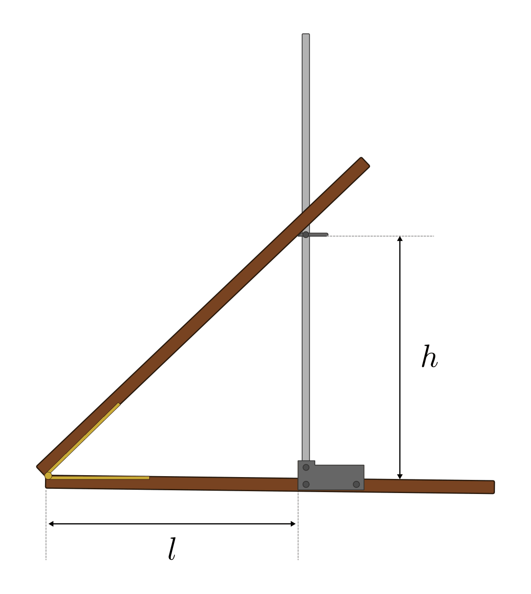
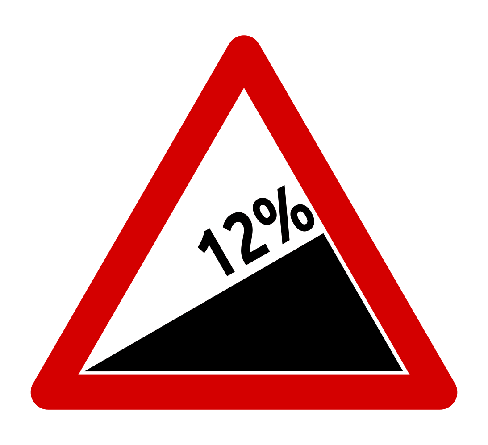
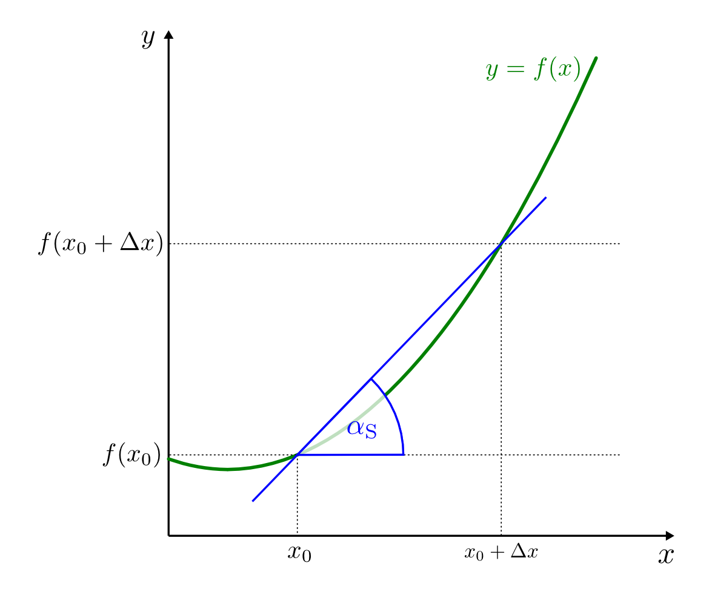
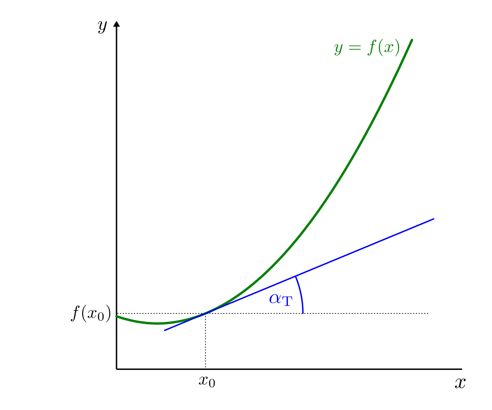
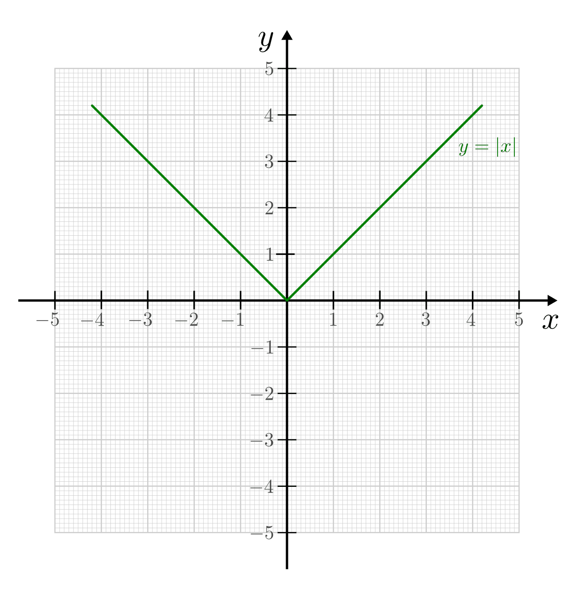

.. _Differenzen und Differentiale:

Differenzen und Differentiale
=============================

.. _Steigungsdreieck:

Das Steigungsdreieck
--------------------

Um die Bedeutung der Steigung einer Funktion zu verstehen, wird zunächst die
Steigung einer Geraden betrachtet. Ein anschauliches Beispiel bietet eine
Holzleiste oder ein Lineal, das schräg auf einer geraden Unterlage aufgestellt
wird.

    Modell eines Steigungsdreiecks. Durch Messen der Höhe :math:`h` und Länge
    :math:`l` kann die Steigung einer schrägen Holzleiste bestimmt werden.

    .. only:: html
    
        :download:`SVG: Steigungsdreieck (Modell)
        <../../pics/analysis/steigungsdreieck-modell.svg>`
        

Umso schneller die Höhe :math:`h`  entlang der horizontalen Wegstrecke :math:`l`
zunimmt, d.h. umso steiler das Lineal aufgestellt ist, desto größer ist die
Steigung.

Ein solches "Steigungsdreieck" kann in einem gewöhnlichen Koordinatensystem an
jede Gerade angelegt werden. Wandert man von einem (frei wählbaren) Punkt auf
der Geraden beispielsweise fünf Kästchen horizontal nach rechts und zählt dann
die Anzahl an Kästchen, die man horizontal nach oben oder unten zurücklegen
muss um wieder auf die Gerade zu treffen, so hat man ein Maß für die Steigung
der Gerade gewonnen. 

*Beispiele:*

* Eine Gerade die entlang einer horizontalen Strecke von fünf Kästchen nach
  rechts um drei Kästchen nach oben ansteigt ist weniger steil als eine Gerade
  die entlang der gleichen horizontalen Strecke (fünf Kästchen) um sieben
  Kästchen nach oben steigt.

* Eine Gerade die entlang einer horizontalen Strecke von drei Kästchen nach
  rechts um vier Kästchen nach oben ansteigt ist steiler als eine Gerade
  die entlang der gleichen horizontalen Strecke (drei Kästchen) um zwei
  Kästchen nach oben steigt.

* Eine Gerade die entlang einer horizontalen Strecke von vier Kästchen nach
  rechts um acht Kästchen nach oben ansteigt ist genauso steil wie eine Gerade
  die entlang einer horizontalen Strecke von sechs Kästchen um zwölf Kästchen
  nach oben steigt. 

Mathematisch kann das Verhältnis zwischen der vertikalen Änderung :math:`\Delta
y = y _{\rm{2}} - y _{\rm{1}}` und der horizontalen Änderung :math:`\Delta x = x
_{\rm{2}} - x _{\rm{1}}` als Bruch geschrieben werden:

.. math::
    :label: eqn-steigung
    
    \text{ Steigung } = \frac{ \text{ Vertikale Änderung }}{ \text{ Horizontale
    Änderung }} = \frac{y _{\rm{2}} - y _{\rm{1}} }{x _{\rm{2}} - x _{\rm{1}} }
    \equiv \frac{\Delta y}{\Delta x} 

Da die beiden Änderungsgrößen :math:`\Delta y` und :math:`\Delta x` die gleiche
Einheit (z.B. Kästchen oder cm) besitzen, besitzt die Steigung keine Einheit. 

* Der Wert der Steigung ist positiv, wenn mit zunehmenden :math:`x`-Werten die
  zugehörigen :math:`y`-Werte größer werden.
* Die Steigung ist gleich Null, wenn mit zunehmenden :math:`x`-Werten die
  zugehörigen :math:`y`-Werte unverändert (konstant) bleiben. 
* Eine negative Steigung bedeutet entsprechend, dass mit zunehmenden
  :math:`x`-Werten die zugehörigen :math:`y`-Werte kleiner werden.

    Das Verkehrszeichen weist auf einen Berg mit einer (durchschnittlichen)
    Steigung von 12 Prozent hin.

    .. only:: html
    
        :download:`SVG: Verkehrszeichen Steigung
        <../../pics/analysis/verkehrszeichen-steigung.svg>`
        
Die Steigung kann auch in Prozent angegeben werden. Eine Steigung von 100%
bedeutet beispielsweise, dass die Gerade mit jedem Kästchen nach rechts um genau
ein Kästchen nach oben steigt. Da jedes Steigungsdreiecks rechtwinklig ist, kann
für beliebige Steigungen kann der Steigungswinkel :math:`\alpha` mit Hilfe der
trigonometrischen Beziehung :math:`\tan{\alpha } = \frac{\text{ Gegenkathete
}}{\text{ Ankathete }}` berechnet werden:

.. math::
    
    \tan{\alpha } = \frac{\text{ Gegenkathete }}{\text{ Ankathete }} =
    \frac{\Delta y}{\Delta x} 
    
Eine Steigung von :math:`1` oder :math:`100\%` bedeutet gerade, dass je
horizontaler Wegdifferenz :math:`\Delta x` eine ebenso große vertikale
Wegdifferenz :math:`\Delta y` vorliegt; dies ist genau dann der Fall, wenn
:math:`\alpha = \text{atan}\left(\frac{\Delta y}{\Delta x}\right) = 45 ^{\circ}`
ist.

.. _Differenzen- und Differentialquotient:

Differenzen- und Differentialquotient
-------------------------------------

Die meisten Funktionen haben keine einheitliche Steigung. Vielmehr nimmt die
Steigung an verschiedenen Stellen unterschiedliche Werte an, kann mitunter in
unterschiedlichen Bereichen auch das Vorzeichen wechseln.

.. index:: Differenzenquotient

Um die durchschnittliche Steigung einer beliebigen Funktion :math:`f` in einen
bestimmten Bereich zwischen einem Startwert :math:`x_0` un einem Endwert
:math:`x_0 + \Delta x` angeben zu können, kann man die Funktionswerte
:math:`f(x_0)` und :math:`f(x_0 + \Delta x)` an den Bereichsgrenzen mit einer
Geraden verbinden und ein entsprechendes Steigungsdreieck einzeichnen. Die
Steigung dieser -- üblicherweise als "Sekante" -- bezeichneten Geraden ist nach
Gleichung :eq:`eqn-steigung` durch den "Differenzenquotient" :math:`\frac{\Delta
y}{\Delta x}` einfach zu berechnen und entspricht der mittleren Steigung der
Funktion :math:`f` im betrachteten Bereich.

.. math::
    :label: eqn-differenzenquotient
    
    \text{ Durchschnittliche Steigung } = \tan{(\alpha _{\rm{S}})} = \frac{\Delta
    y}{\Delta x} = \frac{f (x_0 + \Delta x) - f(x_0) }{\Delta x } 

Dabei bezeichnet :math:`\alpha _{\rm{S}}` den Winkel, den die
Sekante mit der horizontalen einschließt.

    Steigung der durch :math:`f(x_0)` und :math:`f(x_0 + \Delta x)`
    verlaufenden Sekante als Veranschaulichung des Differenzenquotienten.

    .. only:: html
    
        :download:`SVG: Differenzenquotient
        <../../pics/analysis/differenzenquotient.svg>`

.. index:: Differentialquotient
        
Der Wert der Steigung einer Funktion :math:`f` an einer einzigen Stelle :math:`x
_{\rm{0}}` lässt sich zunehmender Genauigkeit ermitteln, wenn der Bereich um die
Stelle :math:`x _{\rm{0}}` immer kleiner ("feinmaschiger") gewählt wird. Im
Grenzfall ist :math:`\Delta x` und somit auch das Steigungsdreieck winzig klein.
Die Sekante wird hierbei zu einer Tangente, die den Funktiosgraphen
augenscheinlich nur noch in einem einzigen Punkt berührt. Für die Steigung der
Tangente gilt also:
    
.. math::
    :label: eqn-differentialquotient

    \text{ Punktuelle Steigung } = \tan{(\alpha _{\,\rm{T}})} = \lim _{\Delta x
    \to 0} \left( \frac{\Delta y}{\Delta x}\right) = \lim _{\Delta x \to 0}
    \left( \frac{f (x_0 + \Delta x) - f(x_0) }{\Delta x }\right) 

Dabei bezeichnet :math:`\alpha _{\,\rm{T}}` den Winkel, den die
Sekante mit der horizontalen einschließt.

    Steigung der durch :math:`f(x_0)` verlaufenden Tangente als
    Veranschaulichung des Differentialquotienten.

    .. only:: html
    
        :download:`SVG: Differentialquotient
        <../../pics/analysis/differentialquotient.svg>`
        

.. 2 Pics nebeneinander als Vergleich

Das Schrumpfen des angelegten Steigungsdreiecks um einen bestimmten Punkt herum
ähnelt gewissermaßen dem Zusammenziehen eines Knotens. In der mathematischen
Symbolik wird bei "infinitesimal" kleinen Steigungsdreiecken anstelle des
griechischen Großbuchstabens :math:`\Delta` der Kleinbuchstabe
:math:`\mathrm{d}` geschrieben. Der Differenzenquotient :math:`\frac{\Delta
y}{\Delta x}` wird dabei zum so genannten Differentialquotienten
:math:`\frac{\mathrm{d} y}{\mathrm{d} x }`:

.. math::
    
    \frac{\Delta y}{\Delta x} \quad \stackrel{\text{ Grenzwertbildung }}{
    \Rightarrow } \quad \frac{\mathrm{d} y}{\mathrm{d} x} 

.. index:: Differenzierbarkeit
.. _Differenzierbarkeit: 

Differenzierbarkeit an einer Stelle :math:`x _{\rm{0}}` 
--------------------------------------------------------

Die Steigung einer Funktion :math:`f` an einer Stelle :math:`x _{\rm{0}}` ist
nur dann eindeutig festgelegt, wenn die Steigungen in der unmittelbaren
Umgebung links und rechts der Stelle gleich sind. Dies ist fast immer der Fall,
doch es gibt Ausnahmen.

*Beispiel:*

.. index:: Betragsfunktion

* Der Graph der Betragsfunktion :math:`y = |x|` besitzt einen Knick an der
  Stelle :math:`x _{\rm{0}} = 0`. Zeichnet man ein Steigungsdreieck links und
  rechts dieser Stelle ein, so besitzt die Steigungsgerade auf der linken Seite
  die Steigung :math:`-1`, auf der rechten Seite hingegen den Wert :math:`+1`.
  An der Stelle :math:`x _{\rm{0}} = 0` ist die Steigung nicht festgelegt -- die
  Funktion ist an dieser Stelle nicht differenzierbar.

    Graph der Betragsfunktion :math:`y=|x|`. An der Stelle :math:`x _{\rm{0}} = 0` 
    ist die Funktion nicht differenzierbar.

    .. only:: html
    
        :download:`SVG: Betragsfunktion
        <../../pics/analysis/betragsfunktion.svg>`
        
Anschaulich sind Funktionen dann differenzierbar, wenn sich die Steigung ihrer
Graphen *kontinuierlich* ändert, die Graphen also keinen "Knick" besitzen.
Hierauf ist insbesondere an den Bereichsgrenzen von abschnittsweise definierten
Funktionen (z.B. Signumsfunktion, Betragsfunktion, Stufenfunktion, usw.) sowie
an Polstellen von gebrochen-rationalen Funktionen zu achten.

Besitzt eine Funktion eine Definitionslücke, so kann an dieser Stelle nichts
über die Differenzierbarkeit der Funktion ausgesagt werden.

Um die Steigung unmittelbar links und unmittelbar rechts der Stelle :math:`x
_{\rm{0}}` berechnen zu können, wählt man die Stelle :math:`x _{\rm{0}}` selbst
als Bereichsgrenze. Wählt man als zweite Bereichsgrenze :math:`x`-Werte, die
nur ein wenig kleiner bzw. größer als :math:`x _{\rm{0}}` sind, so erhält man
Steigungsdreiecke, die unmittelbar links bzw. rechts der untersuchten Stelle an
der Funktion anliegen.

Mathematisch lassen sich die beiden unmittelbar angrenzenden Steigungen wie
folgt ausdrücken:

.. math::
    
    \text{ Steigung links von $x_0$: } = \lim _{\substack{\Delta x \to 0,\\[3pt] \Delta x < 0\;} }
    \left( \frac{f(x_0 + \Delta x) - f(x_0)}{\Delta x}\right) \\[12pt]
    \text{ Steigung rechts von $x_0$: } = \lim _{\substack{\Delta x \to 0,\\[3pt] \Delta x > 0 \;} }
    \left( \frac{f(x_0 + \Delta x) - f(x_0)}{\Delta x}\right) 

..  \text{ Steigung links von $x_0$: } = \lim _{ \stackrel{x < x_0}
..  {\rightarrow} x_0 } \left( \frac{f(x) - f(x_0}{x - x_0}\right) \\[12pt]
..  \text{ Steigung rechts von $x_0$: } = \lim _{x \stackrel{x > x_0}
..  } {\rightarrow} x_0 } \left( \frac{f(x) - f(x_0)}{x - x_0}\right) 

Stimmen die beiden Grenzwerte auf linken und auf der rechten Seite der Stelle
:math:`x _{\rm{0}}` überein, so ist die Funktion an dieser Stelle
differenzierbar, und der Wert ihre Steigung ist gleich dem Steigungswert der
beiden Grenzwerte.

*Beispiel:*
    
* Die Funktion :math:`f(x) = |x|` soll auf Differenzierbarkeit an der Stelle
  :math:`x_0=0` hin untersucht werden.

  Um die Betragstriche weglassen zu können, zerlegt man die Funktion in zwei
  Teilfunktionen :math:`f(x) = -x \text{ für } x < 0` und :math:`f(x) = +x
  \text{ für } x \ge 0`. An der Stelle :math:`x_0 = 0` gilt somit für den
  linksseitigen Grenzwert:

  .. math::
      
      \lim _{\substack{\Delta x \to 0,\\[3pt] \Delta x < 0\;} } \left(
      \frac{f(x_0 + \Delta x) - f(x_0)}{\Delta x}\right) &= \lim
      _{\substack{\Delta x \to 0,\\[3pt] \Delta x < 0\;} } \left( \frac{|x_0 +
      \Delta x| - |x_0|}{\Delta x}\right)  = \lim _{\substack{\Delta x \to
      0,\\[3pt] \Delta x < 0\;} } \left(\frac{-\Delta x}{\Delta x}\right)  =
      -1 \\[6pt]
      \lim _{\substack{\Delta x \to 0,\\[3pt] \Delta x > 0\;} } \left(
      \frac{f(x_0 + \Delta x) - f(x_0)}{\Delta x}\right) &= \lim
      _{\substack{\Delta x \to 0,\\[3pt] \Delta x > 0\;} } \left( \frac{|x_0 +
      \Delta x| - |x_0|}{\Delta x}\right) = \lim _{\substack{\Delta x \to
      0,\\[3pt] \Delta x > 0\;} } \left( \frac{+\Delta x}{\Delta x}\right) =
      +1 \\[6pt]

  Hierbei wurde jeweils :math:`x_0 = 0` eingesetzt und die Betragsfunktion in
  Abhängigkeit des Vorzeichens von :math:`\Delta x` ausgewertet. Der
  linksseitige und der rechtsseitige Grenzwerte stimmen nicht überein, die
  Funktion ist somit an der Stelle :math:`x_0 = 0` nicht differenzierbar.

  An jeder anderen Stelle, beispielsweise :math:`x_0 = -5`, ist die Funktion
  :math:`f(x) = |x|` jedoch differenzierbar, denn dabei gilt:

  .. math::
      
      \lim _{\substack{\Delta x \to 0,\\[3pt] \Delta x < 0\;} } \left(
      \frac{f(x_0 + \Delta x) - f(x_0)}{\Delta x}\right) &= \lim
      _{\substack{\Delta x \to 0,\\[3pt] \Delta x < 0\;} } \left(\frac{|x_0 +
      \Delta x| - |x_0|}{\Delta x}\right) \\[4pt] = \lim _{\substack{\Delta x
      \to 0,\\[3pt] \Delta x < 0\;} } \left( \frac{|-5 + \Delta x| -
      |-5|}{\Delta x}\right) &=  \lim _{\substack{\Delta x \to 0,\\[3pt] \Delta
      x < 0\;} } \left(\frac{+5 - \Delta x - 5}{\Delta x}\right) = -1 \\[6pt]
      
  Dieser Wert des Differentialquotienten gilt in diesem Fall sowohl für positive
  wie für negative :math:`\Delta x`-Werte, da diese im Vergleich zu :math:`x_0`
  klein sind und daher keine Auswirkung auf das Vorzeichen der Betragsfunktion
  haben.

.. index:: Ableitung
.. _Herleitung von Ableitungsregeln:

Herleitung von Ableitungsregeln
-------------------------------

Um die Steigung einer Funktion :math:`f(x)` für beliebige Punkte angeben zu
können, ist es nützlich, eine Funktion :math:`f'(x)` zu finden, deren
Funktionswerte eben den Werten der Steigungen von :math:`f(x)` entsprechen. Die
Funktion :math:`f'(x)` wird dabei als "Ableitung" von :math:`f(x)`, die
Bestimmung von :math:`f(x)` als "Ableiten" von :math:`f(x)` bezeichnet.

Um eine allgemeine Ableitungsregel für beliebige :math:`x`-Werte herzuleiten,
wird zunächst der Differentialquotient für die betrachtete Funktion aufgestellt.
Durch geschickte Umformungen versucht man anschließend, den zu untersuchenden
Term auf bekannte Grenzwerte hin zurückzuführen (beispielsweise gegen Null
konvergierende Terme). Als Ergebnis erhält man dann einen Ausdruck, der die
Ableitung :math:`f'(x)` der Funktion angibt.

*Beispiele:*
    
* Die Ableitung für die Funktion :math:`f(x) = x^2` soll anhand des
  Differentialquotienten bestimmt werden.

  Der Differentialquotient für diese Funktion lautet allgemein: 

  .. math::
      
      &\phantom{=\;} \lim _{\Delta x \to 0} \left( \frac{f(x + \Delta x) - f(x)}{\Delta
      x}\right) = \lim _{\Delta x \to 0} \left( \frac{(x + \Delta x)^2 -
      x^2}{\Delta x}\right) \\[6pt] &= \lim _{\Delta x \to 0} \left( \frac{x^2 + 2 \cdot x
      \cdot \Delta x + (\Delta x)^2 - x^2}{\Delta x} \right) = \lim _{\Delta x \to 0}
      \left(2 \cdot x + \Delta x \right) = 2 \cdot x

  In der zweiten Zeile wurde hierbei zunächst die binomische Formel
  ausmultipliziert, wobei sich die :math:`x^2`-Terme wegen des unterschiedlichen
  Vorzeichens aufheben. Anschließend wurde im Zähler  :math:`\Delta x`
  ausgeklammert und gekürzt.

  Für die Funktion :math:`f(x) = x^2` ist die zugehörige Ableitungsfunktion
  somit :math:`f'(x) = 2 \cdot x`.

* Die Ableitung für die Funktion :math:`f(x) = 4 \cdot x^3 - 5 \cdot x` soll
  anhand des Differentialquotienten bestimmt werden.

  Der Differentialquotient für diese Funktion lautet allgemein: 
  
  .. only:: html
  
      .. math::
      
          &\phantom{=\;} \lim _{\Delta x \to 0} \left( \frac{f(x + \Delta x) -
          f(x)}{\Delta x}\right) = \lim _{\Delta x \to 0} \left( \frac{\big(4 \cdot
          (x + \Delta x)^3 - 5 \cdot  (x+ \Delta x)\big) - \big(4 \cdot x^3 - 5
          \cdot x\big)}{\Delta x}\right) \\[6pt] &= \lim _{\Delta x \to 0} \left(
          \frac{\big(4 \cdot (x^3 + 3\!\cdot\!x^2\!\cdot\!\Delta x + 3\!\cdot\!x\!\cdot
          \!(\Delta x)^2 + (\Delta x)^3 - 5\!\cdot\!x  - 5\!\cdot\!\Delta x \big) - (4
          \cdot x^3 - 5 \cdot x)}{\Delta x} \right) \\[6pt]
          &=\lim _{\Delta x \to 0} \left( \frac{12\!\cdot\!x^2\!\cdot\!\Delta x +
          12\!\cdot\!x\!\cdot\!(\Delta x)^2- 5 \cdot \Delta x}{\Delta x}\right)
          =\lim _{\Delta x \to 0} \left( 12  \cdot x^2 + 12  \cdot x  \cdot  \Delta
          x - 5 \right) = 12 \cdot x^2 - 5

  .. only:: latex
  
      .. math::
      
          &\lim _{\Delta x \to 0} \left( \frac{f(x + \Delta x) -
          f(x)}{\Delta x}\right) = \lim _{\Delta x \to 0} \left( \frac{\big(4\!\cdot\!
          (x + \Delta x)^3 - 5\!\cdot\!(x+ \Delta x)\big) - \big(4\!\cdot\!x^3 - 5\!
          \cdot\!x\big)}{\Delta x}\right) \\[6pt] &= \lim _{\Delta x \to 0} \left(
          \frac{\big(4\!\cdot\!(x^3 + 3\!\cdot\!x^2\!\cdot\!\Delta x + 3\!\cdot\!x\!\cdot
          \!(\Delta x)^2 + (\Delta x)^3 - 5\!\cdot\!x  - 5\!\cdot\!\Delta x \big) - (4\!
          \cdot\!x^3 - 5\!\cdot\!x)}{\Delta x} \right) \\[6pt]
          &=\lim _{\Delta x \to 0} \left( \frac{12\!\cdot\!x^2\!\cdot\!\Delta x +
          12\!\cdot\!x\!\cdot\!(\Delta x)^2- 5\!\cdot\!\Delta x}{\Delta x}\right)
          =\lim _{\Delta x \to 0} \left( 12\!\cdot\!x^2 + 12\!\cdot\!x\!\cdot\!\Delta
          x - 5 \right) \\[6pt] &= 12\!\cdot\!x^2 - 5

  In der zweiten Zeile wurde hierbei wiederum die binomische Formel
  ausmultipliziert, wobei sich die :math:`4\!\cdot\!x^3`-Terme und
  :math:`5\!\cdot\! x`-Terme jeweils wegen der unterschiedlichen Vorzeichen
  aufheben. Anschließend wurde im Zähler :math:`\Delta x` ausgeklammert und
  gekürzt; im resultierenden Ausdruck geht der Term :math:`12 \cdot x \cdot
  \Delta x` wegen :math:`\Delta x \to 0` gegen Null.

  Für die Funktion :math:`f(x) = 4 \cdot x^3 - 5 \cdot x` ist die zugehörige
  Ableitungsfunktion somit :math:`f'(x) = 12 \cdot x^2 - 5`.

Glücklicherweise wurden, wie in den nächsten Abschnitten näher beschrieben ist,
mit Hilfe der obigen Methode für alle elementaren Funktionen allgemeine
Ableitungsregeln hergeleitet, so dass man die Ableitung einer Funktion in
praktischen Anwendungen sehr häufig mit deutlich weniger Rechenaufwand bestimmen
kann.

