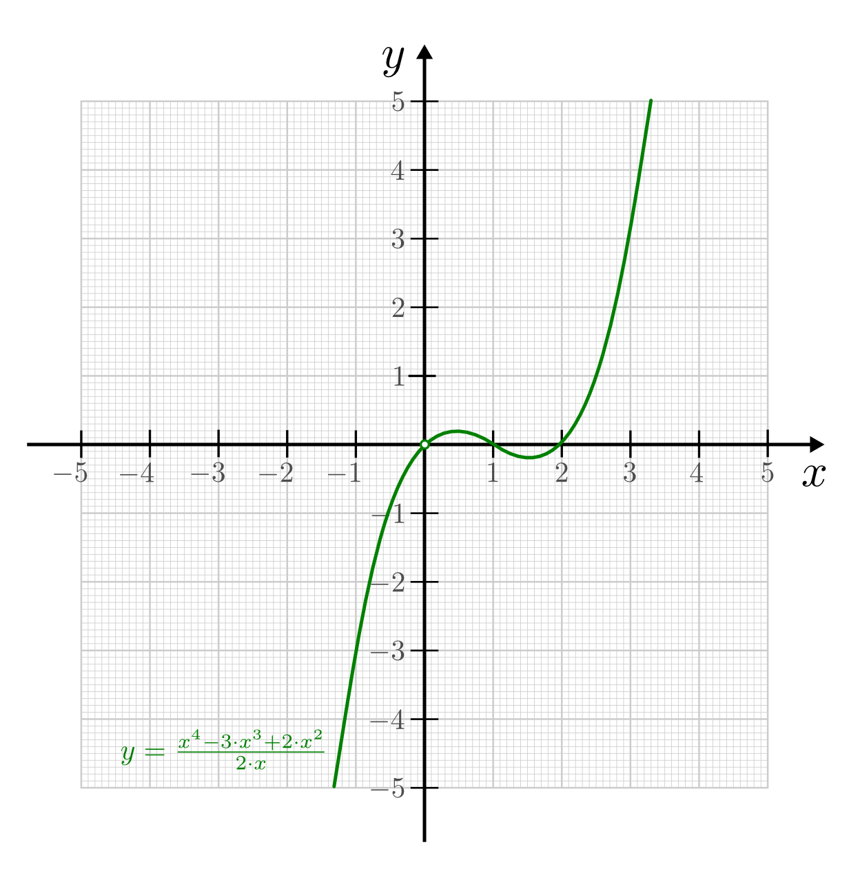

.. _Kurvendiskussion:

Kurvendiskussion
================

Als Kurvendiskussion bezeichnet man eine analytische Untersuchung einer
gegebenen Funktion, um anhand charakteristischer Eigenschaften auf ihren Verlauf
schließen zu können.

Dabei geht man, unabhängig von der Art der Funktion, immer nach einem im
Wesentlichen gleichen Schema vor. Dieses Schema soll im Folgenden anhand der
Beispielfunktion :math:`f(x) = \frac{x^4 - 3 \cdot x^3 + 2 \cdot x^2}{5 \cdot
x}` im Detail vorgestellt werden.

.. _Bestimmung des Definitionsbereichs:

.. rubric:: 1.: Bestimmung des Definitionsbereichs

Zunächst muss überprüft werden, für welche :math:`x`-Werte die Funktion
definiert ist; beispielsweise muss ausgeschlossen werden können, dass durch Null
dividiert wird.

Die :math:`x`-Werte dürfen zudem nicht außerhalb des Definitionsbereichs der
jeweiligen Funktion liegen, beispielsweise muss darauf geachtet werden, dass die
Argumente von Wurzel- oder Logarithmusfunktionen nicht negativ werden.
:ref:`Potenzfunktionen <Potenz- und Wurzelfunktionen>` der Form :math:`f(x) =
x^n` mit :math:`n \in \mathbb{N}`, :ref:`ganzrationale Funktionen <Ganzrationale
Funktionen>`, :ref:`Exponentialfunktionen <Exponentialfunktionen>` sowie die
:ref:`Sinus- und Cosinusfunktion <Winkelfunktionen am Einheitskreis>` sind für
alle reelle Zahlen definiert, bei ihnen gilt also :math:`\mathbb{D} =
\mathbb{R}`.

Der Definitionsbereich einer zusammengesetzten Funktion ist gleich der
Schnittmenge der Definitionsbereiche aller Teilfunktionen.

* *Beispiel:*

  Die Funktion :math:`f(x) = \frac{x^4 - 3 \cdot x^3 + 2 \cdot x^2}{2 \cdot x}`
  hat an der Stelle  :math:`x = 0` eine Definitionslücke, da für diesen Wert
  der Nenner der Funktion gleich Null wird. Für alle anderen :math:`x`-Werte
  ist die Funktion definiert, es ist also :math:`\mathbb{D} = \mathbb{R}
  \setminus \{ 0 \}`.

.. _Bestimmung des Verhaltens an den Rändern des Definitionsbereichs:

.. rubric:: 2.: Bestimmung des Verhaltens an den Rändern des Definitionsbereichs

Sofern der Definitionsbereich der zu untersuchenden Funktion es zulässt, werden
als nächstes die :ref:`Grenzwerte <Grenzwerte einer Funktion>` der Funktion für
unendlich große positive und negative :math:`x`-Werte untersucht. Bei Wurzel-
und Logarithmusfunktionen allerdings kann beispielsweise nur der Grenzwert für
unendlich große positive :math:`x`-Werte bestimmt werden, da diese beiden
Funktionstypen nur für positive reelle Zahlen definiert sind.

Hat die Funktion Definitionslücken, so sind auch die Grenzwerte der Funktion an
diesen Stellen zu bestimmen.

* *Beispiel:*

  Die Funktion :math:`f(x) = \frac{x^4 - 3 \cdot x^3 + 2 \cdot x^2}{2 \cdot x}`
  geht für sehr große positive :math:`x`-Werte gegen Unendlich, da in diesem
  Fall sowohl der Zähler wie auch der Nenner positive Werte annehmen, aber der
  Zähler schneller wächst als der Nenner. Es gilt also:

  .. math::

      \lim _{x \to +\infty} \left( \frac{x^4 - 3 \cdot x^3 + 2 \cdot x^2}{2
      \cdot x} \right) = + \infty

  Für sehr große negative :math:`x`-Werte geht die Funktion gegen minus
  Unendlich, da in diesem Fall die höchste Potenz des Zählers einen positiven
  Wert, der Nenner aber einen negativen Wert liefert, und der Zähler schneller
  wächst als der Nenner. Es gilt also:

  .. math::

      \lim _{x \to -\infty} \left( \frac{x^4 - 3 \cdot x^3 + 2 \cdot x^2}{2
      \cdot x} \right) = - \infty

  Die Funktion hat zudem :math:`x=0` als Definitionslücke. Um die Grenzwerte
  für :math:`x \to 0` zu berechnen, kann man folgenden Trick nutzen: An jeder
  Stelle :math:`x \ne 0` kann im Funktionsterm :math:`x` gekürzt werden, da
  :math:`x` als gemeinsamer Faktor in jedem Zählerterm enthalten ist. Somit
  gilt:

  .. math::

      \lim _{x \to 0} \left( \frac{x^4 - 3 \cdot x^3 + 2 \cdot x^2}{2 \cdot x}
      \right) = \lim _{x \to 0} \left( x^3 - 3 \cdot x^2 + 2 \cdot x\right) = 0

  Sowohl für sehr kleine negative wie für sehr kleine positive :math:`x`-Werte
  gehen alle Terme beim betrachteten Grenzwert gegen Null. Da der linksseitige
  und der rechtsseitige Grenzwert identisch sind, ist die Funktion "stetig
  behebbar": Man könnte die Funktion abschnittsweise mit :math:`f(x) = 0` für
  :math:`x=0` und :math:`f(x) = \frac{x^4 - 3 \cdot x^3 + 2 \cdot x^2}{2 \cdot
  x}` für :math:`x \ne 0` definieren, um eine "nahtlose" Funktion zu erhalten,
  die für alle reellen Zahlen definiert ist.

.. index:: Regel von L'Hospital

In manchen Fällen erhält man bei der Bestimmung des Grenzwerts an einer
Definitionslücke :math:`x_0` ein nicht bestimmtes Ergebnis, beispielsweise bei
der Funktion :math:`f(x) = \frac{\sqrt{x}}{x}`. Diese Funktion hat an der Stelle
:math:`x_0 = 0` eine Definitionslücke, da der Nenner an dieser Stelle den Wert
Null annimmt; gleichzeitig ist allerdings auch der Zähler :math:`f_1(x) =
\sqrt{x}` an dieser Stelle gleich Null. In derartigen Fällen, wenn sich ein
Grenzwert der Form :math:`\frac{"0"}{"0"}` ergibt, kann die sogenannte "Regel
von `L'Hospital
<https://de.wikipedia.org/wiki/Guillaume_François_Antoine,_Marquis_de_L’Hospital>`_"
angewendet werden:

.. math::

    \lim _{x \to x_0} \frac{f_1(x)}{f_2(x)} = \frac{"0"}{"0"} \quad \Rightarrow
    \quad \lim _{x \to x_0} \frac{f_1(x)}{f_2(x)} = \lim _{x \to x_0}
    \frac{f_1'(x)}{f_2'(x)}

Für das oben genannte Beispiel :math:`f(x) = \frac{f_1(x)}{f_2(x)} =
\frac{\sqrt{x}}{x}` gilt:

.. math::

    f_1'(x) &= \left(x ^{\frac{1}{2}}\right)' = \frac{1}{2} \cdot x ^{-
    \frac{1}{2}} \quad \text{und} \\[4pt]
    f_2'(x) &= \;\left(x ^1 \right)'\; = 1

Für die Stelle :math:`x_0 = 1` gilt somit :math:`\frac{f_1'(1)}{f_2'(1)} =
\frac{1}{1} = 1`, der Grenzwert der Funktion für :math:`x \to x_o` ist also
gleich :math:`1`.

Haben also zwei Funktionen :math:`f_1(x)` und :math:`f_2(x)` an einer Stelle
:math:`x_0` beide den Grenzwert :math:`0`, so besagt die Regel von L'Hospital,
dass in diesem Fall der Grenzwert gleich dem Quotienten der Ableitungen von
:math:`f_1(x)` und :math:`f_2(x)` ist, sofern beide Funktionen differenzierbar
sind und die Ableitung der Nennerfunktion an der Stelle :math:`x_0` nicht gleich
Null ist.

Die Regel von L'Hospital kann ebenfalls angewendet werden, wenn :math:`\lim _{x \to
\infty} f_1(x) = \lim _{x \to \infty} f_2(x) = 0` ist:

.. math::

    \lim _{x \to \pm \infty} \frac{f_1(x)}{f_2(x)} = \frac{"0"}{"0"} \quad \Rightarrow \quad
    \lim _{x \to \pm \infty} \frac{f_1(x)}{f_2(x)} = \lim _{x \to \pm \infty}
    \frac{f_1'(x)}{f_2'(x)}

Weiterhin gilt die Regel von L'Hospital auch, wenn die Grenzwerte von
:math:`f_1(x)` und :math:`f_2(x)` beide für :math:`x \to x_0` oder :math:`x \to
\pm \infty` gegen Unendlich gehen:

.. math::

    \lim _{x \to x_0} \frac{f_1(x)}{f_2(x)} &= \frac{"\infty"}{"\infty"} \quad \Rightarrow
    \quad \;\;\lim _{x \to x_0} \frac{f_1(x)}{f_2(x)} =
    \;\;\lim _{x \to x_0} \frac{f_1'(x)}{f_2'(x)} \\[6pt]
    \lim _{x \to \pm \infty} \frac{f_1(x)}{f_2(x)} &= \frac{"\infty"}{"\infty"} \quad \Rightarrow \quad
    \lim _{x \to \pm \infty} \frac{f_1(x)}{f_2(x)} = \lim _{x \to \pm \infty}
    \frac{f_1'(x)}{f_2'(x)}

Die Regel von L'Hospital ist somit in vielen Fällen nützlich, wenn ein
Grenzwert auf andere Weise nicht bestimmt werden kann.

.. _Untersuchung auf Symmetrie:

.. rubric:: 3.: Untersuchung auf Symmetrie

Eine Funktion ist achsensymmetrisch zur :math:`x`-Achse, wenn :math:`f(-x) =
f(x)` für alle :math:`x`-Werte des Definitionsbereichs gilt. Dies ist der Fall,
wenn alle im Funktionsterm auftretenden Potenzen gerade sind.

Eine Funktion ist punktsymmetrisch zum Koordinatenursprung :math:`(0,0)`, wenn
:math:`-f(-x) = f(x)` für alle :math:`x`-Werte des Definitionsbereichs gilt.
Dies ist der Fall, wenn alle im Funktionsterm auftretenden Potenzen ungerade
sind.

Enthält eine Funktion Terme mit sowohl geraden wie auch ungeraden Exponenten,
liegt keine Symmetrie vor.

* *Beispiel:*

  Die Funktion :math:`f(x) = \frac{x^4 - 3 \cdot x^3 + 2 \cdot x^2}{2 \cdot x}`
  hat Terme mit sowohl geraden wie auch ungeraden Exponenten, sie ist somit
  nicht symmetrisch.

.. _Bestimmung von Nullstellen:

.. rubric:: 4.: Bestimmung von Nullstellen

Als :ref:`Nullstellen <Nullstellen>` bezeichnet man diejenigen :math:`x`-Werte, deren
zugehörige Funktionswerte gleich Null sind, für die also :math:`f(x) = 0` gilt.

* *Beispiel:*

  Bei der Funktion :math:`f(x) = \frac{x^4 - 3 \cdot x^3 + 2 \cdot x^2}{2 \cdot x}`
  als gebrochen-rationaler Funktion entsprechen die Nullstellen den Nullstellen
  des Zählers. Es muss somit geprüft werden, für welche :math:`x`-Werte der
  Term :math:`x^4 - 3 \cdot x^3 + 2 \cdot x^2` gleich Null ist, also folgende
  Gleichung gelöst werden:

  .. math::

      x^4 - 3 \cdot x^3 + 2 \cdot x^2 = 0

  Auf der linken Seite kann :math:`x^2` als gemeinsamer Faktor ausgeklammert
  werden. Es folgt:

  .. math::

      x^2 \cdot \left(x^2 - 3 \cdot x^1 + 2 \right) = 0

  Ein Produkt ist gleich Null, wenn einer der Faktoren gleich Null ist. Es wäre
  somit :math:`x=0` eine Nullstelle des Zählers, doch dieser Wert ist nicht in
  der Definitionsmenge der Funktion enthalten. Zu untersuchen bleibt, für
  welche :math:`x`-Werte der zweite Faktor :math:`x^2 - 3 \cdot x + 2` gleich
  Null wird:

  .. math::

      x^2 - 3 \cdot x + 2 = 0

  Diese Gleichung kann mit Hilfe der Lösungsformel für quadratische Gleichungen
  gelöst werden. Mit :math:`a = 1`, :math:`b=-3` und :math:`c = 2` folgt:

  .. math::

      x _{\rm{1,2}} = \frac{-b \pm \sqrt{b^2 - 4 \cdot a \cdot c}}{2 \cdot a} =
      \frac{3 \pm \sqrt{9 - 4 \cdot (1 \cdot 2)}}{2} = \frac{3 \pm 1}{2}

  Die Funktion hat also die zwei Nullstellen :math:`x_1 = 1` und :math:`x_1 =
  2`.

.. _Bestimmung von Extremstellen:

.. rubric:: 5.: Bestimmung von Extremstellen

.. und Monotoniebereichen?

Bei der Untersuchung von :ref:`Extremstellen <Extremstellen>` wird geprüft, für
welche :math:`x`-Werte der Funktionsgraph Hochpunkte, Tiefpunkte oder
Terrassenpunkte besitzt. Hierzu muss die erste Ableitung der Funktion bestimmt
und gleich Null gesetzt werden. Um zu prüfen, um welchen Extremstellen-Typ es
sich handelt, kann man zu jeder Extremstelle :math:`x_0` einen etwas kleineren
und einen etwas größeren :math:`x`-Wert in die erste Ableitungsfunktion
:math:`f'(x)` einsetzen und aus den erhaltenen Steigungswerten den
Krümmungsverlauf betrachten: Beispielsweise bedeutet eine erst positive und dann
negative Steigung einen Hochpunkt an der Stelle :math:`x_0`.

Eine zweite Möglichkeit zur Bestimmung des Nullstellentyps bietet die zweite
Ableitungsfunktion :math:`f''(x)`. Da man diese für eine Bestimmung der
Wendepunkte ohnehin berechnen muss, kann man dies auch gleich an dieser Stelle
tun und die :math:`x`-Werte der Extremstellen einsetzen. Ergibt sich für eine
Stelle :math:`x_0` ein positiver Wert, so handelt es sich um einen Tiefpunkt,
ergibt sich ein negativer Wert, so handelt es sich um einen Hochpunkt. Ergibt
sich der Wert Null, so handelt es sich um einen Terrassenpunkt. [#]_

Die zu den Extremstellen gehörenden Funktionswerte erhält man durch Einsetzen
in die ursprüngliche Funktion :math:`f(x)`.

* *Beispiel:*

  Für :math:`x \ne 0` kann die Funktion :math:`f(x) = \frac{x^4 - 3 \cdot x^3 +
  2 \cdot x^2}{2 \cdot x}` als :math:`\tilde{f}(x) = \frac{1}{2} \cdot (x^3 - 3
  \cdot x^2 + 2 \cdot x)` geschrieben werden. Die erste Ableitung dieser
  Funktion lautet:

  .. math::

      f'(x) = \frac{1}{2} \cdot \left( 3 \cdot x^2 - 6 \cdot x + 2\right)

  Diese (Ableitungs-)Funktion ist gleich Null, wenn der Term :math:`3 \cdot x^2
  - 6 \cdot x + 2` gleich Null ist:

  .. math::

      3 \cdot x^2 - 6 \cdot x + 2 = 0

  Diese Gleichung kann mit Hilfe der Lösungsformel für quadratische Gleichungen
  gelöst werden. Mit :math:`a = 3`, :math:`b=-6` und :math:`c = 2` folgt:

  .. math::

      x _{\rm{3,4}} = \frac{-b \pm \sqrt{b^2 - 4 \cdot a \cdot c}}{2 \cdot a} =
      \frac{6 \pm \sqrt{36 - 4 \cdot (3 \cdot 2)}}{6} = \frac{6 \pm \sqrt{12}}{6}

  Die Funktion besitzt also die zwei Extremstellen :math:`x_3 \approx 0,42` und
  :math:`x_4 \approx 1,58`. Um zu überprüfen, um welche Art von Extremstellen
  es sich handelt, wird die zweite Ableitung berechnet:

  .. math::

      f''(x) = \frac{1}{2} \cdot (6 \cdot x - 6)

  Für :math:`x_3 \approx 0,42` ergibt sich beim Einsetzen ein Wert kleiner als
  Null, die Funktion hat an dieser Stelle also einen Hochpunkt. Für :math:`x_4
  \approx 1,58` ergibt sich beim Einsetzen ein Wert größer als Null, die
  Funktion hat an dieser Stelle also einen Tiefpunkt.

  Ein Einsetzen von :math:`x_3` und :math:`x_4` in die Funktion :math:`f(x)`
  ergibt die zugehörigen Funktionswerte :math:`f(x_3) \approx 0,19` und
  :math:`f(x_4) \approx -0,19`.

.. _Bestimmung von Wendepunkten:

.. rubric:: 6.: Bestimmung von Wendepunkten

Bei der Untersuchung hinsichtlich :ref:`Wendepunkten <Wendepunkte>` wird
geprüft, für welche :math:`x`-Werte die zweite Ableitung der Funktion gleich
Null ist. Hat man eine (oder mehrere) solche Stelle :math:`x_0` gefunden, kann
man anschließend durch Einsetzen eines etwas kleineren und eines etwas größeren
:math:`x`-Werts in die zweite Ableitungsfunktion :math:`f''(x)` prüfen, ob die
jeweiligen Ergebnisse ein unterschiedliches Vorzeichen besitzen. In diesem Fall
handelt es sich tatsächlich um einen Wendepunkt, andernfalls nicht.

* *Beispiel:*

  Für :math:`x \ne 0` kann die Funktion :math:`f(x) = \frac{x^4 - 3 \cdot x^3 +
  2 \cdot x^2}{2 \cdot x}` als :math:`\tilde{f}(x) = \frac{1}{2} \cdot (x^3 - 3
  \cdot x^2 + 2 \cdot x)` geschrieben werden. Die zweite Ableitung dieser
  Funktion lautet:

  .. math::

      f''(x) = \frac{1}{2} \cdot (6 \cdot x - 6)

  Setzt man diese Funktionsgleichung gleich Null, so erhält man :math:`6 \cdot
  x - 6 = 0` oder :math:`x=1` als einzige Wendestelle des Funktionsgraphen.

  Dass es sich tatsächlich um eine Wendestelle handelt, kann durch Einsetzen
  beispielsweise der Werte :math:`x=0` und :math:`x=2` in die zweite Ableitung
  :math:`f''(x)` überprüft werden: Es ist :math:`f''(0) = -3` und
  :math:`f''(2) = 3`, die Krümmung ändert also bei :math:`x=1` ihr Vorzeichen,
  somit hat der Funktionsgraph dort eine Wendestelle.

  Setzt man :math:`x=1` in die ursprüngliche Funktion :math:`f(x)` ein, erhält
  man :math:`f(1)=0`. Die Funktion hat also einen Wendepunkt bei :math:`(1,0)`.

.. _Erstellung eines Funktionsgraphen:

.. rubric:: 7.: Erstellung eines Funktionsgraphen

Die bis zu diesem Schritt im Rahmen der Kurvendiskussion erarbeiteten Ergebnisse
reichen grundsätzlich aus, um den Verlauf des Funktionsgraphen qualitativ
richtig zeichnen zu können; ergänzend können bei Bedarf einige weitere
:math:`x`-Werte in die Funktion :math:`f(x)` eingesetzt werden, um weitere
Punkte des Funktionsgraphen zu erhalten.

* *Beispiel:*

  Bei der Funktion :math:`f(x) = \frac{x^4 - 3 \cdot x^3 +
  2 \cdot x^2}{2 \cdot x}` sind nach den vorherigen Rechenschritten die
  Nullstellen, Extrem- und Wendestellen sowie das Verhalten im Unendlichen
  bekannt. Der Funktionsgraph sieht damit etwa so aus:

    Funktionsgraph der Beispielfunktion :math:`y = \frac{x^4 - 3 \cdot x^3 + 2
    \cdot x^2}{2 \cdot x}`.

    .. only:: html

        :download:`SVG: Funktionsgraph (Beispielfunktion)
        <../../pics/analysis/beispiel-kurvendiskussion.svg>`

Das genannte Schema für Kurvendiskussionen lässt sich allgemein für beliebige
Kombinationen elementarer Funktionen anwenden.

.. raw:: html

    

.. only:: html

    .. rubric:: Anmerkungen:

.. [#] Als einfache Merkregel kann man an die Normalparabel :math:`f(x)=x^2`
    denken. Deren erste Ableitung ist :math:`f'(x) = 2 \cdot x`, die zweite
    Ableitung ist :math:`f''(x)=2`. Die Normalparabel hat einen Tiefpunkt bei
    :math:`x_0=0`, wobei der Wert der zweiten Ableitung an dieser Stelle positiv
    ist.

