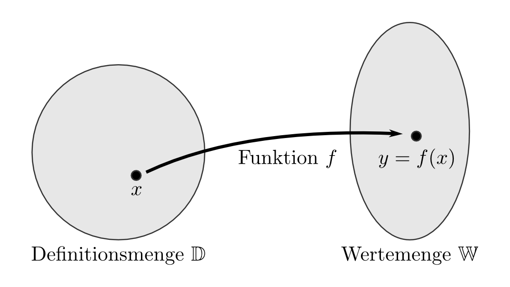
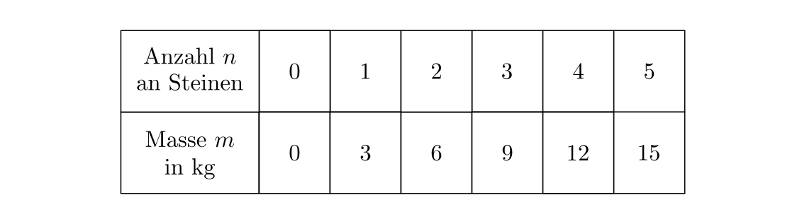
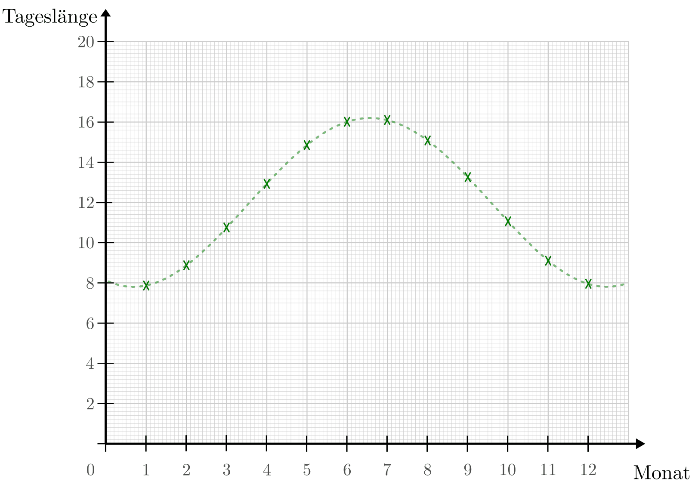
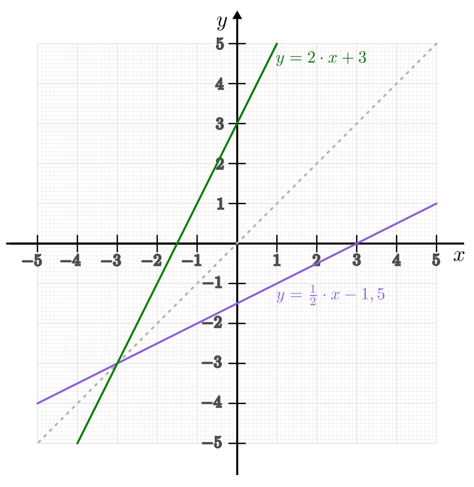
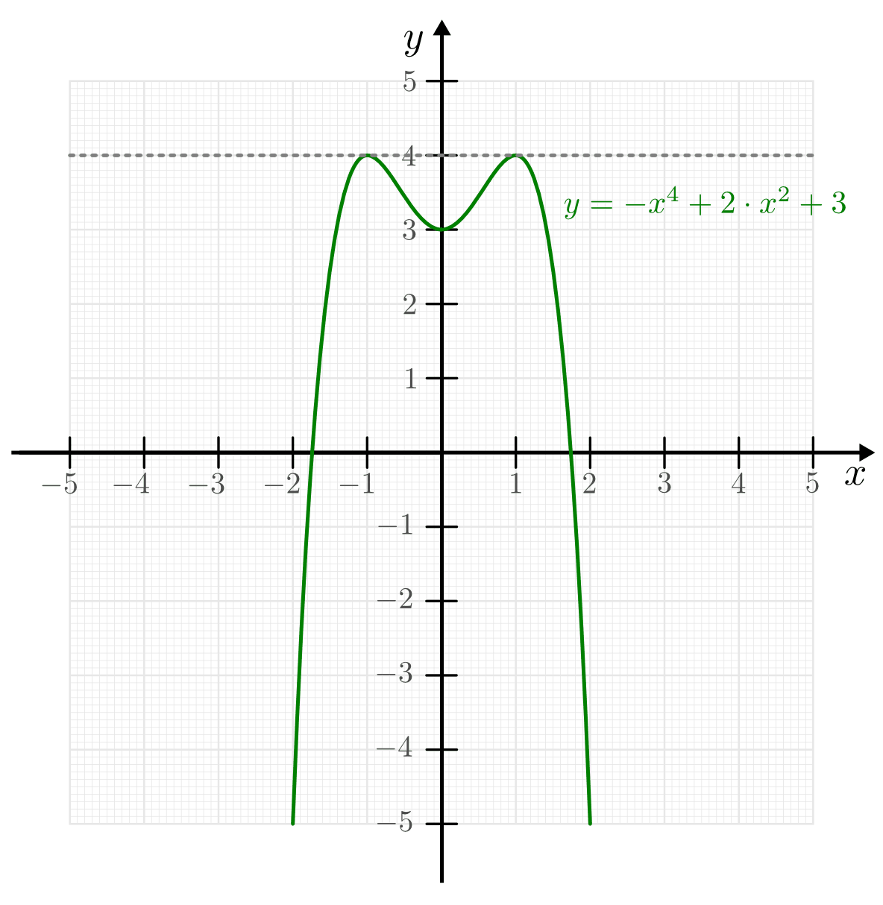
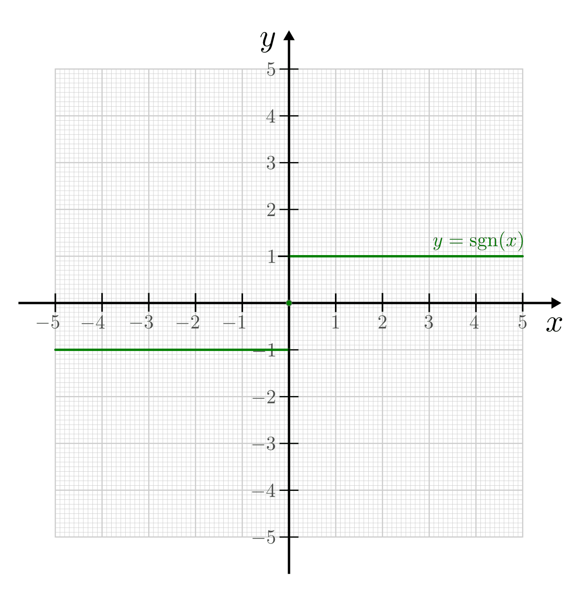
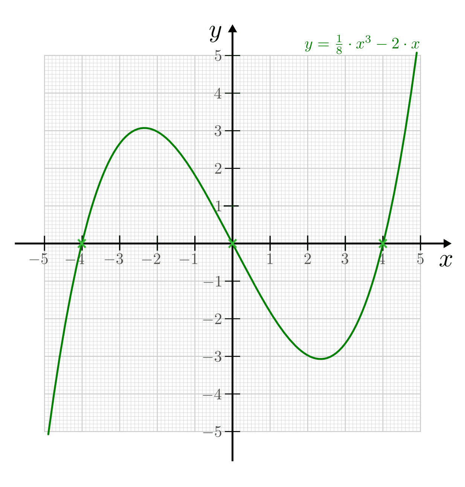

.. _Eigenschaften von Funktionen:

Eigenschaften von Funktionen
============================

Funktionen lassen sich anhand verschiedener Eigenschaften unterteilen. Wichtige
Eigenschaften, die dabei von Bedeutung sind, werden im folgenden Abschnitt kurz
zusammengefasst. [#]_

.. index:: Definitionsmenge, Wertemenge
.. _Definitions- und Wertemenge:

Definitions- und Wertemenge
---------------------------

Die Menge an möglichen Werten, welche die Ausgangsgröße ("Variable") :math:`x`
annehmen kann, nennt man Definitionsmenge :math:`\mathbb{D}`. Entsprechend
bezeichnet man die Menge an Werten, welche die Funktion :math:`y = f(x)` als
Ergebnisse liefert, als Wertemenge :math:`\mathbb{W}`.

    Eine Funktion weist jedem Wert der Definitionsmenge :math:`\mathbb{D}`
    je einen eindeutigen Wert der Wertemenge :math:`\mathbb{W}` zu.

    .. only:: html

        :download:`SVG: Definitionsmenge und Wertemenge
        <../pics/analysis/definitionsmenge-wertemenge.svg>`

.. index:: Definitionslücke

Bisweilen müssen einzelne Werte oder Intervalle aus der Definitionsmenge
ausgeschlossen werden, um ein stets eindeutiges Verhalten der Funktion zu
gewährleisten.

*Beispiele:*

* Bei der gebrochen-rationalen Funktion :math:`f(x) = \frac{x}{x-1}`
  muss der Wert :math:`x=1` aus der Definitionsmenge ausgeschlossen werden, da
  hierbei ansonsten durch Null dividiert würde.

* Bei der Wurzelfunktion :math:`f(x) = \sqrt{x}` müssen alle Werte von
  :math:`]-\infty ;\;  0[` ausgeschlossen werden, da die Wurzel nur für
  positive :math:`x`-Werte definiert ist.

.. Definitionslücken, insbesondere bei gebrochen-rationalen Funktionen

Einzelne aus der Definitionsmenge ausgeschlossenen Werte nennt man
Definitionslücken. Müssen hingegen Intervalle aus der Definitionsmenge
ausgeschlossen werden, so bezeichnet man die verbleibende Definitionsmenge
häufig als Definitionsbereich und gibt sie ebenfalls als Vereinigungsmenge von
Intervallen an.

Im Folgenden werden ausschließlich "reellwertige" Funktionen untersucht, das
heißt Vorschriften, die den reellen Werten einer (unabhängigen) Variablen
:math:`x` ebenfalls reelle Werte der (von :math:`x` abhängigen) Variablen
:math:`y` zuweisen. Hierbei gilt, sofern keine weiteren Einschränkungen zu
beachten sind, somit :math:`\mathbb{D} = \mathbb{W} = \mathbb{R}`. [#]_

.. _Graph:
.. _Interpolation:
.. _Funktionsgraph:
.. _Darstellungen von Funktionen:

Darstellungen von Funktionen
----------------------------

Funktionen lassen sich im Allgemeinen auf drei verschiedene Arten darstellen:

* als Wertetabelle,
* als Graph in einem Koordinatensystem, und
* in Form einer Funktionsgleichung.

Wertetabellen sind dann sinnvoll, wenn einzelne Wertepaare :math:`(x \,,\, y)`
vorliegen, was insbesondere bei empirisch ermittelten (Mess-)Daten häufig der
Fall ist. Bei einer großen Anzahl von Wertepaaren können tabellarische
Darstellungen jedoch -- ohne die Verwendung von Computern -- schnell
unübersichtlich werden. Ein zweiter Nachteil liegt darin, dass fehlende
Funktionswerte zwischen zwei Wertepaaren nur durch Mittelwertbildung
("Interpolation") abgeschätzt werden können.

.. Hinweis Interpolation und Arithmetische Folgen

    Darstellung eines funktionalen Zusammenhangs mittels einer Wertetabelle.

    .. only:: html

        :download:`SVG: Wertetabelle
        <../pics/analysis/darstellung-wertetabelle.svg>`

Bei graphischen Darstellungen werden die einzelnen Wertepaare :math:`(x \,,\,
y)` in eindeutiger Weise auf Punkte eines Koordinatensystems abgebildet. [#]_
Sind die Abstände zwischen den Wertepaaren nur sehr gering, so kann der
funktionale Zusammenhang graphisch durch eine Kurve veranschaulicht werden. Dies
ermöglicht oftmals ein schnelles Ablesen der Funktionswerte (zumindest
näherungsweise). Beispielsweise kann auf diese Weise an Oszilloskopen oder
Kardiogrammen der zeitliche Verlauf eines elektrischen Spannungssignals direkt
beobachtet werden. [#]_

    Darstellung von Wertepaaren mittels eines Diagramms (Beispiel: Tageslänge im
    Jahresverlauf am 50. Breitengrad).

    .. only:: html

        :download:`SVG: Wertepaare als Diagramm
        <../pics/analysis/darstellung-funktionsgraph.svg>`

Wie das Bild einer Funktion bei einer graphischen Darstellung konkret aussieht,
hängt auch von der Wahl des Koordinatensystems, insbesondere von der Skalierung
der Achsen ab. Weisen beispielsweise die :math:`x`- und die :math:`y`-Achse
unterschiedliche Skalierungen auf, so erscheint das Funktionsbild verzerrt.

..
    Pic Drei Darstellungen der Normalparabel

Zur rechnerischen Untersuchung einer Funktion wird die "analytische" Form, also
eine Darstellung als Funktionsgleichung bevorzugt. Eine Funktionsgleichung kann
wiederum bei Bedarf jederzeit in eine Wertetabelle oder eine graphische Form
gebracht werden. Man unterscheidet zwischen zwei Arten von Funktionsgleichungen:

* Bei der *expliziten* Form ist die Funktionsgleichung nach der (abhängigen)
  Variablen :math:`y` aufgelöst.

  *Beispiel:*

  .. math::

      y = 2 \cdot x^3 - 5

* Bei einer *impliziten* Form treten die unabhängige Variable :math:`x` und die
  abhängige Variable :math:`y` auf der gleichen Seite der Gleichung auf; die
  Gleichung hat damit die Form :math:`f(x,y) = 0`.

  *Beispiel:*

  .. math::

      2 \cdot x^3 - y  + 5 = 0

Nicht jede Funktion kann in einer nach :math:`y` aufgelösten Form dargestellt
werden, beispielsweise :math:`x + y + \sin{(y)} = 0`. Sofern möglich, wird im
Allgemeinen die explizite Darstellungsform :math:`y=f(x)` bevorzugt. [#]_

..  Dennoch handelt es sich hierbei ebenfalls um eine Funktion, die beispielsweise
..  dem Wert :math:`x=0` den Funktionswert :math:`y = 0` oder dem Wert :math:`x =
..  \frac{\pi}{2} + 1` den Wert :math:`- \frac{\pi}{2}` zuordnet.

.. index:: Surjektivität, Injektivität, Bijektivität
.. _Surjektivität, Injektivität und Bijektivität:

Surjektivität, Injektivität und Bijektivität
--------------------------------------------

Die Unterscheidung von surjektiven, injektiven und bijektiven Funktionen
ermöglicht eine wichtige Einteilung von Funktionen.

.. _Surjektivität:

* Eine Funktion heißt surjektiv, wenn jedes Element ihrer Wertemenge
  :math:`\mathbb{W}` *mindestens* einmal als Funktionswert auftritt, also jedes
  Element der Wertemenge mindestens einem Element der Definitionsmenge
  zugeordnet ist.

  .. figure:: ../pics/analysis/funktion-surjektiv-sinus.png
      :width: 60%
      :align: center
      :name: fig-surjektivität
      :alt:  fig-surjektivität

      Beispiel einer surjektiven Funktion (Sinus).

      .. only:: html

          :download:`SVG: Surjektive Funktion
          <../pics/analysis/funktion-surjektiv-sinus.svg>`

  Am Diagramm einer Funktion lässt sich diese Eigenschaft daran erkennen, dass
  jede beliebige, zur :math:`x`-Achse parallele Gerade den Funktionsgraph im
  gesamten Wertebereich mindestens einmal schneidet.

  *Beispiel:*

      Die Sinus-Funktion :math:`f(x) = \sin{(x)}` mit der Definitionsmenge
      :math:`\mathbb{D} = \mathbb{R}` und der Wertemenge :math:`\mathbb{W} = [-1 ;\;
      +1]` ist surjektiv. Der Funktionsgraph wird von jeder zur :math:`x`-Achse
      parallelen Geraden zwischen :math:`y=-1` und :math:`y=1` mindestens einmal
      geschnitten.

.. _Injektivität:

* Eine Funktion heißt injektiv, wenn jedes Element ihrer Wertemenge
  :math:`\mathbb{W}` *höchstens* einmal als Funktionswert auftritt, also jedes
  Element der Wertemenge maximal einem Element der Definitionsmenge zugeordnet
  ist.

  .. figure:: ../pics/analysis/funktion-injektiv-exponential.png
      :width: 60%
      :align: center
      :name: fig-injektivität
      :alt:  fig-injektivität

      Beispiel einer injektiven Funktion :math:`(y = 2^x)`.

      .. only:: html

          :download:`SVG: Injektive Funktion
          <../pics/analysis/funktion-injektiv-exponential.svg>`

  Am Diagramm einer Funktion lässt sich diese Eigenschaft daran erkennen, dass
  jede beliebige, zur :math:`x`-Achse parallele Gerade den Funktionsgraph im
  gesamten Wertebereich höchstens einmal schneidet.

  *Beispiel:*

      Die Funktion :math:`f(x) = 2^x` mit der Definitionsmenge :math:`\mathbb{D} =
      \mathbb{R}` und der Wertemenge :math:`\mathbb{W} = \mathbb{R}` ist injektiv.
      Der Funktionsgraph wird von jeder zur :math:`x`-Achse parallelen Geraden im
      positiven Wertebereich :math:`(y>0)` genau einmal, im negativen Wertebereich
      :math:`(y<0)` überhaupt nicht geschnitten.

.. _Bijektivität:

* Eine Funktion heißt bijektiv, wenn jedes Element ihrer Wertemenge
  :math:`\mathbb{W}` *genau* einmal als Funktionswert auftritt, also jedes
  Element der Wertemenge genau einem Element der Definitionsmenge zugeordnet
  ist. [#]_

  .. figure:: ../pics/analysis/funktion-bijektiv.png
      :width: 60%
      :align: center
      :name: fig-bijektivität
      :alt:  fig-bijektivität

      Beispiel einer bijektiven Funktion :math:`(y = x^3)`.

      .. only:: html

          :download:`SVG: Bijektive Funktion
          <../pics/analysis/funktion-bijektiv.svg>`

  Am Diagramm einer Funktion lässt sich diese Eigenschaft daran erkennen, dass
  jede beliebige, zur :math:`x`-Achse parallele Gerade den Funktionsgraph im
  gesamten Wertebereich genau einmal schneidet.

  *Beispiel:*

      Die Funktion :math:`f(x) = x^3` mit der Definitionsmenge :math:`\mathbb{D} =
      \mathbb{R}` und der Wertemenge :math:`\mathbb{W} = \mathbb{R}` ist bijektiv;
      der Funktionsgraph wird von jeder zur :math:`x`-Achse parallelen Geraden im
      gesamten Wertebereich genau einmal geschnitten.

Jede surjektive oder injektive Funktion kann durch eine geeignete Einschränkung
der Definitionsmenge bzw. der Wertemenge zu einer entsprechenden bijektiven
Funktion gemacht werden. [#]_

..  Injektiv: Jedes Element der Zielmenge höchstens ein Element der
..  Definitionsmgenge

.. index:: Umkehrfunktion
.. _Umkehrbarkeit einer Funktion:

Umkehrbarkeit einer Funktion
----------------------------

Eine Funktion ist eine mathematische Beschreibung dafür, welche "Ursache"
:math:`x` innerhalb eines Prozesses eine bestimmte Wirkung :math:`y` hervorruft.
Ein derartiger Zusammenhang ist nur dann sinnvoll, wenn die Zuweisung eines
beliebigen Wertes der Ausgangsgröße :math:`x` zu einem Ergebniswert :math:`y =
f(x)` stets eindeutig ist, ein :math:`x`-Wert also nicht zwei verschiedene
:math:`y`-Werte als Ergebnis liefern kann.

.. math::

    y = f(x)

Umgekehrt ist es jedoch möglich, dass verschiedene :math:`x`-Werte den gleichen
:math:`y`-Wert als Ergebnis liefern.

*Beispiele:*

* Unterschiedliche Körper können eine gleich große Masse besitzen. Ein einzelner
  Körper hingegen besitzt stets nur einen einzigen, eindeutigen Wert für die
  Größe seiner Masse.
* In einem Obstladen kostet eine bestimmte Sorte Äpfel (zu einem bestimmten
  Zeitpunkt) einen eindeutigen Preis je Menge. Unabhängig davon, wie viele
  Äpfel ein Kunde tatsächlich kauft, ist der zu zahlende Gesamtbetrag dadurch
  eindeutig festgelegt. Der gleiche Preis je Menge kann gleichzeitig allerdings
  auch für eine andere Obstsorte gelten.

Im Allgemeinen sind Funktionen somit nicht "umkehrbar", es lässt sich also nicht
für jede Funktion eine Zuordnung finden, die jedem beliebigen :math:`y`-Wert auf
eindeutige Weise einen :math:`x`-Wert zuweist. Eine Funktion besitzt diese
Eigenschaft genau dann, wenn sie :ref:`bijektiv <Bijektivität>` ist. Ist eine
Funktion nicht bijektiv, so muss sie zuerst durch Einschränkung ihrer
Definitions- bzw. Wertemenge zu einer bijektiven Funktion gemacht werden.

Die Umkehrfunktion :math:`f_{\mathrm{U}}` einer Funktion :math:`f` findet man,
indem man die ursprüngliche Funktionsgleichung :math:`y=f(x)` nach :math:`x`
auflöst und anschließend die Variablen :math:`x` und :math:`y` vertauscht.

*Beispiel:*

* Die Umkehrfunktion :math:`f_{\mathrm{U}}` der Funktion :math:`f(x) = 2 \cdot x + 3`
  lässt sich berechnen, indem zunächst die Funktionsgleichung nach :math:`x`
  aufgelöst wird:

  .. math::

     y = 2 \cdot x + 3 \quad \Leftrightarrow \quad x = \frac{1}{2} \cdot (y -3)

  Multipliziert man in der rechten Gleichung die Klammer aus und vertauscht die
  Bezeichnungen der Variablen :math:`x` und :math:`y`, so folgt für die
  Umkehrfunktion :math:`f_{\mathrm{U}}`:

  .. math::

     y = \frac{1}{2} \cdot x - 1,5

Bildet man nach dem gleichen Prinzip erneut die Umkehrfunktion einer
Umkehrfunktion, so erhält man wieder die ursprüngliche Funktion zurück.

    Graph einer Funktion :math:`(y=2 \cdot x + 3)` und ihrer Umkehrfunktion
    :math:`(y = \frac{1}{2} \cdot x - 1,5)`.

    .. only:: html

        :download:`SVG: Funktion und Umkehrfunktion
        <../pics/analysis/funktion-umkehrfunktion.svg>`

Im gleichen Koordinatensystem werden eine Funktion :math:`y = f(x)` und ihre
Umkehrfunktion :math:`y = f_{\mathrm{U}}(y)` durch einen gleichen Funktionsgraphen
dargestellt, wenn lediglich die Benennung der :math:`x`- und :math:`y`-Achse
(Argument- und Funktionswerte) ausgetauscht werden. Sollen die Bezeichnungen der
:math:`x`- und :math:`y`-Achse hingegen bestehen bleiben, so sind die Graphen
einer Funktion und ihrer Umkehrfunktion stets achsensymmetrisch zur
Winkelhalbierenden des ersten und dritten Quadranten.

.. _Monotonie und Beschränktheit:

Monotonie und Beschränktheit
----------------------------

Die Untersuchung einer Funktion auf Monotonie, Beschränktheit, Grenzwerte und
Stetigkeit ermöglicht es im Bereich der Analysis, weiter reichende Aussagen über
die Funktion, beispielsweise das Aussehen des Funktionsgraphen, zu treffen.

.. index:: Monotonie einer Funktion
.. _Monotonie:

.. rubric:: Monotonie

In gleicher Weise wie bei :ref:`Zahlenfolgen <Monotonie einer Zahlenfolge>`
stellt auch bei Funktionen die Monotonie eine wichtige charakteristische
Eigenschaft einer Funktion dar.

Gilt für alle Elemente :math:`x_1 < x_2` aus dem Definitionsbereich einer
Funktion auch :math:`f(x_1) \le f(x_2)`, so heißt die Funktion monoton steigend.
Entsprechend heißt eine Funktion monoton fallend, wenn für die Funktionswerte
aller :math:`x_1 < x_2` die Bedingung :math:`f(x_1) > f(x_2)` gilt. Bei einer
konstanten Funktion sind die Funktionswerte :math:`f(x)` für alle :math:`x`
konstant.

Es gilt somit für jede Funktion :math:`f(x)` und :math:`x_1 < x_2`:

.. math::

    f(x_1) &\le f(x_2) \text{\;\; für alle $n$} \quad \rightarrow
    \quad \text{$f(x)$ ist monoton zunehmend. } \\
    f(x_1) &\ge f(x_2) \text{\;\; für alle $n$} \quad \rightarrow
    \quad \text{$f(x)$ ist monoton abnehmend. } \\
    f(x_1)  &=  f(x_2) \text{\;\; für alle $n$} \quad \rightarrow
    \quad \text{$f(x)$ ist konstant. }

Gilt bei der obigen Unterscheidung anstelle der Kleiner-Gleich-Relation
:math:`\le` die Kleiner-Relation :math:`<` bzw. anstelle der Größer-Gleich-Relation
:math:`\ge` die Größer-Relation :math:`>`, so nennt man die Funktion *streng*
monoton ab- bzw. zunehmend. Jede streng monoton steigende Funktion ist bijektiv
und somit umkehrbar; die Umkehrfunktion hat dabei die gleiche Monotonie wie die
ursprüngliche Funktion.

.. index:: Beschränktheit einer Funktion
.. _Beschränktheit:

.. rubric:: Beschränktheit

Eine Funktion :math:`f(x)` wird beschränkt genannt, wenn es zwei reelle Zahlen
:math:`s` und :math:`S` gibt, so dass alle Funktionswerte :math:`y = f(x)`
zwischen beiden begrenzenden Zahlen liegen, wenn also gilt:

.. math::

    s \le f(x) \le S \text{\;\; für alle } x \in \mathbb{D}

Hierbei wird :math:`s` als untere Schranke und :math:`S` als obere Schranke
der Funktion bezeichnet.

Eine Funktion kann in einem bestimmten Bereich auch nur einseitig eine untere
oder eine obere Schranke aufweisen. Beispielsweise gilt für alle Werte der
Funktion :math:`f(x) = -x^4 + 2 \cdot x^2 + 3` die Ungleichung :math:`f(x) \le
4`, so dass jede Zahl :math:`\ge 4` eine obere Schranke der Funktion darstellt.
Es lässt sich jedoch keine untere Schranke für die gleiche Funktion definieren,
da sie im negativen Bereich betraglich unendlich große Werte annimmt.

    Beispiel einer einseitig beschränkten Funktion :math:`(y = -x^4 + 2 \cdot
    x^2 + 3)`.

    .. only:: html

        :download:`SVG: Beschränktheit einer Funktion
        <../pics/analysis/funktion-beschraenktheit-einseitig.svg>`

Hat eine Funktion in einem bestimmten Bereich weder eine obere noch eine untere
Schranke, so heißt die Funktion in diesem Bereich unbeschränkt.

..  Beispiel :math:`\sin{x}` als beidseitig beschränkte Funktion, :math:`-x^4 +
..  2 \cdot x^2 + 3` für einseitig beschränkte Funktion. Simon 398

.. index:: Grenzwert einer Funktion

.. _Grenzwerte einer Funktion:

Grenzwerte einer Funktion
-------------------------

Die Werte einer Funktion können sich -- abhängig vom Funktionstyp -- ebenso wie
die Werte einer Zahlenfolge mit zunehmenden :math:`x`-Werten einem bestimmten
Zahlenwert annähern. Eine Funktion besitzt genau dann einen solchen Grenzwert,
wenn sie :ref:`monoton <Monotonie>` und :ref:`beschränkt <Beschränktheit>` ist.

.. rubric:: Grenzwerte für :math:`x \to \infty` und :math:`x \to -\infty`

Grenzwerte von Funktionen werden ebenfalls in sehr ähnlicher Weise wie
Grenzwerte von :ref:`Folgen <Folgen und ihre Eigenschaften>` definiert. Während jedoch der
"Definitionsbereich" von Folgen auf die natürlichen Zahlen beschränkt ist und
somit nur *ein* Grenzwert für :math:`x \to \infty` existieren kann, können die
:math:`x`-Werte von Funktionen sowohl im positiven wie auch im negativen
Zahlenbereich unendlich groß werden; es lässt sich daher ein Grenzwert sowohl
für :math:`x \to \infty` wie auch für :math:`x \to -\infty` definieren.

Ein Grenzwert einer Funktion für :math:`x \to \infty` existiert genau dann, wenn
sich für immer größere :math:`x`-Werte die zugehörigen :math:`y`-Werte immer
mehr an einen bestimmten Wert :math:`g` annähern. Dies ist genau dann der Fall,
wenn für alle :math:`x`-Werte ab einer gewissen Zahl :math:`x_0` das
:ref:`Konvergenzkriterium <Grenzwert einer Zahlenfolge>` erfüllt ist, also die Differenz von
:math:`f(x) - g` beliebig klein wird. Für jeden noch so kleinen Wert
:math:`\varepsilon` muss also gelten:

.. math::
    :label: eqn-cauchy-kriterium

    | f(x) - g | < \varepsilon \; \text{ für alle } \; x > x_0 \quad
    \Leftrightarrow \quad g \text{ ist Grenzwert von } f(x)

Anschaulich besagt diese Bedingung, dass man sich einen beliebig dünnen
"Schlauch" (eine so genannte :math:`\varepsilon`-Umgebung) um den Grenzwert
:math:`a` herum denken kann und dann alle Funktionswerte ab einem bestimmten
:math:`x`-Wert innerhalb dieser Umgebung liegen müssen. [#]_

Existiert ein Grenzwert :math:`g` einer Funktion für beliebig große
negative beziehungsweise positive :math:`x`-Werte, so schreibt man:

.. math::
    :label: eqn-grenzwert-unendlich

    \text{Grenzwert für unendlich große, negative $x$-Werte}: \lim_{x \to -\infty} f(x) &= g_1 \\
    \text{Grenzwert für unendlich große,\, positive $x$-Werte}: \lim_{x \to +\infty} f(x) &= g_2

Existiert für eine Funktion :math:`f(x)` einer der beiden obigen Grenzwerte, so
nennt man die Funktion "konvergent" für :math:`x \to -\infty` beziehungsweise
:math:`x \rightarrow +\infty`. Ebenso ist es möglich, dass eine Funktion keinen
Grenzwert für :math:`x \rightarrow \pm \infty` besitzt; in diesem Fall nennt man
sie divergent.

*Beispiele:*

* Die Funktion :math:`f(x) = \frac{1}{x}` (eine so genannte "Hyperbelfunktion")
  ist für :math:`x \rightarrow \infty` konvergent zum Grenzwert Null. Für
  :math:`x \rightarrow -\infty` ist der Grenzwert ebenfalls gleich Null. Es gilt
  also:

  .. math::

      \lim_{x \rightarrow \pm \infty}\left(  \frac{1}{x} \right) = 0

* Die Funktion :math:`f(x) = \frac{x}{x+1}` ist für :math:`x \rightarrow \pm
  \infty` konvergent zum Grenzwert :math:`1`. Es gilt also:

  .. math::

      \lim_{x \rightarrow \pm \infty} \left( \frac{x}{x + 1}\right)  = 1

* Die Funktion :math:`f(x) = x^2` (eine "Parabel") ist divergent, sie hat keinen
  Grenzwert.

Werden die Funktionswerte einer divergierenden Funktion mit zunehmenden
:math:`x`-Werten unendlich groß, so bezeichnet man :math:`\infty` als
"uneigentlichen" Grenzwert -- tatsächlich existiert in diesem Fall keine
bestimmte Zahl :math:`g` als obere Schranke, wie sie für einen Grenzwert
eigentlich existieren muss.

..  Man lehnt sich dabei vielmehr an den Sprachgebrauch an, dass eine derartige
..  Funktion für große :math:`x`-Werte "gegen unendlich" geht.

.. rubric:: Grenzwert für :math:`x \to x_0`

Grenzwerte von Funktionen können nicht nur für unendlich große negative bzw.
positive :math:`x`-Werte betrachtet werden; es ist ebenso möglich zu prüfen, ob
ein Grenzwert existiert, wenn sich die :math:`x`-Werte einem frei wählbaren Wert
:math:`x_0` annähern. Existiert ein solcher Grenzwert :math:`g`, so schreibt
man:

.. math::
    :label: eqn-grenzwert-an-einer-stelle

    \lim_{x \to x_0} f(x) = g

Ist die Funktion :math:`f(x)` an der Stelle :math:`x_0` definiert, so ist ihr
Grenzwert an dieser Stelle gleich ihrem Funktionswert, es gilt also
:math:`f(x_0) = g` für :math:`x_0 \in \mathbb{D}`. Der obige Grenzwert kann
allerdings auch dann existieren, wenn die Funktion an der Stelle :math:`x_0`
nicht definiert ist. Vor allem an den Grenzen des Definitionsbereichs
:math:`\mathbb{D}` (beispielsweise an Definitionslücken) werden Funktionen
deshalb häufig auf mögliche Grenzwerte untersucht.

Sofern möglich, nähert man dazu die :math:`x`-Werte der Stelle :math:`x_0`
sowohl von links als auch von rechts an; man untersucht also das Verhalten der
Funktion an den Stellen :math:`x_0 - \delta` und :math:`x_0 + \delta`, wobei
:math:`\delta` eine möglichst kleine Zahl ist. Man bildet also folgende
Grenzwerte:

.. math::

    g_{\mathrm{-}} = \lim_{\substack{x \to (x_0-h), \\ h \to 0}} \big(f(x)\big)
    \\[4pt]
    g_{\mathrm{+}} = \lim_{\substack{x \to (x_0+h), \\ h \to 0}} \big(f(x)\big)

Entsprechend bezeichnet man die beiden zugehörigen Grenzwerte :math:`g_{-}` und
:math:`g_{+}` als "linksseitig" bzw. "rechtsseitig".

.. _Rechenregeln für Grenzwerte:

.. rubric:: Rechenregeln für Grenzwerte

Für das Rechnen mit Grenzwerten gibt es folgende Rechenregeln:

.. math::
    :label: eqn-rechenregeln-grenzwerte

    \lim \big(f_1(x) \pm f_2(x)\big) &= \lim \big(f_1(x)\big) \pm \lim
    \big(f_2(x)\big) \\
    \lim \big(f_1(x) \, \cdot \; f_2(x)\big) &= \lim \big(f_1(x)\big)\, \cdot \;
    \lim \big(f_2(x)\big) \\
    \lim \left( \frac{f_1(x)}{f_2(x)}\right) &= \frac{\lim
    \big(f_1(x)\big)}{\lim \big(f_2(x)\big)}

Bei der Division zweier Funktionen bzw. Grenzwerte muss dabei darauf geachtet
werden, dass nicht durch Null dividiert wird, d.h. es muss :math:`f_2(x) \ne 0`
für alle :math:`x` sowie :math:`\lim \big( f_2(x) \big) \ne 0` gelten. Ist
im Speziellen :math:`f(x) =1` und :math:`g(x)` eine Funktion mit dem Grenzwert
:math:`\infty` für :math:`x \to \infty`, so gilt:

.. math::

    \lim_{x \to \infty} f(x) = \infty \quad \Rightarrow \quad \lim_{x \to
    \infty} \frac{1}{f(x)} = 0

Gilt zudem für drei Funktionen :math:`f_1(x) < f_2(x) < f_3(x)` und sind die
Grenzwerte :math:`\lim_{x \to x_0} \big( f_1(x)\big) = \lim_{x \to x_0} \big(
f_2(x)\big) = g` der kleinsten und größten Funktion identisch, so gilt
dies auch für den Grenzwert der "mittleren" Funktion.

.. index:: Stetigkeit
.. _Stetigkeit:

Stetigkeit
----------

Man bezeichnet eine Funktion an einer Stelle :math:`x_0 \in \mathbb{D}` als
stetig, wenn an dieser Stelle der linksseitige Grenzwert :math:`g_{-}`, der
rechtsseitige Grenzwert :math:`g_+` und der Funktionswert :math:`g=f(x_0)`
übereinstimmen. Eine Funktion wird (global) stetig genannt, wenn die
Stetigkeitsbedingung für alle :math:`x`-Werte des Definitionsbereichs erfüllt
ist.

Anschaulich bedeutet Stetigkeit, dass der Graph einer Funktion keine "Sprünge"
macht, d.h. entlang des Definitionsbereichs als eine durchgezogene Linie (ohne
Absetzen des Schreibstifts) gezeichnet werden kann. Dies ist bei sehr vielen
Funktionen der Fall, beispielsweise bei allen ganzrationalen Funktionen, der
Sinus- bzw. Cosinusfunktion. Auch die Tangens- und Hyperbelfunktion :math:`f(x)
= \frac{1}{x}` sind stetig, da sich ihre Funktionswerte nur an den jeweils nicht
definierten Stellen (Definitionslücken) sprunghaft ändern. Auch die Kombination
zweier oder mehrerer stetiger Funktionen mittels den Grundrechenarten Addition,
Subtraktion, Multiplikation oder Division ungleich Null ergibt wieder eine
stetige Funktion.

Ein anschauliches Beispiel für eine lokal, aber nicht global stetige Funktion
ist die so genannte Signum-Funktion (auch Vorzeichenfunktion genannt). Sie ist
abschnittsweise folgendermaßen definiert:

.. math::

    \text{sgn}(x) = \begin{cases}
    -1 &\quad \text{falls } \quad x < 0 \\
    \phantom{+}0 &\quad \text{falls } \quad  x = 0 \\
    +1 &\quad \text{falls } \quad x > 0
    \end{cases}

    Funktionsgraph der Signumsfunktion :math:`y = \text{sgn}(x)`.

    .. only:: html

        :download:`SVG: Signumsfunktion
        <../pics/analysis/signumsfunktion.svg>`

Die Signum-Funktion ist an allen Stellen bis auf :math:`x_0=0` (lokal) stetig.
An dieser Stelle jedoch stimmen ihr linksseitiger Grenzwert
:math:`g_{\mathrm{-}} = -1`, ihr Funktionswert :math:`f(0) = 0` und ihr
rechtsseitiger Grenzwert :math:`g_{\mathrm{+}} = 1` nicht überein.

.. index:: Minimum, Maximum
.. _Minimum:
.. _Maximum:
.. _Zwischenwertsatz und Extremwertsatz:

.. rubric:: Zwischenwertsatz und Extremwertsatz

Ist eine Funktion :math:`f` in einem Intervall stetig, so ist sie dort auch
begrenzt. Es existieren also eine untere Schranke :math:`s` und eine obere
Schranke :math:`S`, so dass :math:`s \le f(x) \le S` für alle :math:`x`-Werte
des Intervalls gilt.

Ist eine Funktion :math:`f` in einem abgeschlossenen Intervall :math:`[a\,;\,b]`
stetig, so gilt der so genannte Extremwertsatz: In diesem Fall lassen sich stets
zwei Funktionswerte :math:`m` und :math:`M` finden, so dass :math:`m \le f(x)
\le M` gilt. Der Wert :math:`m` wird dabei als Minimum, der Wert :math:`M` als
Maximum der Funktion :math:`f` im Intervall :math:`[a\,;\,b]` bezeichnet.

.. todo Pics!

Eine in einem abgeschlossenen Intervall :math:`[a\,;\,b]` stetige Funktion
:math:`f` nimmt zudem jeden Wert zwischen :math:`f(a)` und :math:`f(b)`
mindestens einmal an. Diese insbesondere für die numerische Berechnung von
Nullstellen wichtige Tatsache wird "Zwischenwertsatz" genannt.

.. index:: Nullstelle
.. _Nullstellen:

Nullstellen
-----------

Als eine Nullstelle wird ein Ausgangswert :math:`x_0` einer Funktion bezeichnet,
für den der zugehörige Funktionswert :math:`y = f(x_0)` den Wert Null annimmt:

.. math::

    f(x_0) = 0 \quad \Leftrightarrow \quad x_0 \text{ ist eine Nullstelle}

Die Nullstellen einer Funktion lassen sich bestimmen, indem man in die implizite
oder explizite Darstellung der Funktion für :math:`y` den Wert Null einsetzt
und die sich ergebende Gleichung mit algebraischen Methoden nach :math:`x`
auflöst. Je nach Art der Funktion ist es möglich, dass diese mehrere, eine
oder auch keine Nullstelle besitzt.

    Funktionsgraph mit drei Nullstellen.

    .. only:: html

        :download:`SVG: Nullstellen einer Funktion
        <../pics/analysis/nullstellen-einer-funktion.svg>`

Zeichnet man eine Funktion als Graph in einem Koordinatensystem ein, so stellen
Nullstellen Schnitt- oder Berührungspunkte mit der :math:`x`-Achse dar.

.. index:: Schnittpunkt zweier Funktionen
.. _Schnittpunkte zweier Funktionen:

.. rubric:: Schnittpunkte zweier Funktionen

Eng verbunden mit der Bestimmung von Nullstellen ist die Bestimmung von
Schnittstellen zweier oder mehrerer Funktionen. Betrachtet man zwei Funktionen
:math:`f_1(x)` und :math:`f_2(x)`, so kann man prüfen, für welche
:math:`x`-Werte aus dem gemeinsamen Definitionsbereich :math:`\mathbb{D} =
\mathbb{D}_1 \cap \mathbb{D}_2` die Werte der Funktionen übereinstimmen, d.h.
für welche Ausgangswerte :math:`{\color{white}|}x_0, x_1, \text{usw.}` die Bedingung
:math:`f_1(x) = f_2(x)` gilt. Das Lösen dieser Gleichung stimmt formal mit
der Bestimmung der Nullstelle von :math:`f_1(x) - f2(x)` überein:

.. math::

    f_1(x) = f_2(x) \quad \Leftrightarrow \quad f_1(x) - f_2(x) = 0

Existieren ein oder mehrere Schnittpunkte, so sind an den entsprechenden Stellen
die Funktionswerte von :math:`f_1` und :math:`f_2` üblicherweise nicht gleich
Null. Man erhält die zugehörigen :math:`y`-Werte der Schnittpunkte, indem man
die beim Lösen der obigen Gleichung gefundenen :math:`x`-Werte in eine der
beiden Funktionen einsetzt.

.. _Verknüpfung und Verkettung von Funktionen:

Verknüpfung und Verkettung von Funktionen
-----------------------------------------

Aus den elementaren Funktionen, die in den nächsten Abschnitten näher beschrieben
werden, lassen sich weitere Funktionen zusammensetzen. Dies ist auf zweierlei
Arten möglich:

* Bei einer so genannten Verknüpfung werden zwei Funktionen durch eine der vier
  Grundrechenarten miteinander verbunden. Das Ergebnis einer so
  zusammengesetzten Funktion erhält man, indem man zunächst die Werte der
  beiden Funktionen berechnet und diese dann mit der entsprechenden
  Grundrechenart verknüpft. Schrittweise lassen sich so auch mehrere Funktionen
  miteinander verknüpfen, wobei auf die Auswertungsreihenfolge der Verknüpfungen
  (Multiplikation bzw. Division vor Addition bzw. Subtraktion) zu achten ist.

  Allgemein hat eine verknüpfte Funktion somit folgende Form:

  .. math::
      :label: eqn-verknuepfte-funktion

      y &= f_1(x) + f_2(x) \quad \text{mit} \quad \mathbb{D} = \mathbb{D}_1 \cap
      \mathbb{D}_2 \quad \text{oder} \\
      y &= f_1(x) \;\cdot \, f_2(x) \quad \text{mit} \quad \mathbb{D} = \mathbb{D}_1 \cap
      \mathbb{D}_2

  Einfache Sonderfälle von Gleichung :eq:`eqn-verknuepfte-funktion` ergeben sich
  hierbei, wenn eine der beiden Funktionen konstant ist. Hierbei entstehen
  folgende Funktionen:

  .. math::
      :label: eqn-funktion-verschoben-gestreckt

      y = f(x) + c \quad \text{und/oder} \quad y = c \cdot f(x)

  Im ersten Fall wird zu jedem Funktionswert die Konstante :math:`c` addiert
  (beziehungsweise subtrahiert, wenn :math:`c < 0` ist). Bei einer graphischen
  Darstellung wird der Funktionsgraph dadurch um :math:`c` Einheiten in
  vertikaler Richtung verschoben (nach oben für :math:`c>0`, nach unten für
  :math:`c<0`).

  Im zweiten Fall wird der Funktionswert mit einer Konstanten :math:`c`
  multipliziert. Dadurch wird der Funktionsgraph im Fall :math:`|c| < 1`
  vertikal gestaucht, im Fall :math:`|c|>1` vertikal gestreckt. Ist :math:`c<0`,
  so wird der Funktionsgraph (wie bei einer :ref:`zentrischen Streckung
  <Ähnlichkeitsabbildungen>`) an der :math:`x`-Achse gespiegelt.

* Bei einer so genannten Verkettung werden zwei Funktionen "hintereinander"
  ausgeführt, d.h. der Funktionswert der ersten Funktion wird als Ausgangswert
  der zweiten Funktion verwendet. Dies ist im Allgemeinen nur dann möglich,
  wenn der Wertebereich der ersten Funktion eine Teilmenge des
  Definitionsbereichs der zweiten Funktion ist.

  Allgemein hat eine verkettete Funktion somit folgende Form:

  .. math::
      :label: eqn-verkettete-funktion

      y = f_2\big( f_1(x)\big) \quad \text{mit } \mathbb{D} = \mathbb{W}_1 \cap
      \mathbb{D}_2

  Dabei wird  :math:`f_2` als äußere und :math:`f_1` als innere Funktion
  bezeichnet. Ähnlich wie bei der Auswertung von Termen in Klammern wird
  zunächst der Wert der inneren Funktion :math:`f_1` berechnet, und dieser
  anschließend, sofern erlaubt, als Argument für die äußere Funktion
  :math:`f_2` eingesetzt.

.. raw:: html

    

.. only:: html

    .. rubric:: Anmerkungen:

.. [#] In den folgenden Abschnitten werden nur Funktionen untersucht, deren
    Werte von nur einer (unabhängigen) Variablen :math:`x` abhängig sind. Bei
    der Analysis von Funktionen mit mehreren Veränderlichen kann, sofern alle
    Variablen unabhängig voneinander sind, der Einfluss jeder Größe einzeln
    untersucht werden.

.. [#] Die Untersuchung komplexwertiger Funktionen, die erst im
    Mathematik-Studium behandelt wird, bezeichnet man als "Funktionentheorie".

.. [#] Konkret liegt ein Punkt somit genau dann auf der Kurve einer Funktion,
    wenn seine Koordinaten die Funktionsgleichung erfüllen. Erfüllen das
    Zahlenpaar :math:`(x,y)` eines Punktes die Funktionsgleichung nicht, so
    liegt er entsprechend außerhalb des Funktionsgraphen.

.. [#] Hierbei entspricht die Zeit :math:`t` der Variablen. Für zeitabhängige
    Funktionswerte wird daher häufig auch :math:`y = f(t)` geschrieben.

.. [#] Bisweilen wird anstelle der Schreibweise :math:`y=f(x)` auch die Kurzform
    :math:`y(x)` verwendet, um die Abhängigkeit der Variablen :math:`y` von der
    Variablen :math:`x` zum Ausdruck zu bringen.

.. [#] Somit ist jede bijektive Funktion sowohl surjektiv als auch injektiv.

.. [#] Beispielsweise kann die (surjektive) Funktion :math:`f(x) =
    \sin{(x)}` mit :math:`\mathbb{D} = \mathbb{R}` und :math:`\mathbb{W} =
    [-1 ;\; +1]` durch eine Einschränkung des Definitionsbereichs auf
    :math:`\mathbb{D} = [- \pi ;\; + \pi]` zu einer bijektiven Funktion
    gemacht werden.

    Entsprechend kann die (injektive) Funktion :math:`f(x) = 2^x` mit
    :math:`\mathbb{D} = \mathbb{R}` und :math:`\mathbb{W} = \mathbb{R}` durch
    eine Einschränkung des Wertebereichs auf :math:`\mathbb{W} = \mathbb{R}
    ^{+}` zu einer bijektiven Funktion gemacht werden.

.. [#] Ebenso kann man für jede monotone Zahlenfolge :math:`x_n` aus den Werten
    des Definitionsbereichs die Folge der zugehörigen Funktionswerte betrachten.
    Hat eine Funktion beispielsweise für :math:`x \to \infty` den Grenzwert
    :math:`g`, so hat auch jede frei wählbare Folge :math:`x_n` die Folge
    :math:`f_n(x_n)` der zugehörigen Funktionswerte den gleichen Grenzwert
    :math:`g`.

.. raw:: html

    

.. hint::

    Zu diesem Abschnitt gibt es :ref:`Übungsaufgaben <Aufgaben Eigenschaften von
    Funktionen>`.

