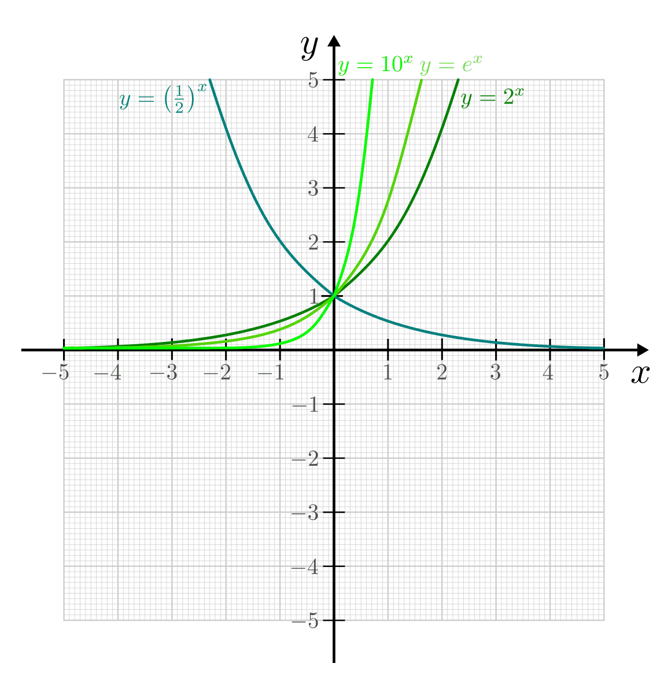
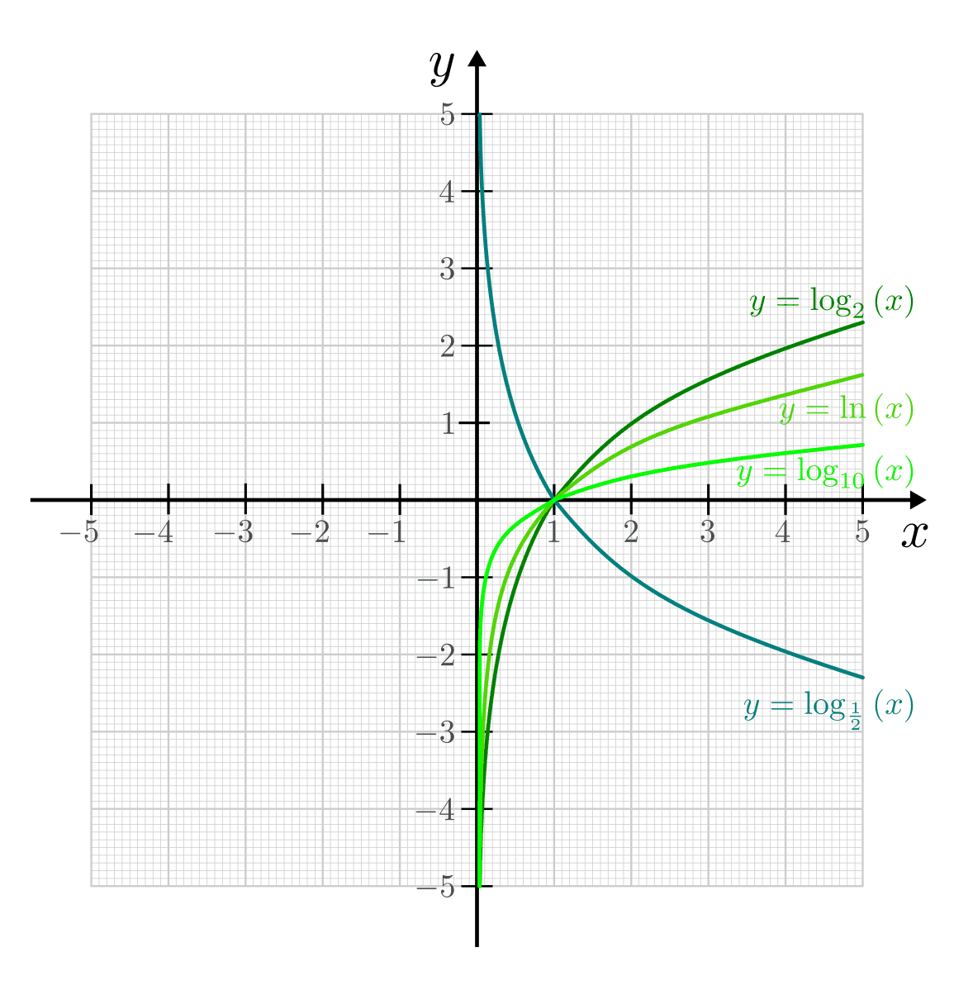

.. _Exponential- und Logarithmusfunktionen:

Exponential- und Logarithmusfunktionen
======================================

.. index:: Exponentialfunktion
.. _Exponentialfunktionen:

Exponentialfunktionen
---------------------

Exponentialfunktionen haben allgemein folgende Funktionsgleichung:

.. math::
    :label: eqn-exponentialfunktion

    y = a ^x

Dabei bezeichnet die "Basis" :math:`a>0` eine beliebige, konstante Zahl.
Üblicherweise wird zudem der Fall :math:`a=1` ausgeschlossen, da :math:`1^x=1`
eine konstante Funktion liefert. Am weitesten verbreitet sind die
Exponentialfunktionen mit den Basen :math:`a=2`, :math:`a=e` und
:math:`a=10`. [#]_

    Beispiele von Exponentialfunktionen.

    .. only:: html

        :download:`SVG: Exponentialfunktionen
        <../../pics/analysis/exponentialfunktionen.svg>`

Im Fall :math:`0<a<1` sind Exponentialfunktionen streng monoton fallend, im Fall
:math:`a>1` streng monoton steigend. Alle Exponentialfunktionen haben den Punkt
:math:`(0,1)` gemeinsam und nähern sich asymptotisch der :math:`x`-Achse an,
ohne diese jemals zu berühren. Exponentialfunktionen haben somit keine
Nullstellen und :math:`s=0` als untere Schranke.
Die Funktionen :math:`y=a^{-x}` und :math:`y=\left( \frac{1}{a}\right)^x` sind
identisch; ihr gemeinsamer Funktionsgraph verläuft bezüglich der :math:`y`-Achse
symmetrisch zur Funktion :math:`y=a^x`. [#]_

Für Exponentialfunktionen sind die folgenden vier :ref:`Rechenregeln für
Potenzen <Rechenregeln für Potenzen mit gleicher Basis>` von Bedeutung:

.. math::
    :label: eqn-exponentialfunktion-rechenregeln

    a ^{x_1 + x_2} &= a ^{x_1} \cdot a ^{x_2} \\[4pt]
    a ^{x_1 - x_2} &= a ^{x_1} : a ^{x_2} \\[4pt]
    a ^{x_1 \;\cdot\, x_2} &= \left(a ^{x_1}\right)^{x_2} \\[4pt]
    {\color{white}1 \qquad\qquad }a ^{\frac{x_1}{x_2}} &= \sqrt[x_2\;]{a ^{x_1}} \quad \;(\text{mit } x_2 \ne 0)

Eine besondere Bedeutung von Exponentialfunktionen :math:`a^x` mit :math:`a > 1`
liegt darin, dass ihre Werte schneller wachsen als es bei einer Potenzfunktion
:math:`x^n` mit beliebig großem (aber festem) :math:`n` der Fall ist; es gilt
also für beliebige Werte :math:`n \in \mathbb{R} ^{+}` und :math:`a >1`:

.. math::

    \lim _{x \to \infty} \frac{a^x}{x^n} = \infty

Der Grund dafür liegt darin, dass die :ref:`Ableitung einer Exponentialfunktion
<Ableitungen von Exponentialfunktionen>` als Maß für die Steigung der jeweiligen
Funktion selbst eine Exponentialfunktion ist: Nicht nur die Werte wachsen für
:math:`a>1` somit exponentiell an, sondern auch die Zunahme der Werte nimmt in
diesem Fall exponentiell zu.

.. index:: Logarithmusfunktion
.. _Logarithmusfunktion:
.. _Logarithmusfunktionen:

Logarithmusfunktionen
---------------------

Logarithmusfunktionen sind die :ref:`Umkehrfunktionen <Umkehrbarkeit einer
Funktion>` von Exponentialfunktionen. Sie haben allgemein folgende
Funktionsgleichung:

.. math::
    :label: eqn-logarithmusfunktion

    y = \log_{a}{(x)}

Da Exponentialfunktionen eindeutig umkehrbar sind, gibt es zu jeder
Exponentialfunktion eine entsprechende Logarithmusfunktion. Da der
Definitionsbereich jeder Umkehrfunktion gleich dem Wertebereich der
Originalfunktion ist, sind Logarithmen nur für :math:`x>0` definiert.

    Beispiele von Logarithmusfunktionen.

    .. only:: html

        :download:`SVG: Logarithmusfunktionen
        <../../pics/analysis/logarithmusfunktionen.svg>`

Logarithmusfunktionen sind nur für :math:`a>0` und :math:`a \ne 1` definiert.
Wie bei den Exponentialfunktionen, so sind auch bei den Logarithmusfunktionen
die Basen :math:`a=2`, :math:`a=e` und :math:`a=10` am weitesten verbreitet; sie
werden, wie bereits im Abschnitt :ref:`Rechenregeln für Logarithmen
<Rechenregeln für Logarithmen>` beschrieben, als binärer, natürlicher und
dekadischer Logarithmus bezeichnet:

.. math::

    \text{lb}\,(x) &= \log_{2}{(x)}\;\,: \quad \!\!\! \text{dualer Logarithmus}{\color{white}\qquad\qquad\qquad\;\; 1} \\
    \ln{(x)} &= \log_{e}{(x)}\;\,: \quad \!\!\! \text{natürlicher Logarithmus} \\
    \text{lg}\,(x) &= \log_{10}{(x)}: \quad \!\!\text{dekadischer Logarithmus}

Im Fall :math:`0 < a < 1` sind Logarithmusfunktionen streng monoton fallend, im
Fall :math:`a > 1` streng monoton steigend. Die einzelnen Logarithmusfunktionen
können jeweils durch einen Basiswechsel in einen Logarithmus mit einer anderen
Basis umgeformt werden. Es gilt dabei:

.. math::
    :label: eqn-logarithmusfunktion-basiswechsel

    \log_{a}{(x)} =
    \frac{\log_{b}{(x)}}{\log_{b}{(a)}}{\color{white}\qquad\qquad\qquad\quad
    \ldots}

Alle Logarithmusfunktionen sind unbeschränkt, haben den Punkt :math:`(0,1)` als
einzige Nullstelle gemeinsam und nähern sich für :math:`x \to 0` asymptotisch
der :math:`y`-Achse an. Die Funktionen :math:`y=\log_{\frac{1}{a}}{(x)}` und
:math:`y=-\log_{a}{(x)}` sind identisch; ihr gemeinsamer Funktionsgraph verläuft
bezüglich der :math:`x`-Achse symmetrisch zur Funktion :math:`y=\log_{a}{(x)}`.
[#]_

Für Logarithmusfunktionen sind die folgenden Rechenregeln von Bedeutung:

.. math::
    :label: eqn-logarithmusfunktion-rechenregeln

    \log_{a}{(x_1 \cdot x_2)} &= \log_{a}{(x_1)} + \log_{a}{(x_2)} \\[4pt]
    \log_{a}{(x_1 : x_2)} &= \log_{a}{(x_1)} - \log_{a}{(x_2)} \\[4pt]
    \log_{a}{(x_1)^{x_2}} &= x_2 \cdot \log_{a}{(x_1)} \\[4pt]
    \log_{a}{(\sqrt[x_2\;]{x_1})} &= \frac{1}{x_2} \cdot  \log_{a}{(x_1)}  \quad
    \;(\text{mit } x_1,\, x_2 \ne 0)

Eine besondere Bedeutung von Logarithmusfunktionen :math:`\log_{a}{(x)}` mit
:math:`a > 1` liegt darin, dass ihre Werte langsamer wachsen als es bei einer
Potenz- bzw. Wurzelfunktion :math:`x^n` mit beliebig kleinem (aber festem)
:math:`n` der Fall ist; es gilt also für beliebige Werte :math:`n \in \mathbb{R}
^{+}` und :math:`a >1`:

.. math::

    \lim _{x \to \infty} \frac{\log_{a}{(x)}}{x^n} = 0

Der Grund dafür liegt darin, dass die :ref:`Ableitung einer Logarithmusfunktion
<Ableitungen von Logarithmusfunktionen>` als Maß für die Steigung der jeweiligen
Funktion sehr schnell gegen Null geht; beispielsweise ist für :math:`x =
1\,000\,000` der Wert der Wurzelfunktion :math:`f(x) = x ^{\frac{1}{2}}` gleich
:math:`(1\,000\,000) ^{\frac{1}{2}} = 1\,000`, der Wert der Logarithmusfunktion
:math:`\log_{2}{(x)}` beträgt für diesen Wert hingegen nur
:math:`\log_{2}{(1\,000\,000)} \approx 19,93`. Dennoch ist der Grenzwert für
:math:`x \to \infty` bei jeder Logarithmus-Funktion :math:`f(x) = \log_{a}{(x)}`
mit :math:`a > 1` ebenfalls Unendlich.

.. raw:: html

    

.. only:: html

    .. rubric:: Anmerkungen:

.. [#] Dabei bezeichnet :math:`e=2,71828182845...` die "Eulersche Zahl".

.. [#] Die Identität von :math:`y=a^{-x}` und :math:`y=\left(
    \frac{1}{a}\right)^x` ergibt sich aus der Beziehung :math:`a^{-x} =
    \frac{1}{a^x} = \left( \frac{1}{a}\right)^x`.

.. [#] Die Identität von :math:`y=\log_{\frac{1}{a}}{(x)}` und
    :math:`y=-\log_{a}{(x)}` lässt sich mit Hilfe der folgenden beiden
    Beziehungen zeigen:

    * Als Spezialfall der :ref:`Basisumrechnung <Basisumrechnung>` von
      Logarithmen gilt für beliebige erlaubte Zahlen :math:`a` und :math:`b`:

      .. math::

          \log_{a}{(b)} = \frac{\log_{b}{(b)}}{\log_{b}{(a)}} =
          \frac{1}{\log_{b}(a)}{\color{white}\qquad\qquad\qquad\qquad\qquad 1}

      Hierbei wird die Identität :math:`\log_{b}{(b)} = 1` genutzt.

    * Ein Quotient als Argument eines Logarithmus kann als :ref:`Differenz
      zweier Logarithmen <Summen und Differenzen von Logarithmen>` dargestellt
      werden. Somit gilt:

      .. math::

          \log_{b}{\left( \frac{1}{a}\right)} = \log_{b}{(1)} - \log_{b}{(a)}  =
          0 - \log_{b}{(a)} = - \log_{b}{(a)}

      Hierbei wird die Identität :math:`\log_{b}{(1)} = 0` genutzt.

    Insgesamt gilt somit:

    .. math::

        \log_{\frac{1}{a}}{(b)} = \frac{1}{\log_{b}{\left( \frac{1}{a}\right)}}
        = - \frac{1}{\log_{b}{(a)}} = - \log_{a}{(b)}\quad \checkmark

