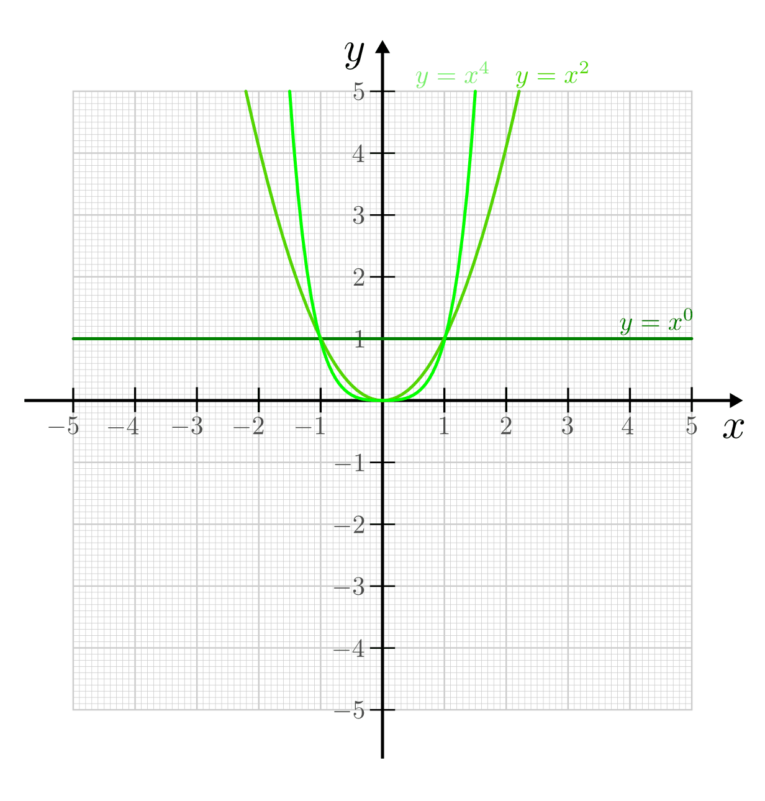
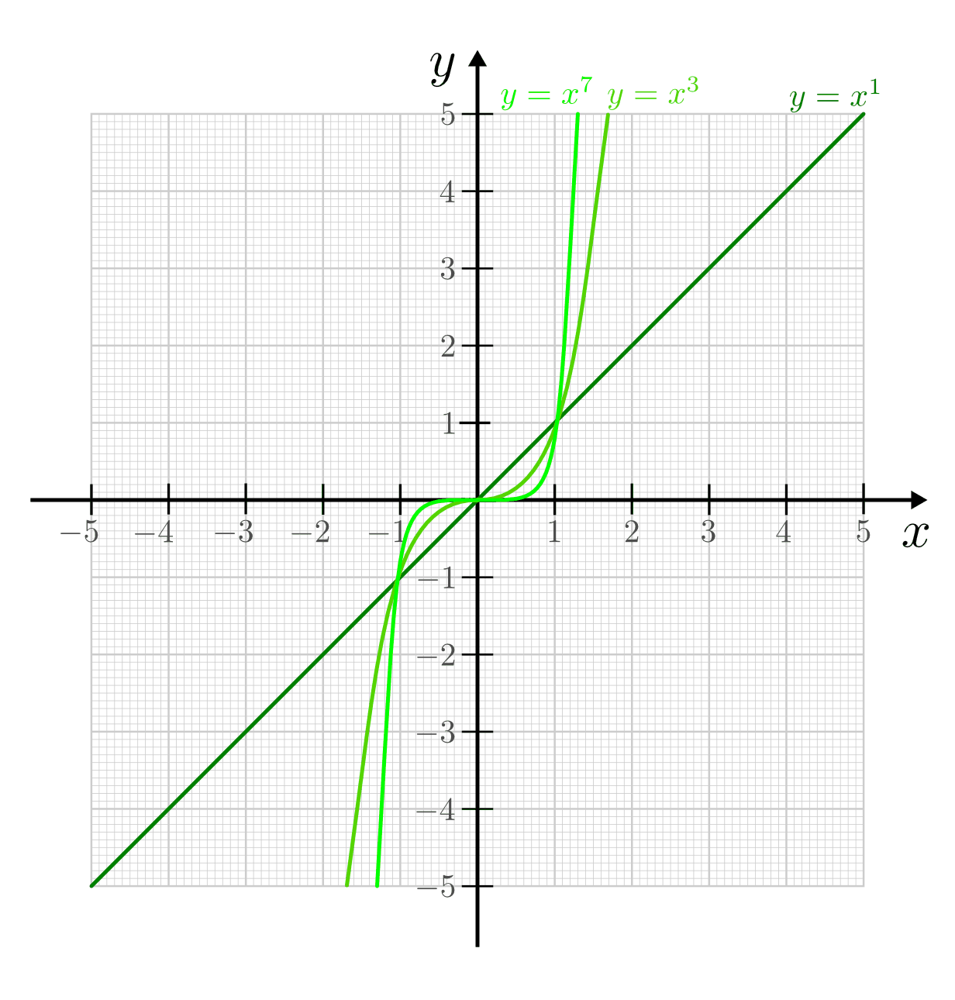
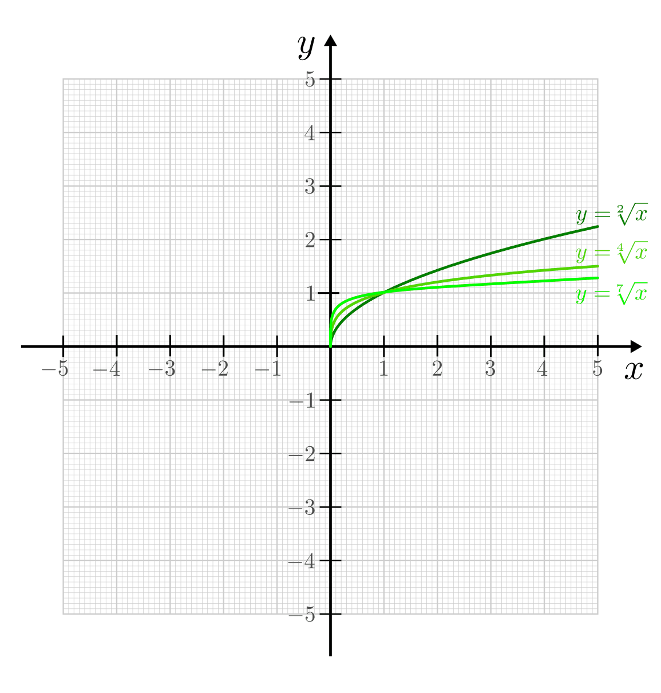

.. index:: Potenzfunktion
.. _Potenz- und Wurzelfunktionen:

Potenz- und Wurzelfunktionen
============================

Eine Potenzfunktion hat allgemein folgende Funktionsgleichung:

.. math::
    :label: eqn-potenzfunktion

    f(x) = x^n

In praktischen Anwendungen treten Potenzfunktionen sehr häufig auf;
beispielsweise werden durch sie Proportionalitäten zwischen einer Größe
:math:`y` und der :math:`n`-ten Potenz der Ausgangsgröße :math:`x` beschrieben.
Wichtige Sonderfälle sind hierbei mit :math:`f(x)=x^0 = 1` die konstante
Funktion und mit :math:`f(x)=x` die lineare Funktion. Wurzelfunktionen lassen
sich ebenfalls als Potenzfunktion mit rationalem Exponenten auffassen.

Einige wichtige Eigenschaften von Potenzfunktionen werden im Folgenden näher
beschrieben.

.. _Gerade und ungerade Potenzfunktionen:

Gerade und ungerade Potenzfunktionen
------------------------------------

Potenzfunktionen auch höheren Grades -- also allgemein Funktionen der Form
:math:`f(x) = x^n` mit :math:`n \in \mathbb{N}` -- lassen sich in gerade und
ungerade Funktionen unterteilen.

.. rubric:: Potenzfunktionen mit geraden Exponenten

Eine Funktion heißt "gerade", wenn für alle :math:`x \in \mathbb{D}` folgende
Bedingung gilt:

.. math::
    :label: eqn-gerade-funktion

    f(-x) = f(x)

Zu jedem Punkt des Funktionsgraphen existiert in diesem Fall ein zweiter
Kurvenpunkt, der achsensymmetrisch zur :math:`y`-Achse ist. Diese Bedingung
wird von allen Potenzfunktionen mit geradzahligen Exponenten erfüllt, da sich
bei diesen die Minuszeichen der negativen :math:`x`-Werte beim Potenzieren
gegenseitig aufheben. Die konstante Funktion :math:`f(x)=c` wird ebenfalls zu
den geraden Funktionen gezählt, da :math:`x^0 = 1` ist.

    Beispiele von Potenzfunktionen mit geraden Exponenten.

    .. only:: html

        :download:`SVG: Potenzfunktionen mit geraden Exponenten
        <../../pics/analysis/potenzfunktionen-mit-geraden-exponenten.svg>`

Zusätzlich haben alle geraden Potenzfunktionen folgende Eigenschaften:

* Die Funktionsgraphen verlaufen stets durch die Punkte :math:`(-1,1)`,
  :math:`(0,0)` und :math:`(1,1)`.

* Die Funktionen sind streng monoton fallend für :math:`x < 0` und streng monoton
  steigend für :math:`x > 0`. [#]_

* Der Definitionsbereich der Funktionen ist :math:`\mathbb{R}`, ihr Wertebereich
  :math:`\mathbb{R}_0 ^{+}`; sie sind also nach unten beschränkt, und für die untere
  Schranke gilt :math:`s=0`.

.. rubric:: Potenzfunktionen mit ungeraden Exponenten

Eine Funktion heißt "ungerade", wenn für alle :math:`x \in \mathbb{D}`
folgende Bedingung gilt:

.. math::
    :label: eqn-ungerade-funktion

    -f(-x) = f(x)

Zu jedem Punkt des Funktionsgraphen existiert somit ein zweiter Kurvenpunkt,
der punktsymmetrisch zum Koordinatenursprung :math:`(0,0)` ist. Diese
Bedingung wird von allen Potenzfunktionen mit ungeraden Exponenten erfüllt,
da sich die Funktionswerte von negativen :math:`x`-Werte gegenüber den
Funktionswerten von betragsgleichen positiven :math:`x`-Werten nur im
Vorzeichen unterscheiden. [#]_

    Beispiele von Potenzfunktionen mit ungeraden Exponenten.

    .. only:: html

        :download:`SVG: Potenzfunktionen mit ungeraden Exponenten
        <../../pics/analysis/potenzfunktionen-mit-ungeraden-exponenten.svg>`

Zusätzlich haben alle ungeraden Potenzfunktionen folgende Eigenschaften:

* Der Funktionsgraph verläuft stets durch die Punkte :math:`(-1,-1)`,
  :math:`(0,0)` und :math:`(1,1)`.

* Die Funktion ist für alle :math:`x`-Werte entweder streng monoton fallend oder streng monoton
  steigend.

* Der Definitionsbereich sowie der Wertebereich der Funktion ist :math:`\mathbb{R}`.

.. _Wurzelfunktionen:

Wurzelfunktionen
----------------

Wurzelfunktionen haben allgemein folgende Funktionsgleichung:

.. math::
    :label: eqn-wurzelfunktion

    f(x) = \sqrt[n]{x}

Dabei ist der Wurzelexponent :math:`n` eine feste natürliche und die Variable
:math:`x` eine beliebige positive reelle Zahl. [#]_ Da die Wurzel einer beliebigen
positiven Zahl ebenfalls eine positive Zahl ist, ist :math:`\mathbb{W} =
\mathbb{D} = \mathbb{R}_0^{+}`.
Aufgrund der Beziehung :math:`\sqrt[n]{x} = x ^{\frac{1}{n}}` lassen sich
Wurzelfunktionen als Potenzfunktionen mit rationalem Exponenten auffassen.
Zugleich ist die :math:`n`-te Wurzelfunktion :math:`y=\sqrt[n]{x}` die
Umkehrfunktion der :math:`n`-ten Potenzfunktion :math:`y = x^n`, da gilt:

.. math::

    x = f_{\mathrm{U}}(y) = \sqrt[n]{x^n} = x ^{\frac{n}{n}} = x^1 = x

    Beispiele von Wurzelfunktionen.

    .. only:: html

        :download:`SVG: Wurzelfunktionen
        <../../pics/analysis/wurzelfunktionen.svg>`

Alle Wurzelfunktionen sind stetig, streng monoton steigend und haben :math:`x_0
= 0` als (einfache) Nullstelle. Die Funktionsgraphen haben neben dem Punkt
:math:`(0,0)` auch den Punkt :math:`(1,1)` gemeinsam; sie entstehen durch
Spiegelung der jeweiligen Potenzfunktion :math:`x^n` an der Geraden :math:`y=x`.

.. raw:: html

    

.. only:: html

    .. rubric:: Anmerkungen:

.. [#] Steht eine Potenzfunktion in Betragszeichen, ist also :math:`f(x) =
    | x^n|`, so ist diese Funktion in jedem Fall gerade, da mögliche negative
    Vorzeichen von Funktionswerten dadurch aufgehoben werden (siehe
    beispielsweise Abbildung :ref:`Betragsfunktion <fig-betragsfunktion>`).

.. [#] Um die Umkehrfunktion einer geraden Potenzfunktion zu bilden, muss somit
    der Definitionsbereich eingeschränkt werden (meist auf :math:`\mathbb{R}_0
    ^{+}`).

.. [#] | Diese Einschränkung ist zumindest für reellwertige Funktionen
         notwendig, da in diesem Fall keine Wurzeln mit negativen Argumenten
         definiert sind.
    | Im Bereich der :ref:`komplexen Zahlen <Komplexe Zahlen>`
      gilt die Beziehung :math:`\sqrt{-1} = i`.

