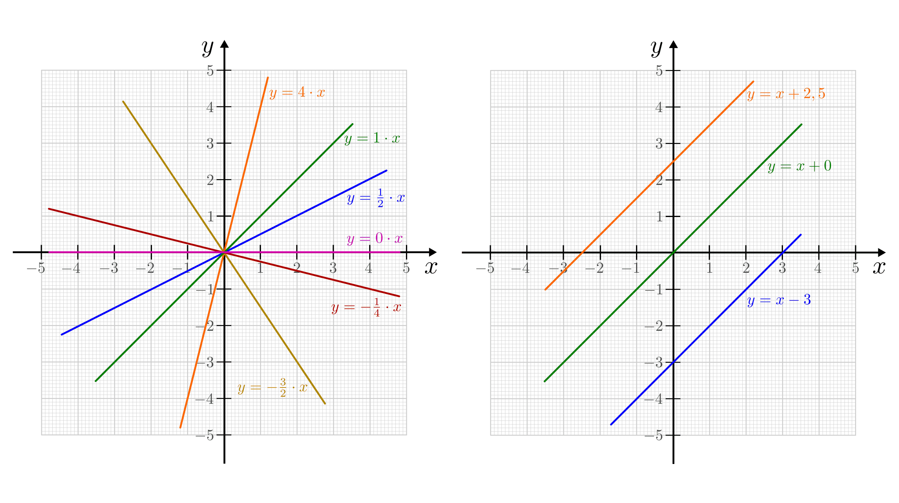
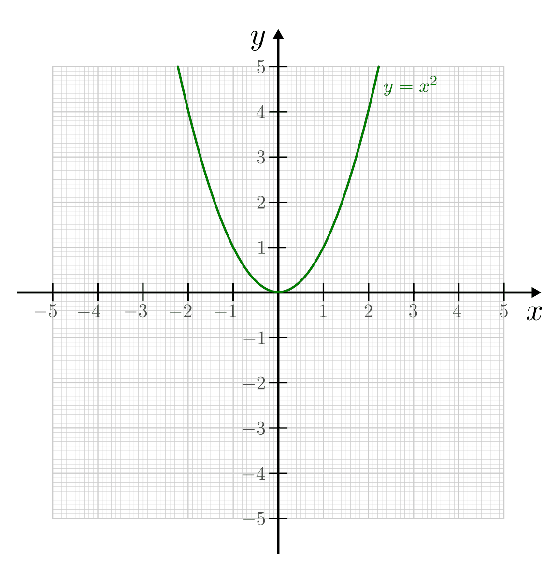
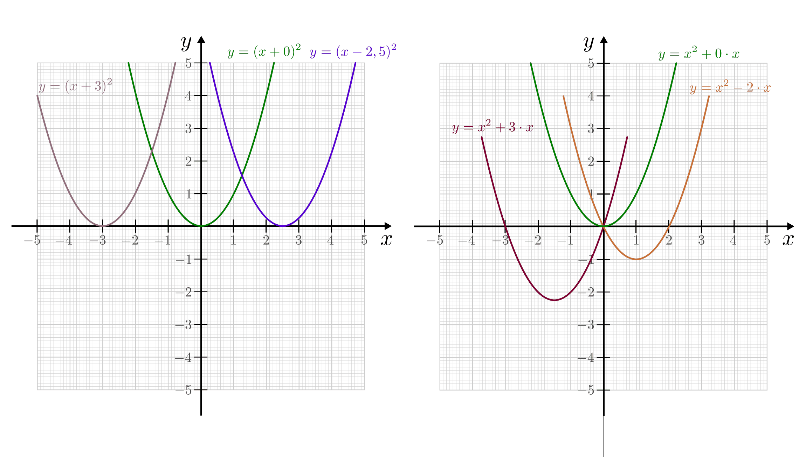
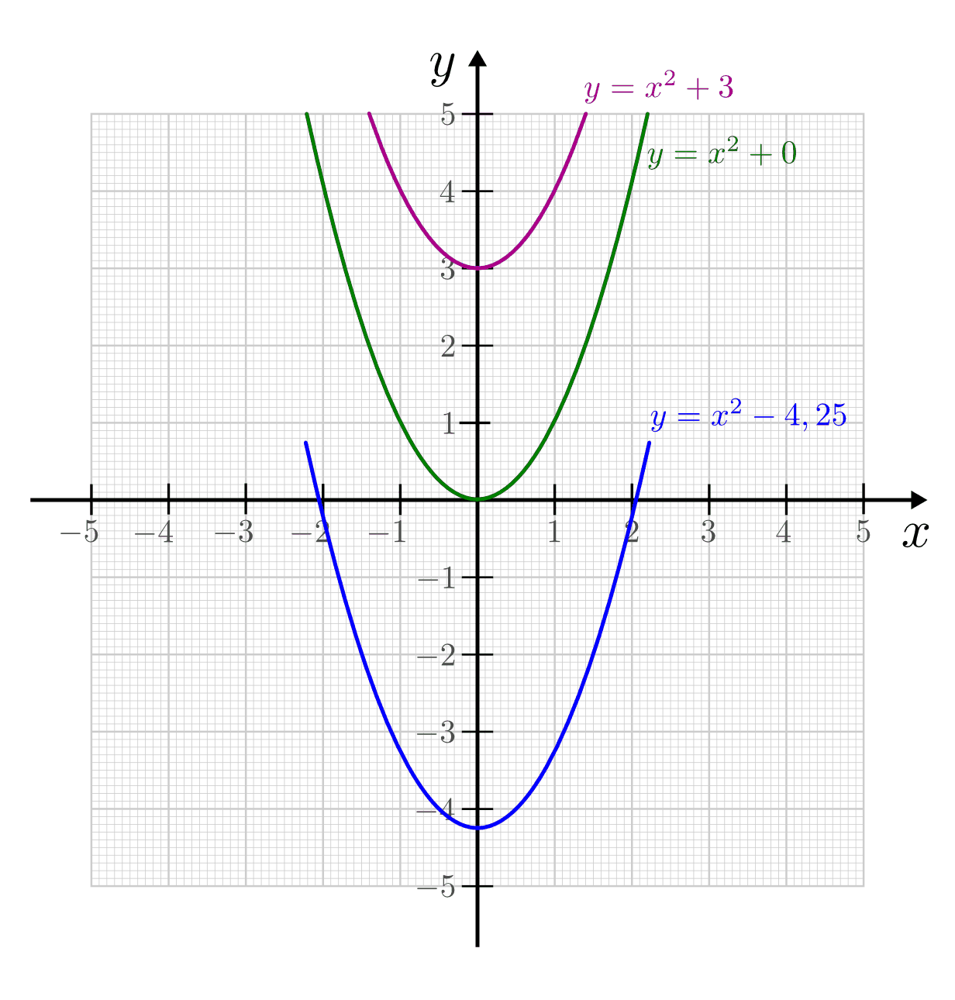
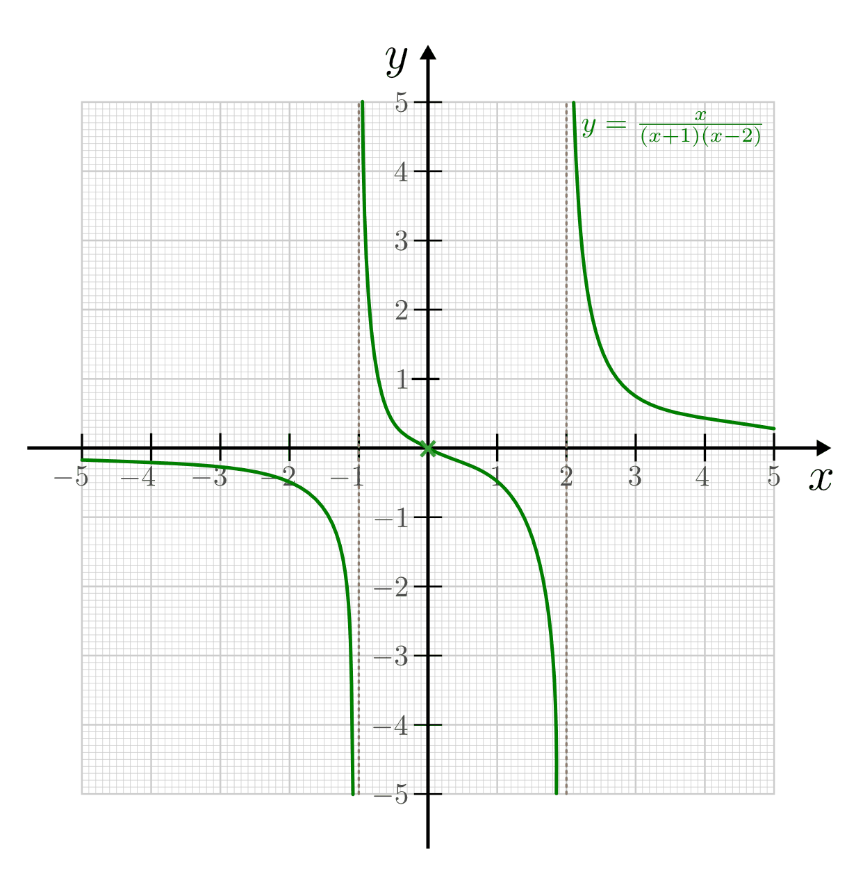
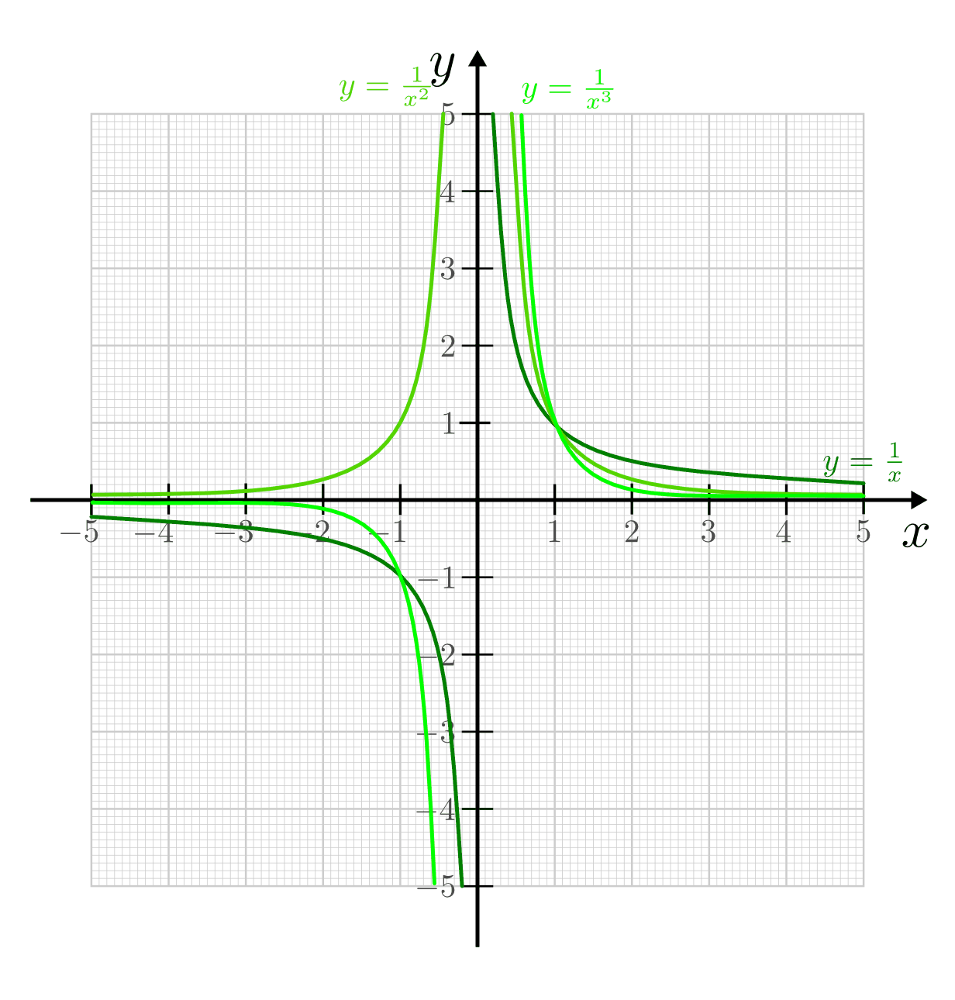

.. _Ganz- und gebrochenrationale Funktionen:

Ganz- und gebrochenrationale Funktionen
=======================================

.. index:: Ganzrationale Funktion
.. _Ganzrationale Funktionen:

Ganzrationale Funktionen
------------------------

Ganzrationale Funktionen haben allgemein folgende Funktionsgleichung:

.. math::
    :label: eqn-ganzrationale-funktion

    y = \sum_{i=0}^{n} a_i \cdot x^i = a _{\rm{n}} \cdot x^n + a
    _{\rm{n-1}} \cdot x ^{n-1} + \ldots + a_2 \cdot x^2 + a_1 \cdot x + a_0

Hierbei bezeichnet man den größten Exponenten :math:`n \in \mathbb{N}` des
Polynoms als "Grad" der Funktion, die reellen Zahlen :math:`a_0` bis :math:`a_n`
nennt man Koeffizienten. Ganzrationale Funktionen haben allgemein folgende
Eigenschaften:

1. Ganzrationale Funktionen sind für alle reellen Zahlen definiert, es gilt also
   :math:`\mathbb{D} = \mathbb{R}`. Sie sind im gesamten Bereich stetig, d.h.
   der Funktionsgraph ergibt eine kontinuierliche Kurve ohne Sprünge.

2. Jede Potenzfunktion :math:`x^n` mit :math:`n \ge 1` wird für große
   :math:`x`-Werte unendlich groß, da :math:`\lim _{x->\infty} x^n = \infty`
   ist. Bei einer ganzrationalen Funktion richtet sich der Grenzwert nach der
   höchsten Potenz und hat das gleiche Vorzeichen wie der dazugehörige
   Koeffizient.

3. Jede ganzrationale Funktion :math:`n`-ten Grades hat maximal :math:`n`
   verschiedene Nullstellen.

   Ebenso ist es möglich, dass bei der Bestimmung der Nullstellen ein Wert
   mehrfach vorkommt. In diesem Fall ist die Nullstelle mehrfach zu zählen, wobei
   der Vielfachheit folgende Bedeutung zukommt:

   - Bei geradzahlig-mehrfachen Nullstellen berührt der Funktionsgraph die
     :math:`x`-Achse, verbleibt allerdings auf der selben Seite der Achse.
   - Bei ungeradzahlig-mehrfachen Nullstellen schneidet der Funktionsgraph die
     :math:`x`-Achse.

Aus Potenzfunktionen zusammengesetzte Funktionen sind meist weder gerade noch
ungerade, außer sie bestehen ausschließlich aus nur geraden oder nur ungeraden
Potenzfunktionen. Sowohl gerade als auch ungerade Funktionen haben besondere
Stellen :math:`x_i` (Nullstellen, Extremstellen und Wendepunkte), sofern
:math:`x_i \ne 0` ist, stets paarweise. Die :math:`x`-Werte der besonderen
Stellen unterscheiden sich dabei nur in ihrem Vorzeichen, es ist also :math:`x_1
= -x_2`. Zudem haben sie folgende Eigenschaften:

* Ganzrationale Funktionen geraden Grades sind stets einseitig beschränkte
  Funktionen. Sie haben entweder keine oder eine gerade Anzahl an Nullstellen,
  die unter Umständen mehrfach zu zählen sind.

* Ganzrationale Funktionen ungeraden Grades sind stets unbeschränkt und haben
  stets (mindestens) eine Nullstelle. Die Gesamtzahl der Nullstellen ist stets
  ungerade.

Im Folgenden werden die obigen und weitere Eigenschaften am Beispiel der häufig
vorkommenden linearen und quadratischen Funktionen, also den einfachsten
Vertretern von ganzrationalen Funktionen (mit :math:`n=1` beziehungsweise
:math:`n=2`), näher beschrieben.

.. index:: Lineare Funktion
.. _Lineare Funktionen:

Lineare Funktionen
^^^^^^^^^^^^^^^^^^

Wenn eine Größe in gleichem Maß zunimmt wie auch eine andere Größe wächst,
so nennt man den Zusammenhang direkt proportional oder linear. Die zugehörige
mathematische Funktion hat folgende Form:

.. math::

    y = a \cdot x + b

Lineare Zusammenhänge zweier Größen treten im Alltag -- beispielsweise bei
:ref:`Dreisatz-Aufgaben <Dreisatz-Aufgaben>` -- sowie in den Naturwissenschaften
sehr häufig auf.

*Beispiele:*

* Je größer die Geschwindigkeit eines Fahrzeugs ist, desto länger ist die
  Wegstrecke, die es in einer bestimmten Zeit zurücklegt.
* Je mehr Plätzchen auf Vorrat gebacken werden, desto länger kann man davon
  naschen (vorausgesetzt, jeden Tag werden gleich viele Plätzchen verspeist).
* Je mehr Geld man ausgeben möchte, desto mehr muss man verdienen. Oder: Je
  sparsamer man mit einer bestimmten Menge Geld umgeht, desto länger kann man
  davon leben. Ähnlich ist es mit dem Benzinverbrauch eines Fahrzeugs.

Der Graph einer linearen Funktion ist eine Gerade, die umso steiler verläuft, je
größer der Proportionalitätsfaktor :math:`a` ist; :math:`a` wird daher auch aus
"Steigung" der linearen Funktion bezeichnet. Der Wert :math:`b` stellt den
Anfangswert dar (das Ergebnis der Funktion, wenn :math:`x=0` ist).

    Graphen der linearen Funktionen :math:`y = a \cdot x` bzw. :math:`y = x + b`
    mit unterschiedlichen Parametern :math:`a` (links) und :math:`b` (rechts).

    .. only:: html

        :download:`SVG: Lineare Funktionen
        <../../pics/analysis/lineare-funktionen.svg>`

Eine Funktion heißt proportional, wenn das Verhältnis der Größen
:math:`\frac{y}{x}` immer einen konstanten Wert hat, d.h. wenn
:math:`\frac{y}{x} = k` gilt. Das ist genau dann der Fall, wenn :math:`y = k
\cdot x` ist. Bei proportionalen Funktionen handelt es sich folglich um lineare
Funktionen, die üblicherweise durch den Koordinatenursprung verlaufen und eine
positive Steigung aufweisen.

.. Beispiele: Menge -> Preis, Weg -> Zeit bei konstanter Geschwindigkeit

.. index:: Quadratische Funktion
.. _Quadratische Funktionen:

Quadratische Funktionen
^^^^^^^^^^^^^^^^^^^^^^^

In manchen Situationen wächst eine Größe durch den Einfluss einer anderen Größe
stärker als proportional. Nimmt eine Messgröße um das :math:`2,4,9,16,n^2`-fache
zu, während die Ausgangsgröße den  :math:`1,2,3,4,n`-fachen Wert annimmt, so
nennt man die zugehörige Funktion quadratisch.

*Beispiele:*

* Ein Quadrat mit einer :math:`2,3,4,\ldots`-fachen Seitenlänge :math:`l` besitzt einen
  :math:`4,9,16,\ldots`-fachen Flächeninhalt :math:`A _{\rm{Quadrat}}`.

  .. math::

      A _{\rm{Quadrat}} = l^2

* Die Fläche :math:`A _{\rm{Kreis}}` eines Kreises wächst ebenfalls
  quadratisch mit zunehmendem Radius an. Zur exakten Berechnung muss der Radius
  :math:`r` quadriert und mit der Kreiszahl :math:`\pi` multipliziert werden.

  .. math::

      A _{\rm{Kreis}} = \pi \cdot r^2

* Die Strecke, die ein Körper im freien Fall (ohne Reibung) zurücklegt, nimmt
  quadratisch mit der Zeit zu: Nach einer Sekunde hat der Körper knapp 5 Meter
  zurückgelegt, nach zwei Sekunden 20 Meter, nach drei Sekunden 45 Meter, nach
  vier Sekunden 80 Meter, usw. Allgemein gilt für die Fallstrecke :math:`s` mit
  der Erdbeschleunigung :math:`g = \unit[9,81]{\frac{m}{s^2} }` folgende Formel:

  .. math::

      s = \frac{1}{2} \cdot g \cdot t^2

Der Graph einer quadratischen Funktion ist eine Parabel bzw. ein Stück davon.

.. index:: Parabel
.. _Normalparabel:

.. rubric:: Die Normalparabel

Allgemein besitzt eine quadratische Funktion folgende Form:

.. math::
    :label: eqn-parabel

    y = a \cdot x^2 + b \cdot x + c

Im einfachsten Fall sind die beiden Parameter :math:`b,c = 0` sowie :math:`a =
1`. Die Funktion vereinfacht sich damit zu:

.. math::
    :label: eqn-normalparabel

    y = x^2

Den zu Gleichung :eq:`eqn-normalparabel` gehörigen Funktionsgraphen nennt man
Normalparabel. Ihre Funktionswerte ergeben sich jeweils durch Quadrieren der
eingesetzten :math:`x`-Werte.

    Graph der Normalparabel :math:`y = x^2`.

    .. only:: html

        :download:`SVG: Normalparabel
        <../../pics/analysis/normalparabel.svg>`

Die Besonderheiten einer Normalparabel sind:

* Der Scheitel der Normalparabel liegt bei :math:`(0;0)`.

* Die Normalparabel ist symmetrisch zur :math:`y`-Achse. Der Grund hierfür ist,
  dass sich das Minuszeichen beim Quadrieren aufhebt -- Minus mal Minus ergibt
  Plus.

* Die Normalparabel besitzt nur nicht-negative :math:`y`-Werte, d.h. sie bildet
  den Definitionsbereich :math:`D = \mathbb{R}` auf den positiven Bereich der
  reellen Zahlen :math:`W = \mathbb{R}^{+}` ab. Der Grund hierfür ist, dass für
  die Quadratzahl einer jeden reellen Zahl :math:`n \in \mathbb{R}` gilt:
  :math:`n^2 \ge 0`

.. _Bedeutung der Parameter a, b und c:

.. rubric:: Bedeutung der Parameter :math:`a,\,b` und :math:`c`

Durch Variation der Parameterwerte :math:`a,\, b` und :math:`c` ergeben sich
gegenüber der Normalparabel folgende Veränderungen:

* Ist der Parameter :math:`0 < a < 1`, so ist die Parabel gegenüber der
  Normalparabel gestaucht, d.h. ihre Werte wachsen langsamer als es bei der
  Normalparabel der Fall ist. Im umgekehrten Fall :math:`a > 0` ist die
  resultierende Parabel gegenüber der Normalparabel gestreckt.

  Gilt :math:`a < 0`, so ist die Parabel nach unten hin geöffnet.

.. figure:: ../../pics/analysis/parabel-a.png
    :width: 50%
    :align: center
    :name: fig-parabel-a
    :alt:  fig-parabel-a

    Graphen der Parabelgleichung :math:`y = a \cdot x^2` für verschiedene
    Parameter :math:`a`.

    .. only:: html

        :download:`SVG: Parabel (a).
        <../../pics/analysis/parabel-a.svg>`

* Lässt sich eine Parabelgleichung als binomische Formel schreiben,
  beispielsweise :math:`x^2 - 6x + 9 = (x-3)^2` oder allgemein :math:`(x \pm
  b)^2`, so bewirkt der in der quadrierten Klammer stehende Parameter :math:`b`
  eine Verschiebung nach links (falls :math:`b>0`) bzw. nach rechts (falls
  :math:`b<0`).

  Die Wirkung des Parameters :math:`b \cdot x` lässt sich bestimmen, indem man
  mit Hilfe der ersten Ableitung den Wert des Parabelscheitels allgemein
  berechnet. [#]_ Je nach Größe der Werte von :math:`a` und :math:`c` bewirkt
  der Parameter :math:`b` eine Verschiebung des Parabelscheitels um  :math:`-
  \frac{b}{2 \cdot a}` in horizontaler und um :math:`- \frac{b^2}{4 \cdot a} +
  c` in vertikaler Richtung. Im Falle einer Normalparabel (:math:`a=1` und
  :math:`c=0`) bewirkt :math:`b \cdot x` eine Verschiebung um :math:`-
  \frac{b}{2}` in :math:`x`-Richtung sowie eine Verschiebung um :math:`-
  \frac{b^2}{4}` in :math:`y`-Richtung.

    Graphen der Parabelgleichung :math:`y = (x + b)^2` bzw. :math:`y = x^2 + b
    \cdot x` für verschiedene Parameter :math:`b`.

    .. only:: html

        :download:`SVG: Parabel (b).
        <../../pics/analysis/parabel-a.svg>`

* Ist der Parameter :math:`c \ne 0`, so ist die Parabel nach oben (:math:`c >
  0`) bzw. nach unten (:math:`c < 0`) verschoben.

    Graphen der Parabelgleichung :math:`y = x^2 + c` für verschiedene
    Parameter :math:`c`.

    .. only:: html

        :download:`SVG: Parabel (c).
        <../../pics/analysis/parabel-c.svg>`

Treten mehrere der oben genannten Fälle ein, so kombinieren sich entsprechend
die Effekte.

.. index:: Gebrochenrationale Funktion
.. _Gebrochenrationale Funktionen:

Gebrochenrationale Funktionen
-----------------------------

Gebrochenrationale Funktionen haben allgemein folgende Funktionsgleichung:

.. math::
    :label: eqn-gebrochenrationale-funktion

    y = \frac{Z(x)}{N(x)} = \frac{\sum_{i=0}^{n} a_i \cdot x^i}{\sum_{k=0}^{m}
    b_k \cdot x^k} = \frac{a _{\rm{n}} \cdot x^n + a _{\rm{n-1}} \cdot x ^{n-1}
    +\ldots + a_2 \cdot x^2 + a_1 \cdot x + a_0}{b _{\rm{m}} \cdot x^m + b
    _{\rm{m-1}} \cdot x ^{m-1} + \ldots + b_2 \cdot x^2 + b_1 \cdot x + a_0}

Gebrochenrationale Funktionen bestehen also aus einem Zählerpolynom
:math:`Z(x)` mit Grad :math:`n` und einem Nennerpolynom :math:`N(x)` mit Grad
:math:`m`. Ist :math:`n<m`, so nennt man die Funktion "echt" gebrochenrational;
andernfalls lässt sich die Funktion mittels :ref:`Polynomdivision
<Polynomdivision>` als Summe einer ganzrationalen Funktion und einer echt
gebrochenrationalen Funktion schreiben.

.. index:: Polstelle
.. _Nullstellen und Polstellen:

Nullstellen und Polstellen
^^^^^^^^^^^^^^^^^^^^^^^^^^

Gebrochenrationale Funktionen sollten stets auf folgende Punkte hin untersucht
werden:

* Als Nullstellen von gebrochenrationalen Funktionen werden alle :math:`x`-Werte
  bezeichnet, für die der Zählerterm :math:`Z(x)` gleich Null wird, ohne dass
  der Nennerterm :math:`N(x)` ebenfalls gleich Null wird.

* Als Polstellen von gebrochenrationalen Funktionen werden alle :math:`x`-Werte
  bezeichnet, für die der Nennerterm :math:`N(x)` gleich Null wird, ohne dass
  der der Zählerterm :math:`Z(x)` ebenfalls gleich Null wird. Die Funktion ist
  (wegen der Division durch Null) an solchen Stellen nicht definiert. Der
  Graph der Funktion ist an Polstellen nicht stetig, sondern nähert sich
  asymptotisch einer durch entsprechenden :math:`x`-Wert verlaufenden und zur
  :math:`y`-Achse parallelen Geraden an. [#]_

*Beispiel:*

* Die folgende Funktion soll auf Nullstellen und Polstellen hin untersucht werden:

  .. math::

      y = \frac{x}{(x+1)(x-2)}

  Der Zählerterm ist nur für :math:`x_0 = 0` gleich Null, der Funktionsgraph
  hat somit nur dort eine Nullstelle. Um die Polstelle(n) zu bestimmen, muss der
  Nennerterm gleich Null gesetzt werden:

  .. math::

      (x+1) \cdot (x-2) \stackrel{!}= 0 \\[6pt]
      \Rightarrow x_1 = -1 \quad ; \quad x_2 = +2

  Die Funktion hat also zwei Polstellen bei :math:`x_1 = -1` und :math:`x_2 = 2`.

    Beispiel von Nullstellen und Polstellen einer gebrochenrationalen Funktion.

    .. only:: html

        :download:`SVG: Polstellen und Nullstellen
        <../../pics/analysis/gebrochenrationale-funktion-nullstellen-und-polstellen-beispiel.svg>`

Werden sowohl der Zählerterm :math:`Z(x)` als auch der Nennerterm :math:`N(x)`
für einen Wert :math:`x_i` gleich Null, so ist die Funktion an dieser Stelle
ebenfalls nicht definiert. Zähler und Nenner enthalten jedoch in diesem Fall
einen gemeinsamen Faktor :math:`(x - x_i)^k`, durch den der gebrochenrationale
Term für :math:`x \ne x_i` gekürzt werden kann.

.. Stetige Fortsetzbarkeit?

.. index:: Hyperbel
.. _Hyperbeln:

Hyperbeln
^^^^^^^^^

Funktionen der Form :math:`\frac{1}{x^n}` stellen die einfachsten
gebrochenrationalen Funktionen dar; sie werden Hyperbeln genannt. Alle diese
Funktionen haben bei :math:`x_0 = 0` eine Polstelle, die :math:`y`-Achse ist
also eine senkrechte Asymptote. Die zweite, waagrechte Asymptote der Funktion
für :math:`x \to \pm \infty` ist die :math:`x`-Achse.

    Beispiele von Hyperbelfunktionen.

    .. only:: html

        :download:`SVG: Hyperbeln
        <../../pics/analysis/hyperbeln.svg>`

Alle Hyperbeln haben, da der Zähler stets ungleich Null ist,  keine
Nullstellen. Zudem verlaufen die Funktionsgraphen aller Hyperbeln durch den
Punkt :math:`(1,1)`.
Aufgrund der Beziehung :math:`\frac{1}{x^n} = x^{-n}` lassen sich
Hyperbelfunktionen als Potenzfunktionen mit negativen Exponenten auffassen.
Damit können auch Hyperbeln in :ref:`gerade und ungerade Funktionen <Gerade und
ungerade Potenzfunktionen>` unterteilt werden:

* Die Funktionsgraphen von Hyperbeln mit geraden Exponenten sind
  achsensymmetrisch zur :math:`y`-Achse, sie verlaufen also im ersten und
  zweiten Quadranten und gehen zusätzlich durch den Punkt :math:`(-1,1)`.
  Im Bereich :math:`x<0` sind gerade Hyperbeln streng monoton steigend, im
  Bereich :math:`x>0` streng monoton fallend. Nach unten sind gerade Hyperbeln
  mit der unteren Schranke :math:`s=0` beschränkt.

* Die Funktionsgraphen von Hyperbeln mit ungeraden Exponenten sind
  punktsymmetrisch zum Koordinatenursprung :math:`(0,0)`, sie verlaufen also im
  ersten und dritten Quadranten und gehen zusätzlich durch den Punkt
  :math:`(-1,-1)`. Im gesamten Definitionsbereich sind ungerade Hyperbeln streng
  monoton steigend.

Aufgrund der Beziehung :math:`y = \frac{c}{x} \; \Leftrightarrow \; x
\cdot y = c` können mit Hyperbeln :ref:`indirekte Proportionalitäten
<Produktgleichungen>` zwischen :math:`x` und :math:`y` beschrieben werden.

.. raw:: html

    

.. only:: html

    .. rubric:: Anmerkungen:

.. [#] Für die erste Ableitung der Parabelgleichung :eq:`eqn-parabel` gilt:

    .. math::

        f' (x) = 2 \cdot a \cdot x + b

    Der Parabelscheitel ist die einzige Stelle einer Parabel, an der ihre
    Steigung :math:`f'(x)` gleich Null ist (Extremwert). Der :math:`x`-Wert des
    Scheitelpunktes lässt sich somit bestimmen, wenn in Gleichung
    :eq:`eqn-parabel-ableitung` :math:`f'(x) = 0` gesetzt wird:

    .. math::

        f'(x) = 0 \quad &\Leftrightarrow \quad 2 \cdot a \cdot x + b = 0 \\[6pt]
        &\Rightarrow x = - \frac{b}{2 \cdot a}

    Den zugehörigen :math:`y`-Wert des Parabelscheitels erhält man, wenn
    man :math:`x _{\rm{S}} = - \frac{b}{2 \cdot a}` in die ursprüngliche
    Parabelgleichung :eq:`eqn-parabel` einsetzt. Es ergibt sich:

    .. math::

        y _{\rm{S}} = f\left(-\frac{b}{2 \cdot a}\right) &= a \cdot \left( -
        \frac{b}{2 \cdot a}  \right)^2  + b \cdot \left( - \frac{b}{2 \cdot
        a}  \right)  + c \\[6pt]
        &= a \cdot \frac{b^2}{4 \cdot a^2}  - \frac{b^2}{2 \cdot a}  + c \\[6pt]
        &= \frac{b^2}{4 \cdot a} - \frac{2 \cdot b^2}{4 \cdot a}  + c \\[6pt]
        &= - \frac{b^2}{4 \cdot a} + c

.. TODO parabel-ableitung-ref ändern!!

.. index:: Asymptote

.. [#] Als Asymptote bezeichnet man allgemein eine Gerade oder Kurve, an die
    sich eine Funktion an einer Polstelle oder im Unendlichen annähert.

    Bei einer gebrochenrationalen Funktion erhält man für :math:`x \to \pm
    \infty` eine schräg verlaufende Gerade als Asymptote, wenn der Grad des
    Zählers um :math:`1` größer ist als der Grad des Nenners. Ist der Grad
    des Zählers um :math:`\ge 2` größer als der Grad des Nenners, so nähert
    sich die gebrochenrationale Funktion asymptotisch an eine schräge Kurve an.
    In beiden Fällen kann die Funktionsgleichung der Asymptote mittels einer
    :ref:`Polynomdivision <Polynomdivision>` bestimmt werden.

    Ist der Grad des Zählers gleich dem Grad des Nenners, so hat die
    gebrochenrationale Funktion für :math:`x \to \pm \infty` eine waagrechte
    Asymptote. Der :math:`y`-Wert dieser Asymptote ist gleich dem Verhältnis der
    Koeffizienten der größten Potenzen des Zählers und des Nenners,
    beispielsweise :math:`\frac{5}{4}` bei :math:`\frac{5 \cdot x^3 - x}{4 \cdot
    x^3 + 2 \cdot x^2}`. Ist der Grad des Zählers kleiner als der Grad des
    Nenners, so hat die gebrochenrationale Funktion für :math:`x \to \pm \infty`
    die waagrechte Asymptote :math:`y=0`.

