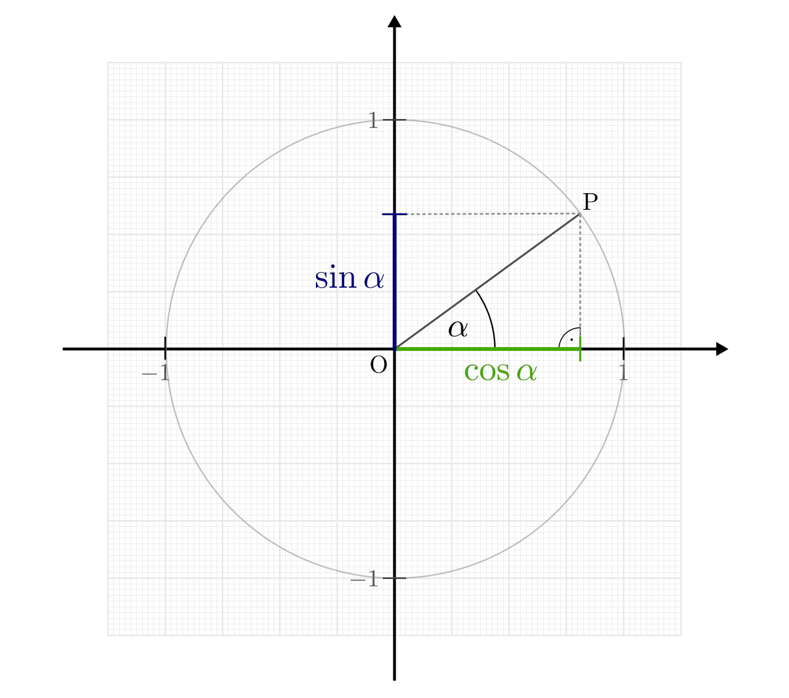
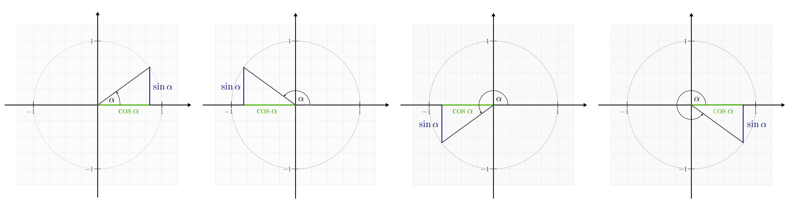
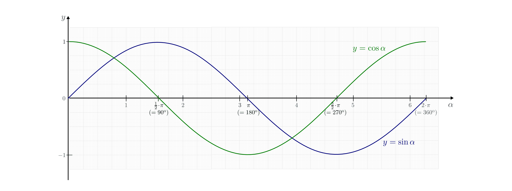
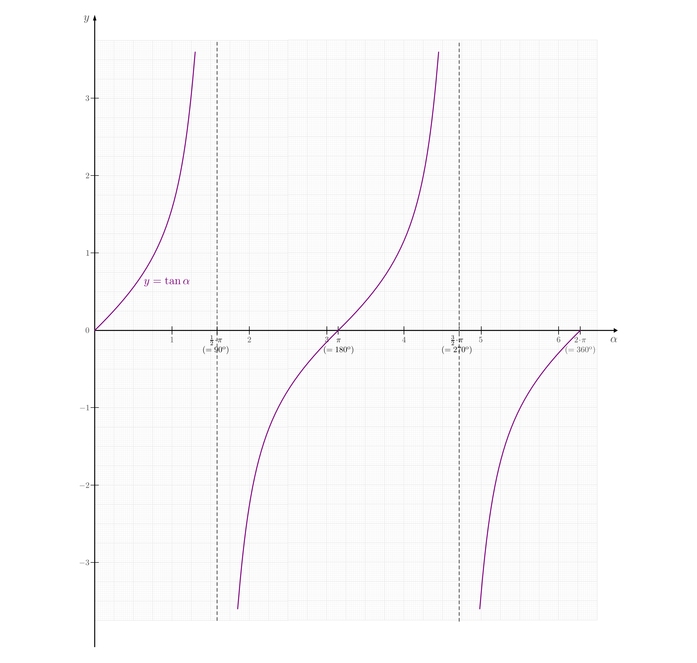
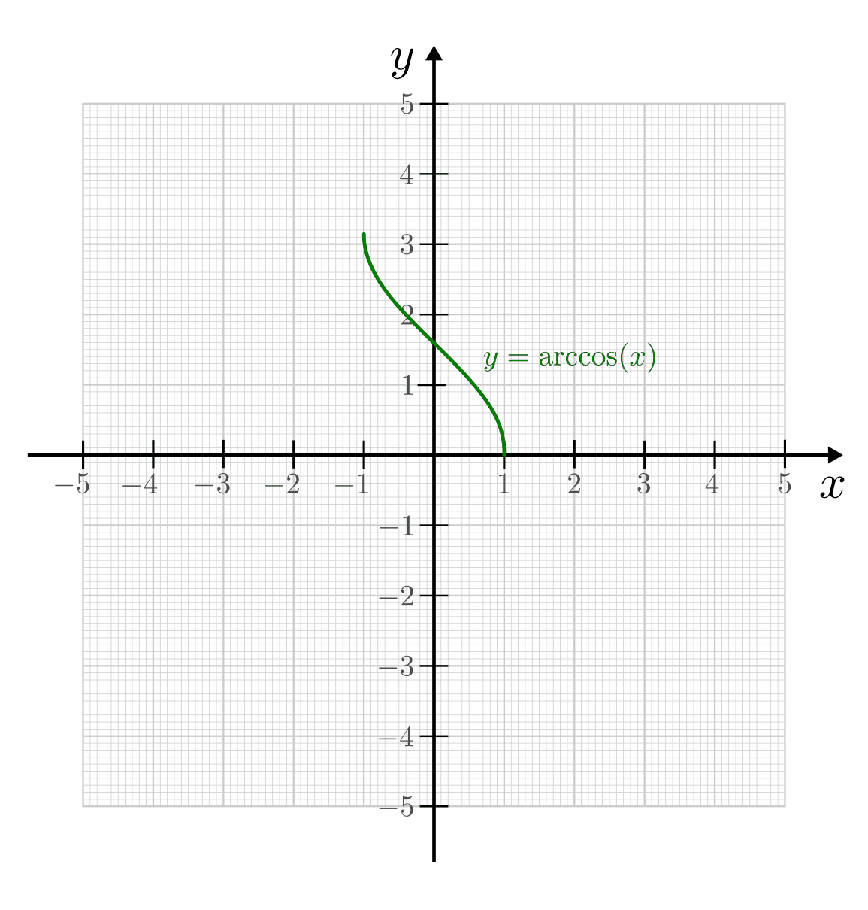
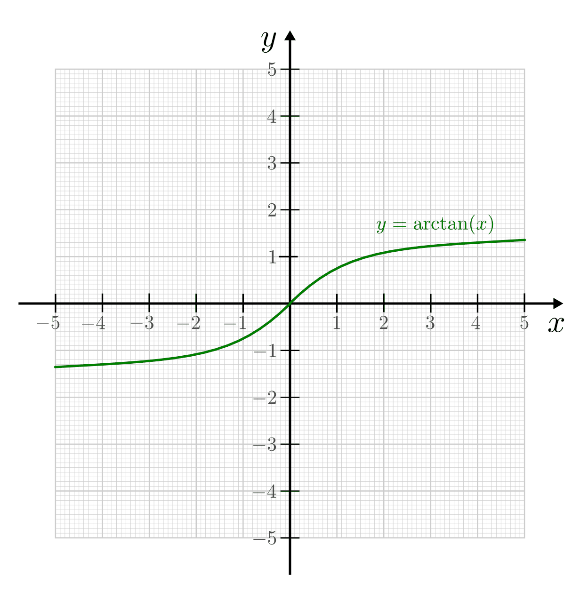

.. index:: Trigonometrische Funktionen
.. _Trigonometrische Funktionen:

Trigonometrische Funktionen
===========================

Die trigonometrischen Funktionen, auch "Winkelfunktionen" genannt,  weisen jedem
Winkel eine bestimmte Zahl zu, die das Längenverhältnis der entsprechenden
Seiten in einem rechtwinkligen Dreieck angibt.

.. index:: Winkelfunktionen, Sinusfunktion, Cosinusfunktion
.. _Sinusfunktion:
.. _Cosinusfunktion:
.. _Winkelfunktionen am Einheitskreis:

Die Winkelfunktionen am Einheitskreis
-------------------------------------

Die beiden Winkelfunktionen Sinus und Cosinus lassen sich nicht nur als
:ref:`Längenverhältnisse in einem rechtwinkligen Dreieck <Längenverhältnisse im
rechtwinkligen Dreieck>`, sondern auch als Streckenanteile interpretieren.
Zeichnet man in ein Koordinatensystem einen Kreis mit Radius eins um den
Koordinatenursprung :math:`\rm{O} = (0,0)` und verbindet den Koordinatenursprung
mit einem auf dem Kreis entlang wandernden Punkt :math:`\rm{P}`, so stellen
Cosinus und Sinus die senkrechten Projektionen der Verbindungslinie auf die
:math:`x`- bzw. :math:`y`-Achse dar. Der Tangens entspricht der Steigung, welche
die Verbindungslinie :math:`\overline{\rm{OP}}` bei einem Winkel :math:`\alpha`
hat.

    Sinus und Cosinus am Einheitskreis. Die Verbindungslinie
    :math:`\overline{\rm{OP}}` besitzt die Länge eins, so dass
    :math:`\cos{\alpha }` und :math:`\sin{\alpha }` den Längen des :math:`x`-
    bzw. :math:`y`-Anteils von :math:`\overline{\rm{OP}}` entsprechen.

    .. only:: html

        :download:`SVG: Sinus und Cosinus am Einheitskreis
        <../../pics/analysis/einheitskreis-winkelfunktionen.svg>`

Der entscheidende Vorteil dieser Darstellung liegt darin, dass der Winkel
hierbei beliebig große Werte annehmen kann: Gilt für den Winkel :math:`\alpha >
360\degree`, so wiederholen sich auch die entsprechenden Werte von
:math:`\sin{\alpha},\; \cos{\alpha }` und :math:`\tan{\alpha}` mit einer Periode
von :math:`360 \degree` von neuem. [#]_

    Vorzeichen von Sinus und Cosinus in den verschiedenen Quadranten.

    .. only:: html

        :download:`SVG: Sinus und Cosinus am Einheitskreis 2
        <../../pics/analysis/einheitskreis-winkelfunktionen-2.svg>`

Damit sich die Winkelfunktionen in einem üblichen Koordinatensystem darstellen
lassen, wird der Winkel als Argument meist nicht im Gradmaß, sondern im
:ref:`Bogenmaß <Gradmaß und Bogenmaß>` angegeben. Damit kann, da sich die
trigonometrischen Funktionen für beliebig große Winkelwerte gelten, kann
beispielsweise auch :math:`\sin{(x)}` anstelle von :math:`\sin{(\alpha)}` für
jedes :math:`x \in \mathbb{R}` geschrieben werden.
Die Vorzeichen der Winkelfunktionen wiederum richten sich danach, in welchem
Quadranten des Koordinatensystems sich der "Kreisvektor" :math:`\rm{OP}` gerade
befindet.

Anhand des Einheitskreises lässt sich auch der so genannte "trigonometrische
Pythagoras" ableiten; Mit der Hypothenusenlänge :math:`\rm{OP} = 1` und den
Kathetenlängen :math:`\sin{(\alpha)}` und :math:`\cos{(\alpha)}` lautet der
:ref:`Satz des Pythagoras <Satz von Pythagoras>` hierbei:

.. math::

    (\sin(\alpha))^2 + (\cos{(\alpha)})^2 = 1^2

Gewöhnlich wird :math:`\sin ^2{(\alpha)}` anstelle von
:math:`(\sin{(\alpha)})^2` und :math:`\cos^2{(\alpha)}` anstelle von
:math:`(\cos{(\alpha)})^2` geschrieben. Für beliebige Winkelwerte :math:`\alpha`
bzw. :math:`x` ergibt sich damit die folgende wichtige Beziehung:

.. math::
    :label: eqn-trigonometrischer-pythagoras

    \sin^2{(x)} + \cos^2{(x)} = 1

.. _Eigenschaften und Funktionsgraphen der Winkelfunktionen:

.. rubric:: Eigenschaften und Funktionsgraphen der Winkelfunktionen

Für einige besondere Winkel :math:`\alpha` lassen sich die Werte der
Winkelfunktionen als (verhältnismäßig) einfache Bruch- bzw. Wurzelzahlen
angeben -- für die übrigen Winkelmaße ergeben :math:`\sin{\alpha }` und
:math:`\cos{\alpha }` Werte mit unendlich vielen Nachkommastellen, die sich
periodisch stets zwischen :math:`-1` und :math:`+1` bewegen. Die Werte von
:math:`\tan{\alpha }` als dem Verhältnis von :math:`\sin{\alpha }` zu
:math:`\cos{\alpha }` reichen von :math:`- \infty` bis :math:`+ \infty`
und sind nicht definiert, wenn :math:`\cos{\alpha } = 0` gilt.

.. only:: html

    .. list-table:: Funktionswerte der Winkelfunktionen für besondere Winkel.
        :widths: 50 50 50 50 50 50 50 50 50 50 50
        :header-rows: 0

        * - :math:`{\color{white}1}\alpha`
          - :math:`{\color{white}\frac{1}{2}111}0\degree{\color{white}111}`
          - :math:`{\color{white}\frac{1}{2}11}30\degree{\color{white}111}`
          - :math:`{\color{white}\frac{1}{2}11}45\degree{\color{white}111}`
          - :math:`{\color{white}\frac{1}{2}11}60\degree{\color{white}111}`
          - :math:`{\color{white}\frac{1}{2}11}90\degree{\color{white}111}`
          - :math:`{\color{white}\frac{1}{2}1}120\degree{\color{white}111}`
          - :math:`{\color{white}\frac{1}{2}1}135\degree{\color{white}111}`
          - :math:`{\color{white}\frac{1}{2}1}150\degree{\color{white}111}`
          - :math:`{\color{white}\frac{1}{2}1}180\degree{\color{white}111}`
          - :math:`{\color{white}\frac{1}{2}1}270\degree{\color{white}111}`
        * - :math:`\sin{\alpha }`
          - :math:`{\color{white}1111}0`
          - :math:`{\color{white}111.}\frac{1}{2}`
          - :math:`{\color{white}11}\frac{1}{2} \cdot \sqrt{2}`
          - :math:`{\color{white}11}\frac{1}{2} \cdot \sqrt{3}`
          - :math:`{\color{white}111.}1`
          - :math:`{\color{white}1.}\frac{1}{2} \cdot \sqrt{3}`
          - :math:`{\color{white}1.}\frac{1}{2} \cdot \sqrt{2}`
          - :math:`{\color{white}111}\frac{1}{2}`
          - :math:`{\color{white}111}0`
          - :math:`{\color{white}.}-1`
        * - :math:`\cos{\alpha }`
          - :math:`{\color{white}1111}1`
          - :math:`{\color{white}11}\frac{1}{2} \cdot \sqrt{3}`
          - :math:`{\color{white}11}\frac{1}{2} \cdot \sqrt{2}`
          - :math:`{\color{white}111.}\frac{1}{2}`
          - :math:`{\color{white}111.}0`
          - :math:`{\color{white}1}-\frac{1}{2}`
          - :math:`-\frac{1}{2} \cdot \sqrt{2}`
          - :math:`-\frac{1}{2} \cdot \sqrt{3}`
          - :math:`{\color{white}.}-1`
          - :math:`{\color{white}111}0`
        * - :math:`\tan{\alpha }`
          - :math:`{\color{white}1111}0`
          - :math:`{\color{white}11}\frac{1}{3} \cdot \sqrt{3}`
          - :math:`{\color{white}111.}1`
          - :math:`{\color{white}111}\sqrt{3}`
          - :math:`{\color{white}11.}\text{n.d.}`
          - :math:`{\color{white}1}-\sqrt{3}`
          - :math:`{\color{white}1}-1`
          - :math:`-\frac{1}{3} \cdot \sqrt{3}`
          - :math:`{\color{white}111}0`
          - :math:`{\color{white}11}\text{n.d.}`

.. raw:: latex

    \begin{center}
    \begin{tabulary}{\linewidth}{|l|C|C|C|C|C|C|C|C|C|C|}
    \hline

    $\alpha$ & $0\degree$ & $30\degree$ & $45\degree$ & $60\degree$ & $90\degree$ &
    $120\degree$ & $135\degree$ & $150\degree$ & $180\degree$ & $270\degree$ \\
    $\sin{(\alpha)}$ & 0 & $\frac{1}{2}$ & $\frac{1}{2}\cdot \sqrt{2}$ &
    $\frac{1}{2}\cdot \sqrt{3}$ & 1 & $\frac{1}{2} \cdot \sqrt{3}$ &
    $\frac{1}{2}\cdot \sqrt{2}$ & $\frac{1}{2}$ & 0 & -1 \\
    $\cos{(\alpha)}$ & 1 & $\frac{1}{2} \cdot \sqrt{3}$ & $\frac{1}{2}\cdot \sqrt{2}$ &
    $\frac{1}{2}$ & 0 & $-\frac{1}{2}$ &
    $-\frac{1}{2}\cdot \sqrt{2}$ & $-\frac{1}{2} \cdot \sqrt{3}$ & -1 & 0 \\
    $\tan{(\alpha)}$ & 0 & $\frac{1}{3} \cdot \sqrt{3}$ & 1 &
    $\sqrt{3}$ & n.d. & $-\sqrt{3}$ & $-1$ & $-\frac{1}{3} \cdot \sqrt{3}$ & 0 & n.d. \\

    \hline
    \end{tabulary}
    \end{center}

Die Werte der Winkelfunktionen :math:`\sin{\alpha }` und :math:`\cos{\alpha}`
lassen sich auch als (wellenartige) Funktionsgraphen darstellen.

..  Um die Proportionen des Einheitskreises beizubehalten, wird der Winkel
..  :math:`\alpha` gewöhnlich im Bogenmaß angegeben -- einer vollen Umdrehung
..  :math:`(\alpha = 360\degree)` entspricht genau eine Bogenlänge von :math:`2 \cdot
..  \pi`.

    Die Funktionsgraphen von Sinus und Cosinus für die erste Periode :math:`(0 < \alpha <
    360\degree)`.

    .. only:: html

        :download:`SVG: Sinus und Cosinus
        <../../pics/analysis/sinus-cosinus.svg>`

Die beiden Funktionen :math:`\sin{(x)}` und :math:`\cos{(x)}` nehmen regelmäßig
wiederkehrend die gleichen Werte aus dem Wertebereich :math:`\mathbb{W} =
[-1;1]` an. Sie werden daher als "periodisch" bezeichnet, mit einer
Periodenlänge von :math:`2 \cdot \pi`. Es gilt damit für jede natürliche Zahl
:math:`n`:

.. math::
    :label: eqn-sinus-cosinus-periode

    \sin{(x \pm 2 \cdot \pi)} &= \sin{(x)} \\
    \cos{(x \pm 2 \cdot \pi)} &= \cos{(x)} \\

Führt man die Funktionsgraphen der Sinus- und Cosinusfunktion für negative
:math:`x`-Werte fort, so kann man erkennen, dass es sich bei der Sinusfunktion
um eine ungerade (punktsymmetrische) Funktion und bei der Cosinusfunktion um
eine gerade (achsensymmetrische) Funktion handelt. Es gilt also:

.. math::
    :label: eqn-sinus-cosinus-symmetrie

    \sin{(x)} &= - \sin{(-x)} \\
    \cos{(x)} &= \phantom{+} \cos{(-x)}

Zudem kann man den Funktionsgraphen der Cosinus-Funktion erhalten, indem man den
Funktionsgraphen der Sinus-Funktion um :math:`\frac{\pi}{2}` nach links (in
negative :math:`x`-Richtung) verschiebt; entsprechend ergibt sich die
Sinus-Funktion aus einer Verschiebung der Cosinusfunktion um
:math:`\frac{\pi}{2}` nach rechts. Es gilt somit unter Berücksichtigung der
Symmetrie der Cosinus-Funktion:

.. math::
    :label: eqn-sinus-cosinus-umrechnung

    \sin{(x)} &= \cos{\left(-x + \frac{\pi}{2}\right)} = \cos{(+x - \frac{\pi}{2})}\\
    \cos{(x)} &= \sin{\left(-x + \frac{\pi}{2}\right)} \\

Da die Funktionswerte der Sinus- und Cosinusfunktion periodisch sind, sind auch
ihre Nullstellen periodisch. Sie lassen sich mit einer beliebigen natürlichen
Zahl :math:`n` in folgender Form angeben:

.. math::
    :label: eqn-sinus-cosinus-nullstellen

    \sin{(x)} &= 0 \quad \Leftrightarrow \quad x = n \cdot \pi \\
    \cos{(x)} &= 0 \quad \Leftrightarrow \quad x = (2 \cdot n + 1) \cdot \frac{\pi}{2} \\

.. index:: Tangensfunktion
.. _Tangens:

.. rubric:: Die Tangensfunktion

Für die Tangens-Funktion :math:`\tan{\alpha } = \frac{\sin{\alpha }}{\cos{\alpha
}}` ergeben sich Vorzeichenwechsel an den Definitionslücken (den Stellen, an
denen :math:`\cos{\alpha } = 0` gilt). Je nachdem, von welcher Seite aus man
sich diesen "Polstellen" nähert, nehmen die Funktionswerte des Tangens --
entsprechend der Vorzeichen von :math:`\sin{\alpha }` und :math:`\cos{\alpha }` --
unendlich große negative bzw. positive Werte an.

    Der Funktionsgraph des Tangens für :math:`0 < \alpha < 360\degree`.

    .. only:: html

        :download:`SVG: Tangens
        <../../pics/analysis/tangens.svg>`

Die Nullstellen :math:`n \cdot \pi` der Tangensfunktion sind mit denen der
Sinusfunktion identisch, die Polstellen entsprechen den Nullstellen :math:`(2
\cdot n + 1) \cdot \frac{\pi}{2}` der Cosinusfunktion.

.. cot = 1 / tan

.. index:: Additionstheoreme
.. _Additionstheoreme:

Additionstheoreme
-----------------

Bisweilen treten in mathematischen und technischen Aufgaben Sinus- und
Cosinusfunktionen auf, deren Argument eine Summe zweier Winkel ist. Oft ist es
dabei hilfreich, diese als Verknüpfung mehrerer Sinus- bzw. Cosinusfunktionen
mit nur einem Winkel als Argument angeben zu können. Die folgenden Rechenregeln,
die eine derartige Umrechnung ermöglichen, werden üblicherweise als
"Additionstheoreme" bezeichnet.

Für beliebige Winkelwerte :math:`x_1` und :math:`x_2` gilt:

.. math::
    :label: eqn-sinus-cosinus-additionstheoreme

    \sin{(x_1 + x_2)} &= \sin{(x_1)} \cdot \cos{(x_2)} + \cos{(x_1)} \cdot \sin{(x_2)} \\
    \cos{(x_1 + x_2)} &= \cos{(x_1)} \cdot \cos{(x_2)} - \sin{(x_1)} \cdot \sin{(x_2)} \\

Ist :math:`x_2 < 0`, so gilt wegen Gleichung :eq:`eqn-sinus-cosinus-symmetrie`:

.. math::

    \sin{(x_1 - x_2)} &= \sin{(x_1)} \cdot \cos{(x_2)} - \cos{(x_1)} \cdot \sin{(x_2)}{\color{white}111} \\
    \cos{(x_1 - x_2)} &= \cos{(x_1)} \cdot \cos{(x_2)} + \sin{(x_1)} \cdot \sin{(x_2)} \\

Ist :math:`x_1 = x_2`, so gelten folgende Rechenregeln für "doppelte"
Winkelwerte:

.. math::
    :label: eqn-sinus-cosinus-doppelte-winkel

    \sin{(2 \cdot x)} &= 2 \cdot \sin{(x)} \cdot \cos{(x)}\\[4pt]
    \cos{(2 \cdot x)} &= \cos^2{(x)} -
    \sin ^2{(x)} \\ &= 2 \cdot \cos^2{(x)} - 1 = 1 - 2 \cdot \sin ^2{(x)} {\color{white}\;\, 1}

Umgekehrt lassen sich Sinus und Cosinus auch umformen, indem man in den obigen
Gleichungen :math:`x` durch :math:`\frac{x}{2}` ersetzt. Es gilt dabei:

.. math::
    :label: eqn-sinus-cosinus-halbe-winkel

    {\color{white}1 \;\;}\sin{(x)} &= 2 \cdot \sin{\left(\frac{x}{2}\right)} \cdot
    \cos{\left(\frac{x}{2}\right)} \\[6pt]
    \cos{(x)} &= \cos^2{\left(\frac{x}{2}\right)} - \sin
    ^2{\left(\frac{x}{2}\right)} \\[2pt]
    &= 2 \cdot \cos^2{\left(\frac{x}{2}\right)} - 1 = 1 -2 \cdot \sin ^2{\left(\frac{x}{2}\right)}

Zudem gibt es (eher zum Nachschlagen) auch zwei Formeln, mit denen Summen oder
Differenzen von gleichartigen Winkelfunktionen in Produkte verwandelt werden
können, was insbesondere bei der Vereinfachung von Brüchen hilfreich sein kann:

.. math::
    :label: eqn-sinus-cosinus

    \sin{(x_1)} + \sin{(x_2)} = 2 \cdot \sin{\left(
    \frac{x_1+x_2}{2}\right)} \cdot \cos{\left(\frac{x_1-x_2}{2} \right)}{\color{white}\qquad\quad 1} \\[6pt]
    \sin{(x_1)} - \sin{(x_2)} = 2 \cdot \cos{\left(
    \frac{x_1+x_2}{2}\right)} \cdot \sin{\left(\frac{x_1-x_2}{2} \right)}{\color{white}\qquad\quad 1} \\

Schließlich gibt es noch zwei Additionsregeln für die Summe bzw. die Differenz
von Winkelargumenten bei Tangensfunktionen:

.. math::
    :label: eqn-tangens-additionstheoreme

    \tan{(x_1 + x_2)} &= \frac{\tan{(x_1)} + \tan{(x_2)}}{1 - \tan{(x_1)} \cdot \tan{(x_2)}}{\color{white}\qquad\qquad\qquad 1} \\[6pt]
    \tan{(x_1 - x_2)} &= \frac{\tan{(x_1)} - \tan{(x_2)}}{1 + \tan{(x_1)} \cdot \tan{(x_2)}} \\

.. index:: Arcusfunktionen
.. _Arcus-Funktionen:

Die Arcus-Funktionen
--------------------

Die Arcus-Funktionen :math:`\text{asin}(x)`, :math:`\text{acos}(x)` und
:math:`\text{atan}(x)` geben zu einem gegebenen Wert :math:`x` den zugehörigen
Winkel :math:`\alpha` an; sie sind damit die Umkehrfunktionen der
trigonometrischen Funktionen :math:`\sin{(x)}`, :math:`\cos{(x)}` und
:math:`\tan{(x)}`. Beispielsweise ist :math:`\text{asin}(x)` der Winkel im
Einheitskreis, dessen Sinus gleich :math:`x` ist.

Da die Sinus-, Cosinus- und Tangensfunktionen aufgrund ihrer Periodizität nicht
:ref:`bijektiv <Bijektivität>` sind, muss ihr Definitionsbereich bei der Bildung der jeweiligen
Umkehrfunktion eingeschränkt werden. Die Arcus-Funktionen werden dabei
üblicherweise mit folgenden Definitionsbereichen festgelegt:

* Die Umkehrfunktion zu :math:`y=\sin{(x)}` mit :math:`x \in [-
  \frac{\pi}{2};\frac{\pi}{2}]` ist die Funktion :math:`y=\text{asin}(x)` mit
  :math:`x \in [1;1]`.

.. figure:: ../../pics/analysis/arcus-sinus.png
    :width: 40%
    :align: center
    :name: fig-arcus-sinus
    :alt:  fig-arcus-sinus

    Funktionsgraph der Arcus-Sinus-Funktion.

    .. only:: html

        :download:`SVG: Arcus-Sinus
        <../../pics/analysis/arcus-sinus.svg>`

* Die Umkehrfunktion zu :math:`y=\cos{(x)}` mit :math:`x \in
  [\phantom{-}\!0;\pi]` ist die Funktion :math:`y=\text{acos}(x)` mit :math:`x
  \in [1;1]`.

    Funktionsgraph der Arcus-Cosinus-Funktion.

    .. only:: html

        :download:`SVG: Arcus-Cosinus
        <../../pics/analysis/arcus-cosinus.svg>`

* Die Umkehrfunktion zu :math:`y=\tan{(x)}` mit :math:`x \in
  [-\frac{\pi}{2};\frac{\pi}{2}]` ist die Funktion :math:`y=\text{atan}(x)` mit
  :math:`x \in \mathbb{R}`.

    Funktionsgraph der Arcus-Tangens-Funktion.

    .. only:: html

        :download:`SVG: Arcus-Tangens
        <../../pics/analysis/arcus-tangens.svg>`

Die Wertebereiche der Arcus-Funktionen stimmen dabei mit den obigen
Definitionsbereichen der ursprünglichen Winkelfunktionen überein.

..  cot ist gleich 1/tan. somit acot(x) = atan(1/x) für x>0 und \pi + atan(1/x)
..  für x<0

.. asin(x) + acos(x) = \frac{\pi}{2} \\
.. atan(x) + acot(x) = \frac{\pi}{2}

.. raw:: html

    

.. only:: html

    .. rubric:: Anmerkungen:

.. [#] Unter einer periodischen Funktion versteht man allgemein eine Funktion,
    für die :math:`f(x + p) = f(x)` gilt; dabei wird :math:`p` als Periode der
    Funktion bezeichnet.

