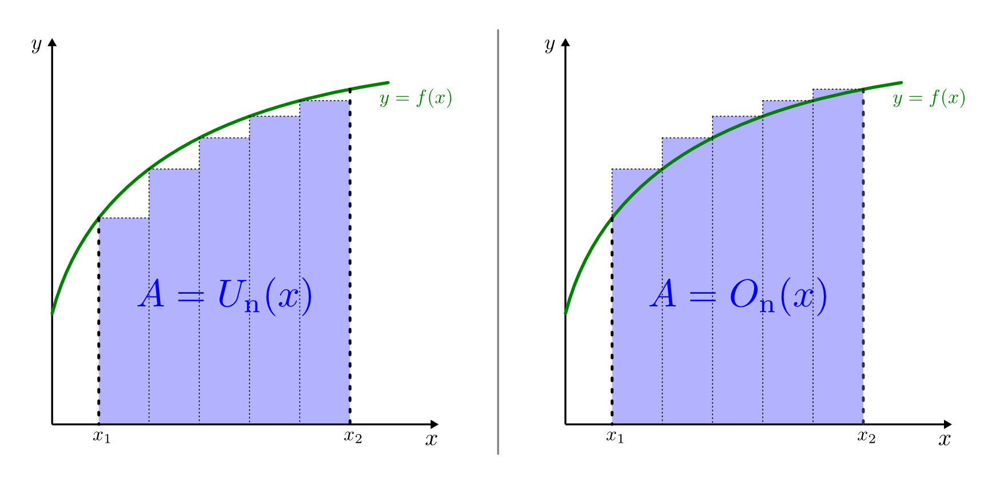
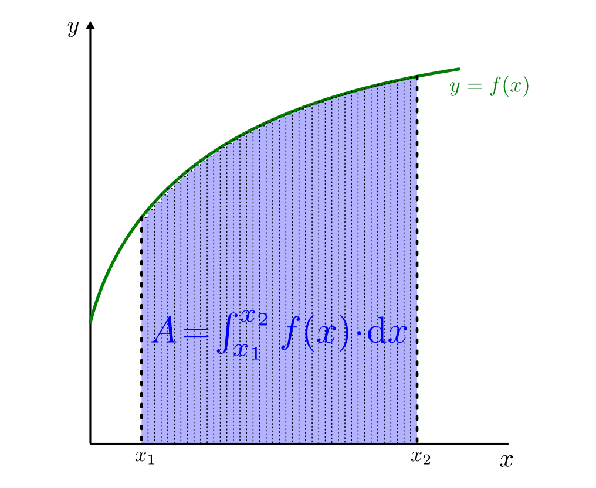

.. index:: Integral
.. _Integralrechnung:

Integralrechnung
================

Um Flächen zu bestimmen, die von krummlinigen Funktionsgraphen und der
:math:`x`-Achse eingeschlossen werden, entwickelte der Mathematiker `Bernhard
Riemann <https://de.wikipedia.org/wiki/Bernhard_Riemann>`_ die Integralrechnung.
Der Grundgedanke hinter den so genannten "Riemann-Summen" ist, dass sich jede
derartige Fläche in eine Vielzahl von schmalen Rechtecken zerlegen lässt, wobei
die Grundseiten aller Rechtecke auf der :math:`x`-Achse liegen und die Höhen der
Rechtecke durch die Funktionswerte an den jeweiligen Stellen gegeben sind. Die
Summe der Flächen aller Rechtecke ergibt dann die Fläche zwischen dem
Funktionsgraph und der :math:`x`-Achse.

    Untersumme und Obersumme als Näherungen für den Flächeninhalt zwischen einem
    Funktionsgraphen und der :math:`x`-Achse.

    .. only:: html

        :download:`SVG: Untersumme und Obersumme
        <../pics/analysis/untersumme-und-obersumme.svg>`

Je nachdem, ob man als Höhe jedes Rechtecks jeweils den kleineren oder größeren
der Funktionswerte beider Randpunkte wählt, füllen die Rechtecke die Fläche
unterhalb des Funktionsgraphen entweder nicht ganz aus, oder sie ragen stets an
einer Seite über den Funktionsgraphen hinaus. Die Summen der so gewählten
Rechteck-Flächen werden dementsprechend als Untersumme :math:`U` bzw. Obersumme
:math:`O` bezeichnet. Für :math:`n` Unterteilungen mit einer Breite von jeweils
:math:`\Delta x` gilt:

.. math::

    U _{\mathrm{n}}(x) = \sum_{i=1}^{n} f(x _{\mathrm{i-1}})  \cdot  \Delta x \\
    O _{\mathrm{n}}(x) = \sum_{i=1}^{n} f(x _{\mathrm{i}}) \cdot  \Delta x {\color{white}_{-1}}

..  O _{\mathrm{n}}(x) = \sum_{i=1}^{n} f(x _{\mathrm{i}})\phantom{_{-1}}  \cdot  \Delta x

Für die Fläche :math:`A_{\mathrm{[x_1; x_2]}} \left( f(x) \right)` unterhalb des
Funktionsgraphen :math:`f` zwischen den zwei Punkten :math:`x_1` und :math:`x_2`
gilt somit: [#]_

.. math::

    U _{\mathrm{n}}(x) \; \le \; A _{\mathrm{[x_1;x_2]}}\left( f(x)\right) \;
    \le \; O _{\mathrm{n}}(x)

Unterteilt man bei einer beliebigen Funktion den Bereich zwischen :math:`x_1`
und :math:`x_2` in eine größere Zahl an schmaleren Rechtecken, so lassen sich
die Abweichungen der einzelnen Rechteckshöhen von den jeweiligen Funktionswerten
verringern und damit die Werte der Unter- und Obersumme angleichen. Bei einer
(theoretischen) Unterteilung in unendlich viele, dafür beliebig schmale
Rechtecke haben die Unter- und Obersumme den gleichen Grenzwert, der mit der
gesuchten Fläche :math:`A_{\mathrm{[x_1; x_2]}} \left( f(x) \right)` identisch ist.

    Integral als Riemann-Summe für infinitessimal kleine Unterteilungen von
    :math:`[x1;x2]`.

    .. only:: html

        :download:`SVG: Integral als Riemann-Summe
        <../pics/analysis/riemann-integral.svg>`

Mathematisch wird die Annäherung der Ober- und Untersumme bei unendlich vielen,
infinitessimal kleinen Unterteilungen durch das so genannte Integralzeichen
:math:`\int_{}^{}` anstelle von :math:`\sum_{}^{}` gekennzeichnet. Zudem wird
anstelle von :math:`\Delta x` für die Breite jedes einzelnen Rechtecks
:math:`\mathrm{d} x` geschrieben:

.. math::

    \lim _{n \to \infty} U _{\mathrm{n}}(x) = \int_{x_1}^{x_2} f(x) \cdot \mathrm{d}
    x = \lim _{n \to \infty} O _{\mathrm{n}}(x)

Der Ausdruck :math:`\int_{x_1}^{x_2} f(x) \cdot \mathrm{d} x` wird dabei
Integral von :math:`f(x)` über :math:`[x_1 ; x_2]` genannt. Die Funktion
:math:`f(x)` wird als Integrand und :math:`x_1` bzw. :math:`x_2` als
Integrationsgrenzen bezeichnet.

.. Integrierbarkeit: Zu f exittiert bestimmtes Integral über Intervall [a;b].

.. index:: Stammfunktion
.. _Integrierbarkeit und Stammfunktion:

Integrierbarkeit und Stammfunktion
----------------------------------

Ein Integral :math:`\int_{a}^{b} f(x) \cdot \mathrm{d} x` einer Funktion
:math:`f(x)` über das Intervall :math:`[a;b]` lässt sich immer dann eindeutig
berechnen, wenn die Funktion :ref:`stetig <Stetigkeit>` ist, der Funktionsgraph
also keine Sprünge aufweist. Das gleiche gilt für bereichsweise definierte
Funktionen, die in den einzelnen Bereichen Stetigkeit aufweisen und
:ref:`beschränkt <Beschränktheit>` sind, also keine Unendlichkeitsstellen
besitzen. Jede Funktion, die diese Bedingung erfüllt, wird integrierbar genannt.

Der Wert eines Integrals :math:`\int_{a}^{b} f(x) \cdot \mathrm{d} x` lässt sich
am einfachsten berechnen, wenn man zur gegebenen Funktion :math:`f(x)` eine so
genannte "Stammfunktion" :math:`F(x)` findet. Eine solche Stammfunktion hat die
Eigenschaft, dass ihre erste Ableitung :math:`F'(x)` gerade der ursprünglichen
Funktion :math:`f(x)` entspricht. Als Zusammenhang zwischen der Stammfunktion
und der zu integrierenden Funktion gilt für alle :math:`x \in [a;b]` also:

.. math::
    :label: eqn-stammfunktion

    F'(x) = f(x)

Die Integration kann also als Umkehrung der Differentiation angesehen werden.
Während jedoch das Ableiten einer Funktion stets ein eindeutiges Ergebnis
liefert, ist die Bestimmung der Stammfunktion nicht eindeutig: Ist :math:`F(x)`
eine Stammfunktion von :math:`f(x)`, so ist jede Funktion :math:`F(x) + C` mit
einer additiven Konstante :math:`C \in \mathbb{R}` ebenfalls eine Stammfunktion
von :math:`f(x)`, da ein konstanter Term beim Ableiten stets den Wert Null
ergibt. Die Gesamtheit aller Stammfunktionen wird "unbestimmtes Integral"
genannt und mittels :math:`\int_{}^{} f(x) \cdot \mathrm{d} x`, also ohne
konkrete Integrationsgrenzen geschrieben.

.. index:: Anfangsbedingung
.. rubric:: Anfangsbedingung und Integralfunktion

Aus der Menge aller Stammfunktionen soll üblicherweise eine bestimmt werden,
die durch einen gegebenen Punkt :math:`P (x_1, y_1)` verläuft. Eine solche
Forderung nennt man Anfangsbedingung.

.. index:: Integralfunktion

Soll das Integral von einer festen Grenze :math:`a` bis zu einer variablen
Grenze :math:`x` verlaufen, so ist das Integral gleich Null, wenn :math:`x = a`
ist, da in diesem Fall keine Fläche aufgespannt wird. Die Anfangsbedingung
besteht somit darin, dass die Stammfunktion an der Stelle :math:`x=a` eine
Nullstelle aufweisen muss. Es muss also gelten:

.. math::

    F(a) + C  = 0 \quad \Leftrightarrow \quad C = - F(a)

Dieser Gedanke folgt daraus, dass man :math:`F(x) = \int_{a}^{x} f(x) \cdot
\mathrm{d} x` als so genannte Integralfunktion interpretiert, die jeweils den
Wert des Integrals liefert, wenn die untere Grenze :math:`a` und die oberen
Grenze :math:`x` entspricht. Mit der obigen Anfangsbedingung erhält man somit
als Wert für das bestimmte Integral über die Funktion :math:`f(x)` von
:math:`a` bis :math:`x=b`:

.. math::
    :label: eqn-integralwert

    \int_{a}^{b} f(x) \cdot \mathrm{d} x = F(b) - F(a)

Als Kurzschreibweise ist hierbei :math:`F(x)\big | _{\mathrm{a}} ^{b} := F(x) -
F(a)` üblich. Möchte man das Integral über eine Funktion :math:`f(x)` zwischen
zwei bestimmten Grenzen :math:`a` und :math:`b` berechnen, so genügt es also,
die Stammfunktion zu bestimmen, die Werte :math:`a` und :math:`b` in die
Stammfunktion einzusetzen und die Differenz beider Werte zu berechnen:

.. math::
    :label: eqn-integral-a-b

    \int_{a}^{b} f(x)  \cdot  \mathrm{d}x = F(x) \big | _{\mathrm{a}}^{b} = F(b) -
    F(a)

Die Schwierigkeit bei der Integralrechnung besteht folglich darin, eine
Stammfunktion :math:`F(x)` zur gegebenen Funktion :math:`f(x)` zu finden.

.. _Grundintegrale:

Grundintegrale
--------------

Von den elementaren Funktionen sowie einigen Kombinationen dieser Funktionen
gibt es unmittelbare Lösungsformeln zur Bestimmung der jeweiligen
Stammfunktion.

.. _Integralregeln für Potenz- und Wurzelfunktionen:

.. rubric:: Integralregeln für Potenz- und Wurzelfunktionen

* Ist die Funktion :math:`f(x) = c` mit :math:`c \in \mathbb{R}` eine konstante
  Funktion, so gilt für die Stammfunktion :math:`F(x)`:

  .. math::
      :label: eqn-stammfunktion-von-konstanten-funktionen

      f(x) = c \quad \Leftrightarrow \quad F(x) = c \cdot x + C

  Anschaulich entspricht der Wert von :math:`c \cdot x` der Fläche des Rechtecks
  mit der Breite :math:`c`, das zwischen der konstanten Funktion und der
  :math:`x`-Achse liegt und die Länge :math:`x` hat.

* Ist die Funktion :math:`f(x) = x^n` eine allgemeine :ref:`Potenzfunktion
  <Potenz- und Wurzelfunktionen>` mit der Einschränkung :math:`n \ne -1`, so
  gilt für die Stammfunktion :math:`F(x)`:

  .. math::
      :label: eqn-stammfunktion-von-potenzfunktionen

      f(x) = x^n \quad \Leftrightarrow \quad F(x) = \frac{x ^{n+1}}{n+1} + C

  Dieses Ergebnis folgt daraus, dass die Ableitung der Funktion :math:`x ^{n+1}`
  dem Term :math:`(n+1) \cdot x^n` entspricht. Die ursprüngliche Funktion
  :math:`f(x) = x^n` unterscheidet sich lediglich um den Faktor
  :math:`\frac{1}{n+1}` von diesem Ableitungsterm.

  Ist beispielsweise :math:`n=1`, also :math:`f(x) = x`, so ist :math:`F(x) =
  \frac{x^2}{2}` eine Stammfunktion. Anschaulich entspricht der Term
  :math:`\frac{1}{2} \cdot x^2` der Fläche eines Dreiecks, das zwischen dem
  Graphen :math:`f(x)=x` und der :math:`x`-Achse liegt; diese Fläche ist gleich
  der Hälfte der Quadratfläche von :math:`f(x) \cdot x = x \cdot x = x^2`.

  Integrale von linearen Funktionen treten in den Naturwissenschaften häufig
  auf, beispielsweise gilt für die zurückgelegte Wegstrecke :math:`s` bei einer
  :ref:`Bewegung mit konstanter Beschleunigung <gwp:Wegstrecke bei konstanter
  Beschleunigung>` :math:`{\color{white}1}v = a \cdot t \quad \Longleftrightarrow \quad s =
  \frac{1}{2} \cdot a \cdot t^2 + s_0`, wobei in diesem Fall die
  Integrationsvariable die Zeit :math:`t` ist. Weitere Beispiele sind die
  :ref:`Bewegungs- <gwp:Kinetische Energie>` und :ref:`Spannenergie
  <gwp:Spannenergie>`, usw.

  Die obige Integrationsregel :eq:`eqn-stammfunktion-von-potenzfunktionen` gilt
  wegen des Zusammenhangs :math:`\sqrt{x} = x ^{\frac{1}{2}}` auch für
  :ref:`Wurzelfunktionen <Wurzelfunktionen>`. Beispielsweise gilt im Fall
  :math:`f(x) = \sqrt{x} = x ^{\frac{1}{2}}` mit :math:`n = \frac{1}{2}`:

  .. math::

      f(x) = \sqrt{x} = x ^{\frac{1}{2}} \quad \Longleftrightarrow \quad F(x) =
      \frac{x ^{\frac{3}{2}}}{\frac{3}{2}} = \frac{2 \cdot \sqrt{x^3}}{3}

* Ist :math:`f(x) = x ^{-1} = \frac{1}{x}` mit :math:`x \ne 0`, so ist eine
  Anwendung der obigen Regel :eq:`eqn-stammfunktion-von-potenzfunktionen` nicht
  möglich. Für diesen Sonderfall gilt vielmehr folgender Zusammenhang:

  .. math::

      f(x) = \frac{1}{x} \quad \Longleftrightarrow \quad F(x) = \ln{(x)} + C

  Die Stammfunktion der :ref:`Hyperbelfunktion <Hyperbeln>` :math:`f(x) =
  \frac{1}{x}` ist also die natürliche :ref:`Logarithmusfunktion
  <Logarithmusfunktionen>` :math:`F(x) = \ln{(x)}`. [#]_

.. _Integralregeln für Exponentialfunktionen:

.. rubric:: Integralregeln für Exponentialfunktionen

* Ist :math:`f(x) = e^x` mit :math:`e = 2.7182\ldots` als Eulerscher Zahl, so
  gilt für die Stammfunktion :math:`F(x)`:

  .. math::
      :label: eqn-stammfunktion-der-natuerlichen-exponentialfunktion

      f(x) = e ^{x} \quad \Longleftrightarrow \quad F(x) = e^x + C

  Ebenso wie die natürliche Exponentialfunktion beim Ableiten unverändert
  bleibt, so bleibt sie auch beim Integrieren unverändert.

* Ist :math:`f(x) = a^x` mit :math:`a > 0` und :math:`a \ne 1`, so
  gilt für die Stammfunktion :math:`F(x)`:

  .. math::
      :label: eqn-stammfunktion-von-exponentialfunktionen

      f(x) = a ^{x} \quad \Longleftrightarrow \quad F(x) = \frac{1}{\ln{(a)}}
      \cdot a ^{x}

  Auch die allgemeine Exponentialfunktion ergibt beim Integrieren wieder
  eine Exponentialfunktion, wobei der Vorfaktor :math:`\frac{1}{\ln{(a)}}`
  berücksichtigt werden muss.

.. _Integralregeln für trigonometrische Funktionen und Arcusfunktionen:

.. rubric:: Integralregeln für trigonometrische Funktionen und Arcusfunktionen

* Ist :math:`f(x) = \sin{(x)}`, so gilt für die Stammfunktion :math:`F(x)`:

  .. math::
      :label: eqn-stammfunktion-der-sinusfunktion

      f(x) = \sin{(x)} \quad \Longleftrightarrow \quad F(x) = -\cos{(x)} + C

  Dieser Zusammenhang ergibt sich daraus, dass die :ref:`Ableitung der
  Cosinusfunktion <Ableitung der Cosinusfunktion>` der negativen Sinusfunktion
  entspricht.

* Ist :math:`f(x) = \cos{(x)}`, so gilt für die Stammfunktion :math:`F(x)`:

  .. math::
      :label: eqn-stammfunktion-der-cosinusfunktion

      f(x) = \cos{(x)} \quad \Longleftrightarrow \quad F(x) = +\sin{(x)} + C

  Dieser Zusammenhang ergibt sich daraus, dass die :ref:`Ableitung der
  Sinusfunktion <Ableitung der Sinusfunktion>` der Cosinusfunktion entspricht.

..  * Für die Sonderfälle :math:`f(x) = \frac{1}{\cos^2{(x)}}` und :math:`f(x) =
  ..  \frac{1}{\sin ^2{(x)}}` existieren ebenfalls unmittelbare Stammfunktionen:

  ..  .. math::

      ..  f(x) = \frac{1}{\cos^2{(x)}} \quad \Longleftrightarrow \quad F(x) =

.. index:: Integrationsregeln
.. _Zusammenfassung wichtiger Integrationsregeln:

Zusammenfassung wichtiger Integrationsregeln
--------------------------------------------

Für jedes Integral gelten folgende Eigenschaften:

* Vertauscht man die obere und die untere Integrationsgrenze, so ändert das
  Integral sein Vorzeichen:

  .. math::
      :label: eqn-integral-vorzeichenregel

      \int_{x_1}^{x_2} f(x) \cdot \mathrm{d} x = - \int_{x_2}^{x_1} f(x) \cdot
      \mathrm{d}x

  Der Grund dafür liegt darin, dass hierbei die Breiten aller Rechtecke
  :math:`\mathrm{d} x _{\mathrm{i}} = (x _{\mathrm{i+1}} - x _{\mathrm{i}})` für :math:`x
  _{\mathrm{i+1}} < x _{\mathrm{i}}` ein negatives Vorzeichen bekommen und somit bei der
  Auswertung des Integrals über gleich große, aber negative Werte summiert wird.

* Ist die obere Integrationsgrenze :math:`x_2` gleich der unteren Grenze
  :math:`x_1`, so ist das Integral für jede beliebige Funktion :math:`f(x)`
  gleich Null:

  .. math::
      :label: eqn-integral-gleiche-grenzen

      \int_{x_1}^{x_1} f(x)  \cdot  \mathrm{d}x  = 0

  Anschaulich lässt sich dies dadurch erklären, dass die Fläche zwischen
  :math:`x_1` und :math:`x_1` eine Breite von Null hat.

* Jedes Integral lässt sich auf folgende Weise in zwei Teilintegrale zerlegen:

  .. math::
      :label: eqn-integral-additivitaet

      \int_{x_1}^{x_3} f(x)  \cdot \mathrm{d}x =
      \int_{x_1}^{x_2} f(x)  \cdot \mathrm{d}x +
      \int_{x_2}^{x_3} f(x)  \cdot \mathrm{d}x

  Ist :math:`x_1 < x_2 < x_3`, so ist umittelbar einleuchtend, dass die Fläche
  zwischen :math:`x_1` und :math:`x_3` gleich der Summe der Teilflächen sein
  muss, da sich das Intervall :math:`[x_1 ; x_3]` in zwei Teilintegrale
  :math:`[x_1;x_2] \cup [x_2;x_3]` zerlegen lässt und die entsprechenden
  Teilsummen gebildet werden können.

  Die Regel gilt jedoch auch dann, wenn :math:`x_2` außerhalb von
  :math:`[x_1;x_3]` liegt; ist beispielsweise :math:`x_2 > x_3`, so wird die --
  gegenüber dem Gesamtintegral -- mit dem ersten Teilintervall zusätzlich
  addierte Fläche aufgrund der Vorzeichenregel
  :eq:`eqn-integral-vorzeichenregel` durch das zweite (negative) Teilintegral
  wieder subtrahiert.

* Lässt sich eine zu integrierende Funktion als Summe zweier Funktion
  :math:`f_1` und :math:`f_2` darstellen, so ist das Ergebnis gleich der Summe
  der Integrale beider Funktionen:

  .. math::
      :label: eqn-integral-distributivgesetz

      \int_{x_1}^{x_2} \big(f_1(x) + f_2(x)\big) \cdot \mathrm{d} x =
      \int_{x_1}^{x_2} f_1 (x) \cdot \mathrm{d} x + \int_{x_1}^{x_2} f_2(x)
      \cdot \mathrm{d} x

  Die obige Regel entspricht formal dem :ref:`Distributivgesetz
  <Distributivgesetz>`.

* Lässt sich eine zu integrierende Funktion als Produkt einer Funktion
  :math:`f(x)` und eines konstanten Faktors :math:`c` darstellen, so kann dieser
  vor das Integral gezogen werden:

  .. math::
      :label: eqn-integral-assoziativgesetz

      \int_{x_1}^{x_2} c \cdot f(x) \cdot \mathrm{d} x = c \cdot
      \int_{x_1}^{x_2} f(x)  \cdot  \mathrm{d}x

  Die obige Regel entspricht dem :ref:`Assoziativgesetz <Assoziativgesetz>` der
  Multiplikation. Anschaulich kann man sich jeden Funktionswert und damit die
  Höhe aller zu addierenden Rechtecke um den Faktor :math:`c` gestreckt denken.

* Erfüllen zwei Funktionen :math:`f_1(x)` und :math:`f_2(x)` für jeden
  beliebigen Wert :math:`x` innerhalb des Intervalls :math:`[x_1;x_2]` die
  Bedingung :math:`f_1(x) < f_2(x)`, so gilt:

  .. math::

      f_1(x) < f_2(x) \text{ für alle } x \in [x_1;x_2] \quad \Leftrightarrow
      \quad \int_{x_1}^{x_2} f_1(x) < \int_{x_1}^{x_2} f_2(x)

.. rubric:: Bestimmung der Fläche zwischen zwei Graphen

Mittels der Integralrechnung kann nicht nur die Fläche zwischen einem
Funktionsgraph und der :math:`x`-Achse, sondern auch die zwischen zwei
Funktionsgraphen :math:`f_1(x)` und :math:`f_2(x)` in einem Intervall
:math:`[a;b]` eingeschlossene Fläche berechnet werden. Verläuft der Graph von
:math:`f_2(x)` oberhalb des Graphen von :math:`f_1(x)`, gilt also :math:`f_2(x)
> f_1(x)` für alle :math:`x \in [a;b]`, so entspricht die gesuchte Fläche
folgendem Integral: [#]_

.. math::
    :label: eqn-flaeche-zwischen-zwei-graphen

    \int_{a}^{b} f_2(x) \cdot \mathrm{d} x - \int_{a}^{b}  f_1(x) \cdot
    \mathrm{d} x = \int_{a}^{b} \big(f_2(x) -f_1(x)\big) \cdot \mathrm{d} x

Schneiden sich Schnittpunkte zweier Funktionen, so müssen zunächst die
:ref:`Schnittstellen <Schnittpunkte zweier Funktionen>` berechnet werden;
anschließend kann einzeln von Schnittstelle zu Schnittstelle integriert werden.
In jedem einzelnen Teilintervall wird dabei die Funktion mit den niedrigeren
Funktionswerten von der Funktion mit den höheren Funktionswerten subtrahiert.

.. index:: Integrationsmethoden
.. _Integrationsmethoden:

Integrationsmethoden
--------------------

In vielen Fällen, insbesondere bei zusammengesetzten Funktionen, lässt sich eine
Integration nicht mittels der oben genannten :ref:`Grundintegrale
<Grundintegrale>` durchführen. In solchen Fällen können allerdings oftmals
weitere Integrationsmethoden angewendet werden.

.. index:: Integrationsmethoden; Partielle Integration
.. _Partielle Integration:

.. rubric:: Partielle Integration

Die Methode der partiellen Integration entspricht formal einer umgekehrten
Anwendung der :ref:`Produktregel <Produktregel>` bei Ableitungen:

.. math::
    :label: eqn-partielle-integration

    \int_{a}^{b} f_1(x) \cdot f_2'(x) = \Big(f_1(x) \cdot
    f_2(x)\Big)\Big|_{\mathrm{a}}^b - \int_{a}^{b} f_1'(x) \cdot f_2(x) \cdot
    \mathrm{d} x

Diese Methode kann immer dann genutzt werden, wenn die zu integrierende Funktion
als Produkt zweier Teilfunktionen geschrieben werden kann. Lässt sich eine
dieser Funktionen leicht integrieren, so setzt man diese als :math:`f_2'(x)`;
die andere Teilfunktion, die sich möglichst leicht ableiten lassen sollte, wird
als :math:`f_1(x)` gesetzt. Das Integral kann dann berechnet werden, indem man
zunächst als Zwischenergebnis das Produkt von :math:`f_1(x)` und der
Stammfunktion von :math:`f_2'(x)` bildet, die obere und untere
Integrationsgrenze als :math:`x`-Werte einsetzt und beide Werte voneinander
subtrahiert. Anschließend muss das Integral :math:`\int_{a}^{b} f_1'(x) \cdot
f_2(x) \cdot \mathrm{d} x` berechnet werden und dessen Wert vom Zwischenergebnis
subtrahiert werden.

Die Methode der partiellen Integration wird insbesondere dann verwendet, wenn
eine der beiden Teilfunktionen eine Potenzfunktion :math:`x^n` mit :math:`n \in
\mathbb{N}` ist. Bei einer derartigen Funktion ist die :math:`n`-te Ableitung
ein konstanter Wert, der beim Integrieren gemäß Gleichung
:eq:`eqn-integral-assoziativgesetz` als konstanter Faktor vor das Integral
gezogen werden kann. Gegebenenfalls muss folglich die Methode der partiellen
Integration wiederholt angewendet werden (maximal :math:`n` mal), um die jeweils
auf der rechten Seite stehenden (Teil-)Integrale der Form :math:`\int_{a}^{b}
f_1'(x) \cdot f_2(x) \cdot \mathrm{d} x` schrittweise zu berechnen.

.. _Integration durch Substitution:

.. rubric:: Integration durch Substitution

Die Methode der Integration durch Substitution entspricht formal einer
umgekehrten Anwendung der :ref:`Kettenregel <Kettenregel>` bei Ableitungen:

.. math::

    \int_{}^{} f_1\big(f_2(x)\big) \cdot f_2'(x) \cdot \mathrm{d} x =
    \int_{}^{} f_1(z) \cdot \mathrm{d} z

Hierbei wurde :math:`z = f_2(x)` geschrieben. Man kann mit dieser Substitution
nach einer Stammfunktion  :math:`F_1(z)` von :math:`f_1(z)` suchen, in gleicher
Weise als würde man lediglich :math:`z` anstelle von :math:`x` schreiben und
somit eine Stammfunktion :math:`F_1(x)` zu :math:`f_1(x)` suchen. Hat man eine
solche Stammfunktion :math:`F_2(z)` gefunden, so genügt es, bei dieser
Stammfunktion wiederum :math:`z` durch den Ausdruck :math:`f_2(x)` zu ersetzen.

Möchte man mit dieser Methode ein bestimmtes Integral von :math:`a` bis
:math:`b` berechnen, so müssen allerdings auch die Integralgrenzen umgerechnet
werden. Es gilt:

.. math::

    \int_{a}^{b} f_1\big(f_2(x)\big) \cdot f_2'(x) \cdot \mathrm{d} x =
    \int_{f_2(a)}^{f_2(b)} f_1(z) \cdot \mathrm{d} z

Da :math:`f_2(x)` bekannt ist, müssen lediglich die Integrationsgrenzen in
diese Funktion eingesetzt werden, um die neuen Integrationsgrenzen zu erhalten.

.. todo Sonderfall lineare Substitution

.. \int_{a}^{b} f(c \cdot x + a) \mathrm{d}x = \frac{1}{c} \cdot F(c \cdot x + a) \big| _a^b
.. mit c \ne 0 und F als Stammfunktion zu f

.. Wichtiger Spezialfall

.. \int_{a}^{b} f(x) \cdot f'(x) \mathrm{d}x = \frac{1}{2} \cdot \left( f(x)^2 \right)\big|_a^b

.. Näherungsweise Integration: Keplersche Fassregel

.. _Integration-Zähler-gleich-Ableitung-des-Nenners:

.. rubric:: Integrale der Form :math:`\int_{}^{} \frac{f'(x)}{f(x)}`

Soll das Integral einer zusammengesetzten Funktion berechnet werden, deren
Zähler der Ableitung des Nenners entspricht, so kann folgende Regel verwendet
werden:

.. math::

    \int_{}^{} \left(\frac{f'(x)}{f(x)}\right) \cdot \mathrm{d} x =
    \ln{(|f(x)|)} + C

Hat die Funktion :math:`f(x)` im Intervall :math:`[a;b]` keine Nullstelle, so
gilt für das bestimmte Integral über :math:`f(x)` von :math:`a` bis :math:`b`:

.. math::

    \int_{a}^{b} \left(\frac{f'(x)}{f(x)}\right) \cdot \mathrm{d} x =
    \ln{(|f(x)|)}\Big | _{\mathrm{a}}^b

Weitere Integrale können Integraltabellen entnommen werden, beispielsweise
`Integraltabelle (HS Esslingen)
<http://www2.hs-esslingen.de/~mohr/mathematik/me2/Integraltabelle.pdf>`_.

.. oder sympy verwenden ;-)

.. raw:: html

    

.. only:: html

    .. rubric:: Anmerkungen:

.. [#] Das Gleichheitszeichen in der obigen Gleichung gilt nur für konstante
    :math:`y`-Werte, also Funktionen der Form :math:`y = f(x) = \text{konst.}`

.. [#] Auch in diesem Fall ist die Integration die Umkehrung der
    Differentiation, denn die :ref:`Ableitung der natürlichen
    Logarithmusfunktion <Ableitungen von Logarithmusfunktionen>` :math:`f(x) =
    \ln{(x)}` ist gerade :math:`f'(x) = \frac{1}{x}`.

.. [#] Formal ist Gleichung :eq:`eqn-flaeche-zwischen-zwei-graphen` zur
    Berechnung der Fläche zwischen zwei Funktionsgraphen mit Gleichung
    :eq:`eqn-integral-distributivgesetz` als Distributivgesetz der
    Integralrechnung identisch.

.. raw:: html

    

.. hint::

    Zu diesem Abschnitt gibt es :ref:`Übungsaufgaben <Aufgaben Integralrechnung>`.

