.. index:: Zahlenbereiche
.. _Einteilung der Zahlen:

Die Einteilung der Zahlen
=========================

.. index:: Zahlenbereiche; Natürliche Zahlen
.. _Natürliche Zahlen:

Natürliche Zahlen
-----------------

Die Zahlen :math:`0 ,\, 1 ,\,  2 ,\,  3 ,\,  4 ,\,  5 ,\,  \ldots`, die zum
Abzählen von Dingen verwendet werden, bezeichnet man als Menge der natürlichen
Zahlen :math:`\mathbb{N}`:

.. math::
    :label: eqn-natürliche-zahlen

    \mathbb{N} = \{ 0 ,\; 1,\; 2,\; 3,\; \ldots \}

Die Menge der natürlichen Zahlen ohne die Zahl :math:`0` wird mit dem Symbol
:math:`\mathbb{N} ^{*}` dargestellt.

.. _Ordnung der natürlichen Zahlen:

.. rubric:: Ordnung der natürlichen Zahlen

Mit Hilfe der natürlichen Zahlen kann man abzählen wie viele Elemente in einer
Menge von Dingen enthalten sind, beispielsweise wie viele Äpfel sich in einer
Kiste befinden. [#]_ Somit ist es auch möglich, die Anzahl an Elementen zweier
verschiedener Mengen zu vergleichen, beispielsweise zu prüfen, ob sich in zwei
Kisten jeweils gleich viele Äpfel befinden, oder in welcher Kiste mehr Äpfel
enthalten sind.

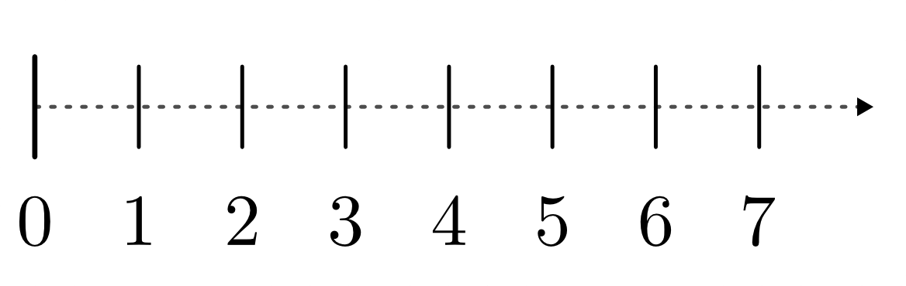

    Der Zahlenstrahl der natürlichen Zahlen.

    .. only:: html

        :download:`SVG: Zahlenstrahl (natürliche Zahlen)
        <../pics/arithmetik/zahlenstrahl-natuerliche-zahlen.svg>`

Die Kisten können somit geordnet, d.h. anhand der Anzahl der darin enthaltenen
Äpfel sortiert werden. Als graphische Darstellungsform wird hierfür häufig ein
"Zahlenstrahl" gewählt, wobei die Zahlen ihrer Größe nach aufsteigend von
links nach rechts angeordnet werden.

.. _Rechnen mit natürlichen Zahlen:

.. rubric:: Rechnen mit natürlichen Zahlen

Jede Menge von Dingen lässt sich durch Hinzufügen weiterer Elemente vergrößern.
Rechnerisch entspricht dies einer Addition zweier natürlicher Zahlen. Das
Ergebnis einer Addition wird Summe genannt.

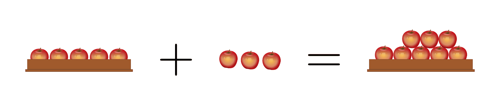

    Beispiel einer einfachen Addition.

    .. only:: html

        :download:`SVG: Addition
        <../pics/arithmetik/addition.svg>`

Ebenso kann eine Menge an Dingen durch Herausnehmen einzelner Elemente
verkleinert werden, mit der Bedingung, dass nicht mehr Elemente aus der Menge
herausgenommen werden können als in ihr enthalten sind. Rechnerisch entspricht
dies einer Subtraktion zweier natürlicher Zahlen. [#]_ Das
Ergebnis einer Subtraktion wird Differenz genannt.

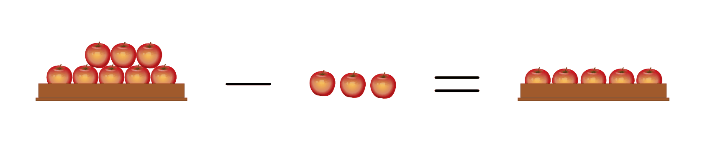

    Beispiel einer einfachen Subtraktion.

    .. only:: html

        :download:`SVG: Subtraktion
        <../pics/arithmetik/subtraktion.svg>`

Auch eine Multiplikation zweier natürlicher Zahlen ist stets möglich; sie
entspricht rechnerisch einer mehrfachen Ausführung einer Addition. Das Ergebnis,
Produkt genannt, ist erneut durch eine natürliche Zahl darstellbar, deren Größe
dem jeweiligen Vielfachen der ursprünglichen Zahl entspricht.

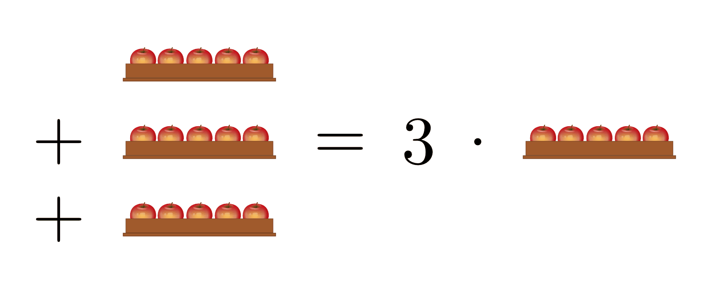

    Beispiel einer einfachen Multiplikation.

    .. only:: html

        :download:`SVG: Multiplikation
        <../pics/arithmetik/multiplikation.svg>`

Eine Division zweier natürlicher Zahlen, d.h. ein Aufteilen einer Menge von
Dingen nur auf mehrere Posten, ergibt ein ganzzahliges Ergebnis genau dann, wenn
die Anzahl der Elemente in der Menge einem Vielfachen der Anzahl an Posten
entspricht -- ansonsten bleibt ein Rest übrig, der sich als Ganzes nicht weiter
aufteilen lässt.

.. index:: Zahlenbereiche; Ganze Zahlen
.. _Ganze Zahlen:

Ganze Zahlen
------------

Um auch ein Fehlen an Dingen zahlenmäßig darzustellen, reichen die
natürlichen Zahlen nicht aus. Die Menge der natürlichen Zahlen
:math:`\mathbb{N}` lässt sich jedoch zur Menge der ganzen Zahlen
:math:`\mathbb{Z}` erweitern.

.. _Die ganzen Zahlen als Obermenge der natürlichen Zahlen:

.. rubric:: Die ganzen Zahlen als Obermenge der natürlichen Zahlen

Alle natürlichen Zahlen sind als Teilmenge in der Menge der ganzen Zahlen
:math:`\mathbb{Z}` enthalten. Zusätzlich kommt für jede natürliche Zahl eine
entsprechende negative "Gegenzahl" hinzu, die ein Fehlen des entsprechenden
Wertes ausdrückt. Zur Darstellung des Falles, dass kein Element vorhanden ist
(aber auch keines fehlt), wird die Zahl Null verwendet.

.. math::
    :label: eqn-ganze-zahlen

    \mathbb{Z} = \{ \ldots,\; -3,\; -2,\; -1,\; 0,\; 1,\; 2,\; 3,\; \ldots \}

Die ganzen Zahlen lassen sich somit in gleicher Weise wie die natürlichen Zahlen
als Zahlenstrahl darstellen. Dabei werden wiederum die einzelnen Zahlen ihrer
Größe nach aufsteigend von links nach rechts geordnet.

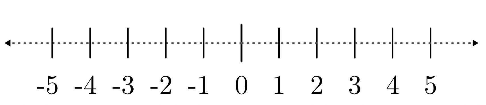

    Der Zahlenstrahl der ganzen Zahlen.

    .. only:: html

        :download:`SVG: Zahlenstrahl (ganze Zahlen)
        <../pics/arithmetik/zahlenstrahl-ganze-zahlen.svg>`

Während bei negativen Zahlen das Minus-Zeichen stets dazu geschrieben werden
muss, kann bei positiven Zahlen das Plus-Zeichen weggelassen werden.

.. _Rechnen mit ganzen Zahlen:

.. rubric:: Rechnen mit ganzen Zahlen

Durch die Erweiterung der natürlichen Zahlen um die negativen Zahlen kann mit
Hilfe der ganzen Zahlen nicht nur jede Addition und Multiplikation, sondern auch
jede Subtraktion uneingeschränkt ausgeführt werden.

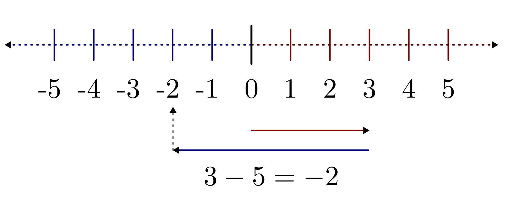

    Beispiel einer Subtraktion am Zahlenstrahl.

    .. only:: html

        :download:`SVG: Subtraktion am Zahlenstrahl
        <../pics/arithmetik/zahlenstrahl-ganze-zahlen-subtraktion.svg>`

Eine veranschaulichende Darstellung von negativen Zahlen ist nicht unmittelbar
möglich, da die Anzahl an Elementen einer Menge stets größer oder gleich Null
ist -- vielmehr lassen sich negative Zahlen als Mengenanzahlen auffassen, die
entsprechend große positive Mengenanzahlen auszugleichen vermögen -- so wie ein
Haufen Erde ein entsprechend großes Erdloch ausfüllen kann.

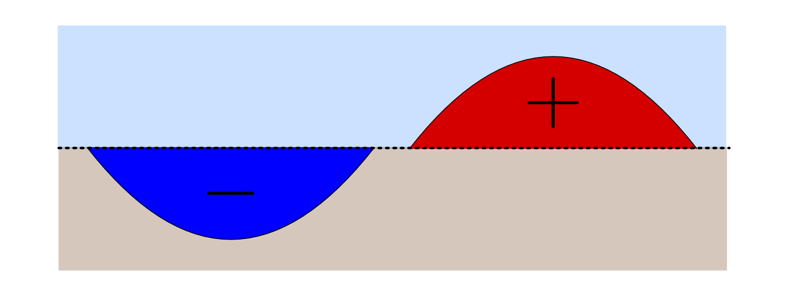

    Bildliche Darstellung einer Subtraktion ganzer Zahlen.

    .. only:: html

        :download:`SVG: Subtraktion (Beispiel)
        <../pics/arithmetik/subtraktion-beispiel.svg>`

Als Einschränkung bleibt jedoch auch im erweiterten System der ganzen Zahlen
bestehen, dass eine Division zweier Zahlen nur dann möglich ist, wenn die erste
Zahl (der Dividend) ein ganzzahliges Vielfaches der zweiten Zahl (des Divisors)
ist -- ansonsten bleibt bei der Division ein nicht weiter teilbarer Rest übrig.

.. index:: Zahlenbereiche; Rationale Zahlen, Rationale Zahlen, Bruchzahlen
.. _Rationale Zahlen:

Rationale Zahlen
----------------

Rationale Zahlen (manchmal auch "Bruchzahlen" genannt) stellen eine Erweiterung
des Zahlenbereichs der ganzen Zahlen dar, um auch eine allgemeine Division
zweier (oder mehrerer) Zahlen zu ermöglichen.

.. _Die rationalen Zahlen als Obermenge der ganzen Zahlen:

.. rubric:: Die rationalen Zahlen als Obermenge der ganzen Zahlen

Alle ganzen Zahlen sind als Teilmenge in der Menge der rationalen Zahlen
:math:`\mathbb{Q}` enthalten. Zusätzlich kommen als weitere Elemente alle
Zahlen hinzu, die sich als Bruch zweier ganzer Zahlen :math:`m` und
:math:`n` darstellen lassen:

.. math::
    :label: eqn-rationale-zahlen

    \mathbb{Q} = \{ \frac{z}{n} \; | \; z,n \in \mathbb{Z} \text{ und } n \ne 0 \}

Die Zahl :math:`z` oberhalb des Bruchstrichs wird Zähler genannt, die Zahl
:math:`n` unterhalb des Bruchstrichs als Nenner des Bruchs bezeichnet. Die
einzige Bedingung liegt darin, dass nicht durch Null geteilt werden darf, d.h.
:math:`n \ne 0` ist. [#N]_

Auch die rationalen Zahlen lassen sich ihrer Größe nach als Zahlengerade
anordnen; die ganzen Zahlen sind dabei als Teil der rationalen Zahlen an den
entsprechenden Stellen eingebettet. [#Q1]_

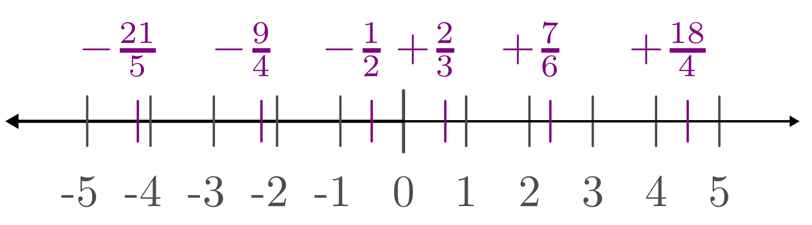

    Der Zahlenstrahl der rationalen Zahlen.

    .. only:: html

        :download:`SVG: Zahlenstrahl (rationale Zahlen)
        <../pics/arithmetik/zahlenstrahl-rationale-zahlen.svg>`

.. index:: Kehrwert

Die rationalen Zahlen liegen "dicht" beieinander, d.h. in den "Lücken" zwischen
je zwei ganzen Zahlen treten jeweils unendlich viele als rationale Zahlen
darstellbare Werte auf.
Anschaulich kann man sich dies dadurch erklären, dass beispielsweise jeder
natürlichen Zahl :math:`n` ein Kehrwert :math:`\frac{1}{n}` zugeordnet werden
kann, für den gilt:

.. math::

   \frac{1}{n} \le 1  \quad \text{ für alle } \quad n \in \mathbb{Z}

Betragsmäßig gilt das gleiche auch für Kehrwerte von negativen Zahlen; hierbei
muss lediglich das Vorzeichen beachtet werden. [#Q2]_

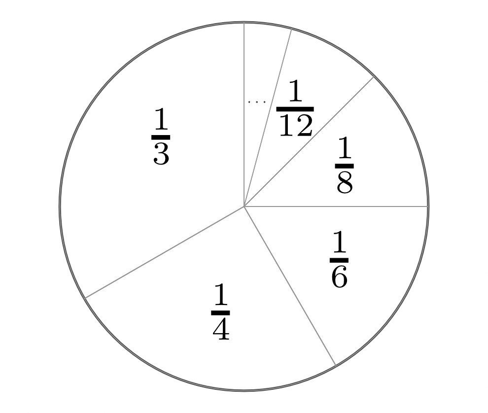

    Darstellung von Stammbrüchen :math:`(1/n ,\, n \in \mathbb{N})` anhand
    eines Tortendiagramms.

    .. only:: html

        :download:`SVG: Tortendiagramm (Stammbrüche)
        <../pics/arithmetik/tortendiagramm-stammbrueche.svg>`

.. _Erweitern und Vereinfachen von Bruchzahlen:

.. rubric:: Erweitern und Vereinfachen von Bruchzahlen

Eine Besonderheit rationaler Zahlen ist es, dass sich ein und die selbe Zahl
:math:`q` durch mehrere gleichwertige Brüche darstellen lässt. Es gilt:

.. math::

    \frac{z_1 }{n_1 } = \frac{z_2 }{n_2 } \quad \text{
    falls } \quad n_1 \cdot z_2 = n_2 \cdot z_1

Allgemein kann jede Bruchzahl :math:`q = \frac{z}{n}` in eine andere, gleich
große Bruchzahl umgeformt werden, indem man sowohl den Zähler :math:`z` als
auch den Nenner :math:`n` mit einer beliebigen ganzen Zahl multipliziert. Diese
in der Praxis häufig vorkommende Methode wird als "Erweitern" einer Bruchzahl
bzw. eines Bruches bezeichnet.

*Beispiele:*

- Anlässlich einer Feier möchte man Tortenstücke verteilen. Soll beispielsweise
  ein Gast ein Viertel einer Torte bekommen, so kann man dieses ebenso gut
  halbieren und somit zwei Achtel-Stücke servieren.

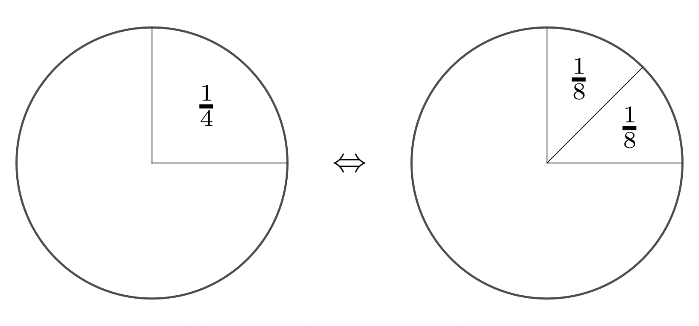

    Kürzen und Erweitern :math:`(\frac{1}{4} = \frac{2}{8})` am Beispiel eines
    Tortendiagramms.

    .. only:: html

        :download:`SVG: Tortendiagramm -- Kürzen und Erweitern
        <../pics/arithmetik/tortendiagramm-kuerzen-erweitern.svg>`

* | Die wohl am häufigsten genutzte Umrechnung bezieht sich auf die Umrechnung
    einer Bruchzahl :math:`q < 1` in eine wertgleiche Angabe mit dem Nenner
    :math:`100` ("Einhundertstel" bzw. "Prozent" genannt).
  | Ist z.B. :math:`q = \frac{1}{4}`, so können Zähler und Nenner um den Faktor
    :math:`25` erweitert werden, und man erhält:

  .. math::

      \frac{1}{4} = \frac{1 \cdot 25}{4 \cdot 25} = \frac{25}{100}

  Somit entspricht der Bruch :math:`\frac{1}{4}` der Dezimalzahl :math:`0,25`
  bzw. der Prozentangabe :math:`25\%`.

Im umgekehrten Fall kann eine Bruchzahl, deren Zähler und Nenner (mindestens)
einen gemeinsamen Faktor besitzen, zu einer wertgleichen rationalen Zahl
vereinfacht werden, indem der gemeinsame Faktor gekürzt wird (bzw. die
gemeinsamen Faktoren gekürzt werden).

*Beispiel:*

* Bei der Bruchzahl :math:`\frac{15}{20}` enthalten sowohl der Zähler als auch
  der Nenner den gemeinsamen Faktor :math:`5`. Dieser kann "gekürzt" werden:

  .. math::

      \frac{15}{20} = \frac{3 \cdot 5}{4 \cdot 5} = \frac{3}{4}

* Bei der Bruchzahl :math:`\frac{30}{60}` lässt sich der Zähler als Produkt der
  Faktoren :math:`2 \cdot 3 \cdot 5`, der Nenner als :math:`2 \cdot 2 \cdot 3
  \cdot 5` darstellen. Es können somit die Faktoren :math:`2 ,\, 3 \text{ und }
  5` (bzw. der Faktor :math:`2 \cdot 3 \cdot 5 = 30`) gekürzt werden:

  .. math::

      \frac{30}{60} = \frac{2 \cdot 3 \cdot 5}{2 \cdot 2 \cdot 3 \cdot 5} =
      \frac{1}{2}

  Derartige Umrechnungen werden beispielsweise bei Zeitangaben genutzt (eine
  "halbe" Stunde usw).

.. index:: Runden
.. _Runden von Bruchzahlen:

.. rubric:: Runden von Bruchzahlen

Jede rationale Zahl kann durch einen ganzzahligen Anteil und einen Restbruch
dargestellt werden, dessen Wert kleiner als eins ist. Soll dieser Restbruch
ebenfalls als Dezimalzahl angegeben werden, so können zwei unterschiedliche
Fälle auftreten:

.. Anmerkung Modulo?

* Manche Bruchzahlen lassen sich als Dezimalzahl mit endlich vielen
  Nachkomma-Stellen darstellen.

  *Beispiel:*

  .. math::

    \frac{1}{16} = 0,0625

* Manche Bruchzahlen entsprechen einer Dezimalzahl mit einer endlichen Periode.
  Bei derartigen Zahlen wiederholen sich ab einer bestimmten Stelle eine oder
  mehrere Nachkomma-Stellen unendlich oft.

  *Beispiele:*

  .. math::

    \frac{1}{3} = 0,3\bar{3} = 0,3333 \ldots \\[8pt]

    \frac{1}{7} = 0,\overline{142\,857} = 0,142\,857\,142\,857 \ldots

Bei der Rechnung mit Dezimalzahlen kann stets nur eine endliche Zahl an
Nachkomma-Stellen berücksichtigt werden; rationale Zahlen werden daher
entsprechend einer gewünschten Genauigkeit gerundet. Diese Genauigkeit wird
durch die Angabe einer bestimmten Anzahl an "zählenden" Ziffern, d.h. Ziffern
außer am Anfang oder am Ende stehenden Nullen, festgelegt.

*Beispiele:*

.. math::

   \underbracket[0.5pt][5.pt]{78\,255\,300,00}_{10\text{ zählende Ziffern}}
   \\[10pt]

   0,000\,\!\!\!\!\!\!\!\!\underbracket[0.5pt][5.pt]{420\,800}_{6\text{
   zählende Ziffern}}

Übermäßig viele zählende Ziffern täuschen bei Ergebnissen von Messungen oder
Schätzungen eine nicht gerechtfertigte Genauigkeit vor. Um dies zu vermeiden,
werden die jeweiligen Zahlen auf- beziehungsweise. abgerundet. Hierzu werden
zunächst die überflüssigen Ziffern durch Nullen ersetzt. Anschließend wird die
letzte nicht überflüssige Ziffer entweder um eins erhöht ("Aufrunden", falls die
erste überflüssige Ziffer :math:`\ge 5` ist) oder unverändert gelassen
("Abrunden").

Bei physikalischen Größen wird anhand der Anzahl der zählenden Ziffern
implizit auch die Messgenauigkeit angegeben. Beispielsweise weist eine
Längenangabe von :math:`\unit[2,170]{m}` auf eine Messgenauigkeit im
Millimeter-Bereich hin, während eine Angabe von :math:`\unit[2,17]{m}` nur eine
Messgenauigkeit im Zentimeter-Bereich bedeutet. [#]_

Um zu große Rundungsfehler zu vermeiden, sollte allerdings bei jeder Rechnung
auf ein frühzeitiges Runden verzichtet und das Runden stattdessen erst am Ende
(im Ergebnis) durchgeführt werden.

.. _Rechnen mit rationalen Zahlen:

.. rubric:: Rechnen mit rationalen Zahlen

Durch die Verwendung rationaler Zahlen lassen sich alle vier
Grundrechen-Operationen -- abgesehen von der Division durch Null --
uneingeschränkt ausführen und beliebig miteinander kombinieren:

* Die Addition zweier rationaler Zahlen :math:`q_1` und :math:`q_2` ist
  definiert als:

  .. math::

      q_1 + q_2 = \frac{z_1}{n_1} + \frac{z_2}{n_2} = \frac{z_1 \cdot n_2}{n_1
      \cdot n_2} + \frac{z_2 \cdot n_1}{n_2 \cdot n_1} = \frac{z_1 \cdot n_2 +
      z_2 \cdot n_1}{n_1 \cdot n_2}

  Um zwei rationale Zahlen :math:`q_1` und :math:`q_2` zu addieren, müssen sie
  zunächst auf einen gemeinsamen Nenner :math:`n_1 \cdot n_2` gebracht werden.
  Beide Zahlen werden hierzu jeweils mit dem Nenner der anderen Zahl erweitert;
  anschließend werden die (erweiterten) Zähler :math:`z_1 \cdot n_2`  und
  :math:`z_2 \cdot n_1` miteinander addiert und auf den gemeinsamen Nenner
  geschrieben.

* Die Subtraktion zweier rationaler Zahlen funktioniert nach dem gleichen
  Prinzip wie die Addition, es sind lediglich die Plus-Zeichen durch
  Minus-Zeichen zu ersetzen:

  .. math::

        q_1 - q_2 = \frac{z_1}{n_1} - \frac{z_2}{n_2} = \frac{z_1 \cdot n_2}{n_1
        \cdot n_2} - \frac{z_2 \cdot n_1}{n_2 \cdot n_1} = \frac{z_1 \cdot n_2 -
        z_2 \cdot n_1}{n_1 \cdot n_2}

* Die Multiplikation zweier rationaler Zahlen :math:`q_1` und :math:`q_2` ist
  definiert als:

  .. math::

      q_1 \cdot q_2 = \frac{z_1}{n_1} \cdot \frac{z_2 }{n_2} = \frac{z_1 \cdot
      z_2}{n_1 \cdot n_2}

  Um zwei rationale Zahlen :math:`q_1` und :math:`q_2` miteinander zu
  multiplizieren, werden beide Zähler :math:`z_1` und :math:`z_2`  miteinander
  multipliziert und das Ergebnis :math:`z_1 \cdot z_2` auf den gemeinsamen
  Nenner :math:`n_1 \cdot n_2` geschrieben.

* Die Division zweier rationaler Zahlen :math:`q_1 = \frac{z_1}{n_1}` und
  :math:`q_2 = \frac{z_2}{n_2}` entspricht einer Multiplikation der ersten Zahl
  (des Dividenden) mit dem Kehrbruch der zweiten Zahl (des Divisors). Die
  Division erfolgt somit nach dem gleichen Prinzip wie die Multiplikation, nur
  müssen Zähler und Nenner der zweiten Zahl vertauscht werden:

  .. math::

      \frac{q_1}{q_2} = \frac{z_1}{n_1} : \frac{z_2}{n_2} = \frac{z_1}{n_1}
      \cdot \frac{n_2}{z_2} = \frac{z_1 \cdot n_2}{n_1 \cdot z_2}

Weitere Hinweise zum Rechnen mit rationalen Zahlen sind im Abschnitt
:ref:`Bruchrechnung <Bruchrechnung>` beschrieben.

.. index:: Zahlenbereiche; Reelle Zahlen, Reelle Zahlen
.. _Reelle Zahlen:

Reelle Zahlen
-------------

Eine Vielzahl an mathematischen Problemen kann nicht mit Hilfe der rationalen
Zahlen gelöst werden. Beispielsweise gibt es keine rationale Zahl :math:`x`,
welche die Gleichung :math:`x^2 = 3` löst; ebenso gibt es keine rationale Zahl,
die das Verhältnis :math:`d/l` aus der Diagonale eines Quadrates und seiner
Seitenlänge bzw. das Verhältnis :math:`u:d` aus dem Umfang :math:`u` und dem
Durchmesser :math:`d` eines Kreises ausdrücken könnte. Um derartige "Mängel" zu
beseitigen, lässt sich der Bereich der rationalen Zahlen zum Bereich der reellen
Zahlen erweitern.

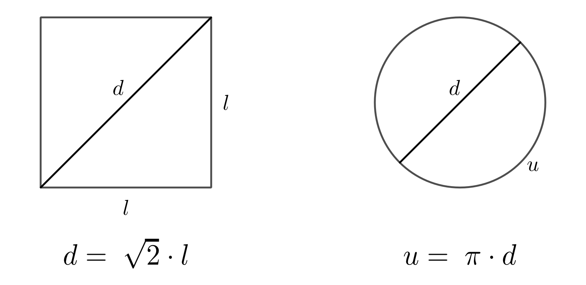

    Anschauliche Beispiele für :math:`\sqrt{2}` und :math:`\pi` als irrationale
    Zahlen.

    .. only:: html

        :download:`SVG: Irrationale Zahlen (Beispiele)
        <../pics/arithmetik/irrationale-zahlen-beispiele.svg>`

Die neu hinzukommenden Zahlen, beispielsweise :math:`\sqrt{2} ,\, \pi` oder
:math:`\sin{20 °}`, werden dabei als "irrationale" Zahlen bezeichnet. Sie lassen
sich zwar ihrem Wert nach in den Zahlenstrahl einordnen, lassen sich jedoch
durch keine rationale Zahl ausdrücken und besitzen in der Darstellung als
Dezimalzahl unendlich viele, nicht periodische Nachkommastellen.

.. index:: Reelle Zahlen; Kreiszahl Pi
.. _Pi:
.. _Kreiszahl:
.. _Kreiszahl Pi:

Für zwei besonders wichtige reelle Zahlen werden spezielle Symbole benutzt:

* Die Zahl :math:`\pi = 3,141592653589\ldots` wird als "Kreiszahl" bezeichnet. Sie
  gibt den Zusammenhang zwischen dem Durchmesser :math:`d` und dem Umfang
  :math:`u` eines Kreises an:

  .. math::

      u = \pi \cdot d

.. index:: Reelle Zahlen; Eulersche Zahl e
.. _Reelle Zahlen:
.. _Eulersche Zahl:
.. _Eulersche Zahl e:

* Die Zahl :math:`e = 2,718281828459\ldots` wird als "Eulersche Zahl"
  bezeichnet. Sie ist in Verbindung mit :ref:`Exponentialfunktionen
  <Exponentialfunktionen>` und :ref:`Logarithmen <Logarithmusfunktionen>` von
  besonderer Bedeutung.

.. index:: Basis, Exponent
.. _Rechnen mit reellen Zahlen:

.. rubric:: Rechnen mit reellen Zahlen

Mit Hilfe der reellen Zahlen lassen sich somit nicht nur alle vier
Grundrechenarten -- abgesehen von der Division durch Null -- uneingeschränkt
ausführen; auch das Potenzieren beliebiger und das Wurzelziehen nicht-negativer
reeller Zahlen liefert stets eindeutige Ergebnisse.

* Für die Potenz :math:`x ^{n}` einer reellen Zahl :math:`x` gilt mit :math:`n
  \in \mathbb{N}`:

  .. math::

      x^{n} = \underbrace{x \cdot x \cdot \ldots \cdot x \cdot x}_{n \text{ Faktoren }}

  Eine Potenz :math:`x ^{n}` mit Exponent :math:`n` entspricht somit einer
  :math:`n`-fachen Multiplikation der Grundzahl ("Basis") :math:`x` mit sich
  selbst. Das wohl bekannteste Beispiel hierfür sind die so genannten
  "Zehner-Potenzen" :math:`10^1 ,\, 10^2 ,\, 10^3 ,\, \ldots`. Sie lassen sich
  als Zehner-Stange, Hunderter-Quadrat und Tausender-Würfel darstellen.

.. index:: Wurzel
.. _Wurzel:

* Das Wurzelziehen ("Radizieren") entspricht der Umkehrung des Potenzierens.
  Für eine beliebige reelle Zahl :math:`a \ge 0` gelte folgende Gleichung:

  .. math::

      a = x ^{n}

  | Dann ist mit gegebenem :math:`n \in \mathbb{N}` dem Wert nach genau eine
    reelle Zahl :math:`x` bestimmt, welche die Gleichung löst.
  | Hierfür schreibt man: [#WUR]_

  .. math::

      x = \sqrt[n]{a}

  Unter der :math:`n`-ten Wurzel aus einer nicht-negativen Zahl :math:`a`
  versteht man somit diejenige Zahl :math:`x`, deren :math:`n`-te Potenz gleich
  :math:`a` ist.

  Wohl am häufigsten treten die so genannten "Quadrat-Wurzeln" einer Zahl
  :math:`a` auf. Hierbei wird diejenige Zahl :math:`x` gesucht, die, mit sich
  selbst multipliziert, die Gleichung :math:`x^2 = a` löst. Beim Ergebnis
  :math:`x = \sqrt[2]{a} = \sqrt{a}` kann der "Wurzelexponent" :math:`n=2`
  weggelassen werden.

Berechnet man Quadrat-, Kubik- und allgemeinen Wurzeln mit Hilfe eines
Taschenrechners oder Computers, so werden die häufig irrationalen Ergebnisse in
gleicher Weise wie beim :ref:`Runden von Bruchzahlen <Runden von Bruchzahlen>`
entsprechend der möglichen Anzeige-Genauigkeit gerundet.

.. _Komplexe Zahlen:

Komplexe Zahlen
---------------

Komplexe Zahlen stellen eine Erweiterung des Zahlenbereichs der reellen Zahlen
dar. Grundlegend hierfür waren Überlegungen von `Gerolamo Cardano
<https://de.wikipedia.org/wiki/Gerolamo_Cardano>`_ und `Rafael Bombelli
<https://de.wikipedia.org/wiki/Rafael_Bombelli>`_, auf welche Weise sich Wurzeln
negativer Zahlen definieren ließen.

Der so geschaffene Zahlenbereich :math:`\mathbb{C}` der komplexen Zahlen hat
sich für vielerlei Anwendungen in den Natur- und Ingenieurwissenschaften als
äußerst nützlich erwiesen. Eine komplexe Zahl lässt sich allerdings nicht mehr
durch eine einzelne Zahl darstellen, sondern bildet vielmehr ein geordnetes
Paar :math:`(a,b)` eines zweidimensionalen Vektorraums.

Da komplexe Zahlen in den derzeitigen Lehrplänen keine Beachtung finden, wird an
dieser Stelle für interessierte Leser lediglich auf den :ref:`Exkurs: Komplexe
Zahlen <Exkurs Komplexe Zahlen>` verwiesen.

.. raw:: html

    

.. only:: html

    .. rubric:: Anmerkungen:

.. [#] Eine Zahl, welche die Mächtigkeit einer endlichen Menge angibt, wird auch
    als Kardinalzahl bezeichnet.

.. [#]  Die Subtraktion stellt somit die "Umkehrung" der Addition dar.

.. [#N] Eine Division durch :math:`n=0` ist grundsätzlich unmöglich:

    * Gäbe es eine rationale Zahl :math:`q = \frac{z}{n}` mit :math:`n = 0` und
      :math:`z \ne 0`, so müsste ebenfalls :math:`q \cdot n  = q \cdot 0 = z`
      gelten. Es gilt jedoch für jede beliebige Zahl :math:`q \cdot 0 = 0` und
      somit :math:`q \cdot 0 \ne z`.

    * Im Fall :math:`n = 0` und :math:`z = 0` würde zwar :math:`q \cdot n = q
      \cdot 0 = 0 = z` gelten. Hierbei wäre allerdings :math:`q` nicht eindeutig
      bestimmt, da  :math:`q \cdot 0 = 0` auf jede beliebige Zahl zutrifft.

.. [#Q1] Die ganzen Zahlen können als so genannte "Scheinbrüche" aufgefasst
    werden, d.h. Brüche, deren Nenner :math:`n` gleich eins ist; für jede ganze
    Zahl :math:`z` gilt somit:

    .. math::

        z = \frac{z}{1}

    Ein Scheinbruch liegt ebenfalls vor, wenn der Zähler :math:`z` ein
    ganzzahliges Vielfaches :math:`n \cdot z` des Nenners :math:`n` ist:

    .. math::

        z = \frac{n \cdot z}{n}

.. [#Q2] Das Minus-Zeichen einer negativen rationalen Zahl wird für gewöhnlich
    vor den Bruchstrich geschrieben. Es ist allerdings genauso richtig,
    stattdessen entweder den Zähler *oder* den Nenner mit einem Minus-Zeichen zu
    versehen:

    .. math::

        -\frac{z}{n}  = \frac{-z\phantom{-}}{n} = \frac{z}{-n\phantom{-}}

    Tragen sowohl Zähler als auch Nenner ein Minus-Zeichen, so ist der Wert des
    Bruches positiv.

.. [#] In der Physik richtet sich die Genauigkeitsangabe stets nach der
    ungenauesten Messung, d.h. die Anzahl an zählenden Ziffern des Ergebnisses
    ist immer gleich der Anzahl der zählenden Ziffern der ungenauesten Messung
    bzw. Maßangabe.

.. [#WUR] Genau genommen gilt dies nur, wenn :math:`n` eine ungerade Zahl ist.
    Für Wurzeln mit geradzahligen :math:`n` erfüllt neben :math:`x =
    \sqrt[n]{a}` auch :math:`x = - \sqrt[n]{a}` die Bedingung :math:`a = x^n`.
    In diesem Fall heben sich beim Potenzieren, d.h. beim mehrfachen
    Multiplizieren, die negativen Vorzeichen paarweise gegenseitig auf. (Siehe
    auch :ref:`Rechenregeln für Potenzen <Rechenregeln für Potenzen mit gleichen
    Exponenten>`)

