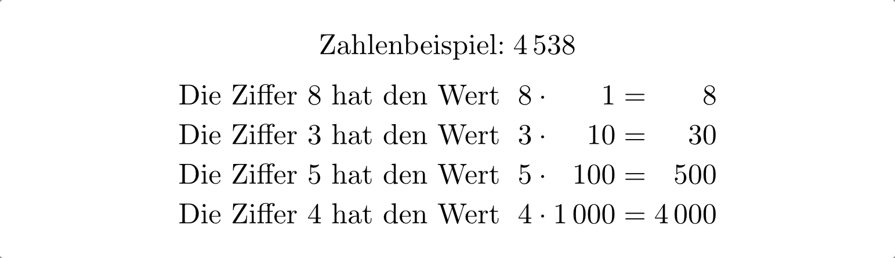
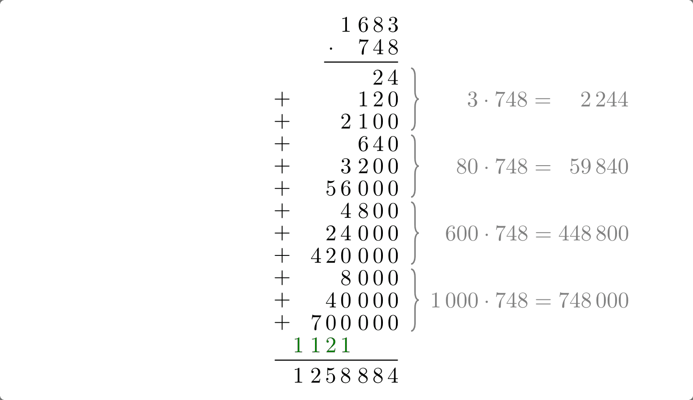
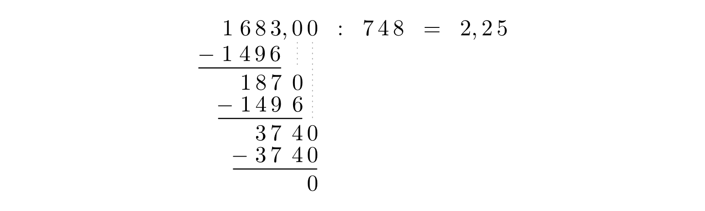

.. _Grundrechenarten und Rechenregeln:

Grundrechenarten und Rechenregeln
=================================

.. index:: Ziffer, Zahl
.. _Ziffern und Zahlen im Dezimalsystem:

Ziffern und Zahlen im Dezimalsystem
-----------------------------------

Im so genannten "Dezimalsystem" werden Zahlen durch die Ziffern :math:`0 ,\, 1
,\, 2 ,\, 3 ,\, 4 ,\, 5 ,\, 6 ,\, 7 ,\, 8 ,\, 9` repräsentiert. Um beliebig
große Zahlen mit nur diesen zehn Ziffern darstellen zu können, besitzt jede
Ziffer neben ihrem eigentlichen Wert auch einen bestimmten Stellenwert. Der
tatsächliche Wert einer Ziffer entspricht damit ihrem Eigenwert multipliziert
mit ihrem Stellenwert.

Die Zahlen :math:`1 ,\, 10 ,\, 100 ,\, 1000` beziehungsweise :math:`\frac{1}{10}
,\, \frac{1}{100} ,\, \frac{1}{1000}` usw. werden als Stufenzahlen oder
Zehnerpotenzen bezeichnet. Mit ihrer Hilfe lässt sich jede Zahl eindeutig
als Summe von Vielfachen der Stufenzahlen schreiben.

    Ziffern als Repräsentanten von Zahlenwerten.

    .. only:: html

        :download:`SVG: Ziffern und Zahlen
        <../pics/arithmetik/ziffern-und-zahlen.svg>`

In der Dezimal-Schreibweise wird bei der Darstellung großer Zahlen nach den
Ziffern für :math:`1\,000 ,\; 1\,000\,000 ,\; 1\,000\,000` usw. nach
Möglichkeit je ein kleiner Zwischenraum eingefügt, um die Lesbarkeit zu erhöhen.
Ziffern mit einer Wertigkeit kleiner als Eins werden im deutschen Sprachraum mit
einem Komma, im Englischen mit einem Punkt von den übrigen getrennt.

.. index:: Grundrechenarten
.. _Grundrechenarten:
.. _Grundrechenregeln:
.. _Die vier Grundrechenarten:

Die vier Grundrechenarten
-------------------------

Mathematik ist die Wissenschaft der Zahlen. Die mathematischen Operationen
Addition, Subtraktion, Multiplikation und Division stellen im alltäglichen
Leben die wohl gebräuchlichsten Verknüpfungen von Zahlen dar; sie werden daher
auch als Grundrechenarten bezeichnet.

.. index::
    single: Grundrechenarten; Addition
    single: Addition
.. _Addition:

.. rubric:: Die Addition

Werden zwei Zahlen oder Terme mit einem Pluszeichen verbunden, so bezeichnet man
den Rechenausdruck als Summe. Die einzelnen Zahlen, die addiert werden, heißen
Summanden.

Ohne Computer oder Taschenrechner lassen sich Zahlen am einfachsten addieren,
indem sie untereinander geschrieben werden. Dabei müssen die Ziffern mit
gleicher Wertigkeit (Einer, Zehner Hunderter usw.) immer genau untereinander
stehen. Anschließend werden spaltenweise von rechts nach links die Ziffern der
einzelnen Summanden addiert. Treten dabei Werte größer als Zehn auf, so wird
nur die Einerstelle der jeweiligen Summe unter den Strich geschrieben, die
Zehnerstelle wird als "Übertrag" in die nächste Ziffernstelle übernommen. [#A1]_

    Beispiel einer schriftlichen Addition.

    .. only:: html

        :download:`SVG: Schriftliche Addtion (Beispiel)
        <../pics/arithmetik/beispiel-addition.svg>`

Der Grundgedanke hierbei besteht darin, dass  jeweils zehn "Einer" mit einem
"Zehner", zehn "Zehner" mit einem "Hunderter" usw. gleichwertig sind. Bei der
Addition der einzelnen Stellenwerte kann man somit jeweils zehn Repräsentanten
einer Wertigkeit durch einen Repräsentanten der nächst höheren Wertigkeit
ersetzen und diesen zur Addition des nächsten Stellenwertes hinzunehmen.

.. index::
    single: Grundrechenarten; Subtraktion
    single: Subtraktion
.. _Subtraktion:

.. rubric:: Die Subtraktion

Werden zwei Zahlen oder Terme mit einem Minuszeichen verbunden, so bezeichnet
man den Rechenausdruck als Differenz. Vor dem Minuszeichen steht der Minuend,
dahinter der Subtrahend.

Auch bei der schriftlichen Subtraktion werden die Ziffern mit gleicher
Wertigkeit jeweils untereinander geschrieben. Anschließend werden spaltenweise
von rechts nach links die Ziffern des Subtrahenden von der jeweiligen Ziffer des
Minuenden subtrahiert. Ist dabei die Ziffer des Minuenden kleiner als die des
Subtrahenden, so wird die Ziffer des Minuenden um 10 erhöht und der so gebildete
Differenzwert unter den Strich geschrieben. Der "Übertrag" lässt sich dadurch
ausgleichen, indem die nächste, um das 10-fache größere Ziffer des Minuenden um
Eins erniedrigt wird. [#S1]_

    Beispiel einer schriftlichen Subtraktion.

    .. only:: html

        :download:`SVG: Schriftliche Subtraktion (Beispiel)
        <../pics/arithmetik/beispiel-subtraktion.svg>`

Der Grundgedanke hierbei besteht wiederum darin, dass jeweils ein "Zehner" mit
zehn "Einern", ein "Hunderter" mit zehn "Zehnern" usw. gleichwertig ist. Bei der
Subtraktion der einzelnen Stellenwerte kann man somit im Minuenden jeweils einen
Repräsentanten einer Wertigkeit durch zehn Repräsentanten der nächst niedrigeren
Wertigkeit ersetzen.

.. index::
    single: Grundrechenarten; Multiplikation
    single: Multiplikation
.. _Multiplikation:

.. rubric:: Die Multiplikation

Werden zwei Zahlen oder Terme mit einem Malzeichen verbunden, so bezeichnet man
den Rechenausdruck als Produkt. Die einzelnen Zahlen beziehungsweise Terme, die
miteinander multipliziert werden, heißen Faktoren.

Bei einer schriftlichen Multiplikation wird der erste Faktor spaltenweise von
rechts mit allen Ziffern des zweiten Faktors multipliziert. An jedes so
gebildete Teilergebnis wird dabei eine Anzahl an Nullen angehängt, die der Summe
an Nullen beider Ziffernwertigkeiten entspricht. Die einzelnen Teilergebnisse
werden gemäß ihrer Wertigkeiten untereinander geschrieben und aufaddiert.

    Beispiel einer schriftlichen Multiplikation.

    .. only:: html

        :download:`SVG: Schriftliche Multiplikation (Beispiel)
        <../pics/arithmetik/beispiel-multiplikation.svg>`

Der Grundgedanke dieser Rechenmethode liegt darin, dass es sich bei jeder
Multiplikation um eine mehrfache Addition handelt. In gleicher Weise, wie man
sich eine einzelne Zahl anhand ihrer Ziffern aus den jeweiligen Vielfachen der
Stufenzahlen aufgebaut denken kann, kann man sich auch jedes Produkt zweier
Zahlen als Summe einzelner Teilfaktoren vorstellen.

.. index::
    single: Grundrechenarten; Division
    single: Division
.. _Division:

.. rubric:: Die Division

Werden zwei Zahlen oder Terme mit einem Geteilt-Zeichen verbunden, so bezeichnet
man den Rechenausdruck als Division. Vor dem Geteilt-Zeichen steht der Dividend,
dahinter der Divisor. Für das Geteilt-Zeichen gibt es mehrere gleichwertige
Schreibweisen:

.. math::

    a_1 : a_2 \; = \; a_1 / a_2 \; = \; \frac{a _1 }{a_2 }

Bei einer schriftlichen Division werden der Dividend, der Divisor und das zu
berechnende Ergebnis in eine Zeile geschrieben. Zunächst werden nur (von links
nach rechts) die ersten :math:`n` Ziffern des Dividenden betrachtet, so dass
die sich aus den :math:`n` Ziffern ergebende Zahl größer ist als der Divisor.
Durch Abschätzen wird ermittelt, welchem ganzzahligen Vielfachen des Divisors
-- abgesehen von einem später noch zu bestimmenden Rest -- die ausgewählte,
:math:`n`-stellige Zahl entspricht. Mit diesem Vielfachen, das die erste
Ergebnis-Ziffer darstellt, wird der Divisor anschließend multipliziert und das
erhaltene Ergebnis von der :math:`n`-stelligen Zahl subtrahiert. Übrig bleibt
hierbei ein bestimmter Teilungsrest. Zu diesem Rest können nach dem gleichen
Schema weitere Ziffern des Dividenden hinzugenommen und die Division nach der
gleichen Rechenmethode fortgesetzt werden.

    Beispiel einer schriftlichen Division.

    .. only:: html

        :download:`SVG: Schriftliche Division (Beispiel)
        <../pics/arithmetik/beispiel-division.svg>`

Durch die Verwendung von Taschenrechnern und Computern werden die schriftliche
Multiplikation und Division im alltäglichen Leben kaum noch angewendet. Das
Rechenschema der schriftlichen Division ist allerdings für die Methode der
:ref:`Polynom-Division <Polynomdivision>` in der Analysis und Algebra von
Bedeutung.

.. _Klammern und Reihenfolge der Auswertung:

Klammern und Reihenfolge der Auswertung
---------------------------------------

Die vier Grundrechenarten sind als Operatoren für jeweils zwei Operanden
festgelegt. Sollen drei oder mehr Zahlen durch die vier Grundrechenarten
verknüpft werden, so kann dies nur schrittweise erfolgen.

Die Reihenfolge, in der die einzelnen Operationen ausgeführt werden müssen, ist
durch Vorrang-Regeln sowie durch die Verwendung von Klammern festgelegt:

1. Was in Klammern steht, wird zuerst ausgewertet (bei Zahlen) beziehungsweise
   zusammengefasst (bei Variablen).
2. Ist durch Klammern keine andere Reihenfolge der Auswertung festgelegt, so
   werden zunächst die Rechenoperatoren der dritten Stufe (Potenzen und Wurzeln)
   ausgewertet.
3. Als nächstes werden die Rechenoperatoren der zweiten Stufe (Multiplikation
   und Division) ausgewertet.
4. Zuletzt werden die Rechenoperationen der ersten Stufe (Addition und
   Multiplikation) ausgeführt.

Durch das Setzen von Klammern kann somit eine von der üblichen Regel "(Hoch vor)
Punkt vor Strich" abweichende Reihenfolge der Auswertung erreicht werden. In
allgemeiner Form kann die Auswertungsreihenfolge somit als "Klammer vor Hoch vor
Punkt vor Strich" zusammengefasst werden. Die Rechenoperationen gleicher Stufe
werden dabei von links nach rechts ausgeführt.

Bei der Verwendung von Klammern sind folgende Regeln zu beachten:

* Klammern treten stets paarweise auf ("Klammer auf, Klammer zu")

* Mehrere Klammern können ineinander verschachtelt, niemals jedoch überlappend
  auftreten.

* Zur besseren Lesbarkeit werden oftmals verschiedene Klammer-Symbole verwendet:

  .. math::
  
      \left \langle \ldots \left \lbrace \ldots \left[ \ldots \left(
      \phantom{\frac{a}{b} } \ldots  \phantom{\frac{a}{b} }  \right) \ldots
      \right] \ldots  \right \rbrace \ldots \right \rangle

  Als Alternative dazu können Klammern unterschiedlicher Größe genutzt werden:

  .. math::
  
      \Bigg( \ldots\bigg( \ldots\Big( \ldots\big( \ldots( \ldots ) \ldots\big)
      \ldots\Big) \ldots\bigg) \ldots\Bigg)

In manchen Fällen kann ein Term durch das Auflösen einer Klammer vereinfacht
werden --  insbesondere wenn sich verschiedene Terme dadurch leichter
zusammenzählen lassen oder sich gegenseitig aufheben (zu Null addieren). Hierzu
muss das vor der Klammer stehende Rechenzeichen auf alle Glieder der Klammer
angewendet werden. Es gelten damit folgende Regeln:

* Steht vor einer Klammer ein Pluszeichen :math:`(+)`, so kann die Klammer ohne
  Änderung der Rechenzeichen innerhalb der Klammer weggelassen werden. Somit
  gilt:

  .. math::
      :label: eqn-klammer-plus

      + (+a) = +a \\
      + (-a) = -a \\

* Steht vor einer Klammer ein Minuszeichen :math:`(-)`, so werden alle additiven
  Rechenzeichen in der Klammer in die jeweils entgegengesetzten umgewandelt (Plus
  wird zu Minus und umgekehrt).

  .. math::
      :label: eqn-klammer-minus

      - (+a) = -a \\
      - (-a) = +a \\

Klammern finden insbesondere dann Anwendung, wenn sowohl additive wie auch
multiplikative Terme miteinander kombiniert werden. Die dafür wesentlichen
Rechenregeln sind im nächsten Abschnitt zusammengefasst.

.. _Rechengesetze für die Grundrechenarten:

Rechengesetze für die Grundrechenarten
--------------------------------------

Häufig muss man bei mathematischen Aufgaben Terme aus Zahlen und/oder Variablen
auswerten, welche durch die vier Grundrechenarten verknüpft sind. Zur
Vereinfachung können dabei bestimmte Umformungen vorgenommen werden, die für
beliebige Variablenwerte aus dem Definitionsbereich stets unveränderte
Ergebniswerte liefern. Die drei wichtigsten dieser Rechenregeln werden als
Kommutativ-, Assoziativ- und Distributivgesetz bezeichnet.

.. index:: Kommutativgesetz
.. _Kommutativgesetz:

.. rubric:: Das Kommutativgesetz

Bei der Addition und der Multiplikation können die einzelnen Summanden
beziehungsweise Faktoren miteinander vertauscht werden. Es gelten somit folgende
Rechenregeln:

.. math::
    :label: eqn-kommutativgesetz

    a_1 + a_2 &= a_2 + a_1 \\[6pt]
    a_1 \cdot a_2 &= a_2 \cdot a_1

Die Subtraktion und die Division sind nicht kommutativ.

.. index:: Assoziativgesetz
.. _Assoziativgesetz:

.. rubric:: Das Assoziativgesetz

Bei der Addition von mehr als zwei Summanden oder einer Multiplikation mehrerer
Faktoren können die Summen- beziehungsweise Produktglieder beliebig durch Klammern
gruppiert werden. Es gilt somit:

.. math::
    :label: eqn-assoziativgesetz

    a_1 + (a_2 + a_3) &= (a_1 + a_2) + a_3 = a_1 + a_2 + a_3 \\[6pt]
    a_1 \; \cdot \, (a_2 \; \cdot \; a_3) &= (a _1 \; \cdot \; a_2) \, \cdot
    \; a_3  = a_1 \; \cdot \; a_2 \; \cdot \; a_3

Das Assoziativgesetz gilt in entsprechender Form auch für die Subtraktion und
die Division. [#ASD]_

.. index:: Distributivgesetz
.. _Distributivgesetz:

.. rubric:: Das Distributivgesetz

Treten Addition und Multiplikation gemeinsam auf, so gelten folgende
Verknüpfungsregeln:

.. math::
    :label: eqn-distributivgesetz

    a_1 \cdot (a_2 + a_3 ) = a_1 \cdot a _2 + a_1 \cdot a_3  \\[6pt]
    (a_2 + a_3 ) \cdot a_1 = a_2 \cdot a _1 + a_3  \cdot a_1

Ist ein Summenterm mit einem Faktor zu multiplizieren, so kann man jeden
Summanden einzeln mit dem Faktor multiplizieren und anschließend beide Produkte
addieren. Die Reihenfolge der Faktoren beziehungsweise Summanden spielt dabei
gemäß dem Kommutativgesetz :eq:`eqn-kommutativgesetz` keine Rolle.

Besitzen im umgekehrten Fall alle Summanden einer Summe einen gemeinsamen
Faktor, so kann dieser gemäß der obigen Gleichung "ausgeklammert" werden. Dieser
Rechentrick, auch als "Faktorisierung" einer Summe bezeichnet, wird insbesondere
bei der Rechnung mit Brüchen häufig angewendet.

Das Distributivgesetz gilt in entsprechender Form auch für die Subtraktion und
die Division. [#DSD]_

.. index:: Binomische Formeln
.. _Binomische Formeln:

Binomische Formeln
------------------

Sollen zwei in Klammern stehende Summenterme miteinander multipliziert werden,
so kann ebenfalls das Distributivgesetz angewendet werden. Jeder Summand des
ersten Terms ist dabei mit jedem Summanden des zweiten Terms (unter
Berücksichtigung des Vorzeichens) zu multiplizieren. Beispielsweise gilt:

.. math::

    (a_1 +  a_2)  \cdot (a_3 +  a_4) =  a_1 \cdot  a_3 + a_1 \cdot a_4 + a_2
    \cdot a_3 + a_2 \cdot a_4

Bestehen die zu multiplizierenden Summenterme wie im obigen Beispiel aus jeweils
zwei Summanden, so werden sie als Binome bezeichnet. Für sie gelten folgende,
für vielerlei Aufgaben nützliche "binomische Formeln":

.. math::
    :label: eqn-binomische-formeln

    (a_1 + a_2)^2 = \; &(a_1 + a_2) \cdot (a_1 + a_2) = a^2 + 2 \cdot a_1 \cdot a_2 + a_2^2 \\
    (a_1 - a_2)^2 = \; &(a_1 - a_2) \cdot (a_1 - a_2) = a^2 - 2 \cdot a_1 \cdot a_2 + a_2^2 \\
    &(a_1 + a_2) \cdot (a_1 - a_2) = a_1^2 - a_2^2

Für höhere Potenzen kann mit Hilfe des :ref:`Summenzeichens <Reihen und ihre
Eigenschaften>` und des so genannten :ref:`Binomialkoeffizienten <Kombinationen
ohne Wiederholung>` eine allgemeine binomische Formel angegeben werden:

.. math::

    (a_1 + a_2) ^n = \sum_{i=0}^{n} \binom{n}{i} \cdot a_1^{(n-i)} \cdot a_2^i

Für :math:`(a_1 - a_2)^n` wechseln sich die Vorzeichen der einzelnen Produkte
ab. Dies kann in der obigen Formel durch einen Faktor :math:`(-1)^i`
berücksichtigt werden, der je nach Wert der Indexvariablen :math:`i` ein
positives oder negatives Vorzeichen liefert. Somit gilt:

.. math::

    {\color{white}1 \qquad \;}(a_1 - a_2) ^n = \sum_{i=0}^{n} \binom{n}{i} \cdot (-1)^i \cdot a_1^{(n-i)}
    \cdot a_2^i

.. Todo Beispiel

..  Binomische Formeln werden beispielsweise zur quadratischen Ergänzung genutzt.

.. index:: Betrag
.. _Beträge und Einheiten:

Beträge und Einheiten
---------------------

Der Betrag :math:`| a |` einer Zahl ist die nicht-negative der beiden Zahlen
:math:`a` und :math:`-a`:

.. math::

    | a | = \begin{cases}
    +a  & \text{ falls } a > 0 \\
    \;\;0  & \text{ falls } a = 0 \\
    -a & \text{ falls } a < 0
    \end{cases}

Anschaulich entspricht der Betrag :math:`| a |` einer Zahl :math:`a` dem
Abstand zwischen :math:`0` und :math:`a` auf der Zahlengeraden.

.. _Rechnen mit Beträgen:

.. rubric:: Rechnen mit Beträgen

Da Beträge letztlich nichts anderes sind als positive reelle Zahlen, können sie
beliebig mit den vier Grundrechenarten verknüpft werden. Für die Beträge von
Produkten und Quotienten gelten dabei folgende Rechenregeln:

.. math::
    | a_1 \cdot a_2  | &= | a_1 | \cdot | a_2 | \\[4pt]
    | a_1  : a_2  | &= | a_1  | : | a_2  | \\[4pt]

Die Gleichung :math:`| a_1  + a_2  | = | a_1 | + | a_2 |` gilt nicht allgemein,
sondern nur dann, wenn :math:`a_1` und :math:`a_2` das gleiche Vorzeichen
besitzen; andernfalls ist der Betrag der Summen :math:`|a_1 + a_2 |` kleiner als
die Summe der Beträge :math:`| a_1 | + | a_2 |`. Beide Fälle lassen sich durch
folgende Ungleichung beschreiben:

.. math::

    | a_1 + a_2 | &\le | a_1 | + | a_2 |

Häufig ist auch der Differenzbetrag zweier Zahlen :math:`a_1` und :math:`a_2`
von Interesse, d.h. der Abstand :math:`|a_2 - a_1|` zwischen :math:`a_1` und
:math:`a_2` auf der Zahlengeraden. Der Differenzbetrag entspricht somit der
Differenz beider Zahlen ohne Berücksichtigung des Vorzeichens. Hierbei gilt:

.. math::

    | a_1 - a_2 | = | a_2 - a_1 |

.. _Rechnen mit Einheiten:

.. rubric:: Rechnen mit Einheiten

In anwendungsorientierten Aufgaben muss meist nicht nur mit Zahlen, sondern auch
mit (physikalischen) Größen gerechnet werden. Diese haben in den meisten Fällen
nicht nur einen bestimmten Betrag beziehungsweise Zahlenwert, sondern auch eine
bestimmte Einheit.

.. math::

    \text{Größe} = \text{Zahlenwert} \cdot \mathrm{Einheit}

Wird in einer Gleichung mit Größen gerechnet, so müssen sich die jeweiligen
Einheiten auf beiden Seiten der Gleichung stets entsprechen. Dabei sind folgende
Regeln zu beachten:

* Identische Größen haben im allgemeinen Sprachgebrauch teilweise
  unterschiedliche Bezeichnungen. Auch hierbei sind die jeweiligen
  Umrechnungsfaktoren zu berücksichtigen.

  *Beispiele:*

.. math::

  \unit[1]{Liter} = \unit[1]{Kubikdezimeter} \\[8pt]
  \unit[1]{Tonne} = \unit[1\,000]{Kilogramm}

* Durch Verwendung von Zehnerpotenzen beziehungsweise  den entsprechenden
  "Vorsätzen" (Kilo-, Mega-, Giga- beziehungsweise Zenti-, Mili-, Mikro- usw.)
  lassen sich Einheiten oftmals "einfacher" darstellen. Dabei müssen die
  Zahlenwerte der Einheiten entsprechend angepasst werden.

  *Beispiele:*

.. math::

  \unit[1]{m} = \unit[100]{cm} = \unit[1\,000]{mm} \\[8pt]
  \unit[1]{MW} = \unit[1\,000]{kW} = \unit[1\,000\,000]{W}

.. Todo Zehnerpotenzen

.. raw:: html

    

.. only:: html

    .. rubric:: Anmerkungen:

.. [#A1] Der Übertrag kann wahlweise über den ersten Summanden oder direkt über
    den Bruchstrich geschrieben werden. Letztere Schreibweise wird bevorzugt,
    wenn auf diese Weise mehr als zwei Zahlen addiert werden.

.. [#S1] Alternativ zur Erniedrigung der nächst größeren Ziffer des Minuenden
    kann der Übertrag auch dadurch berücksichtigt werden, dass die nächst
    größere Ziffer des Subtrahenden um Eins erhöht wird.

    Sollen mehrere Zahlen auf einmal vom Minuenden subtrahiert werden, so kann
    man die einzelnen Subtrahenden -- Ziffer für Ziffer -- zunächst
    aufaddieren, um sie dann als Summe vom Minuenden abzuziehen.

.. [#ASD] Für das Assoziativgesetz bzgl. der Addition und Subtraktion gilt:

    .. math::

        a_1 + (a_2 + a_3 ) &= (a_1 + a _2) + a_3  = a_1 + a_2 + a_3  \\
        a_1 + (a_2 - a_3 ) &= (a_1 + a _2) - a_3  = a_1 + a_2 - a_3  \\
        a_1 - (a_2 + a_3 ) &= (a_1 - a _2) - a_3  = a_1 - a_2 - a_3 \\
        a_1 - (a_2 - a_3 ) &= (a_1 - a _2) + a_3  = a_1 - a_2 + a_3

    Für Multiplikations- und Divisionsklammern, d.h. Klammern in denen nur Mal-
    und Geteiltzeichen, aber keine Additions- und Subtraktionszeichen als
    Rechenoperatoren vorkommen, gilt das Assoziativgesetz in folgender Form:

    * Steht vor einer Multiplikations- beziehungsweise Divisionsklammer ein
      Malzeichen :math:`(\cdot )`, so kann die Klammer ohne Änderung der
      Rechenzeichen in der Klammer weggelassen werden.

      .. math::

          a_1 \cdot (a_2 \cdot  a_3 ) &= (a_1 \cdot a_2) \cdot  a_3 \,  = a_1
          \cdot a _2 \cdot  a_3 \\
          a_1 \cdot (a_2 : a_3 ) &= (a_1 \cdot a _2) : a_3 \,  = a_1 \cdot a_2
          : a_3 \\

    * Steht vor einer Multiplikations- beziehungsweise  Divisionsklammer ein
      Divisionszeichen :math:`(:)`, so kann die Klammer weggelassen werden, wenn
      alle Rechenzeichen in die entgegengesetzten umgewandelt werden (hierbei
      ist "Mal" durch "Geteilt" und "Geteilt" durch "Mal" zu ersetzen).

      .. math::

          a_1 : (a_2 \cdot a_3 ) &= (a_1 : a _2) : a_3  = a_1 : a_2 : a_3 \\
          a_1 : (a_2 : a_3 ) &= (a_1 : a _2) \cdot a_3 \,  = a_1 : a_2 \cdot a_3

    In jedem Fall muss darauf geachtet werden, dass nicht durch Null dividiert
    wird. Bei den letzten drei Gleichungen muss daher die Bedingung :math:`a _3
    \ne 0` eingehalten werden, in den letzten beiden muss zusätzlich :math:`a_2
    \ne 0` gelten.

.. [#DSD] Für die Kombination der Subtraktion und Multiplikation gilt das
    Distributivgesetz in folgender Form:

    .. math::

        a_1 \cdot (a_2 - a_3 ) = a_1 \cdot a _2 - a_1 \cdot a_3 \\[4pt]
        (a_2 - a_3) \cdot  a_1  = a_2 \cdot a _1 - a_3 \cdot a_1

    Für die Kombination der Addition oder Subtraktion mit der Division gilt
    (jeweils mit :math:`a_1 \ne 0`):

    .. math::

        (a_2 + a_3 ) : a_1 = a_2 : a_1 + a_3 : a_1 \\[4pt]
        (a_2 - a_3 ) : a_1 = a_2 : a_1 - a_3 : a_1

