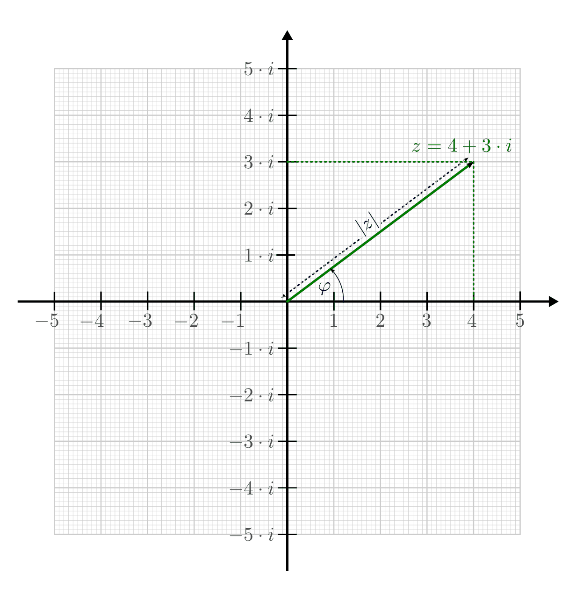

.. index:: 
    single: Komplexe Zahlen
    single: Zahlenbereiche; Komplexe Zahlen
.. _Exkurs Komplexe Zahlen:

Exkurs: Komplexe Zahlen
=======================

Die Menge der komplexen Zahlen :math:`\mathbb{C}` stellt eine zusätzliche
Erweiterung der reellen Zahlen dar. Ein ursprüngliches Ziel dieser Erweiterung
war es, auch die Rechenoperation des Wurzelziehens uneingeschränkt mit allen
Zahlen des zugrunde liegenden Zahlenbereichs ausführbar zu machen, d.h. auch
Wurzeln mit negativen Argumenten zu definieren.

.. index:: Imaginäre Zahlen

Um eine Lösung für eine Wurzel mit negativem Argument angeben zu können, wird
formal eine "imaginäre Einheit" :math:`i` eingeführt, welche die folgende
Gleichung erfüllt:

.. math::
    :label: eqn-imaginäre-einheit
    
    i = \sqrt{-1}

Die Menge :math:`\mathbb{I}` der imaginären Zahlen entspricht der Menge an
Zahlen, die man erhält, wenn man die imaginäre Einheit :math:`i` mit einem
beliebigen (reellen) Vielfachen :math:`b` multipliziert:

.. math::
    
    \mathbb{I} = \lbrace b \cdot i \; | \; b \in \mathbb{R} \text{ und } i =
    \sqrt{-1} \rbrace

Bildet man die Summe aus einer reellen Zahl :math:`a` und einer imaginären
Zahl :math:`b \cdot i`, so erhält man eine komplexe Zahl :math:`z`:

.. math::
    :label: eqn-komplexe-zahl
    
     z = a + b \cdot i

Für die Menge :math:`\mathbb{C}` der komplexen Zahlen gilt entsprechend:

.. math::
    
    \mathbb{C} = \lbrace a + b \cdot i \; | \; a,b \in \mathbb{R} \text{ und } i
    = \sqrt{-i} \rbrace

Jede komplexe Zahl :math:`z` setzt sich somit aus einem "Realteil" :math:`a` und
einem "Imaginärteil" :math:`b \cdot i` zusammen. Die Menge der reellen Zahlen
:math:`\mathbb{R}` stellen dabei eine Teilmenge der komplexen Zahlen
:math:`\mathbb{C}` dar, für die :math:`b=0` gilt.

.. rubric:: Rechnen mit komplexen Zahlen

Die Rechenregeln für reelle Zahlen lassen sich weitgehend auf komplexe Zahlen
übertragen, wenn man :math:`i = \sqrt{-1}` bzw. die dazu äquivalente Beziehung
:math:`i^2 = \sqrt{-1} \cdot \sqrt{-1} = -1` beachtet.

* Addiert bzw. subtrahiert man zwei komplexe Zahlen :math:`z _{\rm{1}}` und
  :math:`z _{\rm{2}}`, so erhält man eine neue komplexe Zahl, deren Real- und
  Imaginärteil gleich der Summe bzw. Differenz der Real- und Imaginärteile von
  :math:`z _{\rm{1}}` und :math:`z _{\rm{2}}` ist:

.. math::
    :label: eqn-addition-komplexer-zahlen
    
    z _{\rm{1}} + z _{\rm{2}} &= ( a _{\rm{1}} +  b _{\rm{1}} \cdot i) + ( a
    _{\rm{2}} + b2 \cdot i) =  (a _{\rm{1}} +  a _{\rm{2}}) + ( b _{\rm{1}} +  b
    _{\rm{2}}) \cdot i \\
    z _{\rm{1}} - z _{\rm{2}} &= ( a _{\rm{1}} +  b _{\rm{1}} \cdot i) - ( a
    _{\rm{2}} + b2 \cdot i) =  (a _{\rm{1}} -  a _{\rm{2}}) + ( b _{\rm{1}} -  b
    _{\rm{2}}) \cdot i \\

* Multipliziert man zwei komplexe Zahlen :math:`z _{\rm{1}}` und :math:`z
  _{\rm{2}}` miteinander, so erhält man eine neue komplexe Zahl, indem man alle
  Komponenten beider Zahlen miteinander multipliziert und hierbei :math:`i^2 =
  -1` setzt. [#KM]_

.. math::
    :label: eqn-multiplikation-komplexer-zahlen
    
    z _{\rm{1}} \cdot z _{\rm{2}} = ( a _{\rm{1}} +  b _{\rm{1}} \cdot i) \cdot
    ( a _{\rm{2}} +  b _{\rm{2}} \cdot i) = ( a _{\rm{1}} \cdot  a _{\rm{2}} -
    b _{\rm{1}} \cdot  b _{\rm{2}}) + (b _{\rm{1}} \cdot  a _{\rm{2}}  + a
    _{\rm{1}} \cdot  b _{\rm{2}}) \cdot i

* Dividiert man eine komplexe Zahl :math:`z _{\rm{1}}` durch eine andere
  komplexe Zahl :math:`z _{\rm{2}}` miteinander, so erhält man eine neue
  komplexe Zahl, indem man den Bruch um die so genannte "komplex konjugierte"
  Zahl :math:`z _{\rm{2}} ^{*} =  a _{\rm{2}} -  b _{\rm{2}} \cdot i` des
  Nenners erweitert: [#KD]_ [#KK]_

.. math::
    :label: eqn-division-komplexer-zahlen
    
    \frac{z _{\rm{1}}}{z _{\rm{2}}} = \frac{ a _{\rm{1}} +  b _{\rm{1}} \cdot
    i}{ a _{\rm{2}} +  b _{\rm{2}} \cdot i} = \frac{(a _{\rm{1}} +  b _{\rm{1}}
    \cdot i) \cdot ( a _{\rm{2}} -  b _{\rm{2}} \cdot i)}{(a _{\rm{2}} +  b
    _{\rm{2}} \cdot i) \cdot ( a _{\rm{2}} -  b _{\rm{2}} \cdot i)} = \frac{( a
    _{\rm{1}} \cdot  a _{\rm{2}} + b _{\rm{1}} \cdot  b _{\rm{2}}) + ( b
    _{\rm{1}} \cdot  a _{\rm{2}} -  a _{\rm{1}} \cdot  b _{\rm{2}} ) \cdot i}{ a
    _{\rm{2}}\,\!^2 +  b _{\rm{2}}\,\!^2}
      
.. rubric:: Gaußsche Zahlenebene und Polarform

Komplexe Zahlen lassen sich zwar nicht auf einer Zahlengeraden, dafür aber als
Punkte einer Zahlenebene (zu Ehren von `Carl Friedrich Gauss
<https://de.wikipedia.org/wiki/Gauss>`_ auch "Gauss'sche Ebene" genannt)
darstellen, die von einer reellen und dazu senkrecht stehenden imaginären
Zahlenachse aufgespannt wird.

    Darstellung der komplexen Zahl :math:`z = 4 + 3 \cdot i` anhand der
    Gauss'schen Zahlenebene.
            
    .. only:: html
    
        :download:`SVG: Gauss'sche Zahlenebene
        <../pics/arithmetik/gausssche-zahlenebene.svg>`

Eine komplexe Zahl lässt sich in der Gauss'schen Ebene entweder anhand ihrer
Koordinaten (Real- und Imaginärteil) oder anhand der Länge :math:`|z|` und
Richtung :math:`\varphi` ihres Zeigers bestimmen. Die Länge des Zeigers, die
vom Koordinatenursprung zum Ort der Zahl führt, ist eine nicht negative reelle
Zahl:

.. math::
    :label: eqn-komplexe-zahl-betrag
    
    | z | = \sqrt{z \cdot z ^{*}} = \sqrt{a^2 + b^2}

Hierbei wird wiederum genutzt, dass das Produkt einer komplexen Zahl :math:`z =
a + b \cdot i` mit ihrer konjugiert komplexen Zahl :math:`z ^{*} = a - b \cdot
i` gleich der reellen Zahl :math:`z \cdot z ^{*} = a^2 + b^2` ist. In der
Gauss'schen Ebene kann die komplex konjugierte Zahl :math:`z ^{*}` durch eine
vertikale Spiegelung von :math:`z` an der reellen Zahlenachse bestimmt werden.

Der Zusammenhang zwischen dem Real- und Imaginärteil von :math:`z`, ihrem Betrag
:math:`|z|` und dem Winkel :math:`\varphi` ihres Zeigers kann mittels der
trigonomischen Größen :math:`\sin{}` und :math:`\cos{}` formuliert werden. Es
gilt:

.. math::
    
    a = | z | \cdot \cos{\varphi} \\
    b = | z | \cdot \sin{\varphi} \\

Jede komplexe Zahl kann somit neben der Koordinatenform auch in einer so
genannten "Polarform", d.h. über die Angabe ihres Betrags :math:`|z|` und
Winkels :math:`\varphi`, in folgender Weise angegeben werden: 

.. math::
    
    z = a + b \cdot i = |z| \cdot \cos{\varphi} + |z| \cdot \sin{\varphi} \cdot
    i 

bzw.

.. math::
    
    z = |z| \cdot (\cos{\varphi} + i \cdot \sin{\varphi})

..  Eulersche Form: 
    e ^{i \cdot \varphi} = \cos{\varphi} + i \cdot \sin{\varphi}
    e ^{-i \cdot \varphi} = \cos{\varphi} - i \cdot \sin{\varphi}

.. raw:: html

    

    
.. only:: html

    .. rubric:: Anmerkungen:

.. [#KM] Explizit kommt Gleichung :eq:`eqn-multiplikation-komplexer-zahlen`
    folgendermaßen zustande:

    .. math::
        
        z _{\rm{1}} \cdot z _{\rm{2}} &= ( a _{\rm{1}} +  b _{\rm{1}} \cdot i)
        \cdot ( a _{\rm{2}} +  b _{\rm{2}} \cdot i) \\ &=  a _{\rm{1}} \cdot  a
        _{\rm{2}} +  a _{\rm{1}} \cdot  b _{\rm{2}} \cdot i +  b _{\rm{1}} \cdot
        a _{\rm{2}} \cdot i +  b _{\rm{1}} \cdot  b _{\rm{2}} \cdot i^2 \\  &= (
        a _{\rm{1}} \cdot  a _{\rm{2}} - b _{\rm{1}} \cdot  b _{\rm{2}}) + ( a
        _{\rm{1}} \cdot  b _{\rm{2}} +  b _{\rm{1}} \cdot  a _{\rm{2}} ) \cdot i
 
    In der letzten Zeile wurde die Beziehung :math:`i^2= -1` genutzt.
    Zusätzlich wurden die bei der Multiplikation entstandenen realen und
    imaginären Anteile sortiert und durch Klammern zusammen gefasst.

.. [#KD] Die Multiplikation einer komplexen Zahl :math:`z = a + b \cdot i` mit
    ihrer komplex konjugierten Zahl :math:`z ^{*} = a - b \cdot i` ergibt die
    (reelle) Zahl :math:`a^2 + b^2`:

    .. math::
        
        (a + b \cdot i) \cdot (a - b \cdot i) = a^2 + a \cdot b \cdot i - b
        \cdot a \cdot i - b^2 \cdot i^2 = a^2 + b^2

    Hierbei wurde wiederum die Beziehung :math:`i^2= -1` genutzt.
    
.. [#KK] Mit Hilfe der Divisionsformel :eq:`eqn-division-komplexer-zahlen` kann
    beispielsweise auch der Kehrbruch einer komplexen Zahl bestimmt werden. Es
    gilt:

    .. math::
    
        \frac{1}{z} = \frac{1}{a + b \cdot i} = \frac{1 \cdot (a - b \cdot
        i)}{(a + b \cdot i) \cdot (a - b \cdot i)} = \frac{a - b \cdot i}{a^2 +
        b^2}

