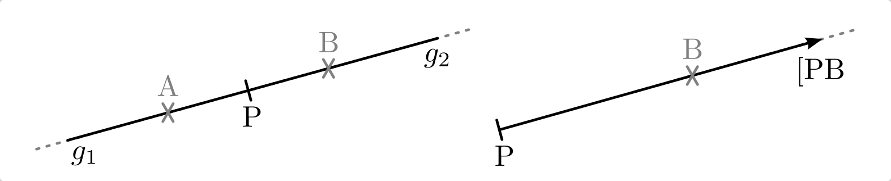
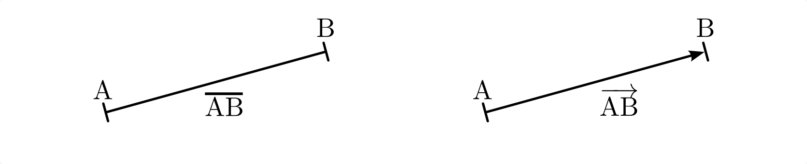
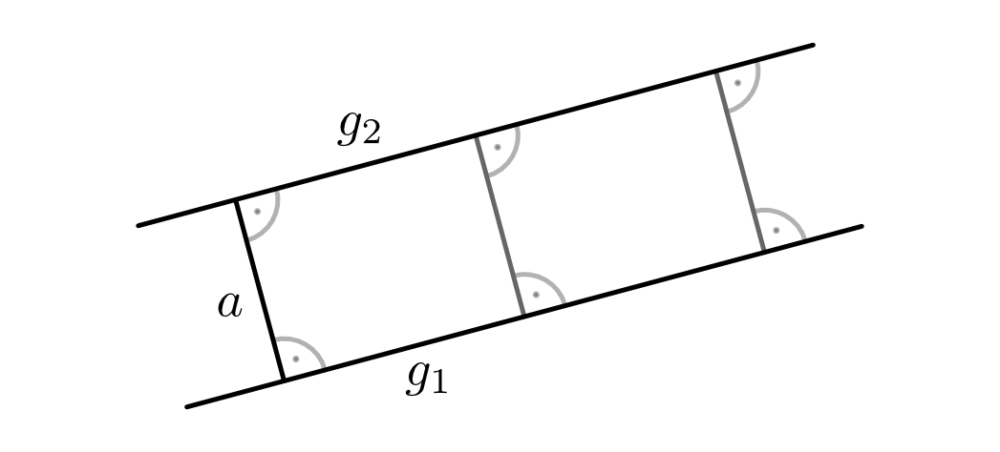
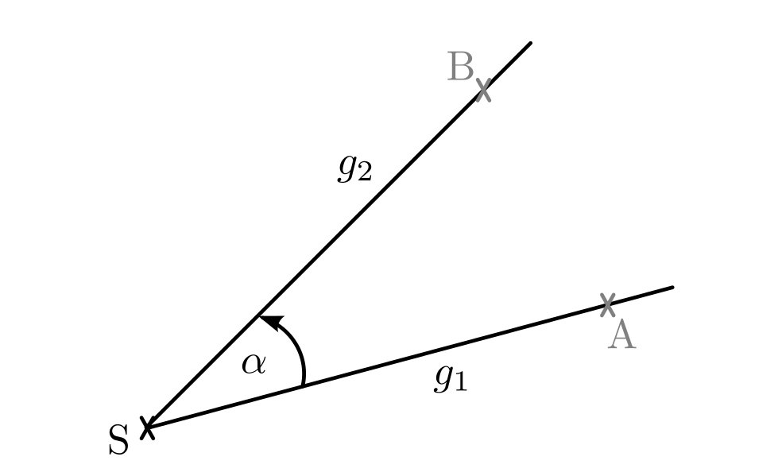
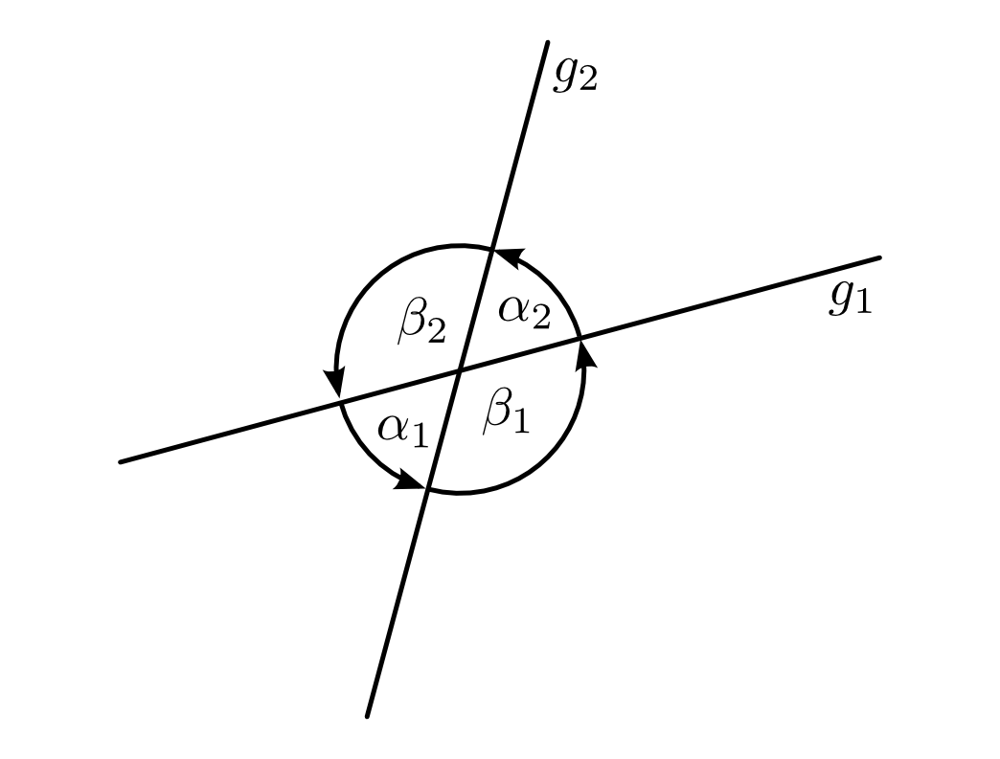
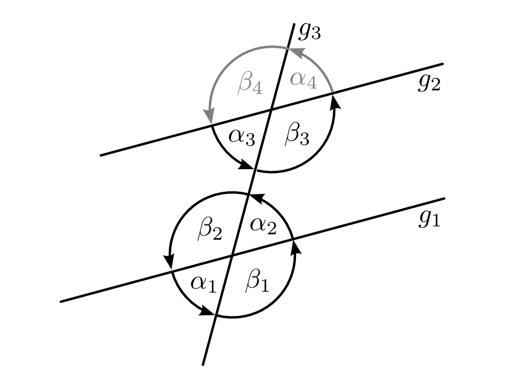
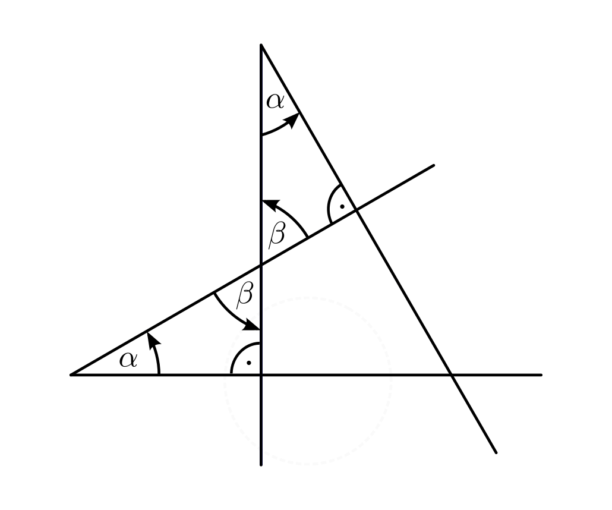

.. _Grundbegriffe-Geometrie:

Grundbegriffe
=============

Einige geometrische Gebilde treten in der Geometrie besonders häufig und in
verschiedenen Zusammenhängen auf. Die wichtigsten dieser Grundelemente und
damit zusammenhängende Begriffe werden im folgenden Abschnitt zusammenfassend
vorgestellt.

.. _Punkt, Gerade, Strecke und Strahl:

Punkt, Gerade, Strecke und Strahl
---------------------------------

.. index:: Punkt, Dimension
.. rubric:: Punkt und Dimension

Das vielleicht grundlegendste Objekt der Geometrie ist der Punkt. Ein Punkt ist
dimensionslos, besitzt also keine räumliche Ausdehnung. Die Lage eines Punktes
im Raum wird für gewöhnlich durch Koordinaten angegeben, beispielsweise
:math:`\mathrm{P} (x\, , \,y)` für einen Punkt im zweidimensionalen Raum oder
:math:`\mathrm{P}(x \, , \, y \, , \, z)` für einen Punkt im dreidimensionalen
Raum. Die Dimension eines Objekts gibt an, wieviele Raumrichtungen zur
Beschreibung seiner geometrischen Eigenschaften berücksichtigt werden müssen.

.. Einheiten..

.. index:: Gerade
.. _Geraden und Halbgerden:

.. rubric:: Geraden und Halbgerden

Eine Gerade :math:`g` entspricht anschaulich einer Bahn, die sich ergibt, wenn
sich ein Punkt ohne Änderung der Richtung unbegrenzt hin- und herbewegt. Eine
Gerade weist stets eine eindeutige Richtung im Raum auf, hat jedoch im
Allgemeinen keinen "Richtungssinn", d.h. sie besitzt keinen klar definierten
Anfang als Startpunkt und kein klar definiertes Ende als Zielpunkt. [#RSG]_
Vielmehr besteht jede Gerade aus einer Menge von unendlich vielen Punkten, die
sich auf der geradlinigen Bahn befinden.

.. figure:: ../pics/geometrie/gerade.png
    :width: 50%
    :align: center
    :name: fig-gerade
    :alt:  fig-gerade

    Richtung und Richtungssinn einer Gerade.
    
    .. only:: html

        :download:`SVG: Gerade
        <../pics/geometrie/gerade.svg>`

Die Richtung einer Gerade wird bereits durch die Angabe zweier auf ihr liegender
Punkte eindeutig festgelegt. Da jede Gerade stets nur entlang einer Raumrichtung
verläuft, ist ihre Dimension gleich eins. 

.. index:: Halbgerade
.. _Halbgerade:

Betrachtet man einen Punkt :math:`\rm{P}`, der auf einer Geraden liegt, so wird
diese durch den Punkt in zwei Halbgeraden unterteilt. Liegt ein weiterer Punkt
:math:`\rm{A}` auf der einen, ein Punkt :math:`\rm{B}` auf der anderen
Halbgerade, so schreibt man für beide Halbgeraden auch kurz :math:`\mathrm{[PA}`
bzw. :math:`\mathrm{[PB}`.

    Darstellung einer Halbgeraden und eines Strahls.
    
    .. only:: html

        :download:`SVG: Halbgerade und Strahl
        <../pics/geometrie/halbgerade-und-strahl.svg>`

.. index:: Strahl
.. _Strahl:

Als Strahl bezeichnet man eine Halbgerade, der ein eindeutiger Richtungssinn
zugewiesen wird.

.. index:: Strecke
.. _Strecke:

Eine Strecke :math:`\overline{\mathrm{AB}}` entspricht der Menge aller Punkte,
die sich zwischen zwei auf Punkten :math:`\rm{A}` und :math:`\rm{B}` einer
Geraden befinden; diese werden ebenfalls zur Punktmenge hinzugenommen. Eine
Strecke entspricht stets dem kürzesten Abstand zwischen beiden Endpunkten.

.. _Pfeil:

Als Pfeil (oder Vektor) :math:`\overrightarrow{\rm{AB}}` bezeichnet man eine
Strecke zwischen zwei Punkten :math:`\rm{A}` und :math:`\rm{B}`, die einen
eindeutigen Richtungssinn aufweist.

    Darstellung einer Strecke und eines Vektors.
    
    .. only:: html

        :download:`SVG: Strecke und Vektor
        <../pics/geometrie/strecke-und-vektor.svg>`

.. index:: Winkel
.. _Parallelität und Winkel:

Parallelität und Winkel
-----------------------

Verlaufen zwei voneinander verschiedene Geraden :math:`g _{\rm{1}}` und :math:`g
_{\rm{2}}` entlang der gleichen Richtung, so heißen sie zueinander parallel.
[#POG]_ Beide Geraden haben an jeder Stelle den gleichen Abstand :math:`a \ne 0`
voneinander und somit keinen gemeinsamen Punkt ("Schnittpunkt").

    Abstand :math:`a` zweier pareller Geraden :math:`g _{\rm{1}}` und :math:`g
    _{\rm{2}}`.
    
    .. only:: html

        :download:`SVG: Abstand paralleler Geraden.
        <../pics/geometrie/abstand-parallele-geraden.svg>`

Der Abstand eines Punktes zu einer Geraden wird stets senkrecht zu dieser
Geraden gemessen; dies entspricht der kürzest möglichen Strecke zwischen diesem
Punkt und einem Punkt auf der Geraden. Der Abstand zweier paralleler Geraden
entspricht dem Abstand irgendeines Punktes der einen Geraden zur anderen
Geraden. 

.. figure:: ../pics/geometrie/abstand-punkt-gerade.png
    :width: 50%
    :align: center
    :name: fig-abstand-punkt-gerade
    :alt:  fig-abstand-punkt-gerade

    Abstand :math:`a` zwischen einem Punkt :math:`\rm{P}` und einer Geraden.
    
    .. only:: html

        :download:`SVG: Abstand Punkt-Gerade
        <../pics/geometrie/abstand-punkt-gerade.svg>`

..  
    Quelle: Simon

.. index:: Gradmaß
.. _Winkel und Gradmaß:

.. rubric:: Winkel und Gradmaß

Gehen zwei Strahlen von einem gemeinsamen Punkt :math:`\rm{S}` ("Scheitel") aus,
so bezeichnet man den Richtungsunterschied zwischen beiden Strahlen als Winkel.
Üblicherweise werden Winkel mit griechischen Kleinbuchstaben symbolisiert.
Liegen auf den zwei Strahlen (auch "Winkelschenkel" genannt) die Punkte
:math:`\rm{A}` und :math:`\rm{B}`, so schreibt man auch :math:`\alpha =
\varangle \rm{ASB}`.

    Winkel zwischen zwei Strahlen.
    
    .. only:: html

        :download:`SVG: Winkel
        <../pics/geometrie/winkel.svg>`

Die Größe eines Winkels wird üblicherweise in Grad angegeben. Ein Grad
entspricht dabei einem :math:`360`-tel einer vollen Umdrehung; wird also ein
Strahl um einen Winkel von :math:`360 °` gedreht, so ist er deckungsgleich mit
dem ursprünglichen Strahl. Je nach Winkelgröße unterscheidet man folgende
Winkelarten:

* Gilt :math:`{\color{white}18}0 < \alpha < \phantom{3}90 °`, so nennt man den Winkel
  "spitz".
* Gilt :math:`{\color{white}1}90 < \alpha < 180 °`, so nennt man den Winkel "stumpf".
* Gilt :math:`180 < \alpha < 360 °`, so nennt man den Winkel "überstumpf".

Gilt für einen Winkel :math:`\alpha = 90 °`, so wird er als "rechter Winkel",
bezeichnet, bei :math:`\alpha = 180 °` wird ein Winkel "gestreckter Winkel"
genannt. Im Fall :math:`\alpha = 360 °`, d.h. einer vollen Umdrehung,
bezeichnet man den Winkel auch als "Vollwinkel".

Für die Angabe von sehr kleinen Winkelgrößen sind auch die Einheiten
"Winkelminute" und "Winkelsekunde" gebräuchlich. Ein Grad entspricht :math:`60`
Winkelminuten, eine Winkelminute wiederum :math:`60` Winkelsekunden. Dabei ist
folgende Schreibweise üblich:

.. math::
    
    1° &= 60' \\ 
    1'\, &= 60'' 

Das Bogenmaß, das ebenfalls häufig für Winkelangaben Verwendung findet, wird im
Abschnitt :ref:`Gradmaß und Bogenmaß <Gradmaß und Bogenmaß>` näher beschrieben.

.. index:: Nebenwinkel
.. _Scheitelwinkel und Nebenwinkel:

.. rubric:: Scheitelwinkel und Nebenwinkel

Schneiden sich zwei Geraden, so ergänzen sich zwei nebeneinander liegende
Winkel jeweils zu :math:`180°`. Für je zwei so genannte "Nebenwinkel"
:math:`\alpha` und :math:`\beta` gilt also:

.. math::
    
    \alpha _{\rm{1}} + \beta _{\rm{1}} = \alpha _{\rm{2}} + \beta _{\rm{2}} =
    180 ° \\
    \alpha _{\rm{1}} + \beta _{\rm{2}} = \alpha _{\rm{2}} + \beta _{\rm{1}} =
    180 °

.. Quelle: Hoffmann

.. index:: Scheitelwinkel

    Schweitelwinkel und Nebenwinkel zweier sich schneidender Geraden :math:`g
    _{\rm{1}}` und :math:`g _{\rm{2}}`.
    
    .. only:: html

        :download:`SVG: Scheitelwinkel und Nebenwinkel
        <../pics/geometrie/winkel-scheitelwinkel-nebenwinkel.svg>`

Die einander gegenüberliegenden Winkel zweier sich schneidender Geraden heißen
"Scheitelwinkel". Scheitelwinkel sind paarweise stets gleich groß, es gilt also
immer:

.. math::
    
    \alpha _{\rm{1}} &= \alpha _{\rm{2}} \\     
    \beta _{\rm{1}}  &= \beta _{\rm{2}}      

.. index:: Stufenwinkel, Wechselwinkel
.. _Stufenwinkel und Wechselwinkel:

.. rubric:: Stufenwinkel und Wechselwinkel

Zeichnet man zu einer von zwei sich schneidenden Geraden eine parallel Gerade,
so liegen am zweiten Schnittpunkt identische Winkelverhältnisse vor wie am
ersten. Die Winkel, die auf der gleichen Seite der die beiden Parallelen
schneidenden Geraden liegen, heißen "Stufenwinkel" (oder kurz: "F"-Winkel), die
einander gegenüber liegenden Winkel "Wechselwinkel" (oder kurz: "Z"-Winkel).

    Stufenwinkel und Wechselwinkel zweier paralleler Geraden :math:`g_{\rm{1}}`
    und :math:`g _{\rm{2}}`, die von einer weiteren Geraden :math:`g _{\rm{3}}`
    geschnitten werden.
    
    .. only:: html

        :download:`SVG: Stufenwinkel und Wechselwinkel
        <../pics/geometrie/winkel-stufenwinkel-wechselwinkel.svg>`

In der Abbildung :ref:`Stufenwinkel und Wechselwinkel
<fig-winkel-stufenwinkel-wechselwinkel>` sind beispielsweise :math:`\beta
_{\rm{1}}` und :math:`\beta _{\rm{3}}` als Stufenwinkel gleich groß, es gilt
also :math:`\beta _{\rm{1}} = \beta _{\rm{3}}`. Ebenso gilt :math:`\alpha
_{\rm{2}} = \alpha _{\rm{3}}`, da es sich bei diesen beiden Winkeln um
Wechselwinkel handelt. [#WSW]_

.. _Zueinander senkrechte Winkel:

.. rubric:: Zueinander senkrechte Winkel

Stehen die Strahlen zweier Winkel senkrecht aufeinander, so sind die beiden
Winkel gleich groß. Der Grund dafür ist, dass die beiden aneinander liegenden
:math:`\beta`-Winkel Scheitelwinkel darstellen, also gleich groß sind. Da die
Summe der Winkel in einem Dreieck stets 180° beträgt und in beiden Dreiecken je
ein Winkel gleich 90° ist, folgt aus der Gleichheit von :math:`\beta` auch die
Gleichheit von :math:`\alpha`.

    Gleichheit von zueinander senkrecht stehenden Winkeln.
    
    .. only:: html

        :download:`SVG: Zueinander senkrechte Winkel
        <../pics/geometrie/winkel-zueinander-senkrechte-winkel.svg>`

Eine naturwissenschaftliche Anwendung dieses Zusammenhangs stellt beispielsweise
das :ref:`Kraftverhältnis an einer schiefen Ebene <gwp:Schiefe Ebene>` dar.

.. Winkelhalbierende?

.. raw:: html

    

    
.. only:: html

    .. rubric:: Anmerkungen:

.. [#RSG] Wird einer Gerade willkürlich ein Richtungssinn zugewiesen, so spricht
    man von einer "orientierten" Geraden.

.. [#POG] Sind zwei orientierte Geraden :math:`g _{\rm{1}}` und :math:`g
    _{\rm{2}}` zueinander parallel, so können sie "gleichsinnig parallel"
    (Symbol: :math:`g _{\rm{1}} \uparrow \uparrow g _{\rm{2}})` oder
    "antiparallel" (Symbol: :math:`g _{\rm{1}} \uparrow \downarrow g _{\rm{2}})`
    zueinander verlaufen.

.. [#WSW] Genau genommen gilt sogar :math:`\alpha _{\rm{1}} = \alpha _{\rm{2}} =
    \alpha _{\rm{3}} = \alpha _{\rm{4}}` sowie :math:`\beta _{\rm{1}} = \beta
    _{\rm{2}} = \beta _{\rm{3}} = \beta _{\rm{4}}`, da es sich jeweils paarweise
    um Stufen- bzw. Wechselwinkel handelt.

