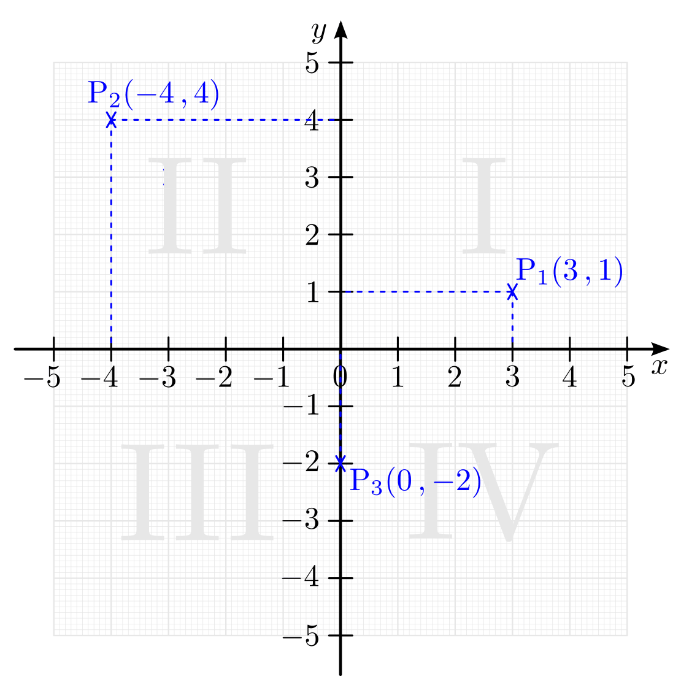
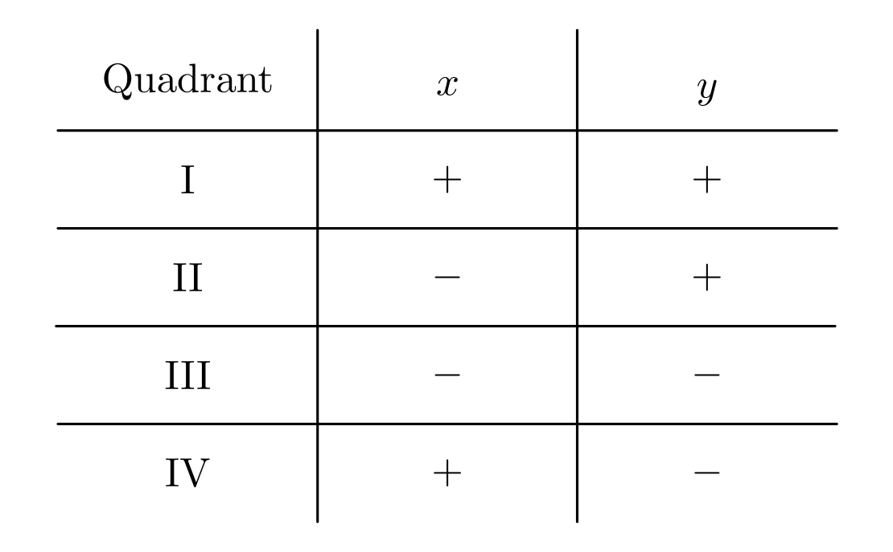
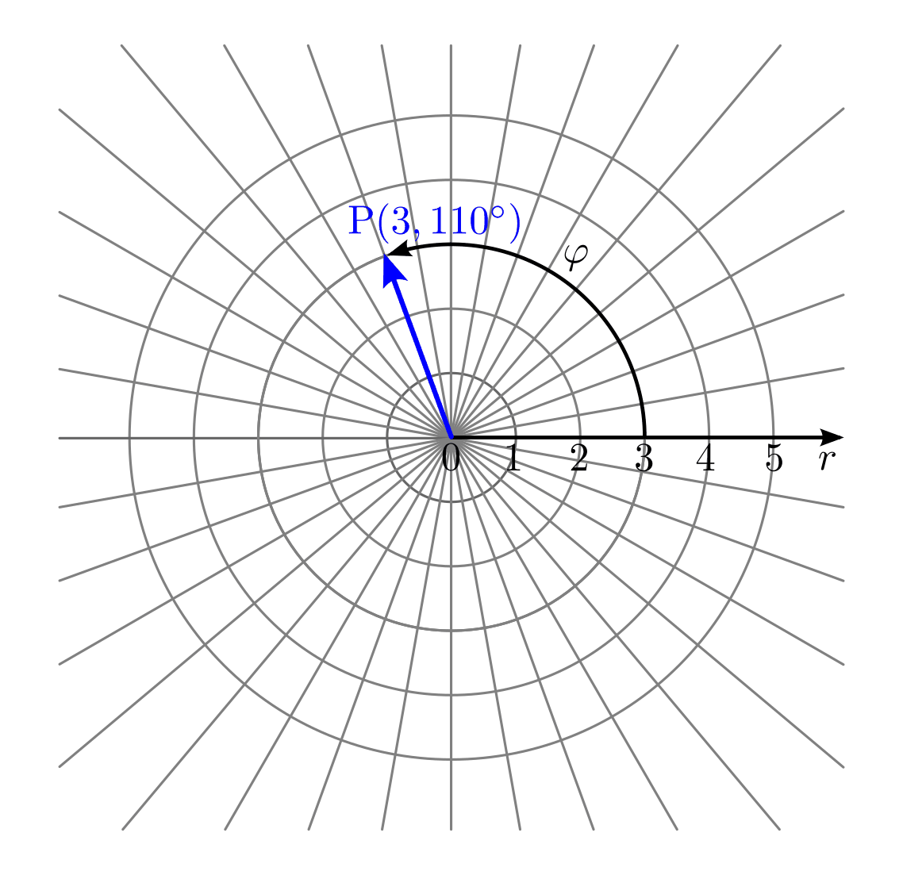

.. index:: Koordinatensystem
.. _Koordinatensysteme:

Koordinatensysteme
------------------

Koordinatensysteme haben die Aufgabe, die Lage eines Punktes in einer Ebene in
übersichtlicher Weise und genau zu beschreiben. Es gibt verschiedene
Möglichkeiten, wie diese Beschreibung erfolgen kann. Die zwei wichtigsten
Koordinatensysteme, das kartesische und das polare, werden in den folgenden
Abschnitten kurz beschrieben.

.. index:: Koordinatensystem; Kartesische Koordinaten
.. _Kartesisches Koordinatensystem:

.. rubric:: Das kartesische Koordinatensystem

In einem so genannten kartesischen Koordinatensystem ist jeder Punkt der
Ebene durch seine Abstände zu den beiden Achsen festgelegt. Diese Abstände
werden durch zwei reelle Zahlen angegeben. Dadurch entspricht jedem Punkt
ein Zahlenpaar :math:`(x,y)` und umgekehrt jedem Zahlenpaar :math:`(x,y)`
ein Punkt :math:`\mathrm{P}`.

    Darstellung von Punkten in einem kartesischen Koordinatensystem.

    .. only:: html

        :download:`SVG: Kartesisches Koordinatensystem.
        <../pics/geometrie/koordinatensystem-kartesisch.svg>`

Die :math:`x`-Achse wird bisweilen auch "Abszisse", die :math:`y`-Achse
"Ordinate" genannt. Auf der :math:`x`-Achse wird nach rechts positiv, nach links
negativ gezählt, auf der :math:`y`-Achse nach oben positiv, nach unten negativ.
Die Ebene des Koordinatensystems wird durch die Achsen in vier Felder
aufgeteilt, die "Quadranten" genannt und mit den römischen Ziffern
:math:`\mathrm{I} ,\, \mathrm{II} ,\, \mathrm{III} \text{ und } \mathrm{IV}`
bezeichnet werden. In welchem Quadranten ein Punkt liegt, kann anhand der
Vorzeichen seiner Koordinaten abgelesen werden.

    Vorzeichen der Koordinaten in den vier Quadranten.

    .. only:: html

        :download:`SVG: Quadrantentabelle.
        <../pics/geometrie/koordinatensystem-kartesisch-quadrantentabelle.svg>`

.. index:: Koordinatensystem; Polare Koordinaten
.. _Polarkoordinaten:
.. _Polare Koordinaten:
.. _Polarkoordinatensystem:

.. rubric:: Das Polarkoordinatensystem

In einem so genannten Polarkoordinatensystem ist jeder Punkt :math:`\mathrm{P}` der
Ebene durch seinen Abstand :math:`r` vom Koordinatenursprung und den Winkel
:math:`\varphi` seiner Verbindungslinie mit dem Koordinatenursprung und der
Horizontalen eindeutig festgelegt.

    Darstellung von Punkten in einem polaren Koordinatensystem.

    .. only:: html

        :download:`SVG: Polares Koordinatensystem.
        <../pics/geometrie/koordinatensystem-polar.svg>`

Die Koordinaten :math:`r` und :math:`\varphi` eines Punktes in einem
Polarkoordinatensystem und die Koordinaten :math:`x` und :math:`y` des selben
Punktes in einem kartesischen System lassen sich unmittelbar ineinander
umrechnen.

Sind :math:`x` und :math:`y` bekannt, so gilt für die Polarkoordinaten :math:`r`
und :math:`\varphi`:

.. math::

    r &= \sqrt{x^2 + y^2} \\[4pt]
    \tan{\varphi} = \frac{y}{x} \quad &\text{bzw.} \quad \varphi =
    \tan^{-1}{\left(\frac{y}{x}\right)}

Sind im umgekehrten Fall :math:`r` und :math:`\varphi` bekannt, so gilt für die
kartesischen Koordinaten :math:`x` und :math:`y`:

.. math::

    x &= r \cdot \cos{\varphi} \\[4pt]
    y &= r \cdot \sin{\varphi} \\

Bei der Umrechnung zwischen kartesischen und polaren Koordinaten werden die
drei :ref:`trigonometrischen Größen <Winkelfunktionen am Einheitskreis>`
Sinus, Cosinus und Tangens verwendet. Beide Koordinatensysteme haben Vor- und
Nachteile, die je nach Art der mathematischen Aufgabenstellung überwiegen. In
diesem Sinne ist kein Koordinatensystem dem anderen überlegen; das kartesische
wird allerdings weitaus häufiger verwendet.

..  Welches Koordinatensystem zur Darstellung von Punkten vorteilhaft ist wird,
..  hängt jeweils von der Art der mathematischen Aufgabe ab.

