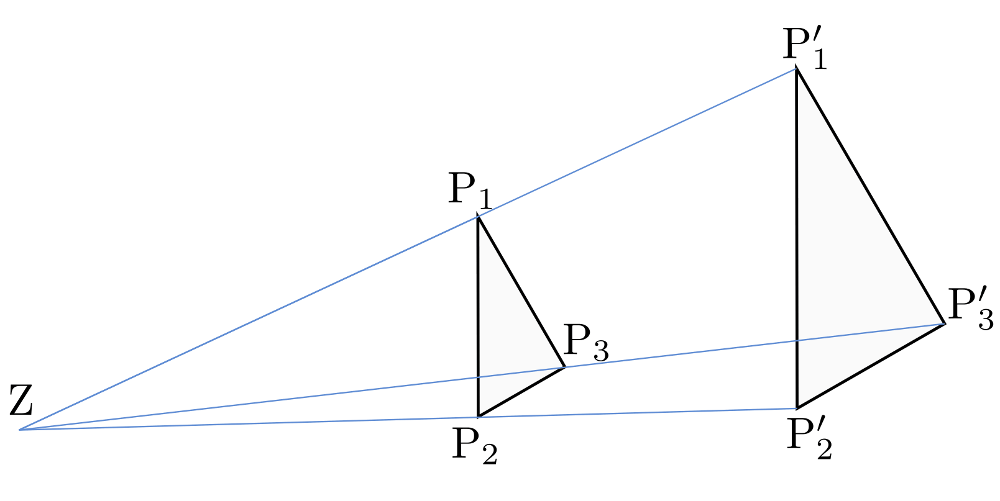
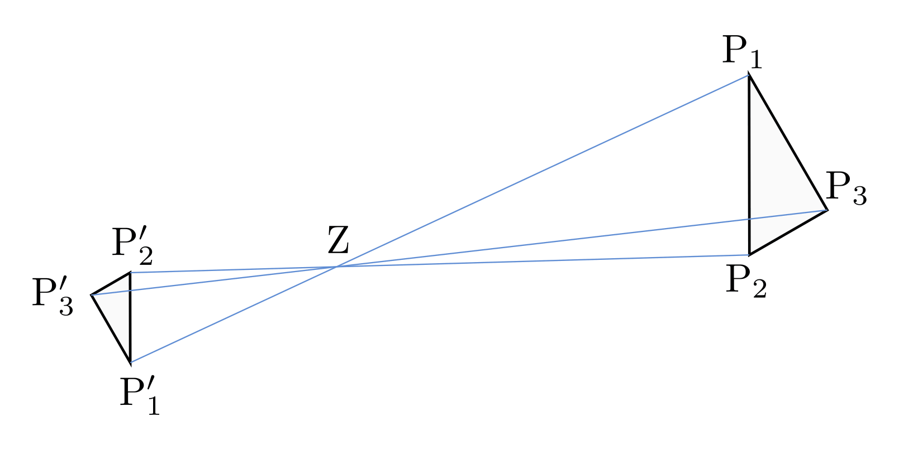
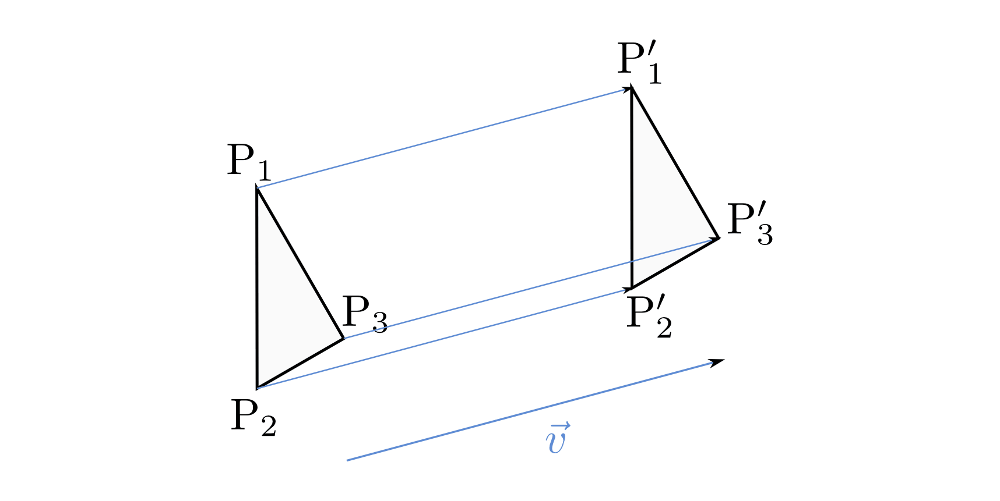
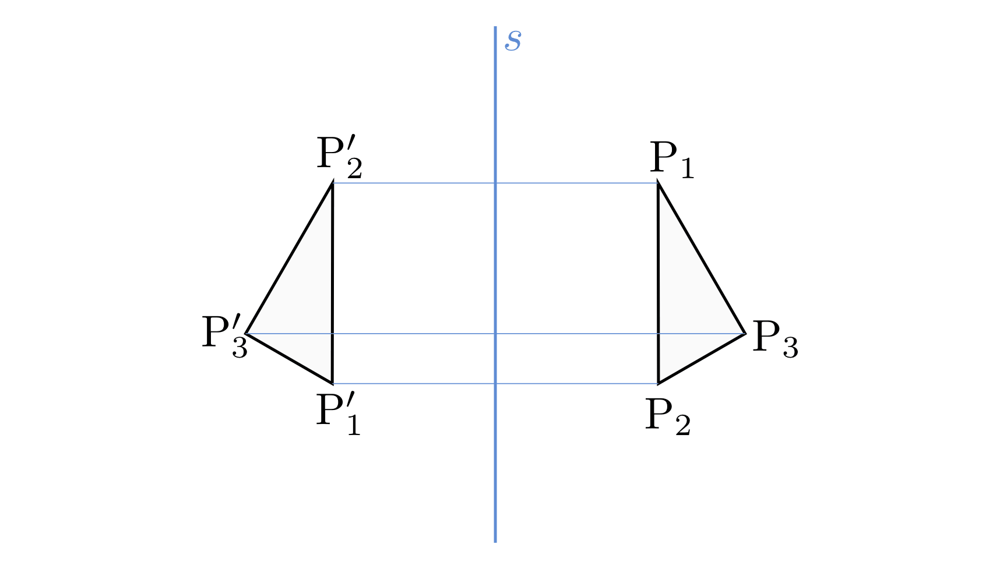
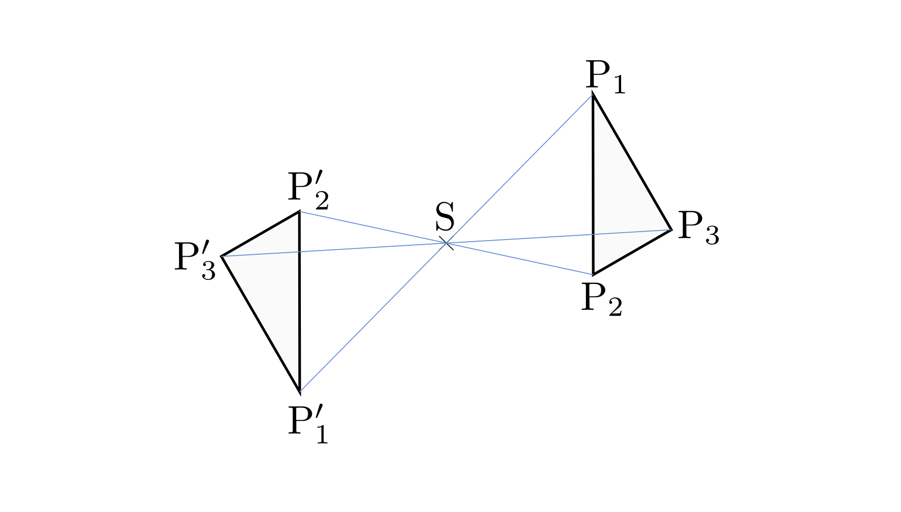
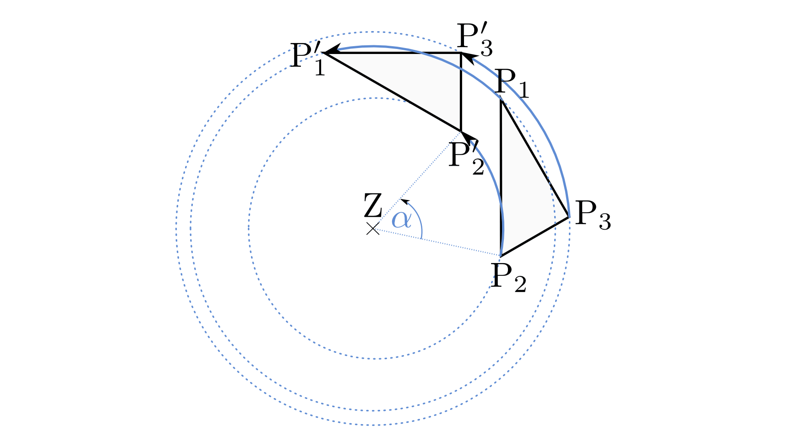

.. index:: Geometrische Abbildung
.. _Abbildungen innerhalb einer Ebene:

Abbildungen innerhalb einer Ebene
=================================

Durch eine geometrische Abbildung entsteht aus einer Original-Figur eine neue
Figur innerhalb der gleichen Ebene (beziehungsweise innerhalb des gleichen
Raumes im dreidimensionalen Fall). Fasst man eine geometrische Form als Menge
ihrer Punkte auf, so ist eine geometrische Abbildung formal mit einer
:ref:`Abbildung von Mengen <Abbildungen>` identisch.

.. index:: Ähnlichkeit, Zentrische Streckung, Maßstab
.. _Maßstab:
.. _Ähnlichkeit:
.. _Ähnlichkeitsabbildungen:

Ähnlichkeitsabbildungen
-----------------------

Bei einer Ähnlichkeitsabbildung bleibt die Form einer geometrischen Figur
erhalten, ihre Größe ändert sich jedoch. Grundlegend ist hierbei die so genannte
"zentrische Streckung".

.. _Zentrische Streckung:

Um eine zentrische Streckung zu beschreiben, geht man von einem bestimmten Punkt
:math:`\mathrm{Z}` als Streckungszentrum aus. Zeichnet man von :math:`\mathrm{Z}` aus
durch jeden Punkt :math:`\mathrm{P}` einer geometrischen Figur :math:`F` einen
Strahl und zeichnet auf diesem in der jeweils :math:`\lambda`-fachen Entfernung einen
neuen Punkt :math:`\mathrm{P'}` ein, so erhält man eine zweite Figur :math:`F'`, die
gegenüber der Original-Figur verschoben und :math:`\lambda`-mal so groß erscheint. [#]_

    Beispiel einer zentrischen Streckung mit :math:`\lambda > 1`.

    .. only:: html

        :download:`SVG: Zentrische Streckung
        <../../pics/geometrie/zentrische-streckung.svg>`

Der Faktor :math:`\lambda` wird Skalierungsfaktor (umgangssprachlich auch
als "Maßstab") genannt. Für :math:`\lambda` ergibt sich folgender
Zusammenhang:

.. math::

    \overline{\mathrm{ZP'}} = \lambda \cdot \overline{\mathrm{ZP}} \quad
    \Leftrightarrow \quad \lambda =
    \frac{\overline{\mathrm{ZP'}}}{\overline{\mathrm{ZP}}}

Ist :math:`\lambda>0`, so bleibt die Orientierungsrichtung der Figur, also der
Umlaufsinn ihrer Punkte, erhalten. Gilt :math:`1 > \lambda > 0`, so wird die Figur
verkleinert ("gestaucht"), im Fall :math:`\lambda > 1` wird sie vergrößert
("gestreckt"). Für :math:`\lambda=1` wird die Figur identisch auf sich selbst
abgebildet.

Ist :math:`\lambda<0`, so liegt die Bildfigur :math:`F'` im Vergleich zur
Originalfigur :math:`F` auf der gegenüber liegenden Seite des Zentrums
:math:`\mathrm{Z}`; ihre Orientierungsrichtung bleibt dabei erhalten. Gilt
:math:`|\lambda| < 1`, so wird auch hierbei die Figur verkleinert beziehungsweise im
Fall :math:`|\lambda|>1` vergrößert.

    Beispiel einer zentrischen Streckung mit :math:`\lambda = -\frac{1}{2}`.

    .. only:: html

        :download:`SVG: Zentrische Streckung (negativer Maßstab)
        <../../pics/geometrie/zentrische-streckung-negativer-massstab.svg>`

Bei jeder Ähnlichkeitsabbildung einer Figur :math:`F` auf eine Figur :math:`F'`
haben einerseits alle entsprechenden Strecken das gleiche Größenverhältnis
:math:`\lambda`, andererseits bleiben die Größen aller Winkel der Figur :math:`F` in
der Figur :math:`F'` erhalten. Beide Kriterien können auch genutzt werden, um
"Ähnlichkeit" als eine :ref:`Relation <Relationen>` zwischen zwei Figuren
aufzufassen: Zwei Figuren :math:`F` und :math:`F'` sind genau dann einander
ähnlich, wenn sie in ihren Winkeln übereinstimmen und die entsprechenden
Strecken im gleichen Maßstab zueinander stehen. In der mathematischen Kurzform
schreibt man hierfür :math:`F \sim F'`.

.. index:: Kongruenz
.. _Kongruenz:
.. _Kongruenzabbildungen:

Kongruenzabbildungen
--------------------

Als Kongruenzabbildung oder "Bewegung" wird jede Abbildung bezeichnet, bei der
die Original-Figur und ihr Abbild in Form und Größe übereinstimmen, sich also
nur die Lage der Figur im Raum verändert. Lässt sich eine geometrische Figur
durch eine beliebige Anzahl von Bewegungen deckungsgleich in eine andere Figur
überführen, so nennt man die beiden Figuren kongruent; kongruente Figuren haben
stets gleich lange Strecken und gleich große Winkel. [#]_

Die vier möglichen Kongruenzabbildungen werden im Folgenden kurz aufgelistet:

.. index:: Translation
.. _Translation:
.. _Translation einer geometrischen Figur:

.. rubric:: Translation einer geometrischen Figur

Um eine Verschiebung ("Translation") zu beschreiben, geht man von einem Vektor
:math:`\vec{v}` aus, für deren Länge :math:`v = |\vec{v}|` gelten soll. Trägt
man an jedem Punkt :math:`\mathrm{P}` einer geometrischen Figur einen ebenso langen,
zu :math:`\vec{v}` parallelen Vektor mit :math:`\mathrm{P}` als Anfangspunkt an, so
ergibt sich zu jedem Original-Punkt ein zugehöriger Bildpunkt :math:`\mathrm{P'}`.

    Beispiel einer Translation.

    .. only:: html

        :download:`SVG: Translation
        <../../pics/geometrie/translation.svg>`

Die sich ergebende Bildfigur :math:`F'` wird durch den Verschiebungsvektor
:math:`\vec{v}` gegenüber der Original-Figur :math:`F` lediglich um die Länge
:math:`v` in Richtung von :math:`\vec{v}` verschoben; die Größe, Form und
Orientierung der Figur bleiben hingegen erhalten.

.. index:: Spiegelung, Spiegelung; an einer Geraden, Achsenspiegelung
.. _Achsenspiegelung:
.. _Spiegelung einer geometrischen Figur an einer Geraden:

.. rubric:: Spiegelung einer geometrischen Figur an einer Geraden

Um eine Spiegelung an einer Geraden zu beschreiben, geht man von einer festen
Geraden :math:`s` als Spiegelachse aus. Durch jeden Punkt :math:`\mathrm{P}` einer Figur
konstruiert man eine Gerade senkrecht zu :math:`s` und bestimmt auf dieser den
Bildpunkt :math:`\mathrm{P'}` so, dass :math:`\mathrm{P}` und :math:`\mathrm{P'}` von
der Spiegelachse :math:`s` den gleichen Abstand haben und auf verschiedenen
Seiten von :math:`s` liegen.

    Beispiel einer Achsenspiegelung.

    .. only:: html

        :download:`SVG: Achsenspiegelung
        <../../pics/geometrie/achsenspiegelung.svg>`

Der Punkt :math:`\mathrm{P'}` wird üblicherweise Spiegelbild von :math:`\mathrm{P}`
bezüglich :math:`s` bezeichnet. Bei einer Achsenspiegelung bleibt die Form und
Größe der Figur erhalten, es ändert sich jedoch der Umlaufsinn ihrer Punkte.

..  Man kann eine Achsenspiegelung ebenso als (räumliche) Drehung der Figur um
..  die Spiegelachse :math:`s` deuten.

.. index:: Spiegelung; an einem Punkt, Punktspiegelung
.. _Punktspiegelung:
.. _Spiegelung einer geometrischen Figur an einem Punkt:

.. rubric:: Spiegelung einer geometrischen Figur an einem Punkt

Um eine Spiegelung an einem Punkt zu beschreiben, geht man von einem festen
Punkt :math:`\mathrm{S}` als Symmetriezentrum aus. Durch jeden Punkt
:math:`\mathrm{P}` einer Figur legt man dann eine Gerade durch
:math:`\mathrm{S}` und bestimmt auf dieser den Bildpunkt :math:`\mathrm{P'}` so,
dass :math:`\mathrm{P}` und :math:`\mathrm{P'}` von :math:`\mathrm{S}` den
gleichen Abstand haben und auf verschiedenen Seiten von :math:`\mathrm{S}`
liegen.

    Beispiel einer Punktspiegelung.

    .. only:: html

        :download:`SVG: Punktspiegelung
        <../../pics/geometrie/punktspiegelung.svg>`

Man kann eine Punktspiegelung ebenso als zentrische Streckung mit einem Maßstab
von :math:`\lambda = -1` oder als Drehung der Ebene um den Punkt :math:`s` mit
einem Drehwinkel von :math:`\alpha=\unit[180]{\degree}` deuten. Bei einer
Punktspiegelung bleibt somit neben der Form und Größe einer Figur auch ihr
Umlaufsinn, also die Reihenfolge ihrer Punkte erhalten.

.. index:: Rotation
.. _Rotation:
.. _Rotation einer geometrischen Figur:

.. rubric:: Rotation einer geometrischen Figur

Um eine Drehung ("Rotation") zu beschreiben, geht man von einem bestimmten Punkt
:math:`\mathrm{Z}` als Drehzentrum und einem festen Winkel :math:`\alpha` aus. Durch
jeden Punkt :math:`\mathrm{P}` einer Figur zeichnet man einen Kreis um den
Mittelpunkt :math:`\mathrm{Z}` und bestimmt auf diesem Kreis den zu :math:`\mathrm{P}`
gehörenden Bildpunkt :math:`\mathrm{P'}` so, dass der Winkel :math:`\varangle
\mathrm{PZP'}` gleich :math:`\alpha` ist.

    Beispiel einer Rotation.

    .. only:: html

        :download:`SVG: Rotation
        <../../pics/geometrie/rotation.svg>`

Erfolgt die Drehung entgegengesetzt zum Uhrzeigersinn, so spricht man von einem
positiven Drehsinn; bei einer Drehung im Uhrzeigersinn spricht man von einem
negativen Drehsinn. Die Form und Größe der Figur sowie die Reihenfolge ihrer
Punkte bleibt bei einer Drehung erhalten.

.. raw:: html

    

.. only:: html

    .. rubric:: Anmerkung:

.. [#] In der analytischen Geometrie werden Skalierungen von geometrischen
    Objekten rechnerisch mittels :ref:`Skalierungsmatrizen
    <Skalierungsmatrizen>` beschrieben.

.. [#] Jede Kongruenzabbildung kann auch als eine Ähnlichkeitsabbildung
    mit einem Maßstab von :math:`\lambda=1` aufgefasst werden. Umgekehrt lässt
    sich jede Ähnlichkeitsabbildung aus einer zentrischen Streckung und/oder
    einer oder mehreren Kongruenzabbildungen zusammensetzen.

