.. index:: Dreieck

.. _Dreiecke:

Dreiecke
========

Allgemeine Eigenschaften
------------------------

Dreiecke bestehen aus den Verbindungsstrecken zwischen drei Punkte
:math:`\rm{A}`, :math:`\rm{B}` und :math:`\rm{C}`, die nicht auf einer
gemeinsamen Geraden liegen. Die den Punkten jeweils gegenüber liegenden Strecken
werden kurz als :math:`a`, :math:`b` und :math:`c`, die Innenwinkel als
:math:`\alpha`, :math:`\beta` und :math:`\gamma` bezeichnet. Die Nebenwinkel
:math:`\alpha ^{*}`, :math:`\beta ^{*}` und :math:`\gamma ^{*}` der Innenwinkel
heißen Außenwinkel.

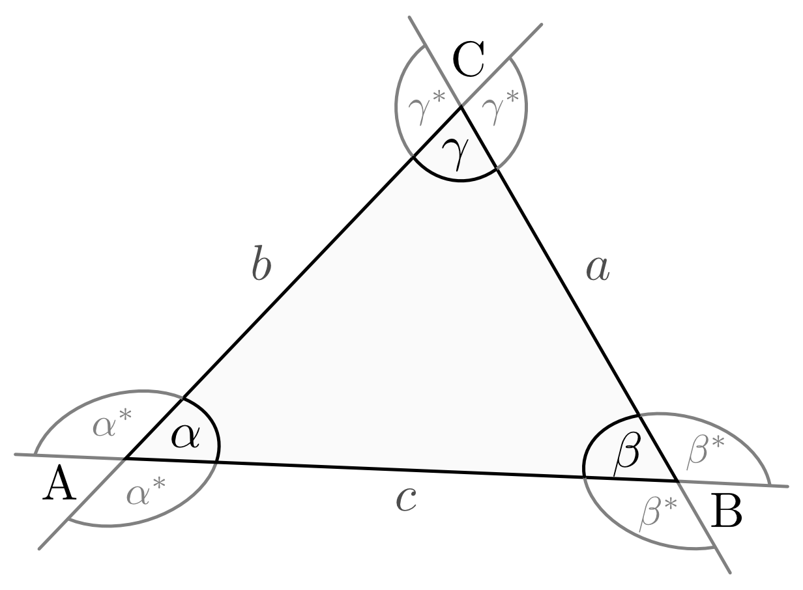

    Aufbau eines allgemeinen Dreiecks.
    
    .. only:: html

        :download:`SVG: Allgemeines Dreieck
        <../../pics/geometrie/dreieck-allgemein.svg>`

Legt man durch :math:`\rm{C}` eine Parallele zu Strecke
:math:`\overline{\rm{AB}}`, so sind :math:`\alpha` und :math:`\alpha'` sowie
:math:`\beta` und :math:`\beta'` als :ref:`Wechselwinkel <Stufenwinkel und
Wechselwinkel>` gleich groß. Gemeinsam mit dem Winkel :math:`\gamma` bilden
:math:`\alpha'` und :math:`\beta'` einen :math:`180 ^{\circ}`-Winkel. Die Summe
der Innenwinkel :math:`\alpha`, :math:`\beta` und :math:`\gamma` ist somit
ebenfalls stets :math:`180 ^{\circ}`:

.. math::
    :label: eqn-innenwinkel
    
    \alpha + \beta + \gamma = 180 ^{\circ}

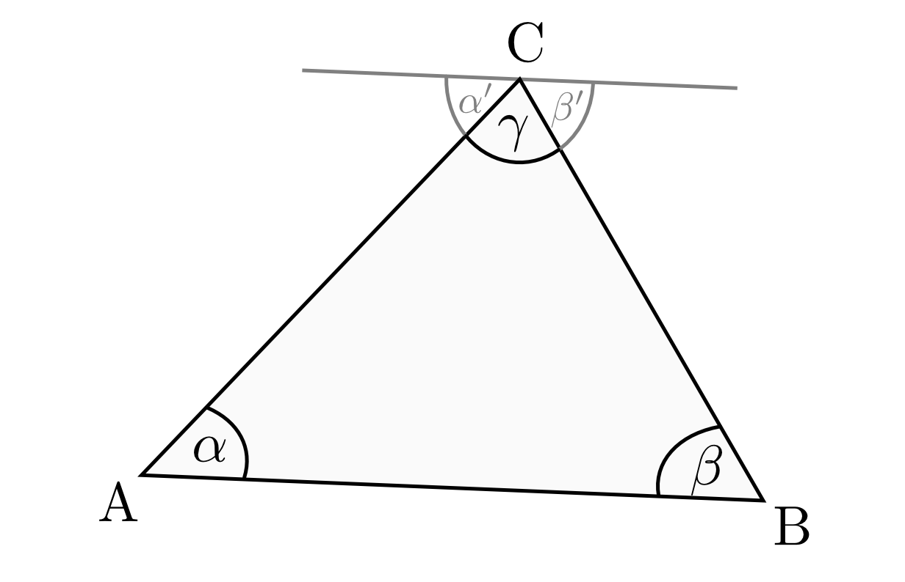

    Die Innenwinkel eines Dreiecks addieren sich zu :math:`180^{\circ}`.
    
    .. only:: html

        :download:`SVG: Innenwinkel eines Dreiecks
        <../../pics/geometrie/dreieck-innenwinkel.svg>`

Die Außenwinkel sind jeweils so groß wie die Summe der beiden nicht anliegenden
Innenwinkel. Dies folgt beispielsweise für den Winkel :math:`\alpha ^{*}` aus
Gleichung :eq:`eqn-innenwinkel` wegen :math:`\alpha ^{*}  = 180 ° - \alpha =
\beta + \gamma`. Insgesamt gilt:

.. math::
    :label: eqn-aussenwinkel
    
    \alpha ^* = \beta + \gamma \\
    \beta ^* = \gamma + \alpha \\
    \gamma ^* = \alpha + \beta \\

Die Summe der Aussenwinkel eines Dreiecks beträgt :math:`360 ^{\circ}`.
Weiterhin gelten in allen Dreiecken drei weitere Beziehungen:

* Die Summe zweier Seitenlängen ist stets größer als die Länge der dritten
  Seite. Es gelten somit folgende Ungleichungen:

  .. math::
      
      a + b > c \quad ; \quad b + c > a \quad ; \quad c + a > b
  
* Die Differenz zweier Seitenlängen ist stets kleiner als die Länge der
  dritten Seite. Somit gilt:

  .. math::
      
      | a - b | < c \!\quad ; \quad\!\! | b - c | < a \!\!\quad ; \quad\! | c - a | < b
  

* | In jedem Dreieck liegen die größeren Seiten den größeren Winkeln gegenüber.
  | Umgekehrt liegen die größeren Winkel den größeren Seiten gegenüber. Es gilt
    somit beispielsweise:

  .. math::
      
      a > b \; \Rightarrow \; \alpha > \beta

.. _Kongruenz und Ähnlichkeit:
  
Kongruenz und Ähnlichkeit 
^^^^^^^^^^^^^^^^^^^^^^^^^

Zwei Dreiecke sind dann :ref:`kongruent <Kongruenzabbildungen>`, wenn sie eine der folgenden Bedingungen
erfüllen:

* Übereinstimmung dreier Seiten (SSS)
* Übereinstimmung zweier Seiten und dem von ihnen eingeschlossenen Winkel (SWS)
* Übereinstimmung zweier Seiten und dem der größeren Seite gegenüber
  liegenden Winkel (SSW)
* Übereinstimmung einer Seite und zweier Winkel -- entweder den beiden
  anliegenden Winkeln oder einem anliegenden und einem gegenüber liegendem
  Winkel (WSW bzw. SWW) 

Die obigen Kongruenzbedingungen werden einerseits für geometrische Beweise
genutzt, können jedoch auch zur eindeutigen Festlegung von Dreiecken verwendet
werden.

Zwei Dreiecke sind dann einander :ref:`ähnlich <Ähnlichkeitsabbildungen>`, wenn sie eine der folgenden
Bedingungen erfüllen:

* Gleiche Längenverhältnisse aller drei Seiten
* Gleiche Längenverhältnisse zweier Seiten und Übereinstimmung des von ihnen
  eingeschlossenen Winkels
* Gleiche Längenverhältnisse zweier Seiten und Übereinstimmung des der
  größeren Seite gegenüber liegenden Winekls
* Übereinstimmung zweier Winkel

Beispielsweise lassen sich die :ref:`Zentrische Streckung <Zentrische
Streckung>` oder die :ref:`Strahlensätze <Strahlensätze>` auf Ähnlichkeiten von
Dreiecken zurückführen.

.. _Besondere Punkte im Dreieck:

Besondere Punkte im Dreieck
^^^^^^^^^^^^^^^^^^^^^^^^^^^

In jedem Dreieck gibt es vier besondere Punkte, die sich durch bestimmte
Transversalen, d.h. durch das Dreieck verlaufende Geraden, konstruieren lassen.
Alle diese Punkte liegen auf einer gemeinsamen Geraden, die auch
"`Euler <https://de.wikipedia.org/wiki/Leonhard_Euler>`_\ sche Gerade"
genannt wird.

.. _Schwerpunkt:

.. rubric:: Der Schwerpunkt

Verbindet man jeden Eckpunkt mit dem Mittelpunkt der gegenüber liegenden
Dreieckseite, so schneiden sich diese "Seitenhalbierenden" in einem gemeinsamen
Punkt :math:`\rm{S}`, der Schwerpunkt des Dreiecks genannt wird.

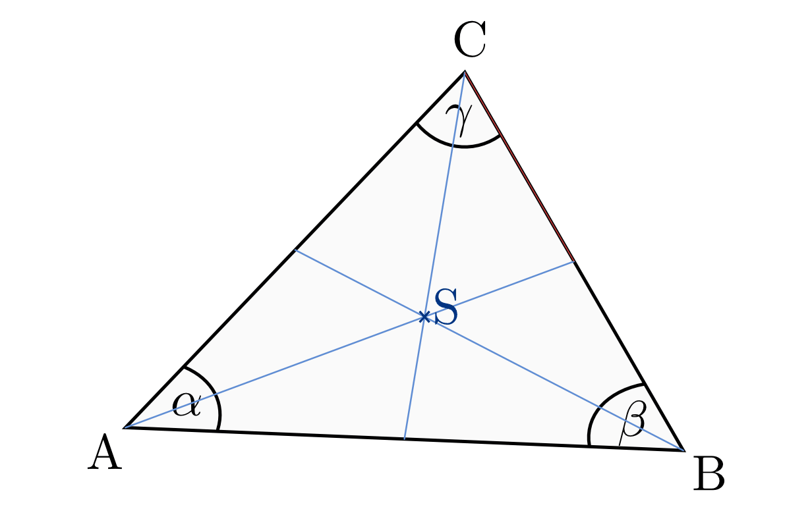

    Schwerpunkt eines Dreiecks.
    
    .. only:: html

        :download:`SVG: Schwerpunkt eines Dreieck
        <../../pics/geometrie/dreieck-schwerpunkt.svg>`

Der Schwerpunkt teilt die Seitenhalbierenden jeweils im Verhältnis :math:`2:1`.
Es bestehen also folgende Proportionen:

.. math::
    
    \frac{\overline{\rm{AS}}}{\overline{\rm{SM_a}}} =
    \frac{\overline{\rm{BS}}}{\overline{\rm{SM_b}}} =
    \frac{\overline{\rm{CS}}}{\overline{\rm{SM_c}}} = \frac{2}{1}

.. _Mittelpunkt:

.. rubric:: Der Mittelpunkt

Zeichnet man auf jeder Dreeicksseite den Mittelpunkt ein und konstruiert
ausgehend von diesem eine senkrechte Gerade zur jeweiligen Dreiecksseite, so
schneiden sich diese "Mittelsenkrechten" in einem gemeinsamen Punkt
:math:`\rm{M}`. Dieser Punkt wird Mittelpunkt des Dreeicks genannt und ist der
Mittelpunkt des so genannten Umkreises, also des Kreises, der durch alle
Eckpunkte des Dreiecks verläuft. 

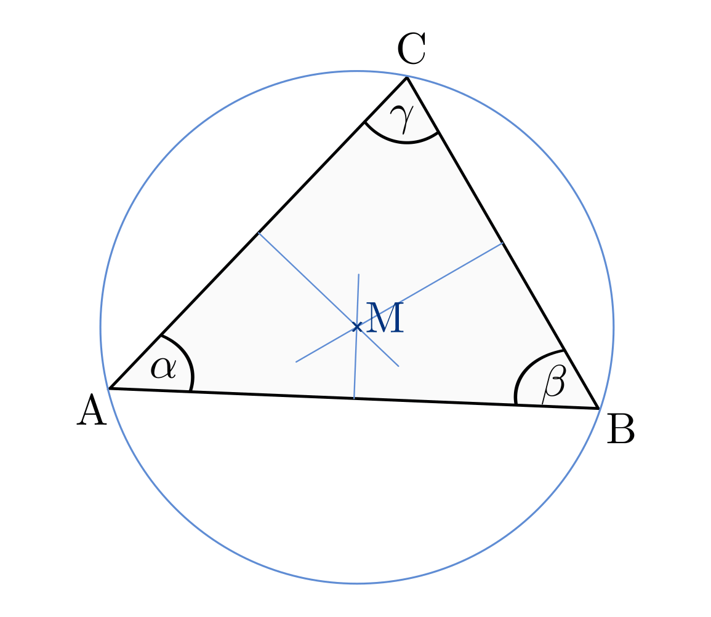

    Mittelpunkt eines Dreiecks.
    
    .. only:: html

        :download:`SVG: Mittelpunkt eines Dreieck
        <../../pics/geometrie/dreieck-mittelpunkt.svg>`

.. _Mittelpunkt des Inkreises:

.. rubric:: Der Mittelpunkt des Inkreises

Konstruiert man zu jedem Innenwinkel eines Dreiecks die Winkelhalbierende, so
schneiden sich diese in einem gemeinsamen Punkt :math:`\rm{W}`. Dieser ist
zugleich der Mittelpunkt des Inkreises, also des Kreises, der alle Strecken des
Dreiecks berührt. 

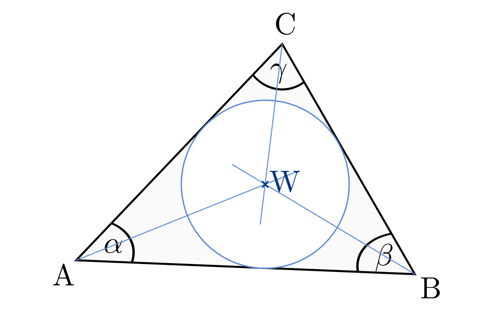

    Inkreis-Mittelpunkt eines Dreiecks.
    
    .. only:: html

        :download:`SVG: Inkreis-Mittelpunkt eines Dreieck
        <../../pics/geometrie/dreieck-mittelpunkt-inkreis.svg>`

.. _Höhenschnittpunkt:

.. rubric:: Der Höhenschnittpunkt

Konstruiert man auf jeder Dreiecksseite eine Senkrechte durch den gegenüber
liegenden Eckpunkt, so schneiden sich die drei Höhen in einem gemeinsamen Punkt
:math:`H`. 

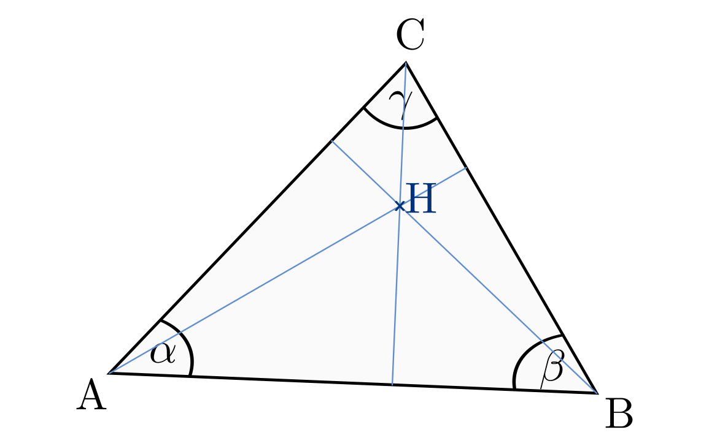

    Höhenschnittpunkt eines Dreiecks.
    
    .. only:: html

        :download:`SVG: Höhenschnittpunkt eines Dreieck
        <../../pics/geometrie/dreieck-hoehenschnittpunkt.svg>`

Besondere Dreiecke
------------------

.. index:: Dreieck; gleichseitig
.. _Gleichseitiges Dreieck:

Gleichseitiges Dreieck
^^^^^^^^^^^^^^^^^^^^^^

In einem gleichseitigen Dreieck besitzen alle Seiten die gleiche Länge. Alle
Winkel betragen :math:`60°`, die besonderen Punkte :math:`\rm{S}`,
:math:`\rm{M}`, :math:`\rm{W}` und :math:`\rm{H}` sind in einem Punkt vereint.

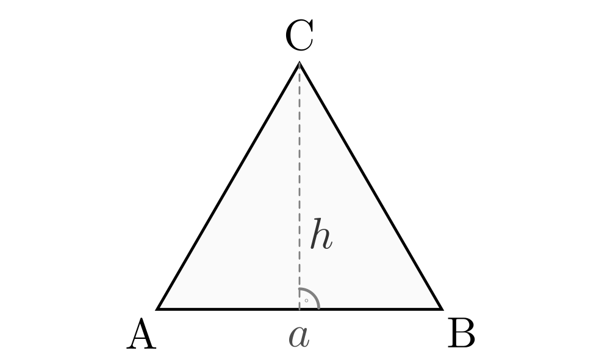

    Grundform eines gleichseitigen Dreiecks.
    
    .. only:: html

        :download:`SVG: Gleichseitiges Dreieck
        <../../pics/geometrie/dreieck-gleichseitig.svg>`

Für die Fläche und den Umfang eines gleichseitigen Dreiecks gilt mit der Höhe :math:`h =
\frac{a}{2} \cdot \sqrt{3}`:

.. math::
    
    \text{Fl\"ache} &= \frac{1}{2} \cdot a \cdot h = \frac{a^4}{4} \cdot \sqrt{3}  \\[10pt]
    \text{Umfang} &= 3 \cdot a

.. index:: Dreieck; gleichschenklig
.. _Gleichschenkliges Dreieck:

Gleichschenkliges Dreieck
^^^^^^^^^^^^^^^^^^^^^^^^^

In einem gleichschenkligen Dreieck besitzen die zwei Seiten :math:`a` und
:math:`b` die gleiche Länge. Die beiden "Basiswinkel" :math:`\alpha` und
:math:`\beta` sind gleich groß. Ist ein Winkel bekannt, lassen sich die übrigen
Winkel unmittelbar mit Hilfe der Beziehung :math:`2 \cdot \alpha + \gamma = 180°`
bestimmen.

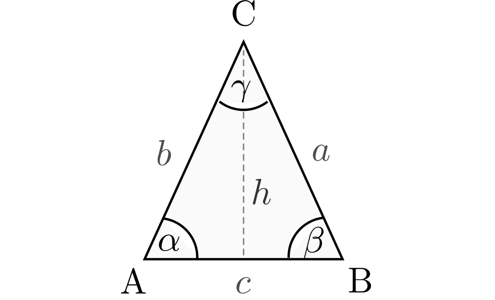

    Grundform eines gleichschenkligen Dreiecks.
    
    .. only:: html

        :download:`SVG: Gleichschenkliges Dreieck
        <../../pics/geometrie/dreieck-gleichschenklig.svg>`

Für die Fläche und den Umfang eines gleichschenkligen Dreiecks gilt mit der Höhe :math:`h`:

.. math::
    
    \text{Fl\"ache} &= \frac{1}{2} \cdot c \cdot h \\[10pt]
    \text{Umfang} &= 2 \cdot a + c

.. index:: Dreieck; rechtwinklig
.. _Rechtwinkliges Dreieck:

Rechtwinkliges Dreieck
^^^^^^^^^^^^^^^^^^^^^^

In einem rechtwinkligen Dreieck ist ein Winkel gleich :math:`90°`, die anderen
beiden Winkel :math:`\alpha` und :math:`\beta` ergeben zusammen :math:`90°`. [#]_

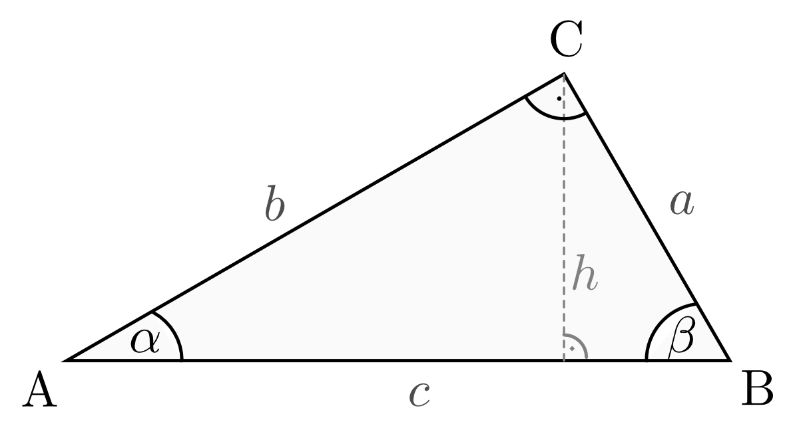

    Grundform eines rechtwinkligen Dreiecks.
    
    .. only:: html

        :download:`SVG: Rechtwinkliges Dreieck
        <../../pics/geometrie/dreieck-rechtwinklig.svg>`

Für die Fläche und den Umfang eines rechtwinkligen Dreiecks gilt: [#]_

.. math::
    
    \text{Fl\"ache} &= \frac{1}{2} \cdot a \cdot b = \frac{1}{2} \cdot c \cdot h \\[10pt]
    \text{Umfang} &= a + b + c

.. index:: Satz von Pythagoras
.. _Satz von Pythagoras:

.. rubric:: Der Satz von Pythagoras

Rechtwinklige Dreiecke weisen eine Besonderheit auf: Quadriert man die Längen
der Dreieckseiten, so entspricht die Quadratzahl :math:`c^2` der längsten
Dreieckseite (der "Hypothenuse") genau der Summe der Quadratzahlen :math:`a^2`
und :math:`b^2` der kürzeren Dreieckseiten (der "Katheten"). 

.. math::
    :label: eqn-pythagoras
    
    a^2 + b^2 = c^2

Diese als "Satz des `Pythagoras <http://de.wikipedia.org/wiki/Pythagoras>`_"
bekannt gewordene Gesetzmäßigkeit lässt sich graphisch dadurch
veranschaulichen, in dem man entlang der Hypothenuse :math:`c` und den beiden
Katheten :math:`a` und :math:`b` Quadrate mit den entsprechenden Seitenlängen
zeichnet und die Flächeninhalte miteinander vergleicht: Die Flächen der beiden
kleineren Quadrate :math:`a^2` und :math:`b^2` sind mit dem großen Quadrat
:math:`c^2` flächengleich.

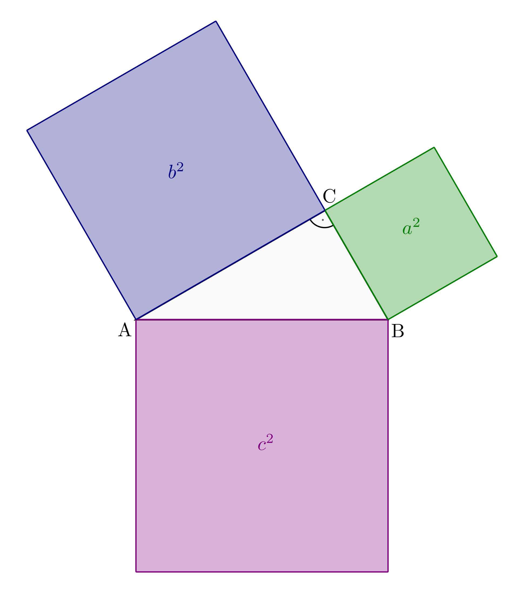

    Veranschaulichung des Satz von Pythagoras für rechtwinklige Dreiecke.
    
    .. only:: html

        :download:`SVG: Der Satz von Pythagoras
        <../../pics/geometrie/dreieck-rechtwinklig-pythagoras.svg>`

Der Satz des Pythagoras erweist sich in der Praxis als nützlich, um
zwei Bretter, Stangen o.ä. mit bekannten Längen :math:`a` und :math:`b`
rechtwinklig zueinander anzuordnen. Löst man Gleichung :eq:`eqn-pythagoras`
nach der Länge der Verbindungslinie :math:`c` auf, so ergibt sich

.. math::
    
    a^2 + b^2 = c^2 \quad \Longleftrightarrow \quad c = \sqrt{a^2 + b^2}

Liegen die Eckpunkte :math:`\rm{A}` und :math:`\rm{B}` exakt um
:math:`c=\sqrt{a^2 + b^2}` voneinander entfernt, so beträgt der Winkel zwischen
:math:`a` und :math:`b` genau :math:`90°`.

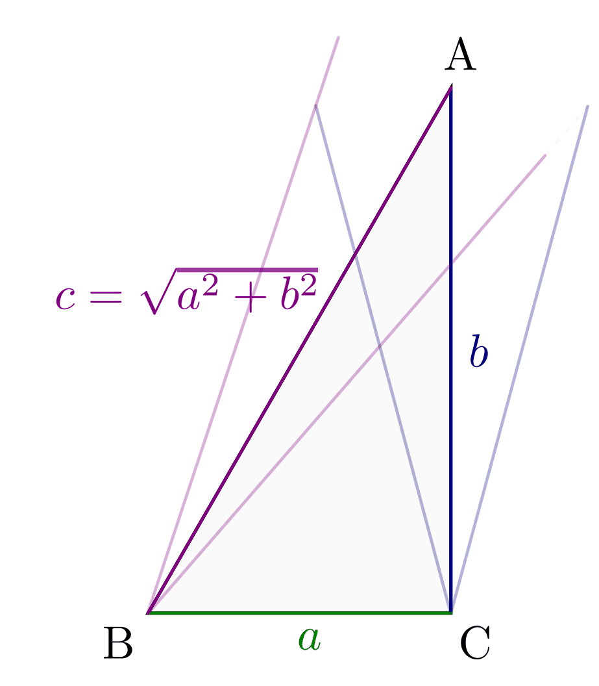

    Der Satz von Pythagoras als Konstruktionshilfe für rechte Winkel.
    
    .. only:: html

        :download:`SVG: Der Satz von Pythagoras (Konstruktionshilfe)
        <../../pics/geometrie/dreieck-rechtwinklig-pythagoras-konstruktionshilfe.svg>`

.. _Höhen- und Kathetensatz:

.. rubric:: Höhen- und Kathetensatz

Im rechteckigen Viereck gelten darüber hinaus zwei weitere Beziehungen:

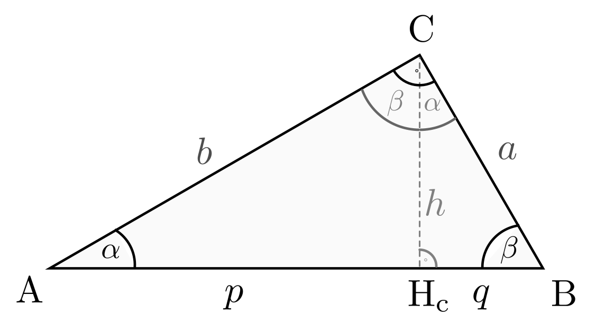

    Der Katheten- und Höhensatz für rechtwinklige Dreiecke.

    .. only:: html

        :download:`SVG: Höhen- und Kathetensatz
        <../../pics/geometrie/dreieck-rechtwinklig-hoehensatz-kathetensatz.svg>`

* Höhensatz:
    Das Produkt der beiden Hypothenusenteile :math:`p` und :math:`q` , die
    rechts und links der Höhe :math:`h` liegen, ist gleich dem Quadrat der
    Höhe:

    .. math::
        
        h^2 = p \cdot q

* Kathetensatz:
  Das Produkt einer Kathete ist gleich dem Produkt aus der Hypothenuse :math:`c`
  und dem anliegenden Hypothenusenanteil: [#]_

    .. math::
    
        a^2 &= c \cdot q \\[10pt]
        b^2 &= c \cdot p

Diese beiden Gesetzmäßigkeiten wurden bereits von `Euklid
<https://de.wikipedia.org/wiki/Euklid>`_ entdeckt. Sie beruhen darauf, dass die
Dreieck :math:`\rm{ABC}` und die beiden durch die Höhe :math:`h` entstehenden
Dreiecke :math:`\rm{AH_cC}` und :math:`\rm{H_cBC}` zueinander ähnlich sind: Alle
enthalten einen rechten Winkel und haben je eine Dreieckseite gemeinsam, zudem
haben alle Dreiecke wegen Gleichung :eq:`eqn-innenwinkel` den Winkel
:math:`\alpha` gemeinsam. 

Aufgrund der Ähnlichkeit sind die Verhältnisse der Seitenlängen gleich, es gilt
beispielsweise für die Dreiecke :math:`\rm{H_cCB}` und :math:`\rm{AH_cC}` das
Längenverhältnis :math:`\frac{p}{h} = \frac{h}{q}`, das sich auch als :math:`h^2
= p \cdot q` schreiben lässt und somit dem Höhensatz entspricht. Ebenso folgen
die beiden Kathetensätze aus den Längenverhältnissen :math:`\frac{c}{a} =
\frac{a}{q}` der Dreiecke :math:`\rm{ABC}` und :math:`\rm{H_cBC}` sowie
:math:`\frac{c}{b} = \frac{b}{p}` der Dreiecke :math:`\rm{ABC}` und
:math:`\rm{AH_cC}`.

.. raw:: html

    

.. only:: html

    .. rubric:: Anmerkungen:

.. [#]  Gilt :math:`\alpha = \beta = 45°`, so spricht man von einem
    gleichschenklig-rechtwinkligen Dreieck.

.. [#]  Da die Seiten :math:`a` und :math:`b` senkrecht aufeinander stehen,
    stellen sie gegenseitig Basislinie und Höhe dar.

.. [#] Der Kathetensatz von Euklid beinhaltet auch den Satz von Pythagoras.
    Addiert man nämlich die beiden Gleichungen :math:`a^2 = c \cdot q` und
    :math:`b^2 = c \cdot p`, so erhält man:

    .. math::
        
        a^2 + b^2 = c \cdot q + c \cdot p = c \cdot (p + q) = c \cdot c = c^2
    

