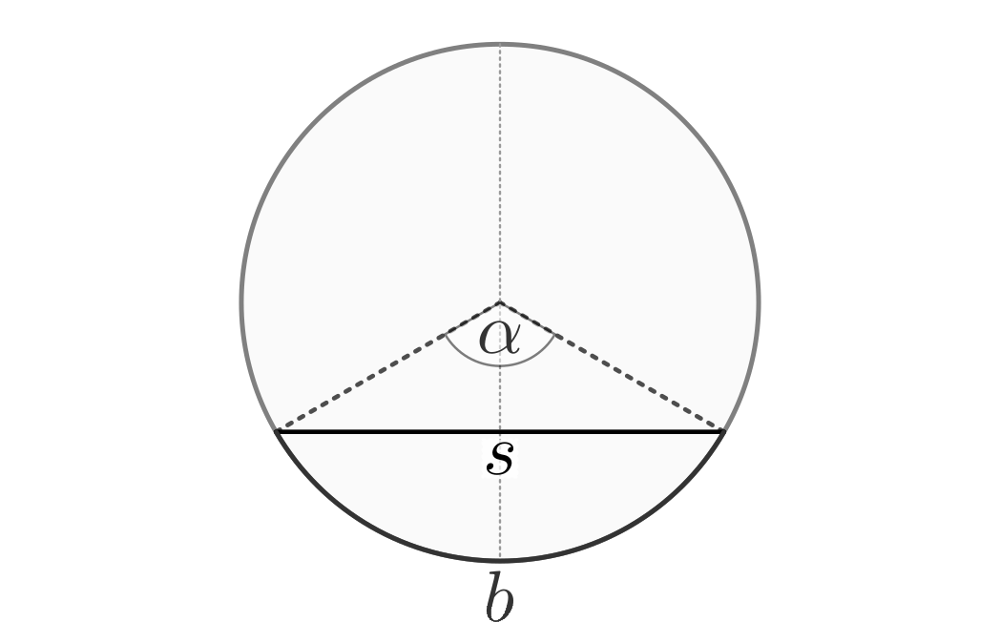
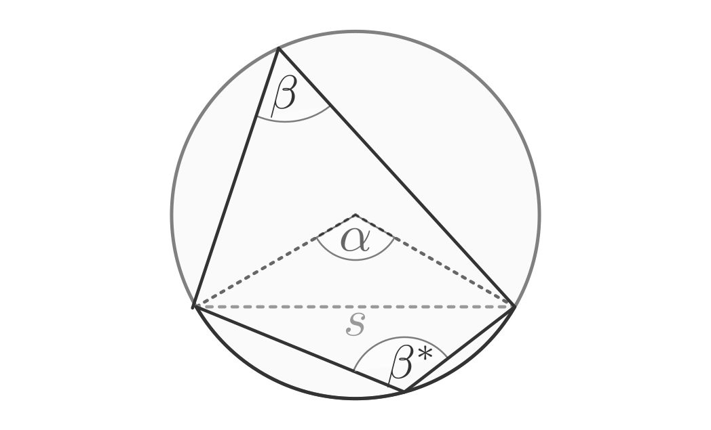
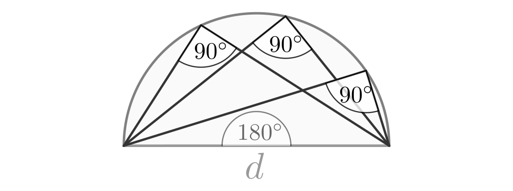

.. _Kreis und Ellipse:

Kreis und Ellipse
=================

.. index:: Kreis
.. _Kreis:

Der Kreis
---------

Jeder Kreis besitzt als Besonderheit, dass alle Punkte auf der Kreislinie gleich
weit vom Mittelpunkt :math:`M` entfernt liegen.

.. figure:: ../../pics/geometrie/kreis.png
    :name: fig-kreis
    :alt:  fig-kreis
    :align: center
    :width: 40%

    Grundform eines Kreises.

    .. only:: html

        :download:`SVG: Kreis
        <../../pics/geometrie/kreis.svg>`

Für den Umfang und die Fläche eines Kreises mit Radius :math:`r` gilt:

.. math::
    :label: eqn-kreis

    \text{Umfang} &= 2 \cdot \pi \cdot r \\[4pt]
    \text{Fl\"ache} &= \pi \cdot r^2

Dabei wird :math:`\pi \approx 3,14159265...` als "Kreiszahl" bezeichnet.

.. index:: Kreisbogen
.. _Kreisbogen:

Der Kreisbogen
--------------

Wird anstelle eines ganzen Kreises nur ein Teil der Kreislinie gezeichnet, so
bezeichnet man den entsprechenden Kreisteil als Kreisbogen.

.. figure:: ../../pics/geometrie/kreisbogen.png
    :name: fig-kreisbogen
    :alt:  fig-kreisbogen
    :align: center
    :width: 40%

    Der Kreisesbogen als Teil des Kreisumfangs.

    .. only:: html

        :download:`SVG: Kreisbogen
        <../../pics/geometrie/kreisbogen.svg>`

.. index:: Bogenlänge

Die Länge eines Kreisbogens hängt vom Umfang des entsprechenden Kreises ab und
davon, welchen Anteil des gesamten Kreises der Kreisbogen ausmacht. Dieser
Anteil wird durch den Mittelpunktswinkel :math:`\alpha` beschrieben, wobei
:math:`\alpha = 360°` einer vollen Umdrehung entspricht. Gilt :math:`\alpha <
360°`, so steht die Kreisbogenlänge :math:`s` im gleichen Verhältnis zum Umfang
:math:`2 \cdot \pi \cdot r` des ganzen Kreises wie :math:`\alpha` zu
:math:`360°`:

.. math::

    \frac{s}{2 \cdot \pi \cdot r} = \frac{\alpha }{360 °}

Nach dieser Gleichung, aufgelöst nach :math:`s`, ergibt sich für die Länge
des Kreisbogens:

.. math::
    :label: eqn-kreisbogen

    s = \frac{\alpha }{360°} \cdot 2 \cdot \pi \cdot r

.. index:: Kreis; Gradmaß und Bogenmaß, Radiant
.. _Gradmaß und Bogenmaß:
.. _Bogenmaß:
.. _Gradmaß:
.. _Radiant:

Gradmaß und Bogenmaß
--------------------

Der Mittelpunktswinkel :math:`\alpha` eines Kreisbogens wird gewöhnlich im
Gradmaß angegeben. :math:`360°` entsprechen dabei dem vollen Kreisumfang.
Betrachtet man einen Einheitskreis (Radius :math:`r = 1`), so hat in diesem Fall
der Kreisumfang beziehungsweise ein geschlossener Kreisbogen eine Länge von
:math:`s = 2 \cdot \pi`. Damit kann der Mittelpunktswinkel :math:`\alpha` auch
durch die Länge :math:`s` des Kreisbogens angegeben werden, wobei :math:`2 \cdot
\pi` dem vollen Kreisumfang entspricht.

.. figure:: ../../pics/geometrie/gradmass-und-bogenmass.png
    :name: fig-gradmaß-und-bogenmaß
    :alt:  fig-gradmaß-und-bogenmaß
    :align: center
    :width: 55%

    Gradmaß und Bogenmaß an einem Einheitskreis :math:`(r = 1)`.

    .. only:: html

        :download:`SVG: Gradmaß und Bogenmaß
        <../../pics/geometrie/gradmass-und-bogenmass.svg>`

Für einen Einheitskreis kann folgende "Umrechnung" zwischen dem Gradmaß und
dem Bogenmaß verwendet werden:

.. math::

    360° \stackrel{\wedge}= 2 \cdot \pi

Um einen Winkel vom Gradmaß ins Bogenmaß umzurechnen, wird dieser durch
:math:`360°` geteilt und mit :math:`2 \cdot \pi` multipliziert. Im umgekehrten
Fall lässt sich ein Winkel vom Bogenmaß ins Gradmaß umrechnen, indem er durch
:math:`2 \cdot \pi` geteilt und mit :math:`360°` multipliziert wird. [#GB1]_

Die Grundeinheit :math:`\frac{1}{2 \cdot \pi }` des Bogenmaßes wird auch als
"Radiant" :math:`(\unit[1]{rad})` bezeichnet. Ein Radiant entspricht ungefähr
einem Winkelmaß von :math:`57,3 \degree`.

.. _Kreissektor:

Der Kreissektor
---------------

Verbindet man einen Kreisbogen mit dem Mittelpunkt, so ergibt sich eine Fläche
in Form eines Tortenstücks. Mathematisch wird diese Fläche als Kreissektor
bezeichnet.

.. figure:: ../../pics/geometrie/kreissektor.png
    :name: fig-kreissektor
    :alt:  fig-kreissektor
    :align: center
    :width: 40%

    Der Kreissektor als Teil der Kreisfläche.

    .. only:: html

        :download:`SVG: Kreissektor
        <../../pics/geometrie/kreissektor.svg>`

Der Flächeninhalt eines Kreissektors entspricht -- analog zum Kreisbogen -- dem
:math:`\alpha / 360°`-sten Anteil der Gesamt-Kreisfläche :math:`\pi \cdot r^2`:

.. math::

    \text{Fl\"ache des Kreissektors} &= \frac{\alpha }{\unit[360]{\degree}}
    \cdot \pi \cdot r^2

.. _Sehnen und Tangenten:

Sehnen und Tangenten
--------------------

Als Kreissehne bezeichnet man eine Strecke, die zwischen zwei auf einem Kreis
liegenden Punkten verläuft. Jede Kreissehne (mit Ausnahme des Durchmessers)
unterteilt den Kreis in zwei verschieden große Kreisbögen; den kleineren von
beiden nennt man den zur Sehne gehörenden Kreisbogen. Der Winkel zwischen
dem Mittelpunkt und den beiden Endpunkten einer Sehne heißt Zentriwinkel.

    Kreissehne, Kreisbogen und Zentriwinkel.

    .. only:: html

        :download:`SVG: Kreissehne
        <../../pics/geometrie/kreissehne.svg>`

Kreissehnen bringen folgende Eigenschaften mit sich:

* Die durch den Mittelpunkt des Kreises und den Mittelpunkt der Sehne
  verlaufende Gerade halbiert die beiden Kreisbögen und den Zentriwinkel; sie
  ist Symmetrieachse des Dreiecks, das aus den Endpunkten der Sehne und dem
  Kreismittelpunkt gebildet wird.

* Sind zwei Sehnen gleich lang, so sind aufgrund der Punktsymmetrie des Kreises
  auch die zugehörigen Kreisbögen, Zentriwinkel und Kreissektoren gleich groß.

  Sind zwei Sehnen unterschiedlich lang, so gehört zur größeren Sehne der
  größere Kreisbogen sowie der größere Zentriwinkel.

Verschiebt man eine Sekante parallel, bis sie den Kreis nur noch in einem
einzigen Punkt berührt, so spricht man von einer Tangente. Jede Tangente steht
senkrecht auf der zum Berührpunkt gehörenden Radius-Linie.

.. index:: Kreiswinkel, Zentriwinkel, Peripheriewinkel
.. _Kreiswinkel:

Kreiswinkel
-----------

Jeder Sehne beziehungsweise jedem Kreisbogen kann eindeutig ein Zentriwinkel
zugeordnet werden. Verbindet man die Endpunkte der Sehne mit einem beliebigen
Punkt, der auf dem "entfernten" (großen) Kreisbogen liegt, so erhält man so
genannte "Peripherie-Winkel". Diese Peripherie-Winkel eines Kreisbogens sind
allesamt gleich groß; betraglich sind sie halb so groß wie der zum Kreisbogen
gehörende Zentriwinkel:

.. math::

    \alpha = 2 \cdot \beta

    Zentriwinkel und Peripheriewinkel

    .. only:: html

        :download:`SVG: Kreiswinkel
        <../../pics/geometrie/kreiswinkel.svg>`

Gehören zwei Peripheriewinkel eines Kreises zur selben Sehne, aber zu
verschiedenen Kreisbögen, so beträgt die Summe beider Winkel :math:`\beta +
\beta^{*} = \unit[180]{\degree}`. Jede Viereck, das auf diese Weise gebildet
wird (dessen vier Ecken also auf einem gemeinsamen Umkreis liegen) nennt man
"Sehnenviereck"; in einem solchen beträgt die Summe der jeweils gegenüber
liegenden Winkel je :math:`\unit[180]{\degree}`

.. index:: Satz von Thales, Thaleskreis
.. _Satz des Thales:

.. rubric:: Der Satz des Thales

Beträgt der Zentriwinkel eines Kreisbogens :math:`\unit[180]{\degree}` (was bei
jedem Halbkreis der Fall ist), so haben sämtliche Peripheriewinkel des einen
Betrag von :math:`\unit[90]{\degree}`; sie sind also rechte Winkel.

    Konstruktion von rechten Winkel mittels des Satzes von Thales.

    .. only:: html

        :download:`SVG: Thaleskreis
        <../../pics/geometrie/thaleskreis.svg>`

.. raw:: html

    

.. only:: html

    .. rubric:: Anmerkungen:

.. [#GB1] Gilt für den Radius eines Kreisbogens :math:`r \ne 1`, so muss bei der
    Umrechnung des Mittelpunktswinkels :math:`\alpha` vom Grad- ins Bogenmaß die
    Länge des Kreisbogens :math:`s` mit dem Radius :math:`r` multipliziert
    werden. Umgekehrt ist bei der Umrechnung des Mittelpunktswinkels vom
    Bogenmaß ins Gradmaß die Kreisbogenlänge :math:`s` durch den Radius
    :math:`r` zu dividieren.

