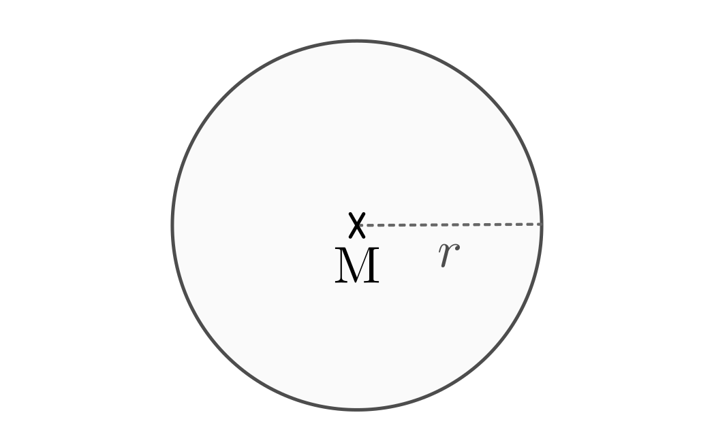
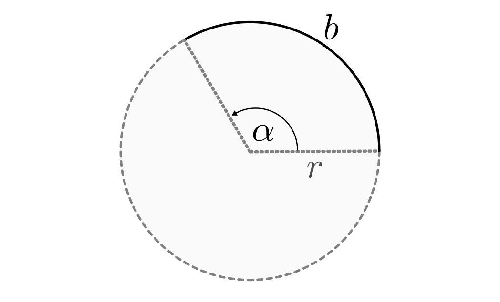
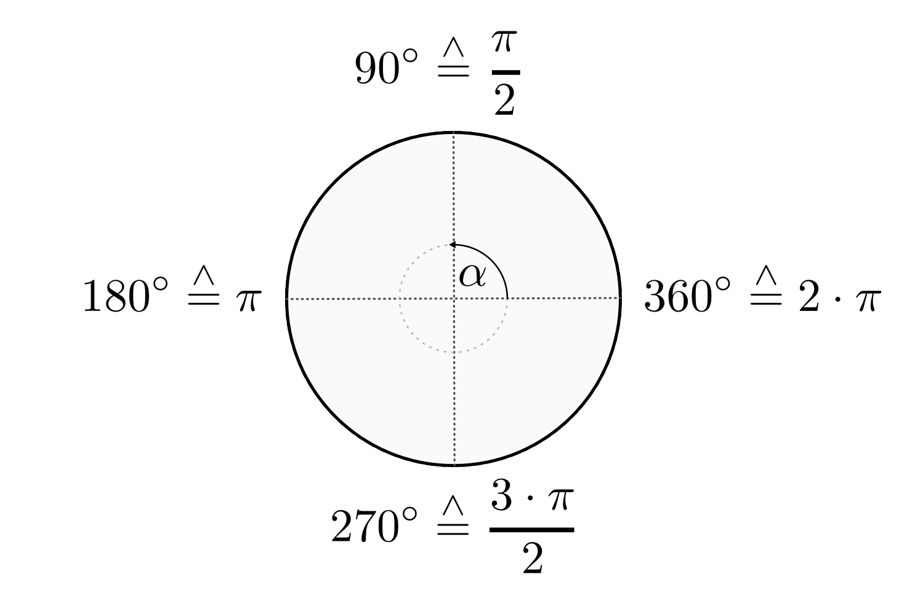
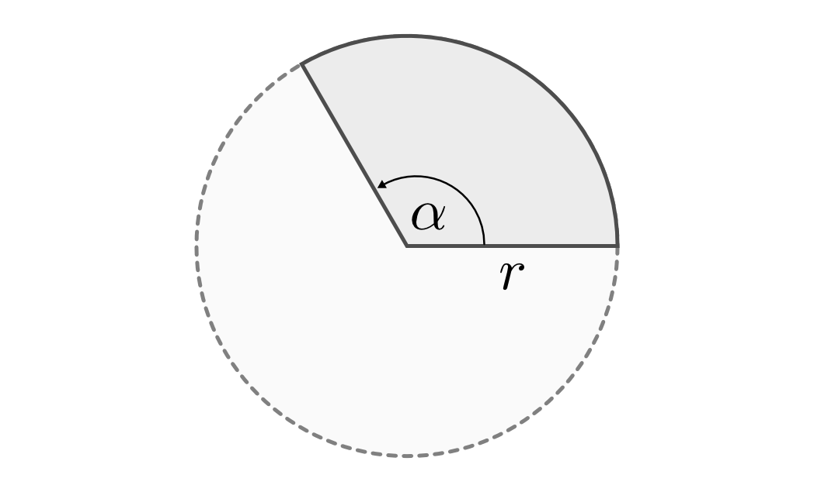

.. _Kreis und Ellipse:

Kreis und Ellipse
=================

.. index:: Kreis
.. _Kreis:

Der Kreis
---------

Jeder Kreis besitzt als Besonderheit, dass alle Punkte auf der Kreislinie gleich
weit vom Mittelpunkt :math:`M` entfernt liegen.

    Grundform eines Kreises.

    .. only:: html

        :download:`SVG: Kreis
        <../../pics/geometrie/kreis.svg>`

Für den Umfang und die Fläche eines Kreises mit Radius :math:`r` gilt:

.. math::
    :label: eqn-kreis

    \text{Umfang} &= 2 \cdot \pi \cdot r \\[4pt]
    \text{Fl\"ache} &= \pi \cdot r^2

Dabei wird :math:`\pi \approx 3,14159265...` als "Kreiszahl" bezeichnet.

.. index:: Kreisbogen
.. _Kreisbogen:

.. rubric:: Der Kreisbogen

Wird anstelle eines ganzen Kreises nur ein Teil der Kreislinie gezeichnet, so
bezeichnet man den entsprechenden Kreisteil als Kreisbogen.

    Der Kreisesbogen als Teil des Kreisumfangs.

    .. only:: html

        :download:`SVG: Kreisbogen
        <../../pics/geometrie/kreisbogen.svg>`

.. index:: Bogenlänge

Die Länge eines Kreisbogens hängt vom Umfang des entsprechenden Kreises ab und
davon, welchen Anteil des gesamten Kreises der Kreisbogen ausmacht. Dieser
Anteil wird durch den Mittelpunktswinkel :math:`\alpha` beschrieben, wobei
:math:`\alpha = 360°` einer vollen Umdrehung entspricht. Gilt :math:`\alpha <
360°`, so steht die Kreisbogenlänge :math:`s` im gleichen Verhältnis zum Umfang
:math:`2 \cdot \pi \cdot r` des ganzen Kreises wie :math:`\alpha` zu
:math:`360°`:

.. math::

    \frac{s}{2 \cdot \pi \cdot r} = \frac{\alpha }{360 °}

Nach dieser Gleichung, aufgelöst nach :math:`s`, ergibt sich für die Länge
des Kreisbogens:

.. math::
    :label: eqn-kreisbogen

    s = \frac{\alpha }{360°} \cdot 2 \cdot \pi \cdot r

.. index:: Kreis; Gradmaß und Bogenmaß, Radiant
.. _Gradmaß und Bogenmaß:
.. _Bogenmaß:
.. _Gradmaß:

.. rubric:: Gradmaß und Bogenmaß

Der Mittelpunktswinkel :math:`\alpha` eines Kreisbogens wird gewöhnlich im
Gradmaß angegeben. :math:`360°` entsprechen dabei dem vollen Kreisumfang.
Betrachtet man Einheitskreis (Radius :math:`r = 1`), so hat in diesem Fall der
Kreisumfang beziehungsweise ein geschlossener Kreisbogen eine Länge von :math:`s
= 2 \cdot \pi`. Damit kann der Mittelpunktswinkel :math:`\alpha` auch durch die
Länge :math:`s` des Kreisbogens angegeben werden, wobei :math:`2 \cdot \pi` dem
vollen Kreisumfang entspricht.

    Gradmaß und Bogenmaß an einem Einheitskreis :math:`(r = 1)`.

    .. only:: html

        :download:`SVG: Gradmaß und Bogenmaß
        <../../pics/geometrie/gradmass-und-bogenmass.svg>`

Für einen Einheitskreis kann folgende "Umrechnung" zwischen dem Gradmaß und
dem Bogenmaß verwendet werden:

.. math::

    360° \stackrel{\wedge}= 2 \cdot \pi

Um einen Winkel vom Gradmaß ins Bogenmaß umzurechnen, wird dieser durch
:math:`360°` geteilt und mit :math:`2 \cdot \pi` multipliziert. Im umgekehrten
Fall lässt sich ein Winkel vom Bogenmaß ins Gradmaß umrechnen, indem er durch
:math:`2 \cdot \pi` geteilt und mit :math:`360°` multipliziert wird. [#GB1]_

Die Grundeinheit :math:`\frac{1}{2 \cdot \pi }` des Bogenmaßes wird auch als
"Radiant" :math:`(\unit[1]{rad})` bezeichnet. Ein Radiant entspricht ungefähr
einem Winkelmaß von :math:`57,3 \degree`.

.. _Kreissektor:

.. rubric:: Der Kreissektor

Verbindet man einen Kreisbogen mit dem Mittelpunkt, so ergibt sich eine Fläche
in Form eines Tortenstücks. Mathematisch wird diese Fläche als Kreissektor
bezeichnet.

    Der Kreissektor als Teil der Kreisfläche.

    .. only:: html

        :download:`SVG: Kreissektor
        <../../pics/geometrie/kreissektor.svg>`

Der Flächeninhalt eines Kreissektors entspricht -- analog zum Kreisbogen -- dem
:math:`\alpha / 360°`-sten Anteil der Gesamt-Kreisfläche :math:`\pi \cdot r^2`:

.. math::

    \text{Fl\"ache des Kreissektors} &= \frac{\alpha }{360°} \cdot \pi \cdot r^2

.. raw:: html

    

.. only:: html

    .. rubric:: Anmerkungen:

.. [#GB1] Gilt für den Radius eines Kreisbogens :math:`r \ne 1`, so muss bei der
    Umrechnung des Mittelpunktswinkels :math:`\alpha` vom Grad- ins Bogenmaß die
    Länge des Kreisbogens :math:`s` mit dem Radius :math:`r` multipliziert
    werden. Umgekehrt ist bei der Umrechnung des Mittelpunktswinkels vom
    Bogenmaß ins Gradmaß die Kreisbogenlänge :math:`s` durch den Radius
    :math:`r` zu dividieren.

