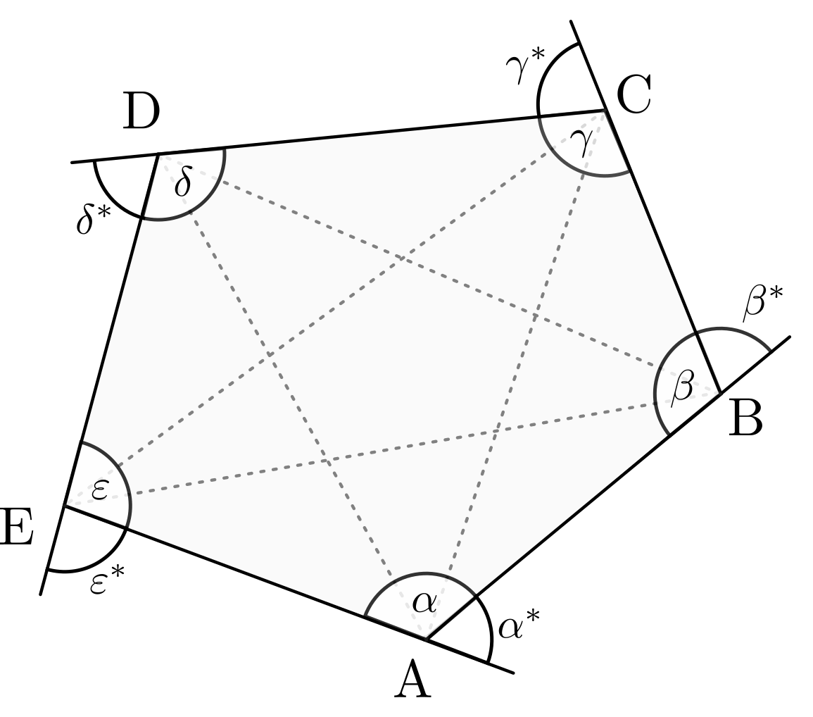

.. _Regelmäßige Vielecke:

Regelmäßige Vielecke
====================

Ein :math:`n`-Eck, bei dem alle Seiten gleich lang und alle Innen-
beziehungsweise Außenwinkel gleich groß sind, wird regelmäßige Vieleck genannt.

.. figure:: ../../pics/geometrie/vieleck-regelmaessig.png
    :name: fig-vieleck-regelmaessig
    :alt:  fig-vieleck-regelmaessig
    :align: center
    :width: 40%

    Beispiel eines regelmäßigen Vielecks

    .. only:: html

        :download:`SVG: Vieleck (regelmäßig)
        <../../pics/geometrie/vieleck-regelmaessig.svg>`

Regelmäßige Vielecke haben folgende Eigenschaften:

* Jedes regelmäßige :math:`n`-Eck hat jeweils :math:`n` Ecken, :math:`n` Seiten,
  :math:`n` Innen- beziehungsweise Außenwinkel sowie :math:`\frac{n \cdot
  (n-3)}{2}` Diagonalen.
* Jedes regelmäßige :math:`n`-Eck ist :math:`n`-fach punktsymmetrisch.
* Um jedes regelmäßige :math:`n`-Eck lässt sich ein Kreis zeichnen, der durch
  alle Ecken verläuft; diesen bezeichnet man als Umkreis.
* In jedes regelmäßige :math:`n`-Eck lässt sich ein Kreis zeichnen, der alle
  Seitenmitten berührt; diesen bezeichnet man als Inkreis.
* Das gemeinsame Zentrum von Um- und Inkreis ist der Mittelpunkt des Vielecks.
* Verbindet man den Mittelpunkt mit den Ecken, so erhält man :math:`n`
  kongruente, gleichschenklige Dreiecke; diese werden auch "Bestimmungsdreiecke"
  genannt.
* Jeder Innenwinkel eines regelmäßigen :math:`n`-Ecks beträgt
  :math:`\frac{n-2}{n} \cdot \unit[180]{\degree}`.
* Jeder Außenwinkel eines regelmäßigen :math:`n`-Ecks beträgt
  :math:`\frac{\unit[360]{\degree}}{n}`.

Bezeichnet die Seitenlänge mit :math:`s`, den Radius des Inkreises mit
:math:`r_1` und den Radius des Umkreises mit :math:`r_2`, so gilt für den Umfang
und die Fläche eines regelmäßigen :math:`n`-Ecks:

.. math::

    \text{Fl\"ache} &= \frac{n}{2} \cdot s \cdot r_1 = \frac{n}{2} \cdot s \cdot
    \sqrt{r_2^2 - \frac{s^2}{4}} \\[10pt]
    \text{Umfang} &= n \cdot s

Beliebige (auch nicht regelmäßige) Vielecke haben zudem allgemein folgende
Eigenschaften:

* Die Summe der Innenwinkel eines :math:`n`-Ecks beträgt :math:`(n-2) \cdot
  \unit[180]{\degree}`.
* Die Summe der Außenwinkel eines :math:`n`-Ecks beträgt stets :math:`\unit[360]{\degree}`.
* Ein Innenwinkel und sein zugehöriger Außenwinkel betragen in Summe stets
  :math:`\unit[180]{\degree}` (da es sich um Nebenwinkel handelt).
* Die Winkelhalbierenden eines Innenwinkels und die des zugehörigen Außenwinkels
  sind zueinander stets senkrecht.

    Beispiel eines unregelmäßigen Vielecks

    .. only:: html

        :download:`SVG: Vieleck (unregelmäßig)
        <../../pics/geometrie/vieleck-unregelmaessig.svg>`

Per Festlegung haben :math:`n`-Ecke zudem keine nach innen zeigenden Ecken sowie
keine einander schneidenden Seiten.

