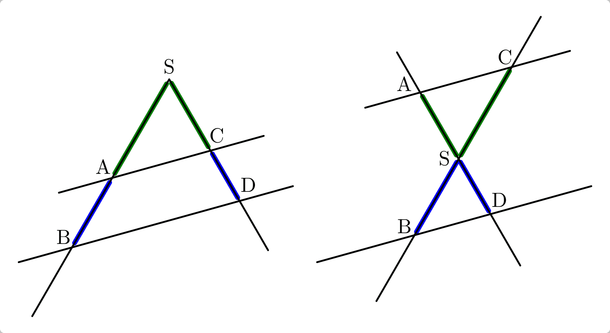
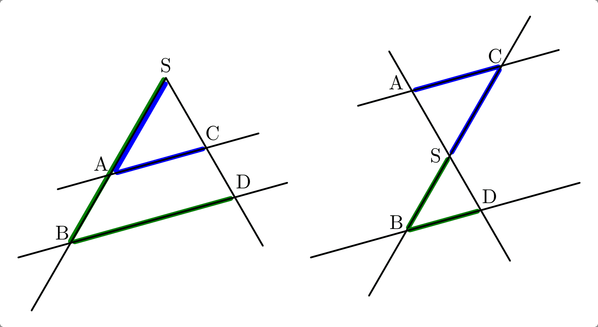
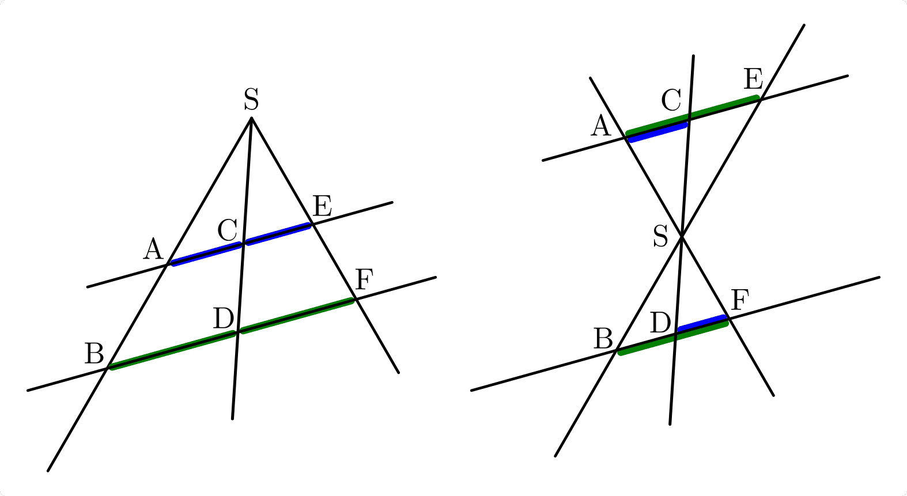

.. index:: Strahlensatz
.. _Strahlensätze:

Strahlensätze
=============

Wird ein Strahlenbüschel von zwei parallel liegenden Geraden geschnitten, so
gilt:

.. _Strahlensatz-1:

Der 1. Strahlensatz:
   
    Die Abschnitte auf einem Strahl stehen im gleichen Verhältnis zueinander wie
    die gleich liegenden Abschnitte auf einem anderen Strahl.

    Im linken Teil der unteren Abbildung gilt beispielsweise:

    ..  Im linken Teil von Abbildung :ref:`Strahlensatz 1 <fig-strahlensatz-1>` gilt
    ..  beispielsweise:

    .. math::
        :label: eqn-strahlensatz-1a

        \frac{\;\;\overline{\mathrm{SA}}\;\;}{\overline{AB}} =
        \frac{\;\;\overline{\rm{SC}}\;\;}{\overline{\rm{CD}}}
           
    Im rechten Teil gilt entsprechend:

    ..  Im rechten Teil von Abbildung :ref:`Strahlensatz 1 <fig-strahlensatz-1>` gilt
    ..  entsprechend:

    .. math::
        :label: eqn-strahlensatz-1b

        \frac{\;\;\overline{\mathrm{SA}}\;\;}{\overline{SD}} =
        \frac{\;\;\overline{\rm{SC}}\;\;}{\overline{\rm{SB}}}
           

    Der 1. Strahlensatz
    
    .. only:: html

        :download:`SVG: Strahlensatz 1
        <../../pics/geometrie/strahlensatz-1.svg>`

.. _Strahlensatz-2:

Der 2. Strahlensatz:
   
    Je zwei Parallelenabschnitte, die zwischen gleichen Strahlen liegen, stehen
    im gleichen Verhältnis zueinander wie die zugehörigen Strahlenabschnitte
    des selben Strahls.

    Im linken Teil der unteren Abbildung gilt beispielsweise:

    .. math::
        :label: eqn-strahlensatz-2a

        \frac{\;\;\overline{\mathrm{SA}}\;\;}{\overline{SB}} =
        \frac{\;\;\overline{\rm{AC}}\;\;}{\overline{\rm{BD}}}
       
    Im rechten Teil gilt entsprechend:

    .. math::
        :label: eqn-strahlensatz-2b

        \frac{\;\;\overline{\mathrm{SC}}\;\;}{\overline{SB}} =
        \frac{\;\;\overline{\rm{AC}}\;\;}{\overline{\rm{BD}}}
           

    Der 2. Strahlensatz
    
    .. only:: html

        :download:`SVG: Strahlensatz 2
        <../../pics/geometrie/strahlensatz-2.svg>`

.. _Strahlensatz-3:

Der 3. Strahlensatz:

    Die Abschnitte auf einer Parallelen stehen im gleichen Verhältnis zueinander
    wie die zugehörigen Abschnitte auf einer anderen Parallelen.

    Im linken Teil der unteren Abbildung gilt beispielsweise:

    .. math::
        :label: eqn-strahlensatz-3a

        \frac{\;\;\overline{\mathrm{AC}}\;\;}{\overline{BD}} =
        \frac{\;\;\overline{\rm{CE}}\;\;}{\overline{\rm{DF}}}
       
    Im rechten Teil gilt entsprechend:

    .. math::
        :label: eqn-strahlensatz-3b

        \frac{\;\;\overline{\mathrm{AC}}\;\;}{\overline{AE}} =
        \frac{\;\;\overline{\rm{DF}}\;\;}{\overline{\rm{BF}}}
           

    Der 3. Strahlensatz
    
    .. only:: html

        :download:`SVG: Strahlensatz 3
        <../../pics/geometrie/strahlensatz-3.svg>`

