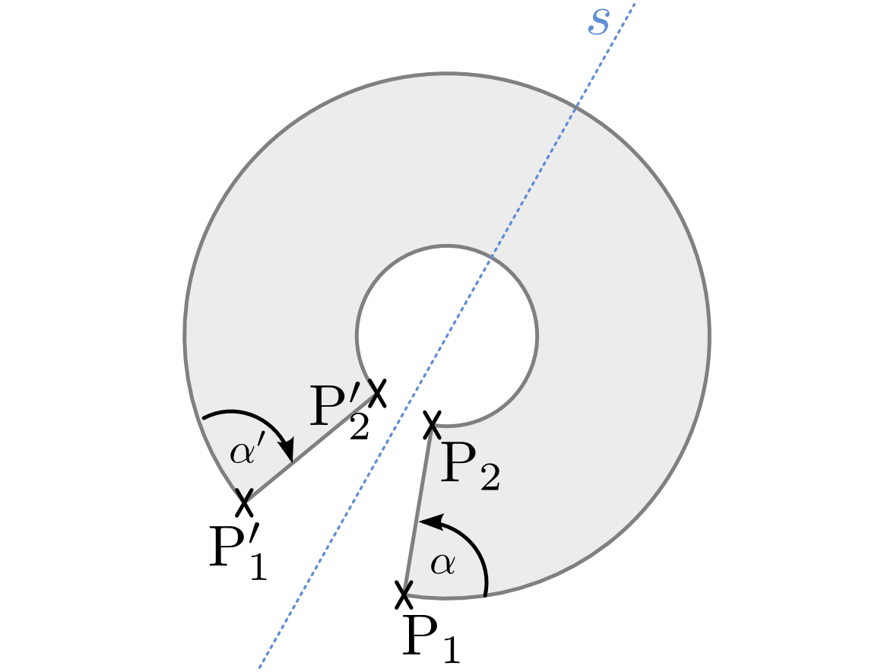
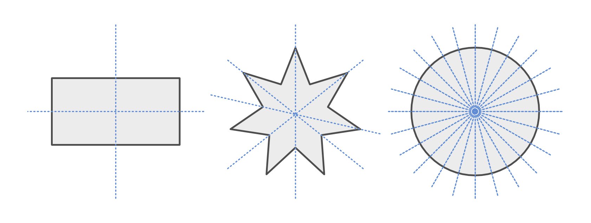
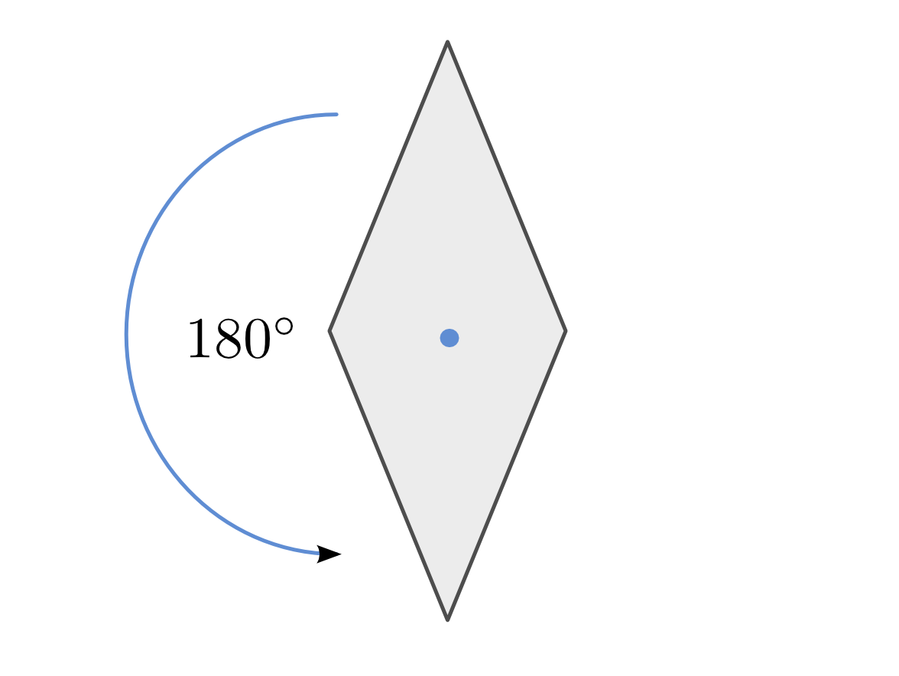
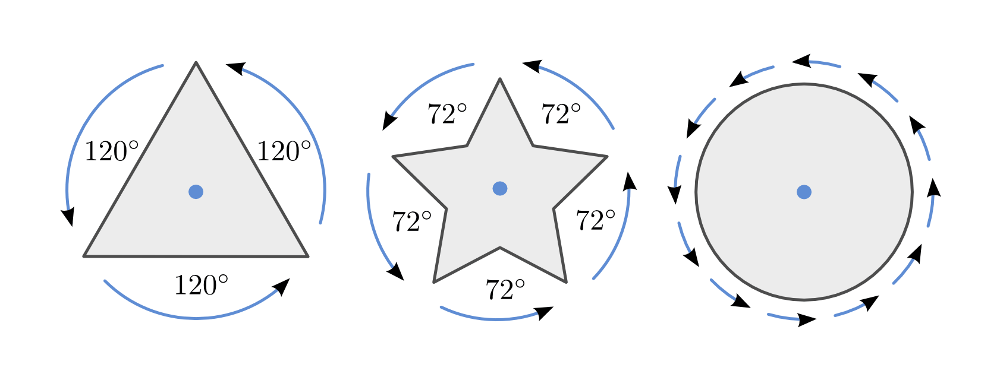

.. index:: Symmetrie
.. _Symmetrie:

Symmetrie
=========

Als Symmetrie wird die Eigenschaft mancher geometrischer Formen bezeichnet, nach
einer bestimmten Transformation wiederum unverändert zu erscheinen.

.. index:: Symmetrie; Achsensymmetrie, Transversale, Achsensymmetrie
.. _Transversale:
.. _Achsensymmetrie:

Achsensymmetrie
---------------

Eine beliebige, quer durch eine geometrische Figur verlaufende Gerade oder
Strecke wird Transversale genannt. Lässt sich die Figur durch eine dieser
Transversalen in zwei gleiche große Teilfiguren aufteilen, die durch Umklappen
entlang der Transversalen völlig deckungsgleich zueinander sind, so heißt die
Figur achsensymmetrisch. Die beiden Teilstücke der Figur werden dabei als
einander entsprechend bezeichnet und die Transversale Symmetrieachse genannt.

    Beispiel einer achsensymmetrischen Figur.

    .. only:: html

        :download:`SVG: Achsensymmetrie
        <../../pics/geometrie/symmetrie-achsensymmetrie.svg>`

Eine Figur kann auch mehrere Symmetrieachsen besitzen. Beispielsweise besitzt
ein Rechteck zwei Symmetrieachsen, ein Kreis sogar beliebig viele.

    Beispiel von mehrfach achsensymmetrischen Figuren.

    .. only:: html

        :download:`SVG: Achsensymmetrie (mehrfach)
        <../../pics/geometrie/symmetrie-achsensymmetrie-mehrfach.svg>`

Lassen sich zwei gleich große Figuren durch Umklappen um eine zwischen beiden
Figuren liegende Gerade :math:`s` zur Deckung bringen, so bezeichnet man beide
Figuren als achsensymmetrisch zueinander liegend. Achsensymmetrische Figuren
haben stets folgende Eigenschaften:

* Einander entsprechende Punkte liegen gleich weit von der Symmetrieachse
  :math:`s` entfernt.
* Verbindungslinien zwischen einander entsprechenden Punkten stehen senkrecht
  auf der Symmetrieachse.
* Einander entsprechende Geraden (sowie Strecken und ihre Verlängerungen)
  schneiden die Symmetrieachse im gleichen Punkt und im gleichen Winkel.
* Der Umlaufsinn beider Figuren ist umgekehrt, d.h. entsprechende Ecken folgen
  in der einen Figur im Uhrzeigersinn aufeinander, in der anderen entgegen dem
  Uhrzeigersinn.

Achsensymmetrische Figuren können ebenso als Paare von achsensymmetrisch
liegenden Figuren aufgefasst werden, deren Flächen sich zum Teil überschneiden.

.. index:: Symmetrie; Punktsymmetrie, Punktsymmetrie
.. _Punktsymmetrie:

Punktsymmetrie
--------------

Ist eine Figur bei einer :math:`180°`-Drehung um einen im Inneren gelegenen
Punkt völlig deckungsgleich mit sich selbst, so heißt die Figur (einfach)
punktsymmetrisch. Der Drehpunkt wird dabei als Symmetriezentrum, der Drehwinkel
als Symmetriewinkel bezeichnet.

    Beispiel einer punktsymmetrischen Figur.

    .. only:: html

        :download:`SVG: Punktsymmetrie
        <../../pics/geometrie/symmetrie-punktsymmetrie.svg>`

Ist eine Figur bereits nach einer Drehung um einen Winkel :math:`\varphi =
\frac{360°}{n}` mit sich selbst deckungsgleich, wobei :math:`n > 2` eine
beliebige natürliche Zahl ist, so heißt die Figur mehrfach punktsymmetrisch.
Sie ist bei weiteren Drehungen um den Winkel :math:`\varphi` stets erneut
deckungsgleich.

    Beispiel von mehrfach punktsymmetrischen Figuren.

    .. only:: html

        :download:`SVG: Punktsymmetrie (mehrfach)
        <../../pics/geometrie/symmetrie-punktsymmetrie-mehrfach.svg>`

Lassen sich zwei gleich große Figuren durch eine :math:`180°`-Drehung um einen
zwischen beiden Figuren liegenden Punkt :math:`\mathrm{S}` zur Deckung bringen, so
bezeichnet man beide Figuren als punktsymmetrisch zueinander liegend.
Punktsymmetrische Figuren haben stets folgende Eigenschaften:

* Einander entsprechende Punkte liegen gleich weit vom Symmetriezentrum
  :math:`\mathrm{S}` entfernt.
* Verbindungslinien zwischen einander entsprechenden Punkten verlaufen
  durch das Symmetriezentrum.
* Einander entsprechende Geraden (sowie Strecken und ihre Verlängerungen)
  verlaufen zueinander parallel.
* Der Umlaufsinn beider Figuren ist gleich, d.h. entsprechende Ecken folgen
  in beiden Figuren entweder im Uhrzeigersinn oder entgegen dem Uhrzeigersinn
  aufeinander.

Punktsymmetrische Figuren können ebenso als Paare von punktsymmetrisch liegenden
Figuren aufgefasst werden, deren Flächen sich zum Teil überschneiden.

