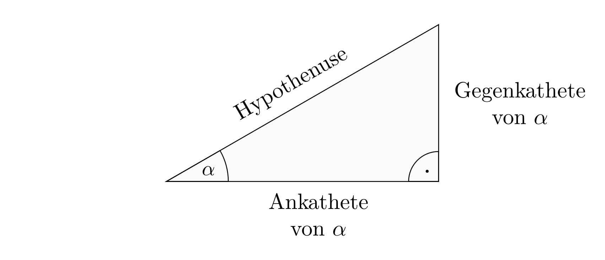

.. index:: Trigonometrie
.. _Trigonometrie:

Trigonometrie
=============

In der Trigonometrie werden Winkelgrößen in Dreiecken untersucht. Diese spielen
in vielen Bereichen der Mathematik und Physik eine wichtige Rolle.

.. _Längenverhältnisse im rechtwinkligen Dreieck:

Längenverhältnisse im rechtwinkligen Dreieck
--------------------------------------------

In einem rechtwinkligen Dreieck wird die an dem betrachteten Winkel
:math:`\alpha` anliegende Kathete als Ankathete, die dem Winkel :math:`\alpha`
gegenüber liegende Seite als Gegenkathete bezeichnet. Die dem rechten Winkel
gegenüber liegende Seite wird Hypothenuse genannt.

    Gegenkathete, Ankathete und Hypothenuse in einem rechtwinkligen Dreieck.

    .. only:: html

        :download:`SVG: Rechtwinkliges Dreieck
        <../../pics/geometrie/rechtwinkliges-dreieck.svg>`

.. index:: Sinus, Cosinus, Tangens, Cotangens

Die Längenverhältnisse der Dreieckseiten lassen sich in Abhängigkeit vom Winkel
:math:`\alpha` ausdrücken. Hierzu führt man :math:`\sin{\alpha},\; \cos{\alpha}`
und :math:`\tan{\alpha }` als Kurzschreibweisen für Sinus, Cosinus und Tangens
ein. Diese bezeichnen folgende Seitenverhältnisse:

.. math::
    :label: eqn-sinus

    \sin{\alpha } &= \frac{\text{Gegenkathete von } \alpha }{\text{Hypothenuse}
    }

.. math::
    :label: eqn-cosinus

    \cos{\alpha } &= \frac{\text{\phantom{geg}Ankathete von } \alpha
    }{\text{Hypothenuse} }

.. math::
    :label: eqn-tangens

    {\color{white}\ldots \qquad \,\, }\tan{\alpha } &= \frac{\text{Gegenkathete
    von } \alpha }{\text{\phantom{geg}Ankathete von } \alpha } =
    \frac{\sin{\alpha }}{\cos{\alpha }}

Bisweilen definiert man zusätzlich zum Tangens auch einen so genannten
"Cotangens", der als Kehrwert des Tangens definiert ist:

.. math::
    :label: eqn-cotangens

    {\color{white}\ldots \qquad \,\, }\cot{\alpha} =
    \frac{\text{\phantom{geg}Ankathete von } \alpha }{\text{Gegenkathete von }
    \alpha } = \frac{ \cos{\alpha} }{ \sin{\alpha} }

Die Sinus- und Cosinuswerte sind als Längenverhältnis einer Kathete zur
Hypothenuse, da die Hypothenuse die längste Seite im rechtwinkligen Dreieck ist,
stets kleiner als eins. Die Werte des Tangens können für :math:`0 \degree \le
\alpha < 90 \degree` alle Werte zwischen :math:`0` und :math:`+\infty`
annehmen; für :math:`\alpha = 90 \degree` ist der Tangens nicht definiert, da
in diesem Fall durch :math:`\cos{(90 \degree)} = 0` dividiert würde.

.. list-table:: Werte von Sinus, Cosinus und Tangens für besondere Winkel.
    :widths: 50 50 50 50 50 50
    :header-rows: 0

    * - :math:`{\color{white}1}\alpha`
      - :math:`{\color{white}\frac{1}{2}111}0°{\color{white}111}`
      - :math:`{\color{white}\frac{1}{2}11}30°{\color{white}111}`
      - :math:`{\color{white}\frac{1}{2}11}45°{\color{white}111}`
      - :math:`{\color{white}\frac{1}{2}11}60°{\color{white}111}`
      - :math:`{\color{white}\frac{1}{2}11}90°{\color{white}111}`
    * - :math:`\sin{\alpha }`
      - :math:`{\color{white}1111}0{\color{white}1111}`
      - :math:`{\color{white}111.}\frac{1}{2}{\color{white}1111}`
      - :math:`{\color{white}11}\frac{1}{2} \cdot \sqrt{2}`
      - :math:`{\color{white}11}\frac{1}{2} \cdot \sqrt{3}`
      - :math:`{\color{white}111.}1{\color{white}1111}`
    * - :math:`\cos{\alpha }`
      - :math:`{\color{white}1111}1{\color{white}1111}`
      - :math:`{\color{white}11}\frac{1}{2} \cdot \sqrt{3}`
      - :math:`{\color{white}11}\frac{1}{2} \cdot \sqrt{2}`
      - :math:`{\color{white}111.}\frac{1}{2}`
      - :math:`{\color{white}111.}0{\color{white}1111}`
    * - :math:`\tan{\alpha }`
      - :math:`{\color{white}1111}0{\color{white}1111}`
      - :math:`{\color{white}11}\frac{1}{3} \cdot \sqrt{3}`
      - :math:`{\color{white}111}1{\color{white}1111}`
      - :math:`{\color{white}111}\sqrt{3}`
      - :math:`{\color{white}111}\text{n.d.}`

Eine weitere Eigenschaft von Sinus und Cosinus ergibt sich daraus, dass der
Sinus des Winkels :math:`\alpha` mit dem Cosinus des Winkels :math:`\beta`
identisch ist. Wegen :math:`\alpha + \beta = 90 \degree` oder :math:`\alpha =
90 \degree - \beta` folgt somit:

.. math::

    \sin{(\beta)} &= \sin{(90 \degree - \alpha)}\, = \cos{(\alpha)} \\
    \cos{(\beta)} &= \cos{(90 \degree - \alpha)}\;\! = \sin{(\alpha)} \\
    \cot{(\beta)} &= \tan{(90 \degree - \alpha)} = \tan{(\alpha)}

.. index:: Sinus-Satz
.. _Sinus-Satz:

Der Sinus-Satz
--------------

Jedes spitzwinklige Dreieck lässt sich durch Einzeichnen einer Höhenlinie in
zwei rechtwinklige Dreiecke zerlegen. Bezeichnet man den Schnittpunkt der Höhe
:math:`h_{\mathrm{c}}` mit der Strecke :math:`c` als :math:`\mathrm{D}`, so gilt
für das Teildreieck :math:`\mathrm{ADC}`:

.. figure:: ../../pics/geometrie/dreieck-sinussatz.png
    :width: 40%
    :align: center
    :name: fig-sinussatz
    :alt:  fig-sinussatz

    Unterteilung eines Dreiecks zum Nachweis des Sinus-Satzes.

    .. only:: html

        :download:`SVG: Sinussatz
        <../../pics/geometrie/dreieck-sinussatz.svg>`

.. math::

    \sin{(\alpha)} = \frac{h_{\mathrm{c}}}{b} \quad \Leftrightarrow \quad h_{\mathrm{c}} = b \cdot
    \sin{(\alpha)}

Für das Teildreieck :math:`\mathrm{DBC}` gilt entsprechend:

.. math::

    \sin{(\beta)} = \frac{h_{\mathrm{c}}}{a} \quad \Leftrightarrow \quad h_{\mathrm{c}} = a \cdot
    \sin{(\beta)}

Setzt man die beiden obigen Gleichungen für :math:`h_{\mathrm{c}}` gleich, so erhält man folgende
Beziehung:

.. math::

    b \cdot \sin{(\alpha)} = a \cdot \sin{(\beta)}

Zeichnet man alle drei Höhenlinien ein, so erhält man jeweils eine entsprechende
Größengleichung. Formt man diese in Verhältnisgleichungen um, so ergibt sich der
folgende "Sinussatz":

.. math::

    \frac{a}{b} = \frac{\sin{(\alpha)}}{\sin{(\beta)}} \quad ; \quad
    \frac{b}{c} = \frac{\sin{(\beta)}}{\sin{(\gamma)}} \quad ; \quad
    \frac{c}{a} = \frac{\sin{(\gamma)}}{\sin{(\alpha)}}

Der Sinussatz wird üblicherweise weiter in eine einzige Gleichung
zusammengefasst:

.. math::
    :label: eqn-sinussatz

    \frac{a}{\sin{(\alpha)}} = \frac{b}{\sin{(\beta)}} = \frac{c}{\sin{(\gamma)}}

Die Seitenlängen eines Dreiecks stehen also im gleichen Verhältnis zueinander
wie die Sinuswerte der jeweils gegenüber liegenden Winkel.

Der Sinus-Satz gilt auch in stumpfwinkligen Dreiecken. Man kann ihn nutzen, um
beispielsweise fehlende Stücke eines Dreiecks zu berechnen, wenn zwei
Seitenlängen und ein gegenüber liegender Winkel oder eine Seitenlänge und
zwei Winkel gegeben sind.

.. index:: Cosinus-Satz
.. _Cosinus-Satz:

Der Cosinus-Satz
----------------

In jedem Dreieck ist das Quadrat einer Seitenlänge gleich der Summe der
Quadrate der beiden anderen Seitenlängen, abzüglich dem doppelten Produkt aus
diesen beiden Seitenlängen und dem Cosinuswert des eingeschlossenen Winkels.
Beispielsweise gilt für beliebige Winkelwerte:

.. math::
    :label: eqn-cosinussatz

    c^2 = a^2 + b^2 - 2 \cdot a \cdot b \cdot \cos{(\gamma)}

Ist :math:`\gamma = 90 \degree`, so ist  :math:`\cos{(\gamma)} = \cos{(90
\degree)} = 0`, und damit :math:`c^2 = a^2 + b^2`. Der :ref:`Satz von
Pythagoras <Satz von Pythagoras>` ist somit ein Sonderfall des Cosinus-Satzes
für rechtwinklige Dreiecke.

Für die beiden anderen Seiten :math:`a` und :math:`b` gilt entsprechend:

.. math::

    a^2 = b^2 + c^2 - 2 \cdot b \cdot c \cdot \cos{(\alpha)} \\
    b^2 = c^2 + a^2 - 2 \cdot c \cdot a \cdot \cos{(\beta)}

Man kann den Cosinus-Satz zur Konstruktion von Dreiecken nutzen, wenn entweder
alle drei Seitenlängen oder zwei Seitenlängen und der von ihnen eingeschlossene
Winkel gegeben sind.

*Beispiel:*

* Welche Werte haben die Winkel eines Dreiecks, dessen Seiten
  :math:`a=\unit[5]{cm}`, :math:`b=\unit[6]{cm}` und :math:`c=\unit[7]{cm}` lang
  sind?

  Nach dem Cosinus-Satz gilt:

  .. math::

    a^2 &= b^2 + c^2 - 2 \cdot b \cdot c \cdot \cos{(\alpha)} \quad
    \Leftrightarrow \quad \alpha = \text{acos}\left( \frac{b^2 + c^2 - a^2}{2
    \cdot b \cdot c}\right) \\[4pt]
    b^2 &= c^2 + a^2 - 2 \cdot c \cdot a \cdot \cos{(\beta)} \quad
    \Leftrightarrow \quad \beta = \text{acos}\left( \frac{c^2 + a^2 - b^2}{2
    \cdot c \cdot a}\right) \\[4pt]
    c^2 &= a^2 + b^2 - 2 \cdot a \cdot b \cdot \cos{(\gamma)} \quad
    \Leftrightarrow \quad \gamma = \text{acos}\left( \frac{a^2 + b^2 - c^2}{2
    \cdot a \cdot b}\right) \\[4pt]

  Setzt man die gegebenen Werte ein, so erhält man:

  .. math::

      \alpha &= \text{acos}\left( \frac{6^2 + 7^2 - 5^2}{2 \cdot 6 \cdot
      7}\right) \approx 44,415 \degree \\
      \beta &= \text{acos}\left( \frac{7^2 + 5^2 - 6^2}{2 \cdot 7 \cdot
      5}\right) \approx 57,122 \degree \\
      \gamma &= \text{acos}\left( \frac{5^2 + 6^2 - 7^2}{2 \cdot 5 \cdot
      6}\right) \approx 78,463 \degree \\

  Für die Summe der Innenwinkel gilt erwartungsgemäß :math:`\alpha + \beta +
  \gamma = 180 \degree`.

.. todo Projektionssatz, Flächensatz Sinom 602f.

