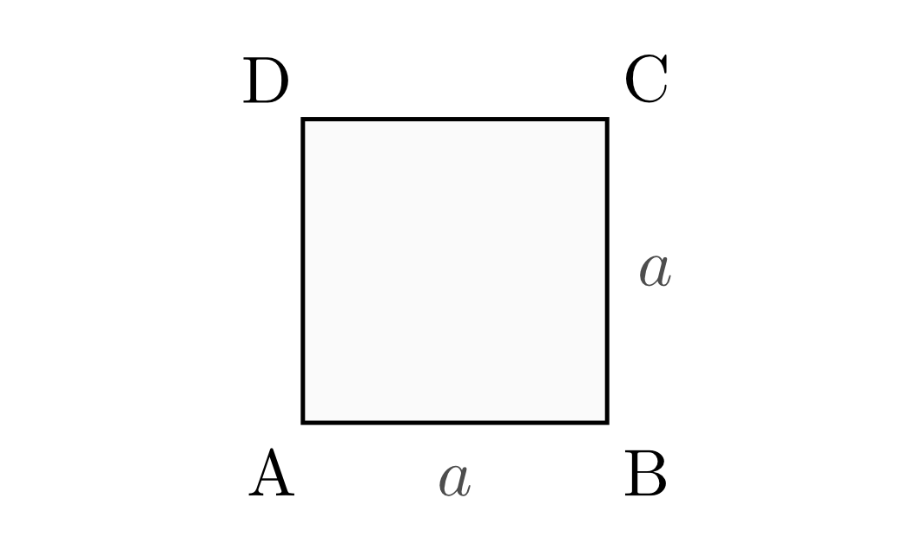
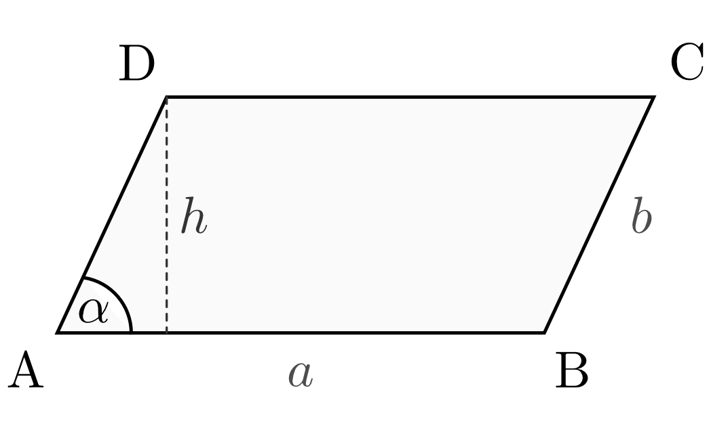
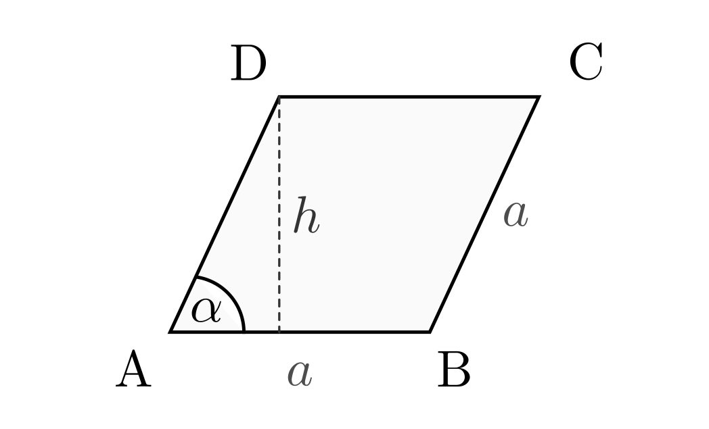
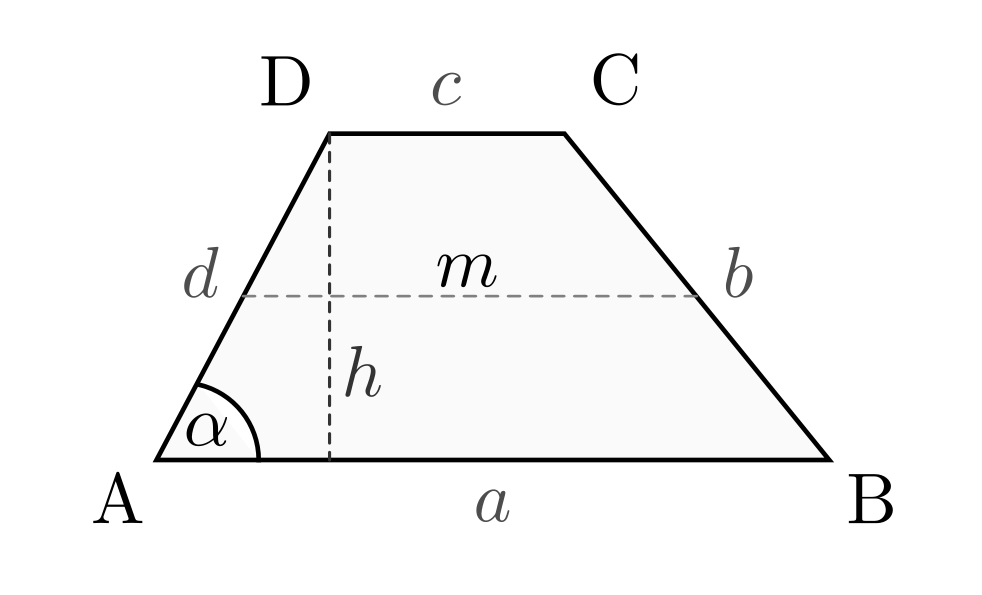
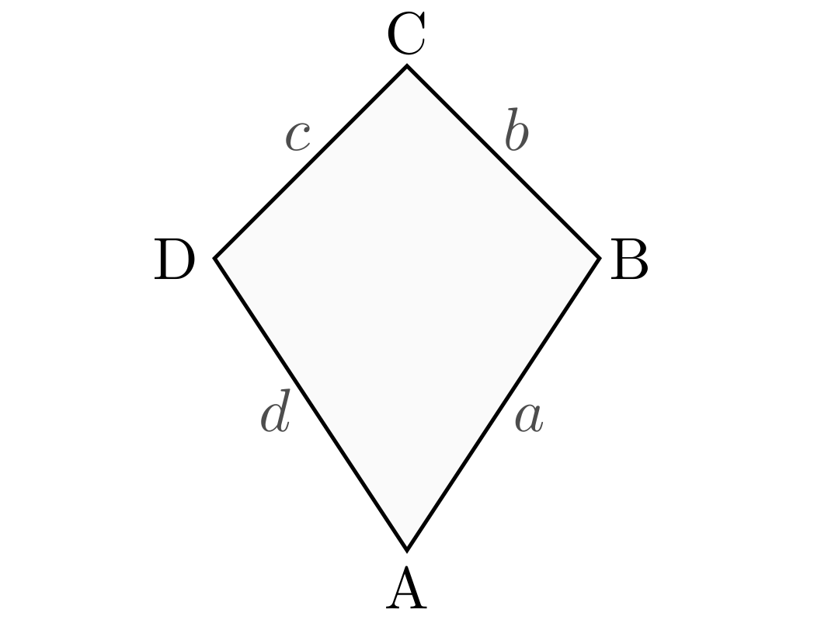

.. index:: Viereck
.. _Vierecke:

Vierecke
========

.. index:: Quadrat
.. _Quadrat:

.. rubric:: Das Quadrat

In einem Quadrat besitzen alle Seiten die gleiche Länge. Alle Winkel betragen
:math:`90°`.

    Grundform eines Quadrats.

    .. only:: html

        :download:`SVG: Quadrat
        <../../pics/geometrie/quadrat.svg>`

Quadrate haben folgende besondere Eigenschaft:

* Jedes Rechteck ist zweifach achsensymmetrisch; die beiden Symmetrieachsen
  verlaufen jeweils senkrecht durch die Mittelpunkte der Seiten.
* Die beiden Diagonalen sind gleich lang.

Für die Fläche und den Umfang eines Quadrats gilt:

.. math::

    \text{Fl\"ache} &= a \cdot a = a^2 \\[10pt]
    \text{Umfang} &= 4 \cdot a

.. index:: Rechteck
.. _Rechteck:

.. rubric:: Das Rechteck

In einem Rechteck besitzen die jeweils gegenüber liegenden Seiten die gleiche
Länge. Alle Winkel betragen :math:`\unit[90]{\degree}`.

.. figure:: ../../pics/geometrie/rechteck.png
    :name: fig-rechteck
    :alt:  fig-rechteck
    :align: center
    :width: 40%

    Grundform eines Rechtecks.

    .. only:: html

        :download:`SVG: Rechteck
        <../../pics/geometrie/rechteck.svg>`

Rechtecke haben folgende besondere Eigenschaft:

* Jedes Rechteck ist zweifach achsensymmetrisch; die beiden Symmetrieachsen
  verlaufen jeweils senkrecht durch die Mittelpunkte der Seiten.
* Die beiden Diagonalen sind gleich lang.

Für die Fläche und den Umfang eines Rechtecks gilt:

.. math::

    \text{Fl\"ache} &= a \cdot b \\[10pt]
    \text{Umfang} &= 2 \cdot a + 2 \cdot b

.. index:: Parallelogramm
.. _Parallelogramm:

.. rubric:: Das Parallelogramm

In einem Parallelogramm besitzen die jeweils gegenüber liegenden Seiten die
gleiche Länge. Die jeweils gegenüber liegenden Winkel sind betragsmäßig
gleich.

    Grundform eines Parallelogramms.

    .. only:: html

        :download:`SVG: Parallelogramm
        <../../pics/geometrie/parallelogramm.svg>`

Parallelogramme  haben folgende besondere Eigenschaft:

* Jedes Parallelogramm ist punktsymmetrisch bezüglich des Schnittpunkts der
  beiden Diagonalen.
* Die beiden Diagonalen halbieren sich gegenseitig.
* Je zwei benachbarte Winkel ergeben in Summe :math:`\unit[180]{\degree}`.

Für die Fläche und den Umfang eines Parallelogramms gilt:

.. math::

    \text{Fl\"ache} &= a \cdot b \cdot \sin{\alpha } = a \cdot h \\[10pt]
    \text{Umfang} &= 2 \cdot a + 2 \cdot b

.. index:: Rhombus

Hat ein Parallelogramm vier gleich lange Seiten, so bezeichnet man es als
"Rhombus".

    Grundform eines Rhombus.

    .. only:: html

        :download:`SVG: Rhombus
        <../../pics/geometrie/rhombus.svg>`

.. index:: Trapez
.. _Trapez:

.. rubric:: Das Trapez

Bei einem Trapez verlaufen (mindestens) zwei Seiten parallel zueinander.

    Grundform eines Trapezes.

    .. only:: html

        :download:`SVG: Trapez
        <../../pics/geometrie/trapez.svg>`

Trapeze haben folgende besondere Eigenschaft:

* Zeichnet man mittig zwischen die beiden parallel verlaufenden Seiten :math:`a`
  und :math:`c` eine weitere parallele Strecke :math:`m` zwischen den übrigen
  Seiten des Vierecks ein, so entspricht die Länge dieser als "Mittelparallele"
  bezeichneten Strecke dem arithmetischen Mittelwert der beiden parallelen
  Seiten:

  .. math::

      m = \frac{a+c}{2}

Für die Fläche und den Umfang eines Trapezes gilt:

.. math::

    \text{Fl\"ache} &=  \frac{a + c}{2} \cdot h = m \cdot h \\[10pt]
    \text{Umfang} &= a + b + c + d

Auch andere Sonderformen von Vierecken haben parallel verlaufende Seiten:
Rhombus, Parallelogramm, Rechteck und Quadrat. Diese bereits beschriebenen
Vierecke stellen somit Sonderformen eines Trapezes dar.

.. index:: Drachenviereck
.. _Drachenviereck:

.. rubric:: Das Drachenviereck

Bei einem Drachenviereck sind zwei aneinander anliegende Seiten :math:`a` und
:math:`b` gleich lang; ebenso sind die beiden übrigen Seiten :math:`c` und :math:`d`
gleich lang.

    Grundform eines Drachenvierecks.

    .. only:: html

        :download:`SVG: Drachenviereck
        <../../pics/geometrie/drachenviereck.svg>`

Drachenvierecke haben folgende besondere Eigenschaften:

* Jedes Drachenviereck hat senkrecht zueinander verlaufende Diagonalen.
* Jedes Drachenviereck kann in zwei gleichschenklige Dreiecke unterteilt werden
* Jedes Drachenviereck hat (mindestens) zwei gleich große Gegenwinkel.
* Jedes Drachenviereck ist achsensymmetrisch.

Die Kriterien eines Drachenvierecks werden auch von jedem Rhombus und jedem
Quadrat erfüllt; diese Vierecke stellen somit Sonderformen eines Drachenvierecks
dar.

