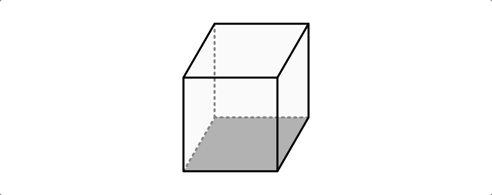
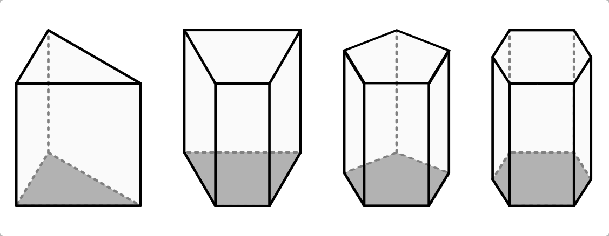
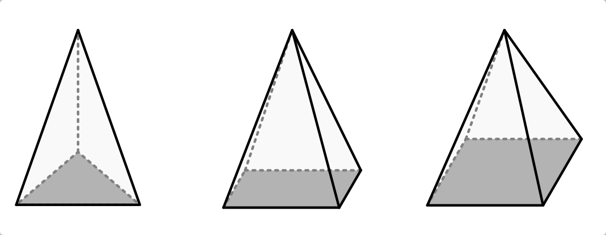
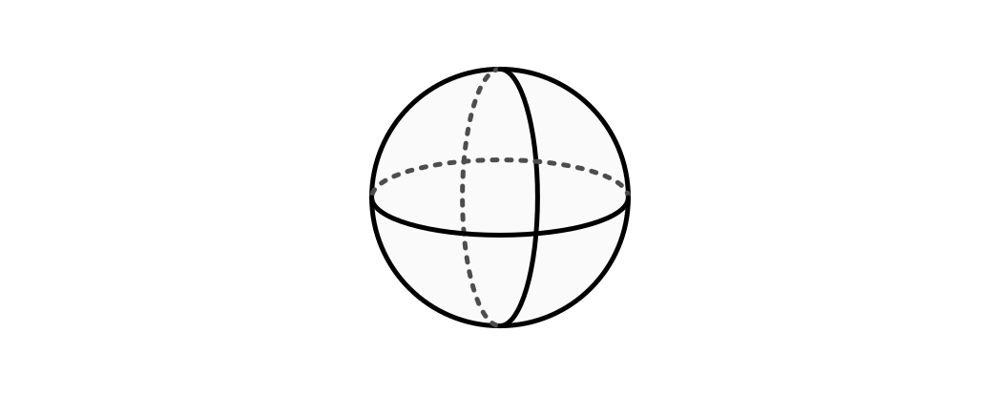
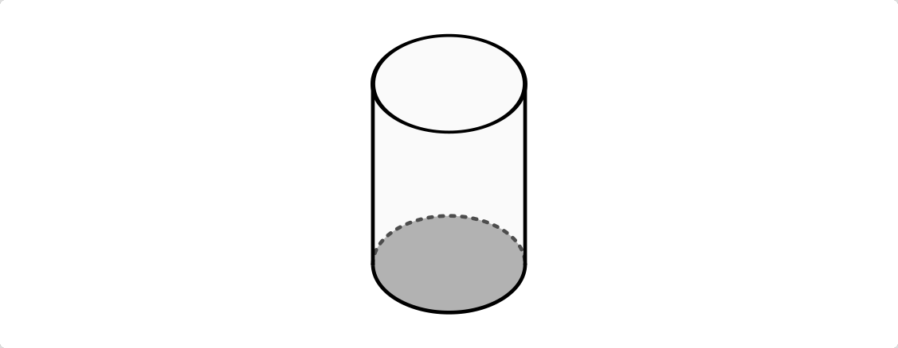
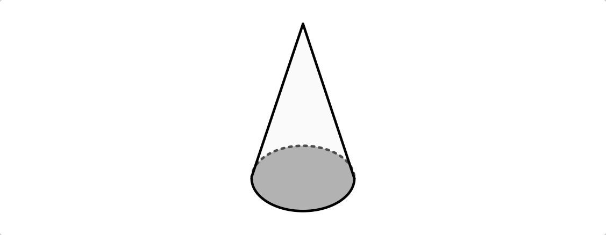
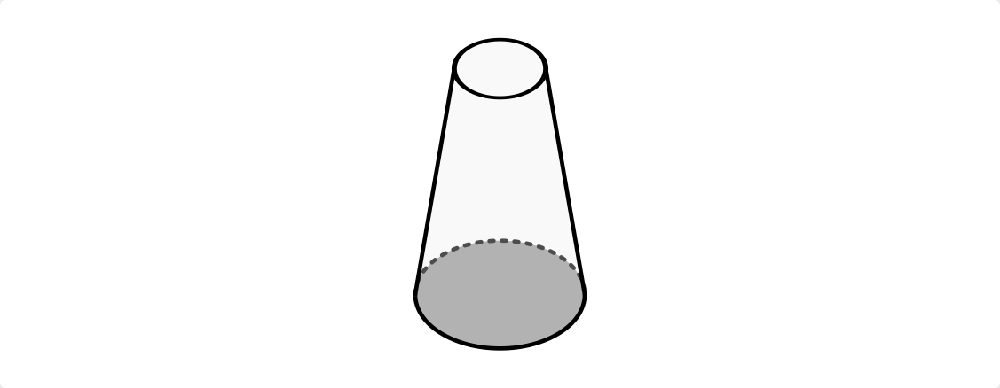

.. _Stereometrie:

Stereometrie
============

Die Stereometrie ist das geometrische Teilgebiet, in dem Eigenschaften
dreidimensionaler Grundformen untersucht werden. Hierbei sind für vielerlei
Anwendungen insbesondere die Größe des Volumens und der Oberfläche von
regelmäßigen Formen von Interesse.

.. _Quader, Würfel und Prisma:

Quader, Würfel und Prisma
-------------------------

.. rubric:: Quader und Würfel

In einem Quader sind im Allgemeinen alle Seitenlängen unterschiedlich lang, alle
Winkel betragen :math:`90 °`. Für das Volumen :math:`V` und die Oberfläche
:math:`A` eines Quaders gilt:

.. math::

    V _{\text{Quader}} &= a \cdot b \cdot c \\
    A _{\text{Quader}} &= 2 \cdot (a \cdot b + a \cdot c + b \cdot c)

    Grundform eines Quaders.

    .. only:: html

        :download:`SVG: Quader
        <../pics/geometrie/quader.svg>`

In einem Würfel -- einer Sonderform eines Quaders -- sind alle Seitenlängen
gleich lang, alle Winkel betragen :math:`90 °`. Für das Volumen :math:`V` und
die Oberfläche :math:`A` eines Würfels gilt:

.. math::

    V _{\text{Würfel}} &= a \cdot a \cdot a = a^3 \\
    A _{\text{Würfel}} &= 6 \cdot a^2

    Grundform eines Würfels.

    .. only:: html

        :download:`SVG: Würfel
        <../pics/geometrie/wuerfel.svg>`

..  In einem Würfel als einer Sonderform eines Quaders betragen alle Winkel
    :math:`90 °`, zusätzlich sind alle Seitenlängen :math:`a` gleich lang.

.. rubric:: Prismen

Für das Volumen :math:`V` und die Oberfläche :math:`A` eines Prismas gilt:

.. math::

    V _{\text{Prisma}} &= A _{\rm{G}} \cdot h \\
    A _{\text{M,Prisma}} &= A _{\rm{S1}} + A _{\rm{S2}} + \ldots + A _{\rm{Sn}} \\
    A _{\text{O,Prisma}} &= 2 \cdot A _{\rm{G}} + A _{\rm{M}}

    Prismen mit drei-, vier-, fünf- und sechseckigen Grundflächen.

    .. only:: html

        :download:`SVG: Prisma-Formen
        <../pics/geometrie/prisma-formen.svg>`

Pyramide und Pyramidenstumpf
----------------------------

Für das Volumen :math:`V` und die Oberfläche :math:`A` einer Pyramide gilt:

.. math::

    V _{\rm{{Pyramide}}} &= \frac{A _{\rm{G}} \cdot h}{3} \\[4pt]
    A _{\rm{{M, Pyramide}}} &= A _{\rm{1}} + A _{\rm{2}} + \ldots + A _{\rm{n}}\\
    A _{\rm{{O, Pyramide}}} &= A _{\rm{G}} + A _{\rm{M}}

    Pyramiden mit einem Dreieck, einem Rechteck oder einem Quadrat als
    Grundflächen.

    .. only:: html

        :download:`SVG: Pyramide-Formen
        <../pics/geometrie/pyramide-formen.svg>`

Für das Volumen :math:`V` und die Oberfläche :math:`A` eines Pyramidenstumpfes
gilt:

.. math::

    V _{\rm{{Pyramidenstumpf}}} &= \frac{1}{3} \cdot h \cdot (A _{\rm{G}} +
    \sqrt{A _{\rm{G}} \cdot A _{\rm{D}}} + A _{\rm{D}}) \\[4pt]
    A _{\rm{{M, Pyramidenstumpf}}} &= A _{\rm{1}} + A _{\rm{2}} + \ldots + A
    _{\rm{n}}\\
    A _{\rm{{O, Pyramidenstumpf}}} &= A _{\rm{G}} + A _{\rm{M}} + A _{\rm{D}}

.. figure:: ../pics/geometrie/pyramidenstumpf.png
    :width: 70%
    :align: center
    :name: fig-pyramidestumpf
    :alt:  fig-pyramidestumpf

    Pyramidenstumpf einer Quadrat-Pyramide.

    .. only:: html

        :download:`SVG: Pyramidestumpf
        <../pics/geometrie/pyramidenstumpf.svg>`

Kugel und Kreiszylinder
-----------------------

Für das Volumen :math:`V` und die Oberfläche :math:`A` einer Kugel gilt:

.. math::

    V _{\rm{{Kugel}}} &= \frac{4}{3} \cdot \pi \cdot r^3 \\[4pt]
    A _{\rm{{O, Kugel}}} &= 4 \cdot \pi \cdot r^2

..  oder: A = \pi \cdot d^2.

    Grundform einer Kugel.

    .. only:: html

        :download:`SVG: Kugel
        <../pics/geometrie/kugel.svg>`

Für das Volumen :math:`V` und die Oberfläche :math:`A` eines Kreiszylinders
gilt:

.. math::

    V _{\rm{{Kreiszylinder}}} &= p \cdot r^2 \cdot h \\[4pt]
    A _{\rm{{M, Kreiszylinder}}} &= 2 \cdot \pi \cdot r \cdot h \\
    A _{\rm{{O, Kreiszylinder}}} &= 2 \cdot \pi \cdot r^2 + 2 \cdot \pi \cdot h

    Grundform eines Kreiszylinders.

    .. only:: html

        :download:`SVG: Kreiszylinder
        <../pics/geometrie/kreiszylinder.svg>`

Kreiskegel und Kreiskegelstumpf
-------------------------------

Für das Volumen :math:`V` und die Oberfläche :math:`A` eines Kreiskegels gilt
mit :math:`s =  \sqrt{r ^2 + h^2}`:

.. math::

    V _{\rm{{Kreiskegel}}} &= \frac{\pi \cdot r^2 \cdot h}{3}  \\[4pt]
    A _{\rm{{M, Kreiskegel}}} &= \pi \cdot r \cdot s \\
    A _{\rm{{O, Kreiskegel}}} &= \pi \cdot r^2 + \pi \cdot r \cdot s

    Grundform eines Kreiskegels.

    .. only:: html

        :download:`SVG: Kreiskegel
        <../pics/geometrie/kreiskegel.svg>`

Für das Volumen :math:`V` und die Oberfläche :math:`A` eines Kreiskegelstumpfes
gilt mit :math:`s =  \sqrt{(r _{\rm{1}} - r _{\rm{2}})^2 + h^2}`:

.. math::

    V _{\rm{{Kreiskegelstumpf}}} &= \frac{\pi}{3} \cdot h \cdot \left( r
    _{\rm{1}}^2 + r _{\rm{2}}^2 + r _{\rm{1}} \cdot r _{\rm{2}} \right) \\[4pt]
    A _{\rm{{M, Kreiskegelstumpf}}} &= \pi \cdot s \cdot (r _{\rm{1}} + r _{\rm{2}}) \\
    A _{\rm{{O, Kreiskegelstumpf}}} &= \pi \cdot (r _{\rm{1}}^2 + r _{\rm{2}}^2
    + s \cdot (r _{\rm{1}} + r _{\rm{2}}))

    Grundform eines Kreiskegelstumpfes.

    .. only:: html

        :download:`SVG: Kreiskegelstumpf
        <../pics/geometrie/kreiskegelstumpf.svg>`

