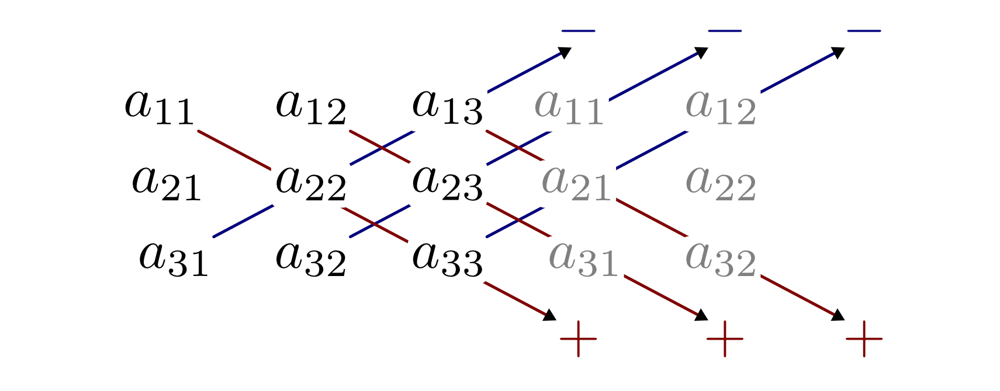
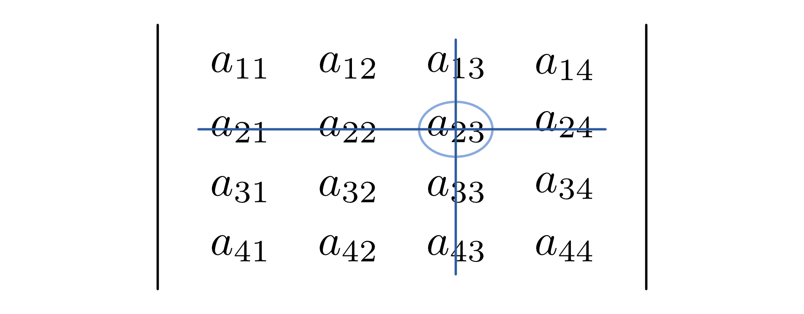
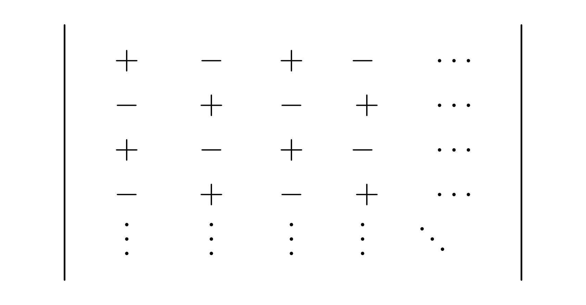

.. index:: Determinante
.. _Determinanten:

Determinanten
=============

Determinanten stellen neben dem :ref:`Gaussschen Lösungsverfahren <Gaussscher
Lösungsalgorithmus>` ein weiteres nützliches Werkzeug im Umgang mit linearen
Gleichungssystemen dar. Sie ermöglichen unter anderem eine verhältnismäßig
einfache und schnelle Untersuchung, ob ein lineares Gleichungssystem eine
eindeutige Lösung besitzt oder nicht.

.. index:: Determinante; zweireihig
.. _Zweireihige Determinanten:

.. rubric:: Zweireihige Determinanten

Um den Umgang mit Determinanten zu verdeutlichen, werden im folgenden Abschnitt
zunächst wiederum lineare Gleichungssysteme mit zwei Gleichungen und zwei
Unbekannten betrachtet. Diese lassen sich im Allgemeinen in folgender Form
darstellen:

.. math::

     a_{\mathrm{11}} \cdot x_1 + a_{\mathrm{12}} \cdot x_2 &= b_1 \\
     a_{\mathrm{21}} \cdot x_1 + a_{\mathrm{22}} \cdot x_2 &= b_2 \\

Allgemein kann ein solches Gleichungssystem gelöst werden, indem man
beispielsweise die erste Gleichung mit :math:`a_{22}` und die zweite Gleichung
mit :math:`a_{\mathrm{12}}` multipliziert. Es folgt:

.. math::

    a_{\mathrm{11}} \cdot a_{\mathrm{22}} \cdot x_1 + a_{\mathrm{12}} \cdot
    a_{\mathrm{22}} \cdot x_2 &=  b_1 \cdot a_{\mathrm{22}} \\
    a_{\mathrm{12}} \cdot a_{\mathrm{21}} \cdot x_1 + a_{\mathrm{12}} \cdot
    a_{\mathrm{22}} \cdot x_2 &=  b_2 \cdot a_{\mathrm{12}}

In dieser Form sind die Koeffizienten von :math:`x_2` in beiden Gleichungen
identisch. Subtrahiert man die zweite Gleichung von der ersten, so erhält man
eine einzelne Gleichung für :math:`x_1`:

.. math::

    a_{\mathrm{11}} \cdot a_{\mathrm{22}} \cdot x - a_{\mathrm{12}} \cdot
    a_{\mathrm{21}} \cdot x_1 &= b_1 \cdot a_{\mathrm{22}} - b_2 \cdot
    a_{\mathrm{12}} \\
    x_1 \cdot (a_{\mathrm{11}} \cdot a_{\mathrm{22}} - a_{\mathrm{12}} \cdot
    a_{\mathrm{21}}) &= b_1 \cdot a_{\mathrm{22}} - b_2 \cdot a_{\mathrm{12}}

Im zweiten Rechenschritt wurde auf der linken Seite :math:`x` ausgeklammert. Ist
die verbleibende Klammer ungleich Null, so erhält man als Lösung für
:math:`x_1`:

.. math::

    x_1 = \frac{ b_1 \cdot a_{\mathrm{22}} - b_2 \cdot a_{\mathrm{12}} }{
    a_{\mathrm{11}} \cdot a_{\mathrm{22}} - a_{\mathrm{12}} \cdot
    a_{\mathrm{21}} }

Nach dem gleichen Prinzip kann man im die erste Gleichung des ursprünglichen
Gleichungssystems mit :math:`a_{\mathrm{11}}` und die zweite Gleichung mit
:math:`a_{\mathrm{21}}` multiplizieren, um eine Bestimmungsgleichung für
:math:`x_2` zu erhalten. Die Lösung lautet dabei:

.. math::

    x_2 = \frac{ b_2 \cdot a_{\mathrm{11}} - b_1 \cdot a_{\mathrm{21}} }{
    a_{\mathrm{11}} \cdot a_{\mathrm{22}} - a_{\mathrm{12}} \cdot
    a_{\mathrm{21}} }

Die Lösbarkeit des Gleichungssystems hängt also nur davon ab, ob für den Term
:math:`(a_{\mathrm{11}} \cdot a_{\mathrm{22}} - a_{\mathrm{12}} \cdot a_{\mathrm{21}}) \ne
0` gilt. Die "Determinante" eines Gleichungssystems wird daher folgendermaßen
definiert:

.. index:: Regel von Sarrus
.. _Regel von Sarrus:

.. math::
    :label: eqn-determinante-zweireihig

    \begin{vmatrix}
    a_{\mathrm{11}} & a_{\mathrm{12}}  \\
    a_{\mathrm{21}} & a_{\mathrm{22}}
    \end{vmatrix} = a_{\mathrm{11}} \cdot a_{\mathrm{22}} - a_{\mathrm{12}}
    \cdot a_{\mathrm{21}}

Das Ergebnis dieser Determinante lässt sich nach der so genannten "Regel von
`Sarrus <https://de.wikipedia.org/wiki/Pierre_Frédéric_Sarrus>`_" berechnen,
indem man das Produkt der in der "Hauptdiagonale" stehenden Zahlen (von links
oben nach rechts unten) bildet und davon das Produkt der in der
"Nebendiagonalen" stehenden Zahlen (von links unten nach rechts oben)
subtrahiert. Ist die resultierende Zahl ungleich Null, so ist das
Gleichungssystem eindeutig lösbar.

.. index:: Regel von Cramer
.. _Regel von Cramer:

Die Lösungen für :math:`x_1` und :math:`x_2` lassen sich nach der so genannten
Regel von `Cramer <https://de.wikipedia.org/wiki/Gabriel_Cramer>`_ ebenfalls in
Determinanten-Schreibweise darstellen. Im Nenner steht dabei immer die
eigentliche Determinante des Gleichungssystems, im Zähler wird die erste
beziehungsweise zweite Spalte der Determinante durch die rechte Seite der
Gleichung ersetzt. Somit gilt:

.. math::
    :label: eqn-determinante-zweireihig-loesungen

    x_1 = \frac{\begin{vmatrix} b_1 & a_{\mathrm{12}} \\ b_2 &  a_{\mathrm{22}}
    \end{vmatrix} }{\begin{vmatrix} a_{\mathrm{11}} & a_{\mathrm{12}}  \\ a_{\mathrm{21}}
    & a_{\mathrm{22}} \end{vmatrix} }
    \quad \text{und} \quad
    x_2 = \frac{\begin{vmatrix}  a_{\mathrm{11}} & b_1 \\  a_{\mathrm{21}} &  b_2
    \end{vmatrix} }{\begin{vmatrix} a_{\mathrm{11}} & a_{\mathrm{12}}  \\ a_{\mathrm{21}}
    & a_{\mathrm{22}} \end{vmatrix} }

.. index:: Determinante; dreireihig
.. rubric:: Dreireihige Determinanten

Determinanten lassen sich auch für Gleichungssysteme mit drei Gleichungen und
drei Unbekannten definieren. In allgemeiner Form lässt sich ein solches
Gleichungssystem folgendermaßen beschreiben:

.. math::

     a_{\mathrm{11}} \cdot x_1 + a_{\mathrm{12}} \cdot x_2 + a_{\mathrm{13}} \cdot x_3 &= b_1 \\
     a_{\mathrm{21}} \cdot x_1 + a_{\mathrm{22}} \cdot x_2 + a_{\mathrm{23}} \cdot x_3 &= b_2 \\
     a_{\mathrm{31}} \cdot x_1 + a_{\mathrm{32}} \cdot x_2 + a_{\mathrm{33}} \cdot x_3 &= b_3 \\

Entsprechend lässt sich hierfür eine Determinante in folgender Form
definieren:

.. math::
    :label: eqn-determinante-dreireihig

    \begin{vmatrix}
        a_{\mathrm{11}} & a_{\mathrm{12}} & a_{\mathrm{13}} \\
        a_{\mathrm{21}} & a_{\mathrm{22}} & a_{\mathrm{23}} \\
        a_{\mathrm{31}} & a_{\mathrm{32}} & a_{\mathrm{33}} \\
    \end{vmatrix} &= \phantom{+}
    a_{\mathrm{11}} \cdot a_{\mathrm{22}} \cdot a_{\mathrm{33}} +
    a_{\mathrm{21}} \cdot a_{\mathrm{32}} \cdot a_{\mathrm{13}} +
    a_{\mathrm{31}} \cdot a_{\mathrm{12}} \cdot a_{\mathrm{23}} \\[-10pt]
    &\phantom{=} - a_{\mathrm{31}} \cdot a_{\mathrm{22}} \cdot a_{\mathrm{13}} -
    a_{\mathrm{21}} \cdot a_{\mathrm{12}} \cdot a_{\mathrm{33}} -
    a_{\mathrm{11}} \cdot a_{\mathrm{32}} \cdot a_{\mathrm{23}}

Wiederum lässt sich die Determinante nach der Regel von Sarrus berechnen, indem
man die Produkte der in der "Hauptdiagonale" stehenden Zahlen (von links oben
nach rechts unten) bildet und davon die Produkte der in der "Nebendiagonalen"
stehenden Zahlen (von links unten nach rechts oben) subtrahiert. Ist die
resultierende Zahl ungleich Null, so ist das Gleichungssystem eindeutig lösbar.

    Merkhilfe zur Regel von Sarrus

    .. only:: html

        :download:`SVG: Regel von Sarrus
        <../pics/algebra/determinanten-regel-von-sarrus.svg>`

Die Lösungen für :math:`x_1`, :math:`x_2` und :math:`x_3` lassen sich ebenfalls
nach der Regel von Cramer in Determinanten-Schreibweise darstellen. Im Nenner
steht wiederum die eigentliche Determinante des Gleichungssystems, im Zähler
wird die erste, zweite beziehungsweise dritte Spalte der Determinante durch die
rechte Seite der Gleichung ersetzt. Somit gilt:

.. math::
    :label: eqn-determinante-dreireihig-loesungen

    x_1 = \frac{\begin{vmatrix} b_1 & a_{\mathrm{12}} & a_{\mathrm{13}} \\ b_2 &
    a_{\mathrm{22}} & a_{\mathrm{23}} \\ b_3 & a_{\mathrm{32}} & a_{\mathrm{33}} \end{vmatrix}
    }{\begin{vmatrix} a_{\mathrm{11}} & a_{\mathrm{12}} & a_{\mathrm{13}} \\ a_{\mathrm{21}}
    & a_{\mathrm{22}}  & a_{\mathrm{23}} \\ a_{\mathrm{31}} & a_{\mathrm{32}} & a_{\mathrm{33}}
    \end{vmatrix} } \quad \text{und} \quad x_2 = \frac{\begin{vmatrix}
    a_{\mathrm{11}} & b_1  & a_{\mathrm{13}}\\  a_{\mathrm{21}} &  b_2 & a
    _{\mathrm{23}} \\ a_{\mathrm{31}} & b_2 & a_{\mathrm{33}} \end{vmatrix} }{\begin{vmatrix} a_{\mathrm{11}}
    & a_{\mathrm{12}} & a_{\mathrm{13}} \\ a_{\mathrm{21}} & a_{\mathrm{22}}  & a_{\mathrm{23}}
    \\ a_{\mathrm{31}} & a_{\mathrm{32}} & a_{\mathrm{33}} \end{vmatrix} } \quad
    \text{und} \quad x_3 = \frac{\begin{vmatrix}  a_{\mathrm{11}} & a_{\mathrm{12}} &
    b_1 \\  a_{\mathrm{21}} & a_{\mathrm{22}} &  b_2 \\ a_{\mathrm{31}} & a_{\mathrm{32}}
    & b_3 \end{vmatrix} }{\begin{vmatrix} a_{\mathrm{11}} & a_{\mathrm{12}} & a
    _{\mathrm{13}} \\ a_{\mathrm{21}} & a_{\mathrm{22}}  & a_{\mathrm{23}} \\ a_{\mathrm{31}} &
    a_{\mathrm{32}} & a_{\mathrm{33}} \end{vmatrix} }

.. index:: Determinante; mehrreihig

.. rubric:: Mehrreihige Determinanten

Auch Gleichungssysteme mit mehr als drei Gleichungen und Unbekannten lassen sich
mit der obigen Determinantenmethode (Regel von Cramer) lösen. Dazu müssen
Determinanten mit :math:`n>3` Reihen berechnet werden. Möchte man für solche
Determinanten eine allgemeine Lösungsregel angeben, so werden die dabei
auftretenden Terme jedoch schnell unübersichtlich: Eine Erweiterung der Regel
von Sarrus auf :math:`n`-reihige Determinanten enthält allgemein :math:`n!`
Summanden, bei einer :math:`n=4`-reihigen Determinante müssten also bereits
:math:`4! = 4 \cdot 3 \cdot 2 \cdot 1 = 24` Summanden ausgewertet werden , bei
einer :math:`n=5`-reihigen Determinante sogar :math:`5! = 5 \cdot 4 \cdot 3
\cdot 2 \cdot 1 = 120`.

Einfacher ist es im allgemeinen, aus einer :math:`n`-reihigen Determinante
insgesamt :math:`n` Determinanten mit :math:`(n-1)` Reihen zu bilden. Dieses
rekursive Entwlicklungsschema, das auch von Computer-Algebra-Systemen zur
Berechnung beliebig großer Determinanten genutzt wird, soll hier am Beispiel
einer vierreihigen Determinante vorgestellt werden.

.. index:: Unterdeterminante

*Definition:*

    Streicht man in einer Determinante :math:`A` eine beliebige Zeile
    :math:`i` und eine beliebige Spalte :math:`j`, so bezeichnet man die
    übrigbleibenden Elemente als Unterdeterminante :math:`D_{\mathrm{ij}}`. Das
    Element :math:`a_{\mathrm{ij}}`, das sich am Schnittpunkt beider Linien
    befindet, nennt man Schnittpunktelement.

    Schnittpunktelement :math:`a_{\mathrm{23}}` bei Streichung der zweiten Zeile
    und der dritten Spalte.

    .. only:: html

        :download:`SVG: Vorzeichen-Schema
        <../pics/algebra/determinanten-schnittpunktelement.svg>`

.. index:: Adjungierte Determinante

*Definition:*

    Multipliziert man den Wert der Unterdeterminante :math:`D_{\mathrm{ij}}` mit
    dem Faktor :math:`(-1)^{i +j}`, so spricht man von der zum Element
    :math:`a_{\mathrm{ij}}` adjungierten Unterdeterminante
    :math:`A_{\mathrm{ij}}`:

    .. math::
        :label: eqn-adjungierte-determinante

        A_{\mathrm{ij}} = (-1)^{i+j} \cdot D_{\mathrm{ij}}

Das Vorzeichen des Faktors :math:`(-1)^{i+j}` hängt von der Zeilen- und
Spaltennummer von :math:`a_{\mathrm{ij}}` ab; ist die Summe beider Zahlen
gerade, so ist das Vorzeichen positiv, andernfalls negativ. Anschaulich kann man
das Vorzeichen auch anhand einer schachbrettartigen Vorzeichentabelle ablesen.

    Vorzeichen-Schema für die Entwicklung von Unterdeterminanten

    .. only:: html

        :download:`SVG: Vorzeichen-Schema
        <../pics/algebra/determinanten-vorzeichen.svg>`

.. Determinanten nur für quadratische Matrizen definiert!
.. Simon S.332: Regel von Sarrus nur für dreireihige Determinanten definiert.
.. Stimmt so nicht: wird nur schnell unhandlich (5 reihen: 120 summanden)

.. index:: Entwicklungssatz von Leibniz
.. _Entwicklungssatz von Leibniz:

Mit den beiden obigen Definitionen kann der so genannte Entwicklungssatz von
`Leibniz <https://de.wikipedia.org/wiki/Leibniz>`_ folgendermaßen formuliert
werden:

    "Multipliziert man die Elemente einer beliebigen Reihe mit den jeweiligen
    adjungierten Unterdeterminanten und addiert die so entstehenden Produkte, so
    erhält man den Wert der Determinante."

Es ist frei wählbar, nach welcher Reihe (Zeile oder Spalte) man eine
Determinante entwickelt. Entwickelt man eine Determinante :math:`A` nach der
:math:`i`-ten Zeile, so gilt:

    .. math::

        A = \sum_{j=1}^{n} a_{\mathrm{ij}} \cdot A_{\mathrm{ij}}

Entwickelt man eine Determinante :math:`A` hingegen nach der :math:`j`-ten
Spalte, so gilt:

    .. math::

        A = \sum_{i=1}^{n} a_{\mathrm{ij}} \cdot A_{\mathrm{ij}}

Zweckmäßig ist es, für die Entwicklung eine Reihe zu wählen, die möglichst
viele Nullen enthält.

*Beispiel:*

* Folgende Determinante :math:`A` mit :math:`n=4` Reihen soll berechnet werden:

  .. math::

      A = \begin{vmatrix}
      \;\,\,1 & \;\,\,2 & \;\,\,3 & \;\,\, 0 \\ \;\,\, 0 & \;\,\,1 & \;\,\, 2 &
      -1 \\ -1 & -2 & \;\,\, 3 & \;\,\, 2 \\ \;\,\,1 & \;\,\, 2 & \;\,\, 1 &
      \;\,\, 0
      \end{vmatrix}

  Zunächst wird die Determinante in Unterdeterminanten mit :math:`n=3` Reihen
  entwickelt. Vorteilhaft ist hierbei eine Entwicklung nach der vierten Spalte,
  da diese zwei Nullen enthält. Nach dem Leibnizschen Entwicklungssatz gilt:

  .. only:: html

      .. math::

          A = \begin{vmatrix}
          \;\,\,1 & \;\,\,2 & \;\,\,3 & \;\,\, 0 \\ \;\,\, 0 & \;\,\,1 & \;\,\, 2 &
          -1 \\ -1 & -2 & \;\,\, 3 & \;\,\, 2 \\ \;\,\,1 & \;\,\, 2 & \;\,\, 1 &
          \;\,\, 0
          \end{vmatrix} = - 0 \cdot \begin{vmatrix}
          \;\,\, 0 & \;\,\, 1 & \;\,\, 2 \\ -1 & -2 & \;\,\, 3 \\ \;\,\, 1 & \;\,\,
          2 & \;\,\, 1 \end{vmatrix} + (-1) \cdot \begin{vmatrix}
          \;\,\, 1 & \;\,\, 2 & \;\,\, 3 \\ -1 & -2 & \;\,\, 3 \\ \;\,\, 1 & \;\,\,
          2 & \;\,\, 1 \end{vmatrix} - 2 \cdot  \begin{vmatrix}
          \;\,\, 1 & \;\,\, 2 & \;\,\, 3 \\ \;\,\, 0 & \;\,\, 1 & \;\,\, 2 \\ \;\,\, 1 & \;\,\,
          2 & \;\,\, 1 \end{vmatrix} + 0 \cdot  \begin{vmatrix} \;\,\, 1 & \;\,\, 2
          & \;\,\, 3 \\ \;\,\, 0 & \;\,\, 1 & \;\,\, 2 \\ -1 & -2 & \;\,\, 3
          \end{vmatrix}

  .. only:: latex

      .. math::

          A = \begin{vmatrix}
          \;\,\,1 & \;\,\,2 & \;\,\,3 & \;\,\, 0 \\ \;\,\, 0 & \;\,\,1 & \;\,\, 2 &
          -1 \\ -1 & -2 & \;\,\, 3 & \;\,\, 2 \\ \;\,\,1 & \;\,\, 2 & \;\,\, 1 &
          \;\,\, 0 \end{vmatrix} = & -0 \cdot \begin{vmatrix}
          \;\,\, 0 & \;\,\, 1 & \;\,\, 2 \\ -1 & -2 & \;\,\, 3 \\ \;\,\, 1 & \;\,\,
          2 & \;\,\, 1 \end{vmatrix} + (-1) \cdot \begin{vmatrix}
          \;\,\, 1 & \;\,\, 2 & \;\,\, 3 \\ -1 & -2 & \;\,\, 3 \\ \;\,\, 1 & \;\,\,
          2 & \;\,\, 1 \end{vmatrix} \\ &- 2 \cdot  \begin{vmatrix}
          \;\;\, 1 & \;\;\, 2 & \;\;\, 3 \\ \;\,\, 0 & \;\;\, 1 & \;\;\, 2 \\ \;\;\, 1 & \;\;\,
          2 & \;\;\, 1 \end{vmatrix} + \phantom{(-)} 0 \cdot  \begin{vmatrix} \;\,\, 1 & \;\,\, 2
          & \;\,\, 3 \\ \;\,\, 0 & \;\,\, 1 & \;\,\, 2 \\ -1 & -2 & \;\,\, 3
          \end{vmatrix}

  Alle Determinanten liefern reelle Zahlen als Ergebnisse; mit Null
  multipliziert ergeben sie ebenfalls Null. Es müssen somit nur die zweite und
  die dritte Unterdeterminante ausgewertet werden. Hierzu kann die Regel von
  Sarrus genutzt werden:

  .. math::

      A &= (-1) \cdot \begin{vmatrix}
      \;\,\, 1 & \;\,\, 2 & \;\,\, 3 \\
      -1 & -2 & \;\,\, 3 \\
      \;\,\, 1 & \;\,\, 2 & \;\,\, 1
      \end{vmatrix} - 2 \cdot  \begin{vmatrix}
      \;\,\, 1 & \;\,\, 2 & \;\,\, 3 \\
      \;\,\, 0 & \;\,\, 1 & \;\,\, 2 \\
      \;\,\, 1 & \;\,\, \;\,\, 1 & \;\,\, 2 & \;\,\, 1 \end{vmatrix} \\[5pt]
      &= (-1) \cdot \qquad \quad \;  0 \qquad \; - 2 \cdot \qquad (-2) \qquad  \quad = 4

  Die Determinante :math:`A` hat somit den Wert :math:`4`.

..  &= (-1) \cdot (+(-2) + 6 + (-6) - (-6) - 6 - (-2) ) \\ &\phantom{=(}- 2 \,\cdot (1 + 4 + 0 -
..  3  -4 - 0) \\

Um ein lineares Gleichungssystem mit :math:`n` Gleichungen und Unbekannten zu
lösen, müssen neben der Determinante :math:`A` der Koeffizienten
:math:`a_{\mathrm{ij}}` auch die :math:`n` Determinanten :math:`A _j` berechnet
werden, die sich ergeben, wenn man die :math:`j`-te Spalte von :math:`A` durch
die Ergebnisspalte :math:`b` ersetzt. Für die Lösung :math:`x_{\mathrm{j}}` gilt
dann mit :math:`j = 1 , \ldots, n`:

.. math::

    x_{\mathrm{j}} = \frac{A_{\mathrm{j}} }{A}

Voraussetzung ist bei dieser allgemeinen Regel von Cramer wiederum, dass die
Determinante :math:`A` der Koeffizienten ungleich Null ist.

.. _Determinanten-Regeln:

.. rubric:: Determinanten-Regeln

Zum Rechnen mit Determinanten sind zudem folgende Regeln bisweilen nützlich:

* Der Wert einer Determinante bleibt gleich, wenn man sie transponiert, also die
  Zeilen mit den Spalten vertauscht.

.. "Transponierte"?

* Vertauscht man zwei Zeilen miteinander, so ändert sich das Vorzeichen der
  Determinante. Ebenso ändert sich das Vorzeichen einer Determinante, wenn man
  zwei Spalten vertauscht.

* Der Wert einer Determinante bleibt gleich, wenn die Elemente einer Zeile mit
  einem beliebigen Faktor multipliziert und das Ergebnis zu den entsprechenden
  Elementen einer anderen Zeile addiert.

  Das gleiche gilt, wenn man die mit einem beliebigen Faktor multiplizierten
  Elemente einer Spalte zu den entsprechenden Elementen einer anderen Spalte
  addiert.

* Eine Determinante hat den Wert Null, wenn alle Elemente einer Zeile oder
  Spalte gleich Null sind oder wenn je zwei Zeilen beziehungsweise Spalten
  gleich oder zueinander proportional sind.

* Eine Determinante wird mit einem Faktor multipliziert, indem man
  alle Elemente einer einzelnen Zeile oder einer einzelnen Spalte mit diesem
  Faktor multipliziert.

.. raw:: html

    

.. hint::

    Zu diesem Abschnitt gibt es :ref:`Übungsaufgaben <Aufgaben Determinanten>`.

