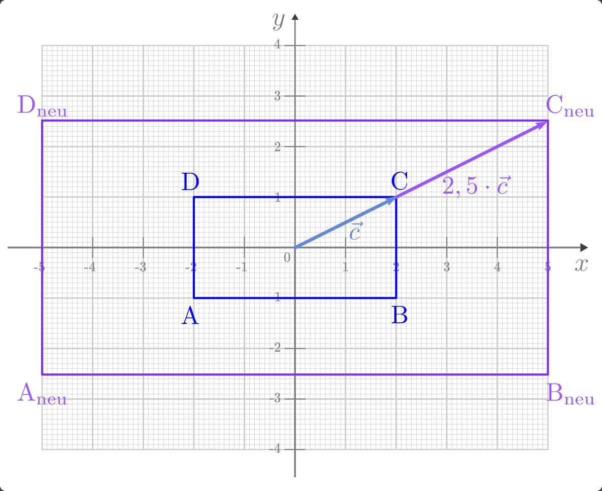
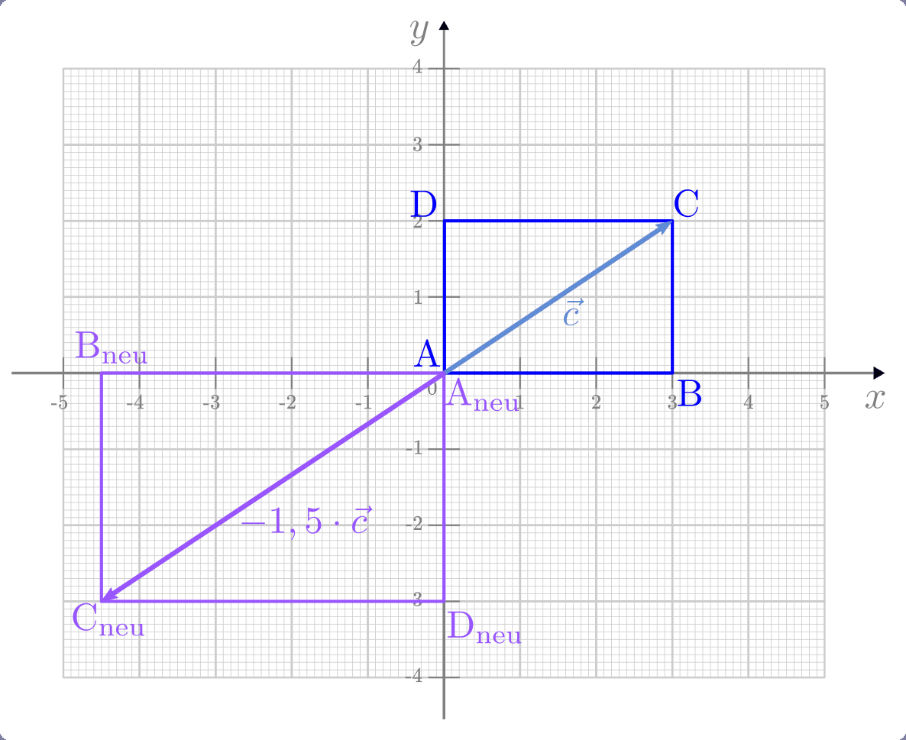
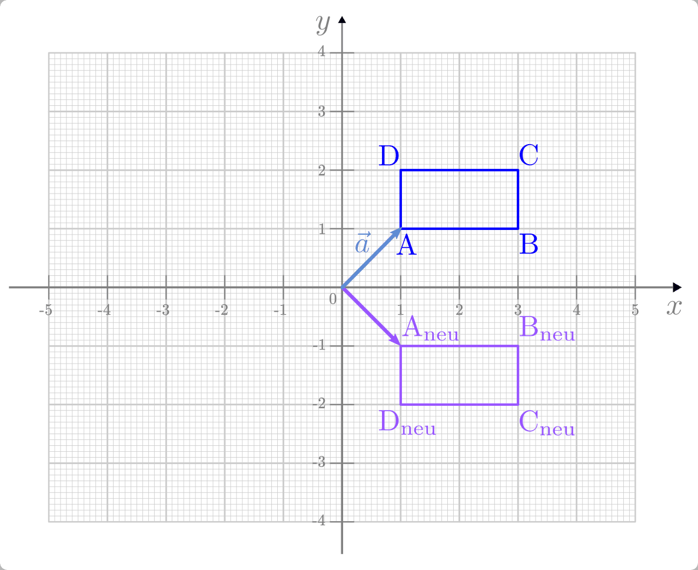
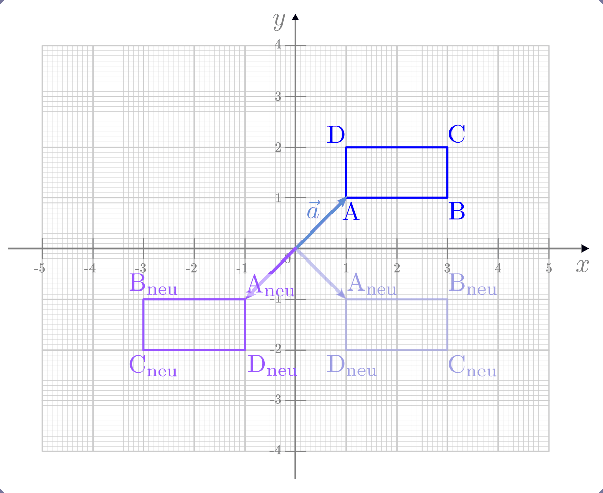
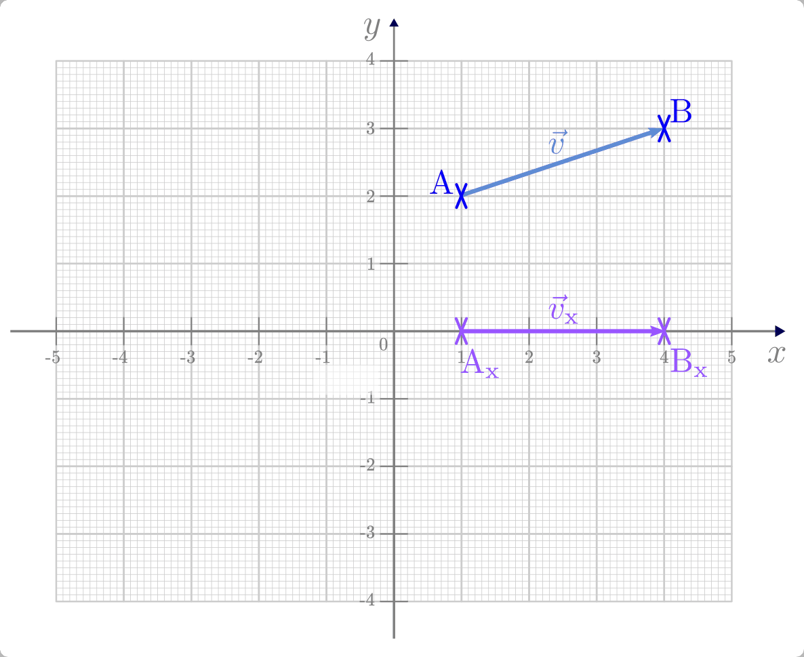
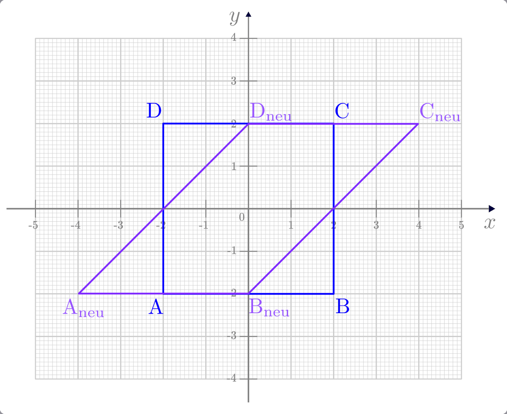

.. index:: Matrix
.. _Matrix:
.. _Matrizen:

Matrizen
========

Bei einer Matrix handelt es sich um eine
rechteckige Anordnungen mehrerer Zahlen. Hat eine Matrix :math:`m` Zeilen und
:math:`n` Spalten, so sagt man, die Matrix sei vom Typ :math:`(m;n)`. Eine
solche Matrix hat allgemein folgende Gestalt:

.. math::

    \underline{A}_{\;(m;\,n)} = \begin{pmatrix} a_{11} & a_{12} & \cdots & a_{1n}\\ a_{21} &
    a_{22} & \cdots & a_{2n}\\ \vdots & \vdots & & \vdots\\ a_{m1} & a_{m2} &
    \cdots & a_{mn}\\ \end{pmatrix}

In der Literatur werden Matrizen häufig auch durch fettgedruckte Großbuchstaben
bezeichnet, in der Praxis werden die Großbuchstaben hingegen üblicherweise
unterstrichen. Die in einer Matrix :math:`\underline{A}` stehenden Zahlen werden
allgemein Elemente oder Komponenten :math:`a_{\mathrm{ij}}` der Matrix genannt,
wobei :math:`i` den Zeilenindex (eine Zahl zwischen :math:`1` und :math:`n`) und
:math:`j` den Spaltenindex (eine Zahl zwischen :math:`1` und :math:`n`)
bezeichnet. Schreibt man :math:`(a_{\mathrm{ij}})` in runden Klammern, so ist
damit die Gesamtheit aller Komponenten, also wiederum die ganze Matrix gemeint.

.. _Spezielle Matrizen:

.. rubric:: Spezielle Matrizen

.. {{{

Matrizen können sowohl hinsichtlich der Zahlenwerte ihrer Komponenten als auch
hinsichtlich ihrer Form Besonderheiten aufweisen: Beispielsweise werden
Matrizen, die ausschließlich Nullen als Werte enthalten, Nullmatrizen genannt.
Andererseits können auch gewöhnliche Vektoren als spezielle Matrizen mit einer
Spaltenzahl von :math:`n=1` aufgefasst werden:

.. math::

    \vec{a} := \underline{A}_{\;(m;\,1)} = \begin{pmatrix}
        a_1 \\ a_2 \\ \vdots \\ a_{\mathrm{m}}
    \end{pmatrix}

Matrizen, die hingegen nur eine Zeilenzahl von :math:`m=1` haben, werden
entsprechend Zeilenvektoren genannt:

.. math::

    {\color{white}\vec{a}:=\quad}\underline{A}_{\;(1;\,n)} = \begin{pmatrix} a_1 \;
    \ldots \; a_{\mathrm{n}} \end{pmatrix}

.. _Transponierte Matrix:
.. _Matrix-Transposition:

Ein Zeilenvektor, der die gleichen Elemente hat wie ein Spaltenvektor
:math:`\vec{a}`, wird häufig auch mit :math:`\vec{a}^{\;\mathrm{T}}` bezeichnet. Das
hochgestellte :math:`\mathrm{T}` bedeutet dabei "transponiert". Allgemein kann zu jeder
Matrix :math:`\underline{A}` eine transponierte Matrix :math:`\underline{A}^{\mathrm{T}}`
gebildet werden, indem man die Zeilen und Spalten der Matrix vertauscht:

.. math::

    \underline{A}_{\;(m;\,n)} = \begin{pmatrix} a_{11} & a_{12} & \cdots\; \cdots\; \cdots & a_{1n}\\ a_{21} &
    a_{22} & \cdots\; \cdots \; \cdots & a_{2n}\\ \vdots  & \vdots & & \vdots \\ a_{m1} & a_{m2} &
    \cdots\; \cdots \; \cdots & a_{mn}\\ \end{pmatrix}
    \quad \Longleftrightarrow \quad
    \underline{A}^{\mathrm{T}}_{\;(n;\,m)} = \begin{pmatrix} a_{11} & a_{12} & \cdots & a_{1m}\\ a_{21} &
    a_{22} & \cdots & a_{2m}\\ \vdots & \vdots & & \vdots \\ \vdots & \vdots \\ \vdots & \vdots & &
    \vdots \\ a_{n1} & a_{n2} & \cdots & a_{nm}\\
    \end{pmatrix}

Beim Transponieren einer Matrix bleiben also nur diejenigen Komponenten
unverändert, die auf der von links oben nach rechts unten verlaufenden
"Hauptdiagonalen" liegen; alle anderen Einträge werden an dieser Diagonalen
gespiegelt. Bleibt eine Matrix beim Transponieren unverändert, so nennt man sie
symmetrisch.

.. index:: Matrix; Diagonalmatrix
.. _Quadratische Matrix:
.. _Diagonalmatrix:

Eine weitere Sonderstellung haben quadratische Matrizen, für deren Zeilen- wie
auch Spaltenanzahl :math:`m=n` gilt. Für jede derartige Matrix
:math:`\underline{A}_{\;(n;\,n)}` lässt sich eine so genannte Diagonalmatrix
:math:`\underline{D}_{\;(n;\,n)}` angeben, bei der alle Komponenten, die nicht
auf der Hauptdiagonalen liegen, gleich Null sind:

.. math::

    \underline{A}_{\;(n;\,n)} = \begin{pmatrix} a_{11} & a_{12} & \cdots &
    a_{1n}\\ a_{21} & a_{22} & \cdots & a_{2n}\\ \vdots & \vdots & & \vdots\\
    a_{n1} & a_{n2} & \cdots & a_{nn}\\ \end{pmatrix}
    \quad \Longleftrightarrow \quad
    \underline{D}_{\;(n;\,n)} = \begin{pmatrix} a_{11} & 0 & \cdots & 0\\ 0 &
    a_{22} & \cdots & 0\\ \vdots & \vdots & & \vdots\\ 0 & 0 &
    \cdots & a_{nn}\\ \end{pmatrix}

.. index:: Matrix; Einheitsmatrix
.. _Einheitsmatrix:
.. _Einheits-Matrix:

Eine Sonderform einer Diagonalmatrix ist eine so genannte Einheitsmatrix, bei
der alle Elemente auf der Hauptdiagonalen den Wert :math:`1` haben.

.. math::

    \underline{E}_{\;(n;\,n)} = \begin{pmatrix} 1 & 0 & \cdots & 0\\ 0 &
        1 & \cdots & 0\\ \vdots & \vdots & & \vdots\\ 0 & 0 &
        \cdots & 1 \\ \end{pmatrix}

Eine Gleichheit zweier Matrizen liegt nur dann vor, wenn beide die gleiche Form
haben und die Werte aller ihrer Komponenten identisch sind. Es muss also gelten:

.. math::

    \underline{A}_{\;(m;\,n)} = \underline{B}_{\;(m;\,n)} \quad \Longleftrightarrow
    \quad a_{ij} = b_{ij} \; \text{für alle $i,\,j$}

Die Wirkungsweise von Matrizen auf geometrische Objekte wird im übernächsten
Abschnitt beschrieben; im nächsten Abschnitt werden zunächst einige grundlegende
Rechenregeln für den Umgang mit Matrizen vorgestellt.

.. }}}

.. _Rechenregeln für Matrizen:

Rechenregeln für Matrizen
-------------------------

.. {{{

Die wichtigsten Rechenoperationen für Matrizen sind die Addition zweier Matrizen
sowie die Multiplikation einer Matrix mit einer Zahl, einem Vektor oder einer
anderen Matrix. Die Rechenregeln für Matrizen basieren auf den üblichen
:ref:`Grundrechenregeln <Grundrechenregeln>` der Arithmetik; man muss diese
lediglich in geordneter Weise auf "mehr" Zahlen angewenden.

.. index:: Matrixaddition
.. _Addition zweier Matrizen:

.. rubric:: Addition zweier Matrizen

Haben zwei Matrizen die gleiche Form, so können sie addiert beziehungsweise
subtrahiert werden, indem die jeweils an gleicher Stelle stehenden Komponenten
addiert beziehungsweise subtrahiert werden:

.. math::

    \underline{A}_{\;(m;\,n)} + \underline{B}_{\;(m;\,n)} = (a_{ij} +
    b_{ij})_{\;(m;\,n)} \; \text{für alle $i,\,j$}

Das Resultat einer Addition beziehungsweise Subtraktion ist wiederum eine
Matrix, welche die gleiche Form hat wie jede der beiden ursprünglichen Matrizen.

*Beispiel:*

* Welches Ergebnis liefert die Addition der folgenden beiden Matrizen?

  .. math::

      \underline{A} =
      \begin{pmatrix}
          \phantom{+}4 & -3 & \phantom{+}7 \\
          \phantom{+}2 & \phantom{+}9 & \phantom{+}1 \\
      \end{pmatrix} \qquad
      \underline{B} = \begin{pmatrix}
          -4 & \phantom{+}1 & -9 \\
          -1 & -7 & \phantom{+}2 \\
      \end{pmatrix}

  Bei der Matrizen-Addition werden die einzelnen Komponenten beider Matrizen
  addiert:

  .. math::

      \underline{A} + \underline{B} &= \begin{pmatrix}
          \phantom{+}4 & -3 & \phantom{+}7 \\
          \phantom{+}2 & \phantom{+}9 & \phantom{+}1 \\
      \end{pmatrix} +
      \begin{pmatrix}
          -4 & \phantom{+}1 & -9 \\
          -1 & -7 & \phantom{+}2 \\
      \end{pmatrix} \\[4pt] &=
      \begin{pmatrix}
          \big(4+(-4)\big) & \big( (-3) + \phantom{+}1\big) & \big( 7 + (-9)\big) \\
          \big(2 + (-1)\big) & \big(\phantom{+}9 + (-7)\big) & \big( 1 + \phantom{+}2 \phantom{+}\big) \\
      \end{pmatrix} =
      \begin{pmatrix}
          0 & -2 & -2 \\
          1 & \phantom{+}2 & \phantom{+}3
      \end{pmatrix}

Da die Addition beziehungsweise Subtraktion komponentenweise nach den gleichen
Rechenregeln wie mit gewöhnlichen Zahlen erfolgt, gilt auch für die Addition
beziehungsweise Subtraktion das :ref:`Kommutativ- <Kommutativgesetz>` und
:ref:`Assoziativgesetz <Assoziativgesetz>` :

.. math::
    :label: eqn-kommutativgesetz-matrixaddition

    \underline{A} + \underline{B} = \underline{B} + \underline{A}

.. math::
    :label: eqn-assoziativgesetz-matrixaddition

    (\underline{A} + \underline{B}) + \underline{C} = \underline{A} +
    (\underline{B} + \underline{C}) = \underline{A} + \underline{B} +
    \underline{C}

.. _Matrix Skalarmultiplikation:
.. _Multiplikation einer Matrix mit einer Zahl:
.. _Multiplikation einer Matrix mit einem Skalar:

.. rubric:: Multiplikation einer Matrix mit einer Zahl

Die Multiplikation einer Matrix mit einer reellen Zahl (einem so genannten
"Skalar") erfolgt ebenfalls komponentenweise: Jedes Element der Matrix
:math:`\underline{A}` wird mit dem Wert des Skalars :math:`c` multipliziert. Man
kann also schreiben:

.. math::

    c \cdot \underline{A}_{\;(m;\,n)} = (c \cdot a_{ij} )_{\;(m;\,n)} \;
    \text{für alle $i,\,j$}

Das Resultat einer ist wiederum eine Matrix, welche die gleiche Form hat wie die
ursprüngliche Matrix.

*Beispiel:*

* Welches Ergebnis erhält man, wenn man folgende Matrix mit :math:`c=4`
  multipliziert?

  .. math::

      \underline{A} = \begin{pmatrix}
          7 & -2 \\
          0 & \phantom{+}3 \\
      \end{pmatrix}

  Bei der Multiplikation einer Matrix mit einer Zahl werden alle Komponenten der
  Matrizen mit dieser Zahl multipliziert:

  .. math::

      c \cdot \underline{A} = 4 \cdot \begin{pmatrix}
          7 & -2 \\
          0 & \phantom{+}3 \\
      \end{pmatrix} = \begin{pmatrix}
          4 \cdot 7 & 4 \cdot (-2) \\
          4 \cdot 0 & 4 \cdot \;\;\;\;3 \;\;\\
      \end{pmatrix}
      \begin{pmatrix}
          28 & -8 \\
          0 & 12
      \end{pmatrix}

Auch für die Multiplikation einer Matrix mit einer Zahl gelten das
:ref:`Kommutativ- <Kommutativgesetz>` und :ref:`Assoziativgesetz
<Assoziativgesetz>`:

.. math::
    :label: eqn-kommutativgesetz-matrix-skalarmultiplikation

    c \cdot \underline{A} = \underline{A} \cdot c

.. math::
    :label: eqn-assoziativgesetz-matrix-skalarmultiplikation

    c_1 \cdot (c_2 \cdot \underline{A}) = (c_1 \cdot c_2) \cdot \underline{A} =
    c_1 \cdot c_2 \cdot \underline{A}

Zudem gilt das :ref:`Distributivgesetz <Distributivgesetz>` in gewohnter Form:

.. math::
    :label: eqn-distributivgesetz-matrix-skalarmultiplikation

    (c_1 + c_2) \cdot \underline{A} &= c_1 \cdot \underline{A} + c_2 \cdot
    \underline{A} \\
    c \cdot (\underline{A} + \underline{B}) &= c \cdot \underline{A} + c \cdot
    \underline{B} \\

.. _Multiplikation eines Zeilen- mit einem Spaltenvektor:

.. rubric:: Multiplikation eines Zeilen- mit einem Spaltenvektor

Zur Herleitung einer Rechenregel für die Multiplikation zweier Matrizen wird
zunächst von der skalaren Multiplikation eines Zeilenvektors mit einem
Spaltenvektor ausgegangen. Wie bei einem gewöhnlichen :ref:`Skalarprodukt zweier
Vektoren <Skalarprodukt>` werden dabei die einzelnen Komponenten des Zeilen- und
des Spaltenvektors miteinander multipliziert, und die sich dabei ergebenden
Teilergebnisse schließlich summiert.

.. math::
    :label: eqn-skalarprodukt-zeilenvektor-spaltenvektor

    \vec{a}^{\;\mathrm{T}}_{(1;\,n)} \cdot \vec{b}_{(n,1)} = (a_1,\, a_2,\,
    \ldots,\, a_{\mathrm{n}}) \cdot \begin{pmatrix}
    b_1 \\ b_2 \\ \vdots \\ b_{\mathrm{n}} \end{pmatrix} = a_1 \cdot b_1 + a_2
    \cdot b_2 + \ldots + a_{\mathrm{n}} \cdot b_{\mathrm{n}} = \sum_{i=1}^{n}
    a_{\mathrm{i}} \cdot b_{\mathrm{i}}

Damit eines solches Produkt möglich ist, muss der Zeilenvektor ebenso viele
Komponenten haben wie der Spaltenvektor. Das Ergebnis des Produkts ist dann eine
gewöhnliche Zahl (ein Skalar).

*Beispiel:*

* Welches Ergebnis erhält man, wenn man den Zeilenvektor
  :math:`\vec{a}^{\;\mathrm{T}} = (3,\, -5,\, 4)` mit dem Spaltenvektor
  :math:`\vec{b} = ( -1 \,\, +2,\, {+}1)` multipliziert?

  .. math::

      \vec{a}^{\;\mathrm{T}}\cdot \vec{b} = (3,\, -5,\, 4) \cdot
      \begin{pmatrix} -1 \\ \phantom{+}2 \\ \phantom{+}1 \end{pmatrix} = 3 \cdot
      (-1) + (-5) \cdot 2 + 4 \cdot 1 = -9

  Das Produkt liefert somit den Wert :math:`\vec{a} ^{\;\mathrm{T}}\cdot \vec{b} = -9`

.. index:: Matrixmultiplikation
.. _Multiplikation Matrix Vektor:
.. _Multiplikation einer Matrix mit einem Vektor:

.. rubric:: Multiplikation einer Matrix mit einem Vektor

Multipliziert man nun nicht nur einen Zeilenvektor mit :math:`n` Komponenten,
sondern eine :math:`n`-spaltige Matrix mit einem Spaltenvektor der Länge
:math:`n`, so wird nach der obigen Regel
:eq:`eqn-skalarprodukt-zeilenvektor-spaltenvektor` für jede Zeile der Matrix ein
Skalarprodukt mit dem Spaltenvektor gebildet. Hat die Matrix :math:`m` Zeilen,
so erhält man folglich :math:`m` einzelne Ergebnisse. Diese werden als
Komponenten in einen neuen Spaltenvektor der Länge :math:`m` geschrieben.

.. math::

    \begin{array}{c|c}
    \underline{A} \cdot \vec{b}  &
    \begin{pmatrix}
        \; b_1 \; \\
        b_2 \\
        \vdots \\
        b_{n} \\
    \end{pmatrix} \\ \midrule
    \begin{pmatrix}
        a_{11} & a_{12} & \ldots & a_{1n} \\
        a_{21} & a_{22} & \ldots & a_{2n} \\
        \vdots & \vdots & \ddots & \vdots \\
        a_{m1} & a_{m2} & \ldots & a_{mn} \\
    \end{pmatrix} &
    \begin{pmatrix}
        \sum_{i=1}^{n} a_{\mathrm{1i}} \cdot b_{\mathrm{i}} \\[4pt]
        \sum_{i=1}^{n} a_{\mathrm{2i}} \cdot b_{\mathrm{i}} \\[4pt]
        \vdots \\
        \sum_{i=1}^{n} a_{\mathrm{mi}} \cdot b_{\mathrm{i}} \\
    \end{pmatrix}
    \end{array}

.. .. figure:: ../pics/algebra/matrix-multiplikation-falk-schema-1.png
..     :name: fig-matrix-multiplikation-falk-schema
..     :alt:  fig-matrix-multiplikation-falk-schema
..     :align: center
..     :width: 75%

..     Multiplikation einer Matrix mit einem Spaltenvektor ("Falk-Schema")

..     .. only:: html

..         :download:`SVG: Matrix-Multiplikation (Falk-Schema) 1 <../pics/algebra/matrix-multiplikation-falk-schema-1.svg>`

*Beispiel:*

* Welches Ergebnis erhält man, wenn man die folgende Matrix
  :math:`\underline{A}` mit dem folgenden Vektor :math:`\vec{b}` multipliziert?

  .. math::

      \underline{A} = \begin{pmatrix}
          \phantom{+}3 & \phantom{+}1 & \phantom{+}2 \\
          \phantom{+}1 & \phantom{+}2 & \phantom{+}1 \\
          -1 & \phantom{+}1 & -3 \\
      \end{pmatrix} \qquad \vec{b} = \begin{pmatrix}
          \phantom{+}3 \\ -2 \\ \phantom{+}1
      \end{pmatrix}

  Für die Multiplikation der Matrix :math:`\underline{A}` mit dem Vektor
  :math:`\vec{b}` gilt nach obigem Schema:

  .. math::

      \underline{A} \cdot \vec{b} =  \quad \begin{array}{r|c}
      & \begin{pmatrix}
          \phantom{+}3 \\ -2 \\ \phantom{+}1
      \end{pmatrix} \\ \midrule
      \begin{pmatrix}
          \phantom{+}3 & \phantom{+}1 & \phantom{+}2 \\
          \phantom{+}1 & \phantom{+}2 & \phantom{+}1 \\
          -1 & \phantom{+}1 & -3 \\
      \end{pmatrix} & \begin{pmatrix}
          \phantom{+}3 \cdot 3 + \phantom{+}1 \cdot (-2) + \phantom{(+}2\phantom{)} \cdot 1 \\
          \phantom{+}1 \cdot 3 + \phantom{+}2 \cdot (-2) + \phantom{(+}1\phantom{)} \cdot 1 \\
          -1 \cdot 3 + \phantom{+}1 \cdot (-2) + (-3) \cdot 1
      \end{pmatrix}
      \end{array}  = \begin{pmatrix}
          \phantom{+}9 \\ \phantom{+}0 \\ -8
      \end{pmatrix}

Ein Produkt einer Matrix mit einem Vektor kann nur dann gebildet werden, wenn
die Anzahl an Spalten der Matrix mit der Anzahl an Zeilen des Vektors
übereinstimmt; andernfalls ist die Multiplikation nicht definiert.

.. A = np.array( [ [3,1,2], [1,2,1], [-1,1,-3] ] )
.. b = np.array( [ [3],[-2],[1] ] )
.. np.dot(A,b)
.. array([[ 9], [ 0], [-8]])

.. index:: Falk-Schema
.. _Multiplikation zweier Matrizen:

.. rubric:: Multiplikation zweier Matrizen

Beim so genannten "Falk-Schema", wie es in der obigen Abbildung dargestellt ist,
werden die zu multiplizierenden Matrizen beziehungsweise Vektoren tabellenartig
aufgelistet. [#]_ Die Auswertung erfolgt allgemein nach folgender Regel:
Multipliziert man die :math:`i`-te Zeile der linken Matrix mit der :math:`j`-ten
Spalter der rechten Matrix, so erhält man die Komponente der Ergebnis-Matrix,
die dort in der :math:`i`-ten Zeile und :math:`j`-ten Spalte steht.

Das Falk-Schema kann also einfach auf die Multiplikation zweier Matrizen
ausgeweitet werden: Hierbei wird jeweils an der Stelle, wo sich eine Zeile der
linken Matrix mit einer Spalte der rechten Matrix überkreuzt, das entsprechende
Skalarprodukt eingetragen.

.. math::

    \begin{array}{c|c}
    \underline{A} \cdot \underline{B}  &
    \begin{pmatrix}
        \phantom{.}\quad b_{11} \;\qquad        & \qquad\qquad b_{12}           & \;\qquad \cdots \qquad & \qquad b_{\mathrm{1p}} \quad\phantom{.}\\[6pt]
        \phantom{.}\quad b_{21} \;\qquad        & \qquad\qquad b_{22}           & \;\qquad \cdots \qquad & \qquad b_{\mathrm{2p}} \quad\phantom{.}\\[6pt]
        \phantom{.}\quad \vdots \;\qquad        & \qquad\qquad \vdots           & \;\qquad \ddots \qquad & \qquad \vdots          \quad\phantom{.}\\[6pt]
        \phantom{.}\quad b_{\mathrm{n1}} \qquad & \qquad\qquad b_{\mathrm{n2}}  & \;\qquad \cdots \qquad & \qquad b_{\mathrm{np}} \quad\phantom{.}\\
    \end{pmatrix} \\ \midrule
    \begin{pmatrix}
        a_{11} & a_{12} & \ldots & a_{\mathrm{1n}} \\[6pt]
        a_{21} & a_{22} & \ldots & a_{\mathrm{2n}} \\[6pt]
        \vdots & \vdots & \ddots & \vdots \\[6pt]
        a_{\mathrm{m1}} & a_{\mathrm{m2}} & \ldots & a_{\mathrm{mn}} \\
    \end{pmatrix} &
    \begin{pmatrix}
        \sum_{i=1}^{n} a_{\mathrm{1i}} \cdot b_{\mathrm{1i}} & \sum_{i=1}^{n}
        a_{\mathrm{1i}} \cdot b_{\mathrm{2i}} & \cdots & \sum_{i=1}^{n}
        a_{\mathrm{1i}} \cdot b_{\mathrm{pi}} \\[6pt]
        \sum_{i=1}^{n} a_{\mathrm{2i}} \cdot b_{\mathrm{1i}} & \sum_{i=1}^{n}
        a_{\mathrm{2i}} \cdot b_{\mathrm{2i}} & \cdots & \sum_{i=1}^{n} a_{\mathrm{2i}}
        \cdot b_{\mathrm{pi}} \\[6pt]
        \vdots & \vdots & \ddots & \vdots \\[6pt]
        \sum_{i=1}^{n} a_{\mathrm{mi}} \cdot b_{\mathrm{1i}} & \sum_{i=1}^{n}
        a_{\mathrm{mi}} \cdot b_{\mathrm{2i}} & \cdots & \sum_{i=1}^{n}
        a_{\mathrm{mi}} \cdot b_{\mathrm{pi}} \\
    \end{pmatrix}
    \end{array}

.. .. figure:: ../pics/algebra/matrix-multiplikation-falk-schema-2.png
..     :name: fig-matrix-multiplikation-falk-schema2
..     :alt:  fig-matrix-multiplikation-falk-schema2
..     :align: center
..     :width: 75%

..     Multiplikation einer Matrix mit einer zweiten Matrix ("Falk-Schema").

..     .. only:: html

..         :download:`SVG: Matrix-Multiplikation (Falk-Schema) 2 <../pics/algebra/matrix-multiplikation-falk-schema-2.svg>`

Auch in diesem Fall ist das Produkt nur dann definiert, wenn die die Anzahl an
Spalten der linken Matrix mit der Anzahl an Zeilen des Vektors übereinstimmt.
Hat die linke Matrix die Form :math:`(m;\,n)` und die rechte Matrix die Form
:math:`(n;\,p)`, so erhält man als Ergebnis eine neue Matrix der Form
:math:`(m;\,p)`. Multipliziert man zwei quadratische Matrizen mit gleicher
Zeilen- beziehungsweise Spaltenanzahl, so ist die Form der resultierenden Matrix
mit der Form der beiden ursprünglichen Matrizen identisch.

*Beispiel:*

* Welches Ergebnis erhält man, wenn man die beiden folgenden Matrizen
  miteinander multipliziert?

  .. math::

      \underline{A} = \begin{pmatrix}
          \phantom{+}2 & \phantom{+}4 & \phantom{+}1 \\
          \phantom{+}0 & -1 & \phantom{+}3 \\
      \end{pmatrix} \qquad \underline{B} = \begin{pmatrix}
          \phantom{+}1 & -3 \\
          -4 & \phantom{+}2 \\
          \phantom{+}2 & \phantom{+}0 \\
      \end{pmatrix}

  Für die Multiplikation der beiden Matrizen :math:`\underline{A}` und
  :math:`\underline{B}` gilt nach dem obigen Schema:

  .. only:: html

      .. math::

          \begin{array}{r|c}
          \underline{A} \cdot \underline{B} \qquad \phantom{.}& \begin{pmatrix}
              \quad \phantom{+}1 \hspace{5.5cm} & \hspace{5.5cm} -3 \quad \phantom{.}\\
              \quad -4           \hspace{5.5cm} & \hspace{5.5cm} \phantom{+}2 \quad \phantom{.}\\
              \quad \phantom{+}2 \hspace{5.5cm} & \hspace{5.5cm} \phantom{+}0 \quad \phantom{.}\\
          \end{pmatrix} \\ \midrule
          \begin{pmatrix}
              \phantom{+}2 & \phantom{+}4 & \phantom{+}1 \\
              \phantom{+}0 & -1 & \phantom{+}3 \\
          \end{pmatrix} & \begin{pmatrix}
              \big(\;2 \cdot 1 + \phantom{(+}4 \phantom{)} \cdot (-4) + \phantom{+}1 \cdot 2 \;\big) &
              \big(\;2 \cdot (-3) + \phantom{(+}4 \phantom{)}\cdot 2 + \phantom{+}1 \cdot 0 \;\big) \\
              \big(\;0 \cdot 1 + (-1) \cdot (-4) + \phantom{+}3 \cdot 2 \;\big) &
              \big(\;0 \cdot (-3) + (-1) \cdot 2 + \phantom{+}3 \cdot 0 \;\big) \\
          \end{pmatrix}
          \end{array}  = \begin{pmatrix}
              -12 & \phantom{+}2 \\
              \phantom{+}10 & -2 \\
          \end{pmatrix}

  .. only:: latex

      .. math::

          \begin{array}{r|c}
          \underline{A} \cdot \underline{B} \qquad \phantom{.}& \begin{pmatrix}
              \quad \phantom{+}1 \hspace{5.5cm} & \hspace{5.5cm} -3 \quad \phantom{.}\\
              \quad -4           \hspace{5.5cm} & \hspace{5.5cm} \phantom{+}2 \quad \phantom{.}\\
              \quad \phantom{+}2 \hspace{5.5cm} & \hspace{5.5cm} \phantom{+}0 \quad \phantom{.}\\
          \end{pmatrix} \\ \midrule
          \begin{pmatrix}
              \phantom{+}2 & \phantom{+}4 & \phantom{+}1 \\
              \phantom{+}0 & -1 & \phantom{+}3 \\
          \end{pmatrix} & \begin{pmatrix}
              \big(\;2 \cdot 1 + \phantom{(+}4 \phantom{)} \cdot (-4) + \phantom{+}1 \cdot 2 \;\big) &
              \big(\;2 \cdot (-3) + \phantom{(+}4 \phantom{)}\cdot 2 + \phantom{+}1 \cdot 0 \;\big) \\
              \big(\;0 \cdot 1 + (-1) \cdot (-4) + \phantom{+}3 \cdot 2 \;\big) &
              \big(\;0 \cdot (-3) + (-1) \cdot 2 + \phantom{+}3 \cdot 0 \;\big) \\
          \end{pmatrix}
          \end{array}

      .. math::

          \Rightarrow \underline{A} \cdot \underline{B} \; = \; \begin{pmatrix}
              -12 & \phantom{+}2 \\
              \phantom{+}10 & -2 \\
          \end{pmatrix}

Die Bedingung, dass bei der Multiplikation zweier Matrizen auf zueinander
passende Spalten- und Zeilenanzahlen geachtet werden muss, zeigt bereits, dass
bei diesem Rechenvorgang die Reihenfolge der Faktoren von Bedeutung ist:

* Multipliziert man eine Matrix der Form :math:`(2;\,3)` mit einer Matrix der
  Form :math:`(3;\,2)`, so ergibt sich eine Matrix der Form :math:`(2;\,2)`.
* Multipliziert man eine Matrix der Form :math:`(3;\,2)` mit einer Matrix der
  Form :math:`(2;\,3)`, so ergibt sich eine Matrix der Form :math:`(3;\,3)`.

Für die Multiplikation zweier Matrizen gilt folglich im Allgemeinen
Kommutativgesetz der Multiplikation *nicht* :

.. math::
    :label: eqn-kommutativgesetz-matrix-multiplikation

    \underline{A} \cdot \underline{B} \ne \underline{B} \cdot \underline{A}

Für die Multiplikation zweier Matrizen gilt allerdings das Assoziativgesetz:

.. math::
    :label: eqn-assoziativgesetz-matrix-multiplikation

    (\underline{A} \cdot \underline{B}) \cdot \underline{C} = \underline{A}
    \cdot (\underline{B} \cdot \underline{C}) = \underline{A} \cdot
    \underline{B} \cdot \underline{C}

Auch das Distributivgesetz gilt für die Multiplikation zweier Matrizen in
folgender Form:

.. math::
    :label: eqn-distributivgesetz-matrix-multiplikation

    \underline{A} \cdot (\underline{B} + \underline{C}) = \underline{A} \cdot
    \underline{B} + \underline{A} \cdot \underline{C}

Zusätzlich gilt, dass bei jedem Produkt einer Matrix :math:`\underline{A}` mit
einer entsprechenden Nullmatrix :math:`\underline{0}` wiederum eine Nullmatrix
entsteht (da jedes einzelnen Skalarprodukt den Wert Null hat). Multipliziert man
hingegen eine beliebige Matrix :math:`\underline{A}` mit einer Einheitsmatrix
:math:`\underline{E}`, so erhält man die ursprüngliche Matrix
:math:`\underline{A}` als Ergebnis. Es gilt also (in diesem Fall sogar
unabhängig von der Reihenfolge der Faktoren):

.. math::
    :label: eqn-matrix-multiplikation-neutrales-und-inverses-element

    \underline{A} \cdot \underline{0} = \underline{0} \cdot \underline{A} &=
    \underline{0} \\[4pt]
    \underline{A} \cdot \underline{E} = \underline{E} \cdot \underline{A} &=
    \underline{E} \\[4pt]

.. Todo Auch Produkt zweier zweier 'normaler' Matrizen mit Ergebnis Nullmatrix
.. möglich

Eine Division zweier Matrizen ist nicht definiert.

.. }}}

.. _Sonderformen von Matrizen:
.. _Wirkungsweise von Matrizen:

Wirkungsweise von Matrizen
--------------------------

Die Wirkungsweise von Matrizen lässt sich gut veranschaulichen, wenn man
einzelne Vektoren in einem ebenen Koordinatensystem betrachtet und verschiedene
Arten von Matrizen auf diese anwendet.

Da es in einem ebenen Koordinatensystem nur zweidimensionale Objekte gibt,
benötigen die jeweiligen (Orts-)Vektoren nur zwei Komponenten (:math:`x` und
:math:`y`); die für ein solches System relevanten Matrizen haben entsprechend
ebenfalls nur :math:`(2 \times 2)` Komponenten.

.. index:: Skalierungsmatrix
.. _Skalierungsmatrix:
.. _Skalierungsmatrizen:

.. rubric:: Skalierungsmatrizen

Eine Skalierungsmatrix hat für ein zweidimensionales Koordinatensystem folgende
Form:

.. math::
    :label: eqn-skalierungsmatrix

    \underline{A}_{\mathrm{\,Ska}} = \begin{pmatrix}
        \lambda & 0 \\
        0 & \lambda
    \end{pmatrix}

Hierbei ist :math:`\lambda \in \mathbb{R}` ein beliebiger Zahlenwert.

Multipliziert man eine derartige Matrix mit dem Ortsvektor eines Punktes, so
erhält man als Resultat wiederum einen Ortsvektor mit gleicher Richtung; dessen
Länge beträgt allerdings das :math:`\lambda`-fache des ursprünglichen
Ortsvektors.

*Beispiele:*

* Wird eine Skalierungsmatrix :math:`\underline{A}_{\mathrm{\,Ska}}` mit
  :math:`\lambda = 1` mit einem Vektor multipliziert, so bleibt dieser
  unverändert. Dies soll am Beispiel des Punktes :math:`\mathrm{P} = (3;\, 2)`
  beziehungsweise des zugehörigen Ortsvektors :math:`\vec{p} =
  \overrightarrow{\mathrm{0P}}` gezeigt werden:

  .. math::

      \underline{A}_{\mathrm{\,Ska}} \cdot \vec{p} = \begin{pmatrix}
          1 & 0 \\ 0 & 1
      \end{pmatrix} \cdot \begin{pmatrix}
          3 \\ 2
      \end{pmatrix} = \begin{pmatrix}
          1 \cdot 3 + 0 \cdot 2 \\
          0 \cdot 3 + 1 \cdot 2
      \end{pmatrix} = \begin{pmatrix}
          3 \\ 2
      \end{pmatrix} = \vec{p}{\color{white}\cdot 3 \cdot 3}

  Der Vektor :math:`\vec{p}` wird somit durch die :ref:`Einheits-Matrix
  <Einheits-Matrix>` nicht verändert.

* Wird eine Skalierungsmatrix :math:`\underline{A}_{\mathrm{\,Ska}}` mit
  :math:`\lambda = 2,5` mit einem Vektor multipliziert, so wird dieser um den
  Faktor :math:`2,5` gestreckt. Dies soll am Beispiel eines Rechtecks gezeigt
  werden, dessen Eckpunkte folgende Koordinaten haben:

  .. math::

      \mathrm{A} = \begin{pmatrix}
          -2;\, -1
      \end{pmatrix} \quad \mathrm{B} = \begin{pmatrix}
          \phantom{+}2;\, -1
      \end{pmatrix} \quad \mathrm{C} = \begin{pmatrix}
          \phantom{+}2;\, +1
      \end{pmatrix} \quad \mathrm{D} = \begin{pmatrix}
          -2;\, +1
      \end{pmatrix}

  Man kann sich die Wirkungsweise der Matrix beispielhaft anhand des Ortsvektors
  :math:`\vec{c} = (2;\, 1)` des Punktes :math:`\mathrm{C}` veranschaulichen:

  .. math::

      \underline{A}_{\mathrm{\,Ska}} \cdot \vec{c} = \begin{pmatrix}
          2,5 & 0 \\ 0 & 2,5
      \end{pmatrix} \cdot \begin{pmatrix}
          2 \\ 1
      \end{pmatrix} = \begin{pmatrix}
          2,5 \cdot 2 + \phantom{2,}0 \cdot 1 \\
          \phantom{2\,\,.}0 \cdot 2 + 2,5 \cdot 1
      \end{pmatrix} = \begin{pmatrix}
          2,5 \cdot 2 \\ 2,5 \cdot 1
      \end{pmatrix} = 2,5 \cdot \vec{c}

  Die Koordinaten-Berechnung der übrigen neuen Punkte erfolgt nach dem gleichen
  Schema: Man erhält für jeden der Punkte einen Ortsvektor, der um einen Faktor
  :math:`2,5` gestreckt ist.

    Wirkungsweise einer Skalierungsmatrix.

    .. only:: html

        :download:`SVG: Skalierungsmatrix
        <../pics/geometrie/skalierungsmatrix.svg>`

Gilt für die Skalierungsgröße :math:`0 \lambda < 1`, so wird der Vektor
beziehungsweise ein aus vielerlei Vektoren bestehendes geometrisches Objekt
durch die Matrix originalgetreu verkleinert (gestaucht). Beispielsweise würde im
obigen Beispiel ein Skalierungsfaktor von :math:`\lambda = \frac{1}{3}` eine
Umkehrung der Skalierung mit dem Faktor :math:`3` zur Folge haben.

Gilt für die Skalierungsgröße :math:`\lambda < 0`, so wird jeder Ortsvektor, auf
den die Matrix angewendet wird, nicht nur um den Faktor :math:`|\lambda|`
skaliert, sondern es wird zusätzlich sein Vorzeichen vertauscht. Hierdurch wird
die Richtung des Ortsvektors umgedreht: Beispielsweise zeigt ein Vektor, der
ursprünglich nach rechts oben gezeigt hat, nach einer Skalierung mit einem
negativen Skalierungsfaktor nach links unten. der Ortsvektor beziehungsweise das
geometrische Objekt erfährt dadurch eine :ref:`zentrische Streckung
<Zentrische Streckung>` am Koordinaten-Ursprung.

*Beispiel:*

* Wird eine Skalierungsmatrix :math:`\underline{A}_{\mathrm{\,Ska}}` mit
  :math:`\lambda = -1,5` mit einem Ortsvektor multipliziert, so wird dieser um
  den Faktor :math:`1,5` gestreckt und um :math:`\unit[180]{\degree}` um den
  Koordinatenursprung gedreht. Dies soll am Beispiel eines Rechtecks gezeigt
  werden, dessen Eckpunkte folgende Koordinaten haben:

  .. math::

      \mathrm{A} = \begin{pmatrix}
          \; 0;\, 0 \,\phantom{.}
      \end{pmatrix} \quad \mathrm{B} = \begin{pmatrix}
          \; 3;\, \phantom{+}0 \,\phantom{.}
      \end{pmatrix} \quad \mathrm{C} = \begin{pmatrix}
          \; 3;\, +2 \,\phantom{.}
      \end{pmatrix} \quad \mathrm{D} = \begin{pmatrix}
          \; 0;\, +2 \,\phantom{.}
      \end{pmatrix}

  Man kann sich die Wirkungsweise der Matrix wiederum beispielhaft anhand des
  Ortsvektors :math:`\vec{c} = (3;\, 2)` des Punktes :math:`\mathrm{C}`
  veranschaulichen:

  .. math::

      \underline{A}_{\mathrm{\,Ska}} \cdot \vec{c} = \begin{pmatrix}
          -1,5 & 0 \\ 0 & -1,5
      \end{pmatrix} \cdot \begin{pmatrix}
          3 \\ 2
      \end{pmatrix} = \begin{pmatrix}
          -1,5 \cdot 3           + \phantom{1,.}0 \cdot 2 \\
          \phantom{-2,}0 \cdot 3 - \phantom{.}1,5 \cdot 2
      \end{pmatrix} = \begin{pmatrix}
          -1,5 \cdot 3 \\ -1,5 \cdot 2
      \end{pmatrix} = -1,5 \cdot \vec{c}

  Die Koordinaten-Berechnung der übrigen neuen Punkte erfolgt wiederum nach dem
  gleichen Schema; man erhält somit ein um den Faktor :math:`1,5` skaliertes
  Objekt im gegenüber liegenden Quadranten.

    Wirkungsweise einer Skalierungsmatrix mit negativem Skalierungsfaktor.

    .. only:: html

        :download:`SVG: Skalierungsmatrix (Skalierungsfaktor negativ)
        <../pics/geometrie/skalierungsmatrix-negativ.svg>`

.. index:: Spiegelungsmatrix
.. _Spiegelungsmatrix:
.. _Spiegelungsmatrizen:

.. rubric:: Spiegelungsmatrizen:

Soll ein (Orts-)Vektor an der :math:`x`- oder an der :math:`y`-Achse eines
zweidimensionalen Koordinatensystems gespiegelt werden, so ist dies mittels der
folgenden Matrizen möglich:

.. math::
    :label: eqn-spiegelungsmatrix

    \text{Spiegelung an der $x$-Achse:} \quad \underline{A}_{\mathrm{\,Spi}} =
    \begin{pmatrix}
    \phantom{+}1 & \phantom{+}0 \;\phantom{.}\\
    \phantom{+}0 &          - 1 \;\phantom{.}
    \end{pmatrix} \\[12pt]
    \text{Spiegelung an der $y$-Achse:} \quad \underline{A}_{\mathrm{\,Spi}}  =
    \begin{pmatrix}
    -1 & \phantom{+}0 \; \phantom{.}\\
    \phantom{+}0 & \phantom{+}1 \;\phantom{.}
    \end{pmatrix} \\[8pt]

Diese beiden Spiegelungsmatrizen ähneln einer Skalierungsmatrix mit der
Skalierungsgröße :math:`1`; auch sie lassen die Länge eines Vektors
beziehungsweise die Größe eines durch mehrere (Orts-)Vektoren festgelegten
Objekts unverändert. Der Unterschied zur reinen Skalierung liegt also in dem nun
auftretenden Minus-Zeichen.

*Beispiel:*

* Das Rechteck mit den folgenden Eckpunkten soll an der :math:`x`-Achse
  gespiegelt werden:

  .. math::

      \mathrm{A} = \begin{pmatrix}
          \; 1;\, 1 \,\phantom{.}
      \end{pmatrix} \quad \mathrm{B} = \begin{pmatrix}
          \; 3;\, \phantom{+}1 \,\phantom{.}
      \end{pmatrix} \quad \mathrm{C} = \begin{pmatrix}
          \; 3;\, +2 \,\phantom{.}
      \end{pmatrix} \quad \mathrm{D} = \begin{pmatrix}
          \; 1;\, +2 \,\phantom{.}
      \end{pmatrix}

  Wendet man die obige Spiegelungsmatrix beispielsweise auf den Ortsvektor
  :math:`\vec{a}` des Punktes :math:`\mathrm{A}` an, so erhält man:

  .. math::

      \underline{A}_{\mathrm{\,Spi}} \cdot \vec{a} = \begin{pmatrix}
          \phantom{+}1 & \phantom{+}0 \; \phantom{.} \\
          \phantom{+}0 & -1 \; \phantom{.}
      \end{pmatrix} \cdot \begin{pmatrix}
          \phantom{+}1 \;\phantom{.} \\ -1\;\phantom{.}
      \end{pmatrix} = \begin{pmatrix}
          \phantom{+}1 \cdot 1 + \phantom{(-}0 \phantom{)} \cdot 1 \\
          \phantom{-}0 \cdot 1 + (-1) \cdot 1
      \end{pmatrix} = \begin{pmatrix}
          \phantom{+}1\,\phantom{.} \\ -1\,\phantom{.}
      \end{pmatrix}

  Die Matrix lässt also die :math:`x`-Komponente des Vektors, mit dem sie
  multipliziert wird, unverändert; die :math:`y`-Komponente des Vektors hingegen
  erhält ein umgekehrtes Vorzeichen.

    Wirkungsweise einer Spiegelungsmatrix

    .. only:: html

        :download:`SVG: Spiegelungsmatrix
        <../pics/geometrie/spiegelungsmatrix.svg>`

Die Spiegelung an der :math:`y`-Achse erfolgt nach dem gleichen Prinzip; die
entsprechende Matrix lässt hierbei allerdings die :math:`y`-Komponente des
Vektors unverändert, während die :math:`x`-Komponente ein umgekehrtes Vorzeichen
erhält.

Wendet man die gleiche Spiegelungsmatrix zweimal hintereinander auf einen Vektor
beziehungsweise ein geometrisches Objekt an, so stimmt das Resultat mit dem
ursprünglichen Objekt überein. Nimmt man hingegen zuerst eine Spiegelung an der
:math:`x`- und anschließend eine Spiegelung an der :math:`y`-Achse vor, so
erhält man eine :ref:`Punktspiegelung <Punktspiegelung>` des ursprünglichen
Objekts um den Koordinatenursprung.

    Zweifache Spiegelung eines Objekts an der :math:`x`- und an der
    :math:`y`-Achse.

    .. only:: html

        :download:`SVG: Spiegelungsmatrix (zweifach)
        <../pics/geometrie/spiegelungsmatrix-doppelt.svg>`

Eine Punktspiegelung ist formal mit einer Skalierung des Objekts mit dem Faktor
:math:`\lambda = -1` identisch. Dies lässt sich unter anderem mittels des
Assoziativ-Gesetzes der Matrix-Multiplikation zeigen:

.. math::

    \underline{A}_{\mathrm{\,Spi,y}} \cdot
    \left(\underline{A}_{\mathrm{\,Spi,x}} \cdot \vec{a}\right) &=
    \left(\underline{A}_{\mathrm{\,Spi,y}} \cdot \underline{A}_{\mathrm{\,Spi,x}}\right) \cdot \vec{a}  \\[4pt]
    &= \underbrace{\left[\begin{pmatrix}
        \phantom{-}1 & \phantom{+}0 \,\phantom{.} \\
        \phantom{+}0 & -1\,\phantom{.}
    \end{pmatrix} \cdot \begin{pmatrix}
        -1 & \phantom{+}0 \,\phantom{.} \\
        \phantom{+}0 & \phantom{-}1\,\phantom{.}
    \end{pmatrix} \right]}_{} \cdot \vec{a} \\[4pt]
    &= \qquad \quad \;\, \begin{pmatrix}
        -1 & \phantom{+}0 \,\phantom{.} \\
        \phantom{+}0 & -1 \,\phantom{.} \\
    \end{pmatrix} \qquad \quad \;\, \cdot \vec{a} \qquad \checkmark

.. index:: Projektionsmatrix
.. _Projektionsmatrix:
.. _Projektionsmatrizen:

.. rubric:: Projektionsmatrizen

Mittels einer Projektionsmatrix lässt sich ein Vektor, wie der Name schon
sagt, auf die :math:`x`- beziehungsweise :math:`y`-Achse "projezieren".
Anschaulich kann man sich eine solche Projektion als "Schatten" des Vektors
vorstellen, der sich bei einer Beleuchtung des Vektors senkrecht zur jeweiligen
Achse ergeben würde.
Um einen (Orts-)Vektor auf die :math:`x`- beziehungsweise :math:`y`-Achse
abzubilden, kann jeweils folgende Matrix genutzt werden:

.. math::
    :label: eqn-projektionsmatrix

    \text{Projektion auf die $x$-Achse:} \quad \underline{A}_{\mathrm{\,Pro}} = \begin{pmatrix}
        \phantom{+} 1 & \phantom{+}0 \;\phantom{.} \\
        \phantom{+} 0 & \phantom{+}0 \;\phantom{.} \\
    \end{pmatrix} \\[12pt]
    \text{Projektion auf die $y$-Achse:} \quad \underline{A}_{\mathrm{\,Pro}} = \begin{pmatrix}
        \phantom{+} 0 & \phantom{+}0 \;\phantom{.} \\
        \phantom{+} 0 & \phantom{+}1 \;\phantom{.} \\
    \end{pmatrix}

*Beispiel:*

* Der Vektor :math:`\vec{v}`, der die Punkte :math:`\mathrm{A} = (1;\, 2)` und
  :math:`\mathrm{B} = (4;\, 3)` miteinander verbindet, soll auf die
  :math:`x`-Achse projeziert werden.

  Für die senkrechten Projektionen der Punkte :math:`\mathrm{A}` und
  :math:`\mathrm{B}` ergibt sich durch Anwenden der entsprechenden
  Projektionsmatrix auf die zugehörigen Ortsvektoren:

  .. math::

      \mathrm{A_x} = \underline{A}_{\mathrm{\,Pro}} \cdot \overrightarrow{\mathrm{0A}} =
      \begin{pmatrix}
          \,\phantom{.} 1 & 0 \,\phantom{.} \\
          \,\phantom{.} 0 & 0 \,\phantom{.} \\
      \end{pmatrix} \cdot \begin{pmatrix}
          \,\phantom{.}  1 \,\phantom{.} \\
          \,\phantom{.}  2 \,\phantom{.} \\
      \end{pmatrix} = \begin{pmatrix}
          1 \\ 0
      \end{pmatrix} \\[12pt]
      \mathrm{B_x} = \underline{A}_{\mathrm{\,Pro}} \cdot \overrightarrow{\mathrm{0B}} =
      \begin{pmatrix}
          \,\phantom{.} 1 & 0 \,\phantom{.} \\
          \,\phantom{.}  0 & 0 \,\phantom{.} \\
      \end{pmatrix} \cdot \begin{pmatrix}
          \,\phantom{.}  4 \,\phantom{.} \\
          \,\phantom{.}  3 \,\phantom{.} \\
      \end{pmatrix} = \begin{pmatrix}
          4 \\ 0
      \end{pmatrix}

  Den projezierten Vektor :math:`\vec{v}_{\mathrm{x}}` zum Vektor :math:`\vec{v}
  = \overline{\mathrm{0B}} - \overline{\mathrm{0A}}` erhält man entweder, indem
  man die Differenz der Ortsvektoren von :math:`\mathrm{B_x}` und
  :math:`\mathrm{A_x}` bildet, oder auch indem man die entsprechende
  Projektionsmatrix auf den Vektor :math:`\vec{v}` anwendet:

  .. math::

      \underline{A}_{\mathrm{\,Pro}} \cdot \vec{v} = \begin{pmatrix}
          \,\phantom{.} 1 & 0 \,\phantom{.} \\
          \,\phantom{.}  0 & 0 \,\phantom{.} \\
      \end{pmatrix} \cdot \left[ \begin{pmatrix}
          \,\phantom{.}  4 \,\phantom{.} \\
          \,\phantom{.}  3 \,\phantom{.} \\
      \end{pmatrix} - \begin{pmatrix}
          \,\phantom{.}  1 \,\phantom{.} \\
          \,\phantom{.}  2 \,\phantom{.} \\
      \end{pmatrix} \right] = \begin{pmatrix}
          \,\phantom{.} 1 & 0 \,\phantom{.} \\
          \,\phantom{.}  0 & 0 \,\phantom{.} \\
      \end{pmatrix} \cdot \begin{pmatrix}
          \,\phantom{.}  3 \,\phantom{.} \\
          \,\phantom{.}  1 \,\phantom{.} \\
      \end{pmatrix} = \begin{pmatrix}
          3 \\ 0
      \end{pmatrix}

  Der "Schatten" des Vektor :math:`\vec{v}` lässt sich somit rechnerisch mittels
  des  Ausdrucks :math:`\overrightarrow{\mathrm{0A_x}} + \lambda \cdot
  \vec{v}_{\mathrm{x}}` mit :math:`0 \le \lambda \le 1` beschreiben. [#]_

    Wirkungsweise einer Projektionsmatrix.

    .. only:: html

        :download:`SVG: Projektionsmatrix
        <../pics/geometrie/projektionsmatrix.svg>`

.. index:: Drehmatrix
.. _Drehmatrix:
.. _Drehmatrizen:

.. rubric:: Drehmatrizen

Soll ein Vektor um einen Winkel :math:`\varphi` in positiver Winkelrichtung
(also gegen den Uhrzeigersinn) um den Koordinatenursprung gedreht werden, so ist
dies mittels der folgenden Drehmatrix möglich:

.. math::
    :label: eqn-drehmatrix

    \underline{A}_{\mathrm{\,Dr}} = \begin{pmatrix}
        \phantom{+}\cos{\left(\varphi\right)} & - \sin{\left(\varphi\right)}
        \,\phantom{.}\\
        \phantom{+}\sin{\left(\varphi\right)} &
        \phantom{+}\cos{\left(\varphi\right)} \,\phantom{.}\\
    \end{pmatrix}

Die Wirkungsweise dieser Matrix kann man sich gut anhand einiger Sonderfälle
veranschaulichen:

* Ist der Drehwinkel :math:`\varphi = \unit[0]{\degree}`, so ist
  :math:`\cos{\left(\varphi\right)} = 1` und :math:`\sin{\left(\varphi\right)} =
  0`. Die Drehmatrix nimmt  in diesem Fall folgende Form an:

  .. math::

      \underline{A}_{\mathrm{\,Dr,\varphi=\unit[0]{\!\degree}}} = \begin{pmatrix}
          \phantom{+}1 & \phantom{+}0 \,\phantom{.}
          \\ \phantom{+}0 & \phantom{+}1 \,\phantom{.}
      \end{pmatrix}

  Diese Matrix entspricht der Einheits-Matrix, die jeden Vektor unverändert
  lässt; eine Drehung um :math:`\unit[0]{\degree}` hat somit keine Auswirkung
  auf geometrische Objekte.

* Ist der Drehwinkel :math:`\varphi = \unit[180]{\degree}`, so ist
  :math:`\cos{\left(\varphi\right)} = -1` und :math:`\sin{\left(\varphi\right)}
  = 0`. Die Drehmatrix nimmt  in diesem Fall folgende Form an:

  .. math::

      \underline{A}_{\mathrm{\,Dr,\varphi=\unit[0]{\!\degree}}} = \begin{pmatrix}
          -1 & \phantom{+}0 \,\phantom{.}\\ \phantom{+}0 & -1\,\phantom{.}
      \end{pmatrix}

  Diese Matrix entspricht einer Skalierungsmatrix mit dem Faktor :math:`\lambda
  = -1`; diese bewirkt, wie bereits beschrieben, eine Punktspiegelung eines
  geometrischen Objekts um den Koordinaten-Ursprung und somit eine Drehung um
  :math:`\unit[180]{\degree}`.

* Ist der Drehwinkel :math:`\varphi = \unit[45]{\degree}`, so ist
  :math:`\cos{\left(\varphi\right)} = \sin{\left(\varphi\right)} = \frac{1}{2}
  \cdot \sqrt{2} \approx 0,707`. Die Drehmatrix nimmt in diesem Fall folgende
  Form an:

  .. math::

      \underline{A}_{\mathrm{\,Dr,\varphi=\unit[45]{\!\degree}}} =
      \frac{\sqrt{2}}{2} \cdot \begin{pmatrix}
          \phantom{-}1 & -1 \,\phantom{.} \\ \phantom{-}1 & \phantom{-}1 \,\phantom{.}
      \end{pmatrix}

  Der Faktor :math:`\frac{\sqrt{2}}{2}`, der in diesem Fall bei allen
  Komponenten der Matrix auftritt, bewirkt eine Skalierung des geometrischen
  Objekts; ansonsten besteht der Unterschied zu den bisherigen Matrizen darin,
  dass nun alle Elemente der Matrix von Null verschieden sind.

  Die Wirkungsweise der obigen Matrix soll anhand einer Drehung der beiden
  Punkte :math:`\mathrm{A} = (3;\, 0)` und :math:`\mathrm{B} = (0;\, 3)`
  beziehungsweise der zugehörigen Ortsvektoren :math:`\vec{a}` und
  :math:`\vec{b}` um :math:`\varphi = \unit[45]{\degree}` veranschaulicht
  werden. Man erhält in diesem Fall für die Koordinaten des neuen Punktes
  :math:`\mathrm{A}_{\mathrm{neu}}`:

  .. math::

      \underline{A}_{\mathrm{\,Dr,\varphi=\unit[45]{\!\degree}}} \cdot \vec{a} =
      \frac{\sqrt{2}}{2} \cdot \begin{pmatrix}
          \phantom{+}1 & -1 \,\phantom{.} \\ \phantom{+}1 & \phantom{-}1 \,\phantom{.}
      \end{pmatrix} \cdot \begin{pmatrix}
          3 \\ 0
      \end{pmatrix} = \frac{\sqrt{2}}{2} \cdot \begin{pmatrix}
          \phantom{-}3 \\ \phantom{-}3
      \end{pmatrix} \\[12pt]
      \underline{A}_{\mathrm{\,Dr,\varphi=\unit[45]{\!\degree}}} \cdot \vec{b} =
      \frac{\sqrt{2}}{2} \cdot \begin{pmatrix}
          \phantom{+}1 & -1 \,\phantom{.} \\ \phantom{+}1 & \phantom{-}1 \,\phantom{.}
      \end{pmatrix} \cdot \begin{pmatrix}
          0 \\ 3
      \end{pmatrix} = \frac{\sqrt{2}}{2} \cdot \begin{pmatrix}
          -3 \\ \phantom{-}3
      \end{pmatrix} \\[12pt]

  .. figure:: ../pics/geometrie/drehmatrix.png
      :width: 60%
      :align: center
      :name: fig-drehmatrix
      :alt:  fig-drehmatrix

      Wirkungsweise einer Drehmatrix.

      .. only:: html

          :download:`SVG: Drehmatrix
          <../pics/geometrie/drehmatrix.svg>`

  | Die neuen Punkte haben somit gerundet die Koordinaten
    :math:`\mathrm{A}_{\mathrm{neu}} = (2,121;\, 2,121)` und
    :math:`\mathrm{B}_{\mathrm{neu}} = (-2,121;\, 2,121)`.
  | Berechnet man die Länge der neuen Ortsvektoren, so stellt man fest, dass
    sich diese durch die Anwendung der Drehmatrix nicht geändert haben:

  .. math::

      \left| \vec{a}_{\mathrm{neu}} \right| = \sqrt{\left( \frac{3\cdot \sqrt{2}}{2}
      \right)^2 + \left(\phantom{-} \frac{3\cdot \sqrt{2}}{2} \right)^2 } = \sqrt{\frac{9\cdot 2}{4} +
      \frac{9\cdot 2}{4}} = \sqrt{9} = 3 \quad \checkmark \\[4pt]
      \left| \vec{b}_{\mathrm{neu}} \right| = \sqrt{\left( \frac{3\cdot \sqrt{2}}{2}
      \right)^2 + \left(- \frac{3\cdot \sqrt{2}}{2} \right)^2 } = \sqrt{\frac{9 \cdot 2}{4} +
      \frac{9\cdot 2}{4}} = \sqrt{9} = 3 \quad \checkmark \\[4pt]

  Drehmatrizen bilden geometrische Objekte also längentreu ab. zudem bleibt auch
  der Winkel zwischen den beiden Ortsvektoren identisch, wie man durch Bildung
  des :ref:`Skalarprodukts <Skalarprodukt>` der beiden neuen Vektoren zeigen
  kann:

  .. math::

      \vec{a}_{\mathrm{neu}} \cdot \vec{b}_{\mathrm{neu}} = \frac{\sqrt{2}}{2} \cdot \begin{pmatrix}
          3 \\ 3
      \end{pmatrix} \cdot \frac{\sqrt{2}}{2} \cdot \begin{pmatrix}
          3 \\3
      \end{pmatrix} =
      \frac{\sqrt{2}}{4}
      \cdot \big( 3 \cdot (-3)  + 3 \cdot 3\big) = 0

  Da die Ortsvektoren einen von Null verschiedenen Betrag haben und für das
  Skalarprodukt :math:`\vec{a}_{\mathrm{neu}} \cdot \vec{b}_{\mathrm{neu}} =
  |\vec{a}_{\mathrm{neu}}| \cdot |\vec{b}_{\mathrm{neu}} | \cdot
  \cos{\left(\varphi_{\mathrm{neu}}\right)}` gilt, muss in diesem Fall
  :math:`\cos{\left(\varphi_{\mathrm{neu}}\right)} =0` sein, damit die rechte
  Seite der Gleichung ebenfalls den Wert Null liefert; folglich ist auch der
  Winkel :math:`\varphi_{\mathrm{neu}}` zwischen den neuen Vektoren gleich
  :math:`\unit[90]{\degree}`.

Bei Drehungen um beliebige Winkel erhält man für die neuen Ortsvektoren meist
Werte, die sich nur auf einige Nachkomma-Stellen gerundet angeben lassen;
allerdings lässt sich bereits bei vier Nachkomma-Stellen eine für die meisten
Zwecke ausreichende Genauigkeit erzielen. In jedem Fall bleiben die gedrehten
Objekte längen- und winkeltreu. [#]_

.. todo Begriff "affine" Abbildung

.. index:: Scherungsmatrix
.. _Scherungsmatrix:
.. _Scherungsmatrizen:

.. rubric:: Scherungsmatrizen

Eine Scherungsmatrix bewirkt eine Verformung eines geometrischen Objekts.
Allgemein hat eine zweidimensionale Scherungsmatrix folgende Form:

.. math::
    :label: eqn-scherungsmatrix

    A_{\mathrm{\,Sche}} = \begin{pmatrix}
        \phantom{+} 1 & \phantom{+}\lambda \,\phantom{.} \\
        \phantom{+} 0 & \phantom{+}1 \,\phantom{.} \\
    \end{pmatrix}

Die Wirkungsweise einer Scherungsmatrix soll im folgenden anhand des Beispiels
:math:`\lambda = 1` verdeutlicht werden.

*Beispiel:*

* Wie verändert eine Scherungsmatrix mit :math:`\lambda=1` ein Quadrat, das
  durch folgende Punkte begrenzt wird?

  .. math::

      \mathrm{A} = \begin{pmatrix}
          -2;\, -2 \,\phantom{.}
      \end{pmatrix} \quad \mathrm{B} = \begin{pmatrix}
          \phantom{+}2;\, -2 \,\phantom{.}
      \end{pmatrix} \quad \mathrm{C} = \begin{pmatrix}
          \phantom{+}2;\, \phantom{+}2 \,\phantom{.}
      \end{pmatrix} \quad \mathrm{D} = \begin{pmatrix}
          -2;\, \phantom{+}2 \,\phantom{.}
      \end{pmatrix}

  Um die Punkte des neuen Vierecks zu erhalten, kann man die Scherungsmatrix auf
  die Ortsvektoren der einzelnen Eckpunkte anwenden:

  .. math::

      A_{\mathrm{\,Sche}} \cdot \vec{a} &= \begin{pmatrix}
        \phantom{+} 1 & \phantom{+}1 \,\phantom{.} \\
        \phantom{+} 0 & \phantom{+}1 \,\phantom{.} \\
    \end{pmatrix} \cdot \begin{pmatrix}
        -2 \,\phantom{.}\\ -2 \,\phantom{.}
    \end{pmatrix} = \begin{pmatrix}
        -2 - 2 \\ \phantom{+}0-2
    \end{pmatrix} = \begin{pmatrix}
        -4 \\ -2
    \end{pmatrix} \\[4pt]
      A_{\mathrm{\,Sche}} \cdot \vec{b} &= \begin{pmatrix}
        \phantom{+} 1 & \phantom{+}1 \,\phantom{.} \\
        \phantom{+} 0 & \phantom{+}1 \,\phantom{.} \\
    \end{pmatrix} \cdot \begin{pmatrix}
        \phantom{+}2 \,\phantom{.}\\ -2 \,\phantom{.}
    \end{pmatrix} = \begin{pmatrix}
        \phantom{+}2 - 2 \\ \phantom{+}0-2
    \end{pmatrix} = \begin{pmatrix}
        \phantom{+}0 \\ -2
    \end{pmatrix} \\[4pt]
      A_{\mathrm{\,Sche}} \cdot \vec{c} &= \begin{pmatrix}
        \phantom{+} 1 & \phantom{+}1 \,\phantom{.} \\
        \phantom{+} 0 & \phantom{+}1 \,\phantom{.} \\
    \end{pmatrix} \cdot \begin{pmatrix}
        \phantom{+}2 \,\phantom{.}\\ \phantom{+}2 \,\phantom{.}
    \end{pmatrix} = \begin{pmatrix}
        \phantom{+}2 + 2 \\ \phantom{+}0+2
    \end{pmatrix} = \begin{pmatrix}
        \phantom{+}4 \\ \phantom{+}2
    \end{pmatrix} \\[4pt]
      A_{\mathrm{\,Sche}} \cdot \vec{d} &= \begin{pmatrix}
        \phantom{+} 1 & \phantom{+}1 \,\phantom{.} \\
        \phantom{+} 0 & \phantom{+}1 \,\phantom{.} \\
    \end{pmatrix} \cdot \begin{pmatrix}
        -2 \,\phantom{.}\\ \phantom{+}2 \,\phantom{.}
    \end{pmatrix} = \begin{pmatrix}
        -2 + 2 \\ \phantom{+}0+2
    \end{pmatrix} = \begin{pmatrix}
        \phantom{+}0 \\ \phantom{+}2
    \end{pmatrix} \\[4pt]

    Wirkungsweise einer Scherungsmatrix.

    .. only:: html

        :download:`SVG: Scherungsmatrix
        <../pics/geometrie/scherungsmatrix.svg>`

Durch die Anwendung der Scherungsmatrix wird ein geometrisches Objekt also
"verzerrt". Der Flächeninhalt des Objekts, im obigen Beispiel eines Quadrats,
bleibt bei der Scherung zwar gleich, jedoch ändern sich die Winkel zwischen den
einzelnen Seiten.

.. todo Jordan-Matrix

.. _Matrizengleichungen:

Matrizengleichungen
-------------------

Matrizen können auch zur Lösung von :ref:`linearen Gleichungssystemen <Lineare
Gleichungssysteme>` genutzt werden. Bei Verwendung von Matrizen können diese
sehr kompakt dargestellt werden. Beispielsweise hat ein lineares
Gleichungssystem mit drei Unbekannten folgende Form:

.. math::

     a_{\mathrm{11}} \cdot x_1 + a_{\mathrm{12}} \cdot x_2 + a_{\mathrm{13}}
     \cdot x_3 &= b_1 \\
     a_{\mathrm{21}} \cdot x_1 + a_{\mathrm{22}} \cdot x_2 + a_{\mathrm{23}}
     \cdot x_3 &= b_2 \\
     a_{\mathrm{31}} \cdot x_1 + a_{\mathrm{32}} \cdot x_2 + a_{\mathrm{33}}
     \cdot x_3 &= b_3 \\

In Matrizenschreibweise kann dies folgendermaßen geschrieben werden:

.. math::
    :label: eqn-matrizengleichung

    \underline{A}_{(3;3)} \cdot \vec{x} = \vec{b}

Gesucht sind bei dieser "Matrizengleichung" wiederum die Komponenten
:math:`x_1`, :math:`x_2` und :math:`x_3` des Vektors :math:`\vec{x}`. Man kann
allerdings, um die Gleichung zu lösen, nicht einfach durch :math:`\underline{A}`
dividieren, da die Division durch eine Matrix nicht definiert ist. Die Lösung
besteht vielmehr darin, eine so genannte "inverse" Matrix :math:`\underline{A}
^{-1}` zu finden, die bei Multiplikation mit der Matrix :math:`\underline{A}`
eine Einheitsmatrix ergibt. [#]_

.. math::
    :label: eqn-inverse-matrix

    \underline{A} \cdot \underline{A}^{-1} = \underline{A}^{-1} \cdot
    \underline{A} = \underline{E}

Hat man eine solche inverse Matrix :math:`A ^{-1}` zur Matrix
:math:`\underline{A}` gefunden, kann man beide Seiten der obigen Gleichung
:eq:`eqn-matrizengleichung` damit multiplizieren:

.. math::

    \underline{A} ^{-1} \cdot \underline{A} \cdot \vec{x} = \underline{A}^{-1} \cdot \vec{b}

Mit :math:`\underline{A}^{-1} \cdot \underline{A} = \underline{E}` folgt damit:

.. math::

    \underline{E} \cdot \vec{x} = \underline{A} ^{-1} \cdot \vec{b}

Da die Einheitsmatrix das neutrale Element bezüglich der Multiplikation ist,
also :math:`\underline{E} \cdot \vec{x} = \vec{x}` gilt, folgt somit als Lösung
für :math:`\vec{x}`:

.. math::
    :label: eqn-matrizengleichung-loesung

    \vec{x} = \underline{A}^{-1} \cdot \vec{b}

Die eigentliche Aufgabe für die Lösung einer Matrizengleichung besteht nun also
darin, zu einer Matrix :math:`\underline{A}` die inverse Matrix
:math:`\underline{A}^{-1}` zu finden. Hierzu muss folgende Gleichung gelöst
werden:

.. math::

    \begin{array}{c|c}
    \underline{A} \cdot \underline{A}^{-1}  &
    \begin{pmatrix}
        \hat{a}_{11} & \hat{a}_{12} & \ldots & \hat{a}_{1n} \\
        \hat{a}_{21} & \hat{a}_{22} & \ldots & \hat{a}_{2n} \\
        \vdots & \vdots & \ddots & \vdots \\
        \hat{a}_{n1} & \hat{a}_{n2} & \ldots & \hat{a}_{nn} \\
    \end{pmatrix} \\ \midrule
    \begin{pmatrix}
        a_{11} & a_{12} & \ldots & a_{1n} \\
        a_{21} & a_{22} & \ldots & a_{2n} \\
        \vdots & \vdots & \ddots & \vdots \\
        a_{n1} & a_{n2} & \ldots & a_{nn} \\
    \end{pmatrix} &
    \begin{pmatrix}
        \;\; 1 \;\; & \;\;0\;\; & \ldots & \;0\;\; \\
        0 & 1 & \ldots & 0\\
        \vdots & \vdots & \ddots & \vdots \\
        0 & 0 & \ldots & 1\\
    \end{pmatrix}
    \end{array}

Alle :math:`\hat{a} _{\mathrm{ij}}` mit :math:`i,j = 1,\ldots,n` sind
Unbekannte; es muss also ein Gleichungssystem mit :math:`n^2` Unbekannten und
:math:`n^2` Gleichungen zur Bestimmung der inversen Matrix gelöst werden.

... to be continued ...

.. raw:: html

    

.. only:: html

    .. rubric:: Anmerkungen:

.. [#] Bisweilen werden beim Falk-Schema, um eine einfachere Textsatzung zu
    ermöglichen, entweder die Klammern der Matrizen oder die beiden zueinander
    senkrechten Tabellenlinien weggelassen.

.. [#] Ist der Zahlenwert der Projektionsmatrix ungleich Eins, so wird der
    Schatten skaliert und die Projektion entsprechend schräg.

    Soll ein dreidimensionaler Vektor auf eine Ebene projeziert werden, so kann
    dies ebenfalls mittels einer Projektionsmatrix erfolgen. Um beispielsweise
    einen Vektor :math:`\vec{v}` auf die :math:`xy`-Ebene zu projezieren, kann
    folgende Matrix auf den Vektor angewendet werden:

    .. math::

        \underline{A}_{\mathrm{\,Pro}} \cdot \vec{v} = \begin{pmatrix}
            1 & 0 & 0 \\
            0 & 1 & 0 \\
            0 & 0 & 0
        \end{pmatrix} \cdot \begin{pmatrix}
            v_{\mathrm{x}} \\
            v_{\mathrm{y}} \\
            v_{\mathrm{z}}
        \end{pmatrix} = v_{\mathrm{x}} + v_{\mathrm{y}}

.. [#] Soll die Drehung in die entgegengesetzte Richtung, also mit dem
    Uhrzeigersinn erfolgen, so muss das Minus-Zeichen vor die andere
    Sinus-Komponente der Drehmatrix gesetzt werden:

    .. math::

        \underline{A}_{\mathrm{\,Dr,\circlearrowleft}} = \begin{pmatrix}
        \phantom{+}\cos{\left(\varphi\right)} & - \sin{\left(\varphi\right)}
        \,\phantom{.}\\
        \phantom{+}\sin{\left(\varphi\right)} &
        \phantom{+}\cos{\left(\varphi\right)} \,\phantom{.}\\
        \end{pmatrix} \qquad ; \qquad
        \underline{A}_{\mathrm{\,Dr,\circlearrowright}} = \begin{pmatrix}
        \phantom{+}\cos{\left(\varphi\right)} & \phantom{+}\sin{\left(\varphi\right)}
        \,\phantom{.}\\
        -\sin{\left(\varphi\right)} &
        \phantom{+}\cos{\left(\varphi\right)} \,\phantom{.}\\
        \end{pmatrix} \qquad \qquad

.. [#] Die Schreibweise :math:`\underline{A}^{-1}` soll auf die Ähnlichkeit zur
    Schreibweise :math:`a^{-1} = \frac{1}{a}` für reelle Zahlen hinweisen, für
    die ebenfalls :math:`a^{-1} \cdot a = 1` gilt. Es kann allerdings nicht
    :math:`\underline{A}^{-1} = \frac{1}{\underline{A}}` sein, da eine Division
    durch eine Matrix nicht definiert ist.
