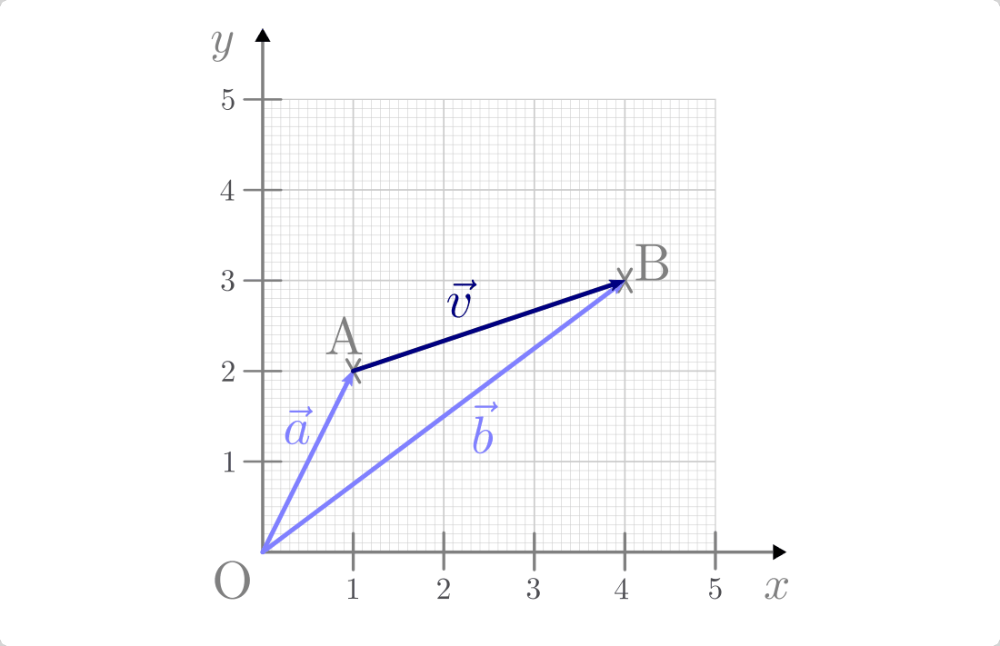

.. _Strecken und Geraden:

Strecken und Geraden
====================

Jeder Punkt :math:`\mathrm{P}` eines kartesischen Koordinatensystems kann
mittels seines :ref:`Ortsvektors <Ortsvektor>`, also mittels seiner :math:`x`-,
:math:`\phantom{|}y`- und :math:`z`-Koordinaten eindeutig dargestellt werden.

Betrachet man mehrere Punkte mit unterschiedlichen Ortsvektoren, so lassen sich
auch die Strecken zwischen den einzelnen Punkten mittels (normaler) Vektoren
darstellen. Die Vektorrechung kann somit unmittelbar auf die Beschreibung von
Strecken und Geraden angewendet werden.

.. index:: Verschiebungsvektor, Strecke
.. _Strecken und Teilverhältnisse:

Strecken und Teilverhältnisse
-----------------------------

Bezeichnet man die zu zwei Punkten :math:`\mathrm{A}` und :math:`\mathrm{B}`
gehörenden Ortsvektoren mit :math:`\vec{a}` und :math:`\vec{b}`, so ist die
Verbindung zwischen diesen beiden Punkten durch den so genannten
"Verschiebungsvektor" :math:`\vec{v}` charakterisiert:

.. math::

    \vec{v} = \vec{b} - \vec{a}

Die einzelnen Koordinaten des Verbindungsvektors erhält man, indem man die
Koordinaten des Ausgangspunkts von den Koordinaten des Endpunkts subtrahiert:

.. math::
    :label: eqn-verschiebungsvektor

    \vec{v} = \begin{pmatrix}
        v_{\mathrm{x}} \\ v_{\mathrm{y}} \\ v_{\mathrm{z}}
    \end{pmatrix} =
    \begin{pmatrix}
        \mathrm{B}_{\mathrm{x}} - \mathrm{A}_{\mathrm{x}} \\
        \mathrm{B}_{\mathrm{y}} - \mathrm{A}_{\mathrm{y}} \\
        \mathrm{B}_{\mathrm{z}} - \mathrm{A}_{\mathrm{z}} \\
    \end{pmatrix}

Im zweidimensionalen Fall entfällt die dritte Koordinate.

    Darstellung einer (zweidimensionalen) Strecke mittels Vektoren.

    .. only:: html

        :download:`SVG: Strecke
        <../pics/geometrie/strecke-darstellung-mittels-vektoren.svg>`

.. index:: Linearfaktor
.. _Linearfaktor:

Mittels des Verschiebungsvektors :math:`\vec{v}` gelangt man vom Punkt
:math:`\mathrm{A}` zum Punkt :math:`\mathrm{B}`, indem man diesen zum
Ortsvektor des Punktes :math:`\mathrm{A}` addiert:

.. math::

    \vec{a} + \vec{v} = \vec{a} + (\vec{b} - \vec{a}) = \vec{b}

Eine Strecke lässt sich somit wahlweise durch die Angabe zweier Punkte
(beziehungsweise deren Ortsvektoren) oder auch durch Angabe eines Ortsvektors
sowie des Verschiebungsvektors :math:`\vec{v}` beider Punkte beschreiben:

.. math::
    :label: eqn-streckengleichung

    \overline{\mathrm{AB}} = \vec{a} + \lambda \cdot \vec{v}

| Der Faktor :math:`0 \le \lambda \le 1` ist notwendig, da eine Strecke die Menge
  *aller* Punkte zwischen den zwei Endpunkten darstellt; dies ist äquivalent dazu,
  dass man zum Ausgangspunkt einen *beliebigen* Bruchteil (kleiner oder gleich
  :math:`1`) des Verschiebungsvektors hinzu addiert.
| Der Faktor :math:`\lambda`
  selbst wird "Linearfaktor" genannt: Er gibt als reiner Zahlenwert ("Skalar")
  an, um welchen Faktor der mit ihm multiplizierte Vektor skaliert, also
  gestaucht beziehungsweise gestreckt wird. Ist der Wert von :math:`\lambda`
  negativ, so wird die Richtung des mit ihm multiplizierten Vektors umgekehrt.

  .. math::

      |\lambda| < 1 \quad &\Longleftrightarrow \quad \text{Stauchung} \\
      |\lambda |> 1 \quad &\Longleftrightarrow \quad \text{Streckung}

*Beispiel:*

* In der obigen Abbildung hat der Punkt :math:`\mathrm{A}` die Koordinaten
  :math:`(1;\;2)` und der Punkt :math:`\mathrm{B}` die Koordinaten
  :math:`(4;\;3)`. Wie lässt sich die Strecke :math:`\overline{\mathrm{AB}}`
  mittels zweier Vektoren darstellen?

  Der Verschiebungsvektor :math:`\vec{v}` zwischen :math:`\mathrm{A}` und
  :math:`\mathrm{B}` ergibt sich aus der Differenz der beiden Ortsvektoren:

  .. math::

      \vec{v} = \begin{pmatrix}
          4 \\ 3
      \end{pmatrix} - \begin{pmatrix}
          1 \\ 2
      \end{pmatrix} = \begin{pmatrix}
          4 - 1 \\
          3 - 2 \\
      \end{pmatrix} = \begin{pmatrix}
          3 \\ 1
      \end{pmatrix}

  Mit dem Punkt :math:`\mathrm{A}` als Ausgangspunkt erhält man damit folgende
  Darstellung der Verbindungslinie zwischen :math:`\mathrm{A}` und :math:`\mathrm{B}`:

  .. math::

      \overline{\mathrm{AB}} = \begin{pmatrix}
          1 \\ 2
      \end{pmatrix} + \lambda \cdot \begin{pmatrix}
          3 \\ 1
      \end{pmatrix}

  Auch hier muss wiederum :math:`0 \le \lambda \le 1` gelten.

.. index:: Teilverhältnis, Teilpunkt
.. _Das Teilverhältnis:

Das Teilverhältnis
^^^^^^^^^^^^^^^^^^

Für die folgenden Überlegungen wird wiederum eine Strecke
:math:`\overline{\mathrm{AB}}` betrachtet, die durch einen Punkt auf ihr
liegenden Punkt :math:`\mathrm{T}` in zwei Abschnitte unterteilt wird.

.. todo pic wie in Simon 630

Das so genannte "Teilverhältnis" :math:`\lambda^{*} > 0` gibt dabei an, in
welchem Verhältnis :math:`\mathrm{T}` die Strecke :math:`\overline{\mathrm{AB}}`
teilt:

.. math::
    :label: eqn-teilverhaeltnis

    \lambda^{*} = \overline{\mathrm{AT}} : \overline{\mathrm{TB}}

Der Wertebereich von :math:`\lambda^{*}` liegt zwischen Null und Unendlich:

* Ist der Teilpunkt :math:`\mathrm{T}` identisch mit dem Punkt
  :math:`\mathrm{A}`, so ist :math:`\lambda^{*} = 0`.
* Halbiert der Teilpunkt :math:`\mathrm{T}` die Strecke
  :math:`\overline{\mathrm{AB}}`, so ist :math:`\lambda^{*} = 1`.
* Nähert sich der Teilpunkt :math:`\mathrm{T}` zunehmend dem Punkt
  :math:`\mathrm{B}`, so geht der Wert des Teilverhältnisses :math:`\lambda^{*}`
  gegen Unendlich. Für :math:`\mathrm{T} = \mathrm{B}` ist das
  Teilverhältnis nicht definiert.

.. todo pic wie in Simon630

Kennt man die Koordinaten der Punkte :math:`\mathrm{A}` und :math:`\mathrm{B}`
sowie das Teilverhältnisses :math:`\lambda^{*}` so ergeben sich folgende
Streckenlängen für :math:`\overline{\mathrm{AT}}` beziehungsweise
:math:`\overline{\mathrm{TB}}`:

.. math::
    :label: eqn-teilstrecken

    \overline{\mathrm{AT}} &= \left|\frac{\lambda^{*}}{\lambda^{*}+1}\right|
    \cdot \overline{\mathrm{AB}} \\[6pt]
    \overline{\mathrm{TB}} &= \left|\frac{1}{\lambda^{*}+1}\right| \cdot
    \overline{\mathrm{AB}}

*Beispiel:*

* Eine Strecke hat die Endpunkte :math:`\mathrm{A} = (1;\, 1)` und
  :math:`\mathrm{B} = (9;\, 7)`. Wie weit ist der Punkt :math:`\mathrm{T}`, der
  die Strecke :math:`\overline{\mathrm{AB}}` im Verhältnis :math:`2:1` teilt,
  von :math:`\mathrm{A}` entfernt?

  Um zu bestimmen, wie weit der Punkt :math:`\mathrm{T}` von :math:`\mathrm{A}`
  entfernt ist, muss die Länge der Strecke :math:`\overline{\mathrm{AT}}`
  bestimmt werden. Dies ist mittels der obigen Formel möglich, wenn man zunächst
  die Länge der Strecke :math:`\overline{\mathrm{AB}}` berechnet:

  .. math::

      \overline{\mathrm{AB}} = \left| \overline{\mathrm{0B}} - \overline{\mathrm{0A}}
      \right| = \left| \begin{pmatrix}
          9 \\ 7
      \end{pmatrix} - \begin{pmatrix}
          1 \\ 1
      \end{pmatrix} \right| = \left|
      \begin{pmatrix}
          8 \\ 6
      \end{pmatrix} \right | = \sqrt{8^2 + 6^2} = \sqrt{100} = 10

  Mit dem Teilungsverhältnis :math:`\lambda^{*} = 2:1 = 2` ergibt sich gemäß der
  obigen Formel für die Länge der Strecke :math:`\overline{\mathrm{AT}}`:

  .. math::
  
      \overline{\mathrm{AT}} =  \left|\frac{\lambda^{*}}{\lambda^{*}+1}\right|
    \cdot \overline{\mathrm{AB}} \; = \; \frac{2}{2 + 1} \cdot 10 \; \approx \;  6,67

  Der Teilpunkt :math:`\mathrm{T}` auf der Strecke
  :math:`\overline{\mathrm{AB}}` ist somit rund :math:`6,67` Längeneinheiten vom
  Punkt :math:`\mathrm{A}` entfernt.

.. _Koordinaten des Teilpunktes:

.. rubric:: Koordinaten des Teilpunktes

| Ausgehend vom Punkt :math:`\mathrm{A}` gelangt man zum Teilpunkt
  :math:`\mathrm{T}`, indem man :math:`\lambda = \frac{\lambda^{*}}{\lambda^{*}+1}`
  in die Streckengleichung :eq:`eqn-streckengleichung` einsetzt.
| Umgekehrt gelangt man vom Punkt :math:`\mathrm{B}` zum Teilpunkt
  :math:`\mathrm{T}`, indem man :math:`\lambda' = -\frac{1}{\lambda^{*}+1}` in die
  Streckengleichung einsetzt:

Für den Zum Teilpunkt :math:`\mathrm{T}` gehörenden Ortsvektor
:math:`\overline{\mathrm{OT}}` gilt somit:

.. math::

    \overrightarrow{\mathrm{OT}} = \vec{a} + \left(
    \frac{\lambda^{*}}{\lambda^{*} + 1} \right) \cdot \vec{v} \\[4pt]
    \overrightarrow{\mathrm{OT}} = \vec{b} - \left( \frac{1}{\lambda^{*} - 1}
    \right) \cdot \vec{v}

Setzt man in die erste der beiden obigen Gleichungen :math:`\vec{v} = \vec{b} -
\vec{a}` ein, so erhält man:

.. math::

    \overrightarrow{\mathrm{OT}} &= \vec{a} + \left(
    \frac{\lambda^{*}}{\lambda^{*} + 1} \right) \cdot \left( \vec{b} - \vec{a}
    \right) \\[4pt]
    &= \vec{a} + \left( \frac{\lambda^{*}}{\lambda^{*} +
    1} \right) \cdot \vec{b} - \left( \frac{\lambda^{*}}{\lambda^{*} + 1}\right)
    \cdot \vec{a}

Um die rechte Seite der Gleichung weiter vereinfachen zu können, kann man
:math:`\vec{a} = 1 \cdot \vec{a}` schreiben und :math:`1 =
\frac{\lambda^{*}+1}{\lambda^{*}+1}` setzen; so erhalten alle Terme den gleichen
(Haupt-)Nenner und können somit zusammengefasst werden:

.. math::

    \overrightarrow{\mathrm{OT}} &= \left( \frac{\lambda^{*} + 1}{\lambda^{*} + 1} \right) \cdot \vec{a} +
    \left( \frac{\lambda^{*}}{\lambda^{*} + 1} \right) \cdot \vec{b} - \left(
    \frac{\lambda^{*}}{\lambda^{*} + 1}\right) \cdot \vec{a}  \\[4pt]
    &= \left( \frac{1}{\lambda^{*} + 1} \right) \cdot \vec{a} + \left(
    \frac{\lambda^{*}}{\lambda^{*} + 1} \right) \cdot \vec{b}  \\[4pt]
    &= \left( \frac{1}{\lambda^{*} + 1} \right) \cdot \left( \vec{a} +
    \lambda^{*} \cdot \vec{b}  \right)

In der zweiten Zeile der obigen Gleichung wurde das :ref:`Distributivgesetz für
Vektoren <Distributivgesetz für Vektoren>` genutzt und die hintere Klammer
ausmultipliziert; in der mittleren Zeile wurde dann die Identität :math:`\vec{a}
= 1 \cdot \vec{a}` genutzt und :math:`1 = \frac{\lambda^{*} + 1}{\lambda^{*} +
1}` gesetzt, um die additiv beziehungsweise subtraktiv verknüpften Terme auf
einen Hauptnenner bringen zu können.

Für die Komponenten des Teilpunktes gilt somit:

.. math::

    \mathrm{T} = \left( \frac{1}{\lambda^{*}+1} \right) \cdot \begin{pmatrix}
        \mathrm{A}_{\mathrm{x}} + \lambda^{*} \cdot B_{\mathrm{x}} \\
        \mathrm{A}_{\mathrm{y}} + \lambda^{*} \cdot B_{\mathrm{y}} \\
        \mathrm{A}_{\mathrm{z}} + \lambda^{*} \cdot B_{\mathrm{z}} \\
    \end{pmatrix}

Für den Mittelpunkt :math:`T_{\mathrm{M}}` einer Strecke gilt insbesondere
:math:`\lambda^{*} = 1`, und somit

.. math::

    \mathrm{T}_{\mathrm{M}} = \left( \frac{1}{2} \right) \cdot \begin{pmatrix}
        \mathrm{A}_{\mathrm{x}} + B_{\mathrm{x}} \\
        \mathrm{A}_{\mathrm{y}} + B_{\mathrm{y}} \\
        \mathrm{A}_{\mathrm{z}} + B_{\mathrm{z}} \\
    \end{pmatrix}

.. todo Innere und äußere Teilung

.. _Geraden in einer Ebene:

Geraden in einer Ebene
----------------------

Eine Gerade :math:`g` kann, ebenso wie eine Strecke, mittels eines Punktes
:math:`\mathrm{A}` beziehungsweise dessen Ortsvektors :math:`\vec{a}` und eines
"Richtungsvektors" :math:`\vec{v}` dargestellt werden:

.. math::
    :label: eqn-geradengleichung

    g = \vec{a} + \lambda \cdot \vec{v}

| In diesem Fall kann für :math:`\lambda \in \mathbb{R}` allerdings ein
  beliebig großer, gegebenenfalls auch negativer Zahlenwert gewählt werden.
| Bei der Bezeichnung von Geraden wird der Richtungspfeil weggelassen, da eine
  Gerade keinen eindeutigen Richtungssinn hat; bei :math:`g` handelt es sich
  vielmehr um die Menge aller Punkte, welche die zugehörige Gleichung erfüllen.
| Soll eine Gerade durch zwei Punkte :math:`\mathrm{A}` und :math:`\mathrm{B}`
  festgelegt werden, so so entspricht der Richtungsvektor :math:`\vec{v}` wiederum
  dem Verschiebungsvektor :eq:`eqn-verschiebungsvektor` beider Punkte.

.. * Durch einen Punkt :math:`\mathrm{A}` und den Neigungswinkel :math:`\alpha`
..   zwischen der Geraden und der :math:`x`-Achse, oder

... to be continued ...

.. NUETZLICHE_MATHE_fuer_physik1.pdf S.25

.. raw:: html

    

.. only:: html

    .. rubric:: Anmerkungen:

