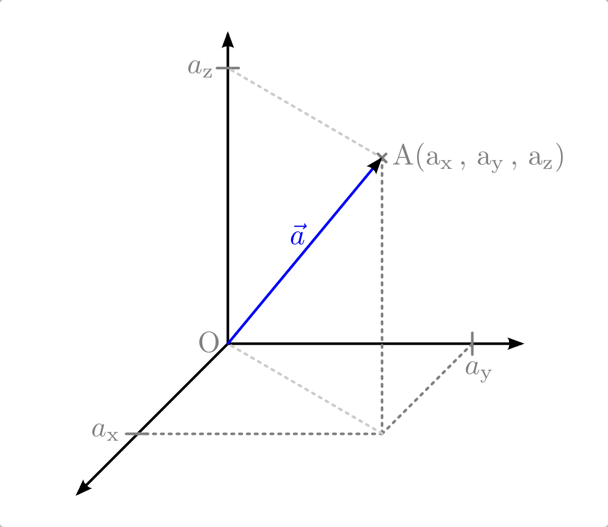
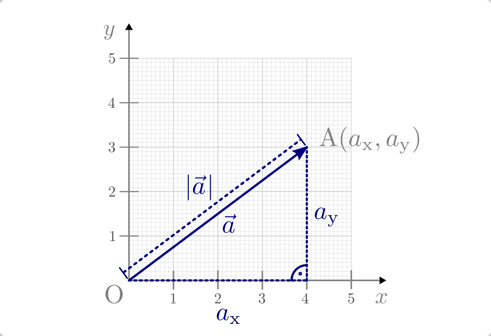
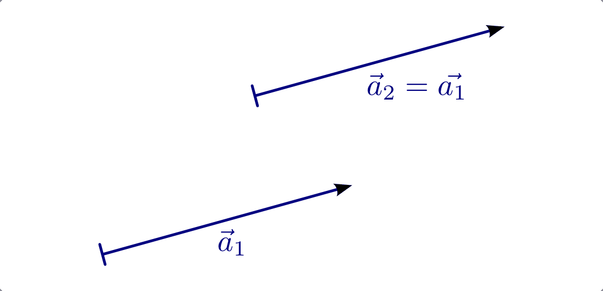
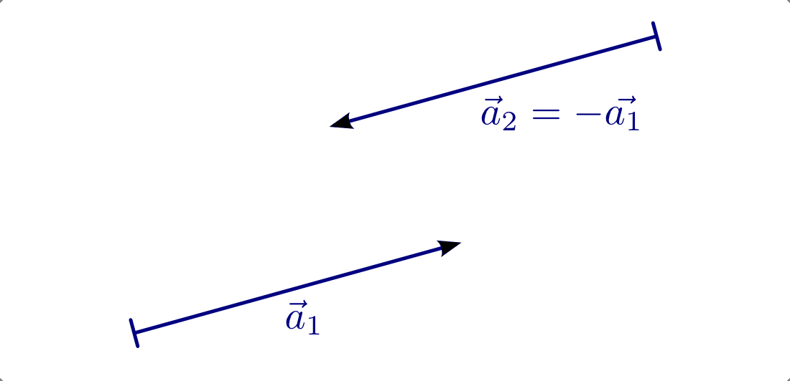
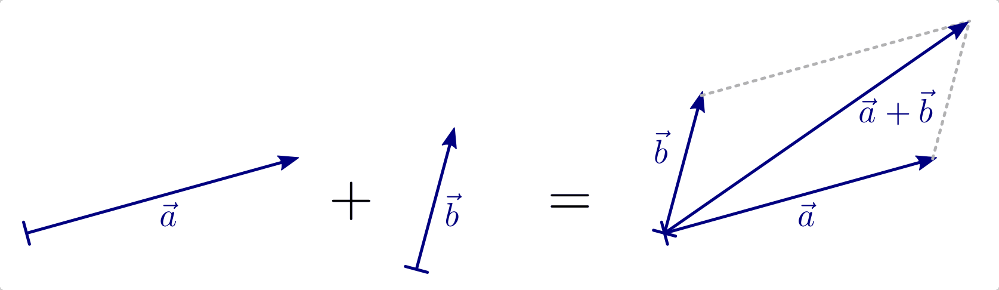
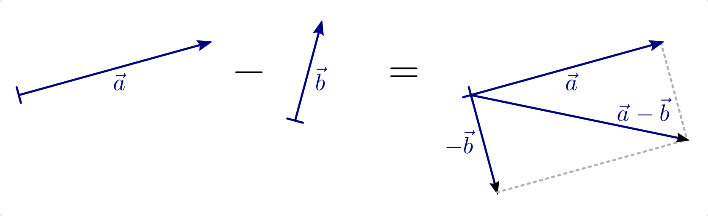
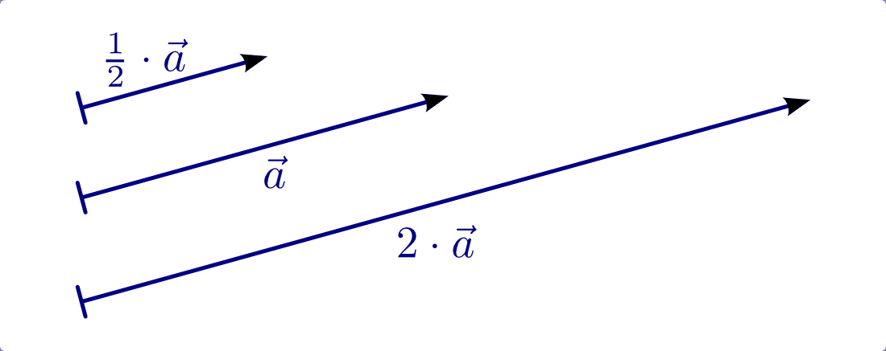
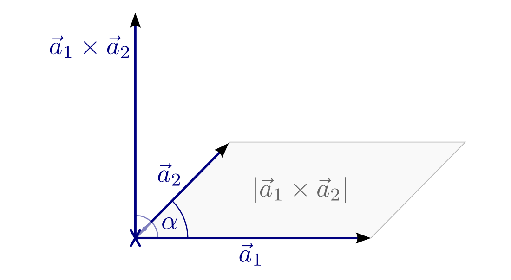

.. index:: Vektor
.. _Vektoren:

Vektoren
========

Darstellung von Vektoren
------------------------

Bei Vektoren handelt es sich aus geometrischer Sicht um :ref:`Strecken
<Strecke>` mit einer bestimmten Länge, die sowohl eine bestimmte Richtung, wie
auch einen bestimmten Richtungssinn haben; dieser wird in Zeichnungen durch
Pfeil am Ende der Strecke hervorgehoben. In der Formelschreibweise werden
Vektoren meist mit kleinen lateinischen Buchstaben bezeichnet und durch einen
Pfeil über der Vektorgröße markiert.

    Darstellung eines Vektors.

    .. only:: html

        :download:`SVG: Vektor
        <../pics/geometrie/vektor.svg>`

Je nachdem, ob zwei- oder dreidimensionale geometrische Formen untersucht
werden, reicht ein geordnetes Paar aus zwei oder ein Tupel aus drei
Koordinatenwerten -- also :math:`(a_{\mathrm{x}} \,,\, a_{\mathrm{y}})` bzw. :math:`(a
_{\mathrm{x}} \,,\, a_{\mathrm{y}} \,,\, a_{\mathrm{z}})` -- aus,  um einen Vektor
:math:`\vec{a}` vollständig zu charakterisieren. [#]_ Die Koordinatenwerte geben
dabei an, um wie viele Längeneinheiten die Spitze des Vektors entlang der
jeweiligen Raumrichtung vom Anfangspunkt des Vektors  entfernt liegt.

.. math::
    :label: eqn-vektor

    \vec{a} = (a_{\mathrm{x}} \,,\, a_{\mathrm{y}} \,,\, a_{\mathrm{z}}) = \begin{pmatrix}
    a_{\mathrm{x}} \\
    a_{\mathrm{y}} \\
    a_{\mathrm{z}} \\
    \end{pmatrix}

    Darstellung eines (dreidimensionalen) Ortsvektors in einem
    Koordinatensystem.

    .. only:: html

        :download:`SVG: Ortsvektor
        <../pics/geometrie/ortsvektor.svg>`

Ein Vektor, dessen Anfangspunkt dem Ursprung des Koordinatensystems
:math:`\vec{0} = (0 \,,\, 0 \,,\, 0)` entspricht, wird als Ortsvektor
bezeichnet.

.. index:: Betrag eines Vektors
.. _Betrag eines Vektors:

.. rubric:: Betrag eines Vektors

Die Länge der Verbindungsstrecke vom Anfangspunkt eines Vektors :math:`\vec{a}`
zu seinem Endpunkt :math:`\mathrm{A}` wird Betrag des Vektors genannt. In Kurzform
schreibt man dafür :math:`| \vec{a} |` oder :math:`a` (ohne Vektorpfeil).

    Betrag eines (zweidimensionalen) Vektors.

    .. only:: html

        :download:`SVG: Betrag eines Vektors
        <../pics/geometrie/vektor-betrag.svg>`

Der Betrag eines Vektors kann mit Hilfe des Satzes von Pythagoras folgendermaßen
anhand seiner Komponenten :math:`a_{\mathrm{x}}` und :math:`a_{\mathrm{y}}` (und
:math:`a_{\mathrm{z}}` bei dreidimensionalen Vektoren) berechnet werden:

.. math::
    :label: eqn-vektor-betrag

    a = | \vec{a } \, | &= \sqrt{a_{\mathrm{x}}^2 + a_{\mathrm{y}}^2}
    \phantom{+ a_{\mathrm{z}}^2} \; \quad \text{für zweidimeinsionale
    Vektoren} \\[4pt]
    a = | \vec{a } \, | &= \sqrt{a_{\mathrm{x}}^2 + a_{\mathrm{y}}^2 +
    a_{\mathrm{z}}^2} \quad \text{für dreidimeinsionale Vektoren}

*Beispiel:*

* Der zweidimensionale Vektor :math:`\begin{pmatrix} 4 \\ 3 \end{pmatrix}` hat
  folgenden Betrag:

  .. math::

      \left| \vec{a} \right| = \sqrt{a_{\mathrm{x}}^2 + a_{\mathrm{y}}^2} =
      \sqrt{4^2 + 3^2} = \sqrt{25} = 5{\color{white} \; \; \qquad \quad \ldots}

*  Der dreidimensionale Vektor :math:`\begin{pmatrix} 4 \\ 5 \\ 2 \end{pmatrix}`
   hat folgenden Betrag:

  .. math::

      \left| \vec{a} \right| = \sqrt{a_{\mathrm{x}}^2 + a_{\mathrm{y}}^2 +
      a_{\mathrm{z}}^2} = \sqrt{4^2 + 5^2 + 2^2} = \sqrt{45}

.. index:: Vektor; Gegenvektor
.. _Vektor und Gegenvektor:

.. rubric:: Vektor und Gegenvektor

Zwei Vektoren :math:`\vec{a}_1` und :math:`\vec{a}_2` sind gleich, wenn sie in
allen Koordinaten übereinstimmen. Beide Vektoren haben dann den gleichen Betrag,
die gleiche Richtung und den gleichen Richtungssinn. Sie können allerdings von
unterschiedlichen Anfangspunkten ausgehen und daher parallel zueinander im Raum
verschoben sein, da für Vektoren stets nur die Differenz der Koordinatenwerte
von Anfangspunkt und Endpunkt von Bedeutung ist.

    Zwei identische Vektoren.

    .. only:: html

        :download:`SVG: Gleichheit zweier Vektoren
        <../pics/geometrie/vektor-gleichheit.svg>`

Das Negative :math:`- \vec{a}` eines Vektors :math:`a`, auch "Gegenvektor"
genannt, ist ein Vektor mit gleichem Betrag und gleicher Richtung wie
:math:`\vec{a}`, jedoch mit umgekehrtem Richtungssinn.

    Vektor und Gegenvektor.

    .. only:: html

        :download:`SVG: Vektor und Gegenvektor
        <../pics/geometrie/vektor-gegenvektor.svg>`

In der Komponentenschreibweise kann der zu einem Vektor :math:`\vec{a}`
gehörende Gegenvektor :math:`- \vec{a}` gebildet werden, indem man alle
Komponenten von :math:`\vec{a}` mit einem Minuszeichen versieht:

.. math::
    :label: eqn-vektor-gegenvektor

    {\color{white}+}\vec{a} = \begin{pmatrix}
    a_{\mathrm{x}} \\
    a_{\mathrm{y}} \\
    a_{\mathrm{z}} \\
    \end{pmatrix} \quad \Leftrightarrow \quad
    - \vec{a} = \begin{pmatrix}
    - a_{\mathrm{x}} \\
    - a_{\mathrm{y}} \\
    - a_{\mathrm{z}} \\
    \end{pmatrix}

Bei zweidimensionalen Vektoren wird die dritte Komponente :math:`a_{\mathrm{z}}
= 0` weggelassen.

.. index:: Vektor; Normvektor
.. _Normvektor und Nullvektor:

.. rubric:: Normvektor und Nullvektor

Ein Vektor, dessen Länge genau einer Längeneinheit :math:`(\unit[1]{LE})`
entspricht, wird "normierter" Vektor :math:`\vec{a}_0` genannt.

.. figure:: ../pics/geometrie/vektor-normvektor.png
    :name: fig-vektor-normvektor
    :alt:  fig-vektor-normvektor
    :align: center
    :width: 50%

    Normvektor :math:`\vec{a} _{\mathrm{0}}` eines Vektors :math:`\vec{a}`

    .. only:: html

        :download:`SVG: Vektor und Normvektor
        <../pics/geometrie/vektor-normvektor.svg>`

Ein Vektor mit Betrag Null wird als Nullvektor :math:`\vec{0}` bezeichnet. Bei
einem Nullvektor sind Anfangs- und Endpunkt identisch.

.. _Addition und Subtraktion von Vektoren:

Addition und Subtraktion von Vektoren
-------------------------------------

Ein Vektor kann durch Beibehalten seiner Richtung und seines Richtungssinns,
d.h. parallel im Raum verschoben werden, ohne dass sich die Werte seiner
Komponenten ändern. Dies kann genutzt werden, um zwei Vektoren zeichnerisch zu
addieren bzw. subtrahieren.

.. index:: Vektor; Summenvektor
.. _Summenvektor:

.. rubric:: Der Summenvektor

Fügt man an einen Vektor :math:`\vec{a}_1` einen zweiten Vektor
:math:`\vec{a}_2` durch eine passende Verschiebung so an, dass der Anfangspunkt
des zweiten Vektors mit dem Endpunkt des ersten Vektors übereinstimmt, dann
erhält man den Summenvektor :math:`\overrightarrow{a_1 + a_2}`, indem man den
Anfangspunkt des ersten Vektors mit dem Endpunkt des zweiten Vektors verbindet.

    Summenvektor der beiden Vektoren :math:`\vec{a}_{\mathrm{1}}` und
    :math:`\vec{a}_{\mathrm{2}}`.

    .. only:: html

        :download:`SVG: Vektor-Addition
        <../pics/geometrie/vektor-addition.svg>`

Rechnerisch erhält man den Summenvektor, indem man die einzelnen Komponenten
beider Vektoren addiert:

.. math::
    :label: eqn-vektor-addition

    \overrightarrow{a_1 + a_2}  = \vec{a}_{\mathrm{1}} +
    \vec{a}_{\mathrm{2}} = \begin{pmatrix}
    a_{\mathrm{1x}} \\
    a_{\mathrm{1y}} \\
    a_{\mathrm{1z}} \\
    \end{pmatrix} + \begin{pmatrix}
    a_{\mathrm{2x}} \\
    a_{\mathrm{2y}} \\
    a_{\mathrm{2z}} \\
    \end{pmatrix} = \begin{pmatrix}
    a_{\mathrm{1x}} + a_{\mathrm{2x}} \\
    a_{\mathrm{1y}} + a_{\mathrm{2y}} \\
    a_{\mathrm{1z}} + a_{\mathrm{2z}} \\
    \end{pmatrix}

..  Additionen von Vektoren haben unmittelbar zahlreiche Anwendungen in der
..  Physik, z.B. beim Zusammenwirken mehrerer Kräfte.

.. index:: Vektor; Differenzvektor
.. _Differenzvektor:

.. rubric:: Der Differenzvektor

Die Differenz :math:`\vec{a}_1 - \vec{a}_2` zweier Vektoren lässt sich
zeichnerisch auf ähnliche Weise bestimmen, indem man den Gegenvektor :math:`-
\vec{a}_2` des zweiten Vektors zum ersten Vektor addiert.

    Differenzvektor der beiden Vektoren :math:`\vec{a}_1` und :math:`\vec{a}_2`.

    .. only:: html

        :download:`SVG: Vektor-Subtraktion
        <../pics/geometrie/vektor-subtraktion.svg>`

Rechnerisch erhält man den Differenzvektor, indem man die einzelnen Komponenten
beider Vektoren subtrahiert:

.. math::
    :label: eqn-vektor-subtraktion

    \overrightarrow{a_1 - a_2}  = \vec{a}_1 - \vec{a}_2 = \begin{pmatrix}
    a_{\mathrm{1x}} \\
    a_{\mathrm{1y}} \\
    a_{\mathrm{1z}} \\
    \end{pmatrix} - \begin{pmatrix}
    a_{\mathrm{2x}} \\
    a_{\mathrm{2y}} \\
    a_{\mathrm{2z}} \\
    \end{pmatrix} = \begin{pmatrix}
    a_{\mathrm{1x}} - a_{\mathrm{2x}} \\
    a_{\mathrm{1y}} - a_{\mathrm{2y}} \\
    a_{\mathrm{1z}} - a_{\mathrm{2z}} \\
    \end{pmatrix}

.. _Multiplikation von Vektoren:

Multiplikation von Vektoren
---------------------------

Vektoren können entweder mit einer reellen Zahl (einem so genannten "Skalar")
als auch mit anderen Vektoren multipliziert werden.

.. _Multiplikation eines Vektors mit einer reellen Zahl:

.. rubric:: Multiplikation eines Vektors mit einer reellen Zahl

Multipliziert man einen Vektor :math:`\vec{a}` mit einer reellen Zahl :math:`c`,
so ergibt sich ein Vektor, der die gleiche Richtung und den gleichen
Richtungssinn hat, dessen Betrag jedoch um den Faktor :math:`c` verändert ist.

* Ist :math:`c > 1`, so wird der Vektor gestreckt.
* Ist :math:`0 < c < 1`, so wird der Vektor gestaucht.
* Ist :math:`c < 0`, so wird zusätzlich zur Streckung bzw. Stauchung
  des Vektors der Richtungssinn umgedreht.

    Produkt eines Vektors mit einem Skalar (Faktoren: :math:`c = \frac{1}{2}` bzw.
    :math:`c = 2`).

    .. only:: html

        :download:`SVG: Produkt eines Vektors mit einem Skalar
        <../pics/geometrie/vektor-produkt-mit-skalar.svg>`

Rechnerisch lässt sich ein Vektor :math:`\vec{a}` mit einer reellen Zahl
:math:`c` multiplizieren, indem jede Komponente des Vektors mit dieser
Zahl multipliziert wird:

.. math::
    :label: eqn-produkt-vektor-mit-skalar

    c \cdot \vec{a} = c \cdot \begin{pmatrix}
    a_{\mathrm{x}} \\
    a_{\mathrm{y}} \\
    a_{\mathrm{z}} \\
    \end{pmatrix} = \begin{pmatrix}
    c \cdot a_{\mathrm{x}} \\
    c \cdot a_{\mathrm{y}} \\
    c \cdot a_{\mathrm{z}} \\
    \end{pmatrix}

Multipliziert man insbesondere einen Vektor :math:`\vec{a}` mit dem Kehrwert
seines Betrags :math:`\frac{1}{| \vec{a} |}`, so erhält man den zugehörigen, auf
:math:`\unit[1]{LE}` normierten Vektor :math:`\vec{a}_0`.

.. index:: Skalarprodukt
.. _Skalarprodukt:

.. rubric:: Das Skalarprodukt

Das Skalarprodukt zweier Vektoren :math:`\vec{a}_1` und :math:`\vec{a}_2` ist
definiert als das Produkt ihrer Beträge :math:`|\vec{a}_1|` und
:math:`|\vec{a}_2|`, multipliziert mit dem Cosinus des zwischen ihnen
eingeschlossenen Winkels :math:`\alpha`:

.. math::
    :label: eqn-skalarprodukt-winkel

    {\color{white}.\;}\vec{a}_1 \cdot \vec{a}_2 =  | \vec{a}_1 | \cdot |
    \vec{a}_2 | \cdot \cos{\alpha}

Schreibt man die beiden Vektoren :math:`\vec{a}_1` und :math:`\vec{a}_2` in
Spaltenform, so kann das Skalarprodukt komponentenweise nach folgender Formel
berechnet werden:

.. math::
    :label: eqn-skalarprodukt

    {\color{white}\ldots \qquad \qquad \quad  }\vec{a}_1 \cdot \vec{a}_2 &= \begin{pmatrix}
    a_{\mathrm{1x}} \\
    a_{\mathrm{1y}} \\
    a_{\mathrm{1z}} \\
    \end{pmatrix} \cdot \begin{pmatrix}
    a_{\mathrm{2x}} \\
    a_{\mathrm{2y}} \\
    a_{\mathrm{2z}} \\
    \end{pmatrix} \\[4pt]
    &= a_{\mathrm{1x}} \cdot a_{\mathrm{2x}} + a_{\mathrm{1y}} \cdot a_{\mathrm{2y}}+ a_{\mathrm{1z}} \cdot a_{\mathrm{2z}}

Das Ergebnis ist ein skalarer Wert, also eine Zahl. Die Bedeutung des
Skalarprodukts wird schnell deutlich, wenn man sich einige Sonderfälle
betrachtet:

* Stehen die beiden Vektoren :math:`\vec{a}_1` und :math:`\vec{a}_2` senkrecht
  zueinander, so ist :math:`\cos{\alpha} = \cos{90 \degree} = 0`. Somit ergibt
  das Skalarprodukt in diesem Fall den Wert Null:

  .. math::

      \vec{a}_1 \perp \vec{a}_2  \quad \Leftrightarrow \quad
      \vec{a}_1 \cdot \vec{a}_2 = 0

  Mit Hilfe dieser Beziehung kann einerseits leicht gepüeft werden, *ob* zwei
  Vektoren :math:`\vec{a}_1` und :math:`\vec{a}_2` senkrecht aufeinander stehen.
  Andererseits kann bei einem Vektor :math:`\vec{a}_1` mit nur zwei gegebenen
  Komponenten unter Verwendung der komponentenweisen Darstellung die dritte
  Komponente so bestimmt werden, dass der Vektor auf dem zweiten Vektor
  :math:`\vec{a}_2` senkrecht steht.

  *Beispiel:*

    Die dritte Komponente des Vektors :math:`\vec{a}_1 = (2,6,?)` soll so
    bestimmt werden, dass er auf dem Vektor :math:`\vec{a}_2 = (3,-5,6)`
    senkrecht steht. Somit muss gelten:

    .. math::

        \vec{a}_1 \cdot \vec{a}_2 &= 0 \\ 2 \cdot 3 + 6 \cdot (-5) +\; ? \cdot 6
        &= 0 {\color{white}\qquad \qquad \qquad \qquad \ldots}\\ \Rightarrow 6
        \cdot \; ? &= 24 \\  ? &= 4

    Ist die gesuchte Komponente somit gleich :math:`4`, so stehen beide Vektoren
    senkrecht aufeinander.

* Stehen die beiden Vektoren :math:`\vec{a}_1` und :math:`\vec{a}_2` parallel
  zueinander, so ist :math:`\cos{\alpha} = \cos{0\degree} = 1`. Das Skalarprodukt ist
  in diesem Fall gleich dem Produkt der Beträge beider Vektoren.

  .. math::

      {\color{white}\ldots \qquad \;\; }\vec{a}_1 \parallel \vec{a}_2 \quad
      \Leftrightarrow \quad \vec{a}_1 \cdot \vec{a}_2 = | \vec{a}_1 | \cdot |
      \vec{a}_2 |

  Dieser Zusammenhang wurde implizit bereits verwendet, um den Betrag eines
  bestimmten Vektors :math:`\vec{a}` zu berechnen. Setzt man nämlich
  :math:`\vec{a} = \vec{a}_1 = \vec{a}_2`, so gilt:

  .. math::

      a = | \vec{a} | = \sqrt{ | \vec{a} | ^2 } = \sqrt{ \vec{a} \cdot \vec{a}}

  Der Betrag :math:`|\vec{a}|` des Vektors kann somit bestimmt werden, indem man
  das Skalarprodukt des Vektors mit sich selbst bildet und aus dem Ergebnis die
  Quadratwurzel zieht. Schreibt man die obige Gleichung komponentenweise, so
  erhält man die übliche Betrags-Gleichung :eq:`eqn-vektor-betrag`.

* Für beliebige Winkel :math:`\alpha` lässt sich das Produkt :math:`a_2 \cdot
  \cos{\alpha}` geometrisch als "Projektion" des Vektors :math:`a_2` auf den
  Vektor :math:`a_1` deuten. Die Projektion entspricht dabei anschaulich dem
  "Schattenwurf" des Vektors :math:`a_2`, der sich bei einer senkrecht auf
  :math:`a_1` einfallenden Beleuchtung ergeben würde.

  Der Werkt des Skalarprodukts ist damit im Allgemeinen gleich dem Betrag des
  ersten Vektors, multipliziert mit der senkrechten Projektion des zweiten
  Vektors auf den ersten.

Nützlich ist das Skalarprodukt auch, wenn man den Winkel zwischen einem Vektor
und einer der Achsen eines (kartesischen) Koordinatensystems berechnen möchte.
Der Trick dabei ist, dass jede Raumachse selbst durch einen Vektor der Länge
:math:`1` und einer einzigen Vektorkomponente dargestellt werden kann,
beispielsweise die :math:`x`-Achse durch den Vektor :math:`e_{\mathrm{x}} =
(1,0,0)`. Es gilt:

.. math::

    {\color{white}\ldots \qquad \quad  }\vec{a} \cdot \vec{e}_{\mathrm{x}} &=
    \begin{pmatrix}
    a_{\mathrm{x}} \\
    a_{\mathrm{y}} \\
    a_{\mathrm{z}} \\
    \end{pmatrix} \cdot \begin{pmatrix}
    1 \\
    0 \\
    0 \\
    \end{pmatrix} \\[4pt]
    &= a_{\mathrm{x}} \cdot 1 + a_{\mathrm{y}} \cdot 0 + a_{\mathrm{z}} \cdot 0
    = a_{\mathrm{x}}

Gleiches gilt auch für die Skalarprodukte von :math:`\vec{a}` mit den beiden
anderen Raumachsen. Die allgemeine Formel :eq:`eqn-skalarprodukt-winkel` des
Skalarprodukts kann damit nach dem gesuchten Winkel :math:`\alpha` aufgelöst
werden:

.. math::

    \vec{a} \cdot \vec{e}_{\mathrm{x}} = | \vec{a} | \cdot | \vec{e}_{\mathrm{x}} |
    \cdot \cos{\alpha} \quad \Leftrightarrow \quad \cos{\alpha} = \frac{\vec{a}
    \cdot \vec{e}_{\mathrm{x}}}{ | \vec{a} | \cdot |\vec{e}_{\mathrm{x}}| }

Setzt man :math:`\vec{a} \cdot \vec{e}_{\mathrm{x}} = a_{\mathrm{x}}` und
:math:`| \vec{e}_{\mathrm{x}}| = 1` in die obige Gleichung ein, so folgt: [#]_

.. math::

    \cos{\alpha} = \frac{\vec{a} \cdot \vec{e}_{\mathrm{x}}}{ | \vec{a} | \cdot
    |\vec{e}_{\mathrm{x}}| } = \frac{a_{\mathrm{x}}}{| \vec{a} |}

Für die Winkel :math:`\alpha ,\, \beta ,\, \gamma` zwischen :math:`\vec{a}` und
den :math:`x ,\, y ,\, z`-Achsen gilt somit:

.. math::
    :label: eqn-winkel-zwischen-vektor-und-raumachsen

    \alpha = \cos^{-1}{\left( \frac{a_{\mathrm{x}}}{| \vec{a} | }\right)} \quad ; \quad
    \beta  = \cos^{-1}{\left( \frac{a_{\mathrm{y}}}{| \vec{a} | }\right)} \quad ; \quad
    \gamma = \cos^{-1}{\left( \frac{a_{\mathrm{z}}}{| \vec{a} | }\right)} \quad

..  Beispiel?

.. _Vektorprodukt:

.. rubric:: Das Vektorprodukt

Das Vektorprodukt zweier Vektoren :math:`\vec{a}_1` und :math:`\vec{a}_2` ergibt
einen Vektor, der auf jedem der beiden Vektoren und senkrecht steht. Diese
Definition ist erst ab einem dreidimensionalen Raum sinnvoll.

    Anschauliche Interpretation eines Vektorprodukts.

    .. only:: html

        :download:`SVG: Vektorprodukt
        <../pics/geometrie/vektor-vektorprodukt.svg>`

Der Betrag des Vektorprodukts zweier Vektoren :math:`\vec{a}_1` und
:math:`\vec{a}_2` ist gleich dem Produkt ihrer Beträge :math:`|\vec{a}_1|` und
:math:`|\vec{a}_2|`, multipliziert mit dem Sinus des zwischen ihnen
eingeschlossenen Winkels :math:`\alpha`:

.. math::
    :label: eqn-vektorprodukt-winkel

    |\vec{a}_1 \times  \vec{a}_2| =  | \vec{a}_1 | \cdot |
    \vec{a}_2 | \cdot \sin{\alpha}

Schreibt man die beiden Vektoren :math:`\vec{a}_1` und :math:`\vec{a}_2` in
Spaltenform, so kann das Vektorprodukt komponentenweise nach folgender Formel
berechnet werden:

.. math::
    :label: eqn-vektorprodukt

    \vec{a}_1 \times \vec{a}_2 = \begin{pmatrix}
    a_{\mathrm{1x}} \\
    a_{\mathrm{1y}} \\
    a_{\mathrm{1z}} \\
    \end{pmatrix} \times \begin{pmatrix}
    a_{\mathrm{2x}} \\
    a_{\mathrm{2y}} \\
    a_{\mathrm{2z}} \\
    \end{pmatrix} = \begin{pmatrix}
    a_{\mathrm{1y}} \cdot a_{\mathrm{2z}} - a_{\mathrm{1z}} \cdot a_{\mathrm{2y}} \\
    a_{\mathrm{1z}} \cdot a_{\mathrm{2x}} - a_{\mathrm{1x}} \cdot a_{\mathrm{2z}} \\
    a_{\mathrm{1x}} \cdot a_{\mathrm{2y}} - a_{\mathrm{1y}} \cdot a_{\mathrm{2x}} \\
    \end{pmatrix}

Das Vektorprodukt findet Anwendung in der analytischen Geometrie und in der
Technik. Beispielsweise kann zu zwei gegebenen Richtungsvektoren, die eine Ebene
beschreiben, mit Hilfe des Vektorprodukts ein dritter "Normvektor" gefunden
werden, der auf der Ebene senkrecht steht. In der Physik wird das Vektorprodukt
beispielsweise bei der Berechnung von :ref:`Drehmomenten <gwp:Drehmoment>` und
:ref:`Drehimpulsen <gwp:Drehimpuls>` genutzt.

.. raw:: html

    

.. only:: html

    .. rubric:: Anmerkungen:

.. [#] Vektoreigenschaften lassen sich so verallgemeinern, dass in der
    algebraischen Geometrie allgemein auch Vektoren mit :math:`n` Dimensionen
    behandelt werden können.

.. [#] Der Betrag des Vektors :math:`\vec{e} _{\mathrm{x}}` ist gleich Eins, da
    :math:`| \vec{e}_{\mathrm{x}} | = \sqrt{1^2 + 0^2 + 0^2} = 1` gilt.

