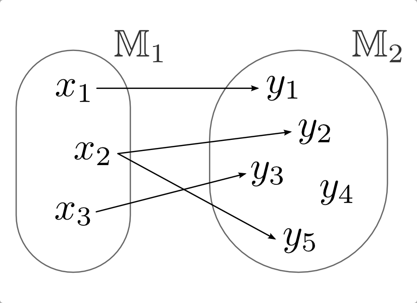

.. _Abbildungen, Funktionen, Relationen und Operationen:

Abbildungen, Funktionen, Relationen und Operationen
===================================================

.. index:: Abbildung
.. _Abbildungen:

Abbildungen
-----------

Unter einer Abbildung :math:`F` aus einer Menge :math:`\mathbb{M}_1` in eine
Menge :math:`\mathbb{M}_2` versteht man eine Teilmenge der :ref:`Produktmenge
<Die Produktmenge>` :math:`\mathbb{M}_1 \times \mathbb{M}_2`.

.. math::
    
    F \subseteq \mathbb{M}_1 \times \mathbb{M}_2 
    
:math:`F` ist somit eine Menge von geordneten Paaren :math:`(x,y)` mit :math:`x
\in \mathbb{M}_1` und :math:`y \in \mathbb{M}_2`. Man sagt, dass durch die
Abbildung :math:`F` das Element :math:`y` dem Element :math:`x` zugeordnet wird.
[#]_ Die Mengen :math:`\mathbb{M}_1` und :math:`\mathbb{M}_2` können auch gleich
sein.

*Beispiel:*

* Durch eine Abbildung :math:`F \subseteq \mathbb{R} \times \mathbb{R}` kann
  beispielsweise jeder reellen Zahl :math:`x` ihre Quadratzahl :math:`x^2`
  zugeordnet werden. Es ist dann :math:`(x,x^2) \in F` für alle :math:`x \in
  \mathbb{R}`. 

Die Menge aller :math:`x \in \mathbb{M}_1`, für die ein :math:`y \in
\mathbb{M}_2` existiert, nennt man Definitionsbereich der Abbildung;
entsprechend nennt man die Menge aller :math:`y \in \mathbb{M}_2`, für die ein
zugehöriges :math:`x \in \mathbb{M}_1` existiert, Wertebereich der Abbildung.

    Beispielhaftes Venn-Diagramm einer Abbildung.

    .. only:: html

        :download:`SVG: Venn-Diagramm einer Abbildung. 
        <../pics/mengenlehre/venn-diagramm-abbildung.svg>`

.. _Inverse Abbildung:

.. rubric:: Inverse Abbildung

Unter einer inversen Abbildung :math:`F _{\rm{U}}` (auch "Umkehrabbildung"
genannt) versteht man die Menge aller geordneten Paare :math:`(y,x)`, für die
:math:`(x,y) \in F` gilt.

Der Definitionsbereich der inversen Abbildung ist der Wertebereich der
ursprünglichen Abbildung und umgekehrt; die inverse Abbildung der inversen
Abbildung ist mit der ursprünglichen Abbildung identisch.

.. _Verkettung von Abbildungen:

.. rubric:: Verkettung von Abbildungen

Es sei :math:`F_1` eine Abbildung von :math:`\mathbb{M}_1` in
:math:`\mathbb{M}_2` und :math:`F_2` eine Abbildung aus :math:`\mathbb{M}_2` in
:math:`\mathbb{M}_3`. Eine Abbildung :math:`F_3 = F_2 \circ F_1` (gelesen:
":math:`F _{\rm{2}}` verkettet mit :math:`F_1`") wird dann als Verkettung
(Hintereinanderausführung) bezeichnet, wenn für alle geordneten Paare
:math:`(x,y) \in F_1` und :math:`(y,z) \in F_2` gilt: :math:`(x,z) \in F_3`.

Allgemein gilt für Verkettungen von Abbildungen zwar das Assoziativgesetz
nicht, d.h. die Reihenfolge der Abbildungen ist nicht vertauschbar; jedoch gilt
das Assoziativ-Gesetz in folgender Form: 

.. math::
    
    F_3 \circ (F_2 \circ F_1 ) = (F_3 \circ F
   _2) \circ F_1 

Für eindeutige Abbildungen (Funktionen) ist folgende Darstellung üblich:

.. math::
    
    (f_2 \circ f_1)(x) = f_2 (f_1(x))

Man nennt dabei die Funktion :math:`f_1` die innere Funktion und :math:`f_2` die
äußere Funktion der Verkettung. Somit ist die Reihenfolge der Verkettung
(":math:`f_2` nach :math:`f_1`") gut erkennbar.

*Beispiel:*
    
* Es sei :math:`z = f_2(y) = \sqrt{y}` sowie :math:`y = f_1(x) =
  x^2 + 1`. Somit gilt :math:`z = f_2 (f_1 (x)) = \sqrt{x^2 +
  1}`. 

.. index:: 
    single: Abbildung; Funktion
.. _Abbildungen-Funktionen:

Funktionen
----------

Eine Abbildung :math:`f` aus :math:`M_1` in :math:`M_2` heißt eindeutig, wenn
jedem :math:`x \in M_1` höchstens ein :math:`y \in M _{\rm{2}}` zugeordnet wird.
Eine derartige Abbildung :math:`f` wird Funktion genannt; man bezeichnet sie im
Allgemeinen mit einem kleinen lateinischen Buchstaben.

Jedem :math:`x` im Definitionsbereich von :math:`f` wird somit *genau* ein Wert
:math:`y \in M_2` zugeordnet. Der Mathematiker `Leonhard Euler
<https://de.wikipedia.org/wiki/Leonhard_Euler>`_ hat hierfür die Schreibweise
:math:`y = f(x)` eingeführt. Dabei wird die Variable :math:`x` als Argument der
Funktion :math:`f` bezeichnet, :math:`y=f(x)` wird Funktionswert genannt.

Zwei Funktionen sind gleich, wenn sie für jedes :math:`x \in \mathbb{M}
_{\rm{1}}` den gleichen Funktionswert :math:`y \in \mathbb{M}_2` liefern, d.h.
:math:`f_1 (x) = f_2 (x)` für alle :math:`x \in \mathbb{M}_1` gilt. 

Ist auch die inverse Abbildung :math:`f _{\rm{U}}(x)` einer Funktion :math:`f(x)`
eindeutig, so nennt man die Funktion :math:`f(x)` (eindeutig) umkehrbar; die
Funktion :math:`f _{\rm{U}}(x)` wird entsprechend als Umkehrfunktion bezeichnet. Sie
entspricht der Menge an geordneten Paaren :math:`(y,\, x)`, für die
:math:`(x,\, y) \in f` gilt. Auch in diesem Fall ist der Definitionsbereich
der Umkehrfunktion der Wertebereich der ursprünglichen Funktion und umgekehrt.

.. index:: 
    single: Abbildung; Relation
    single: Relation
.. _Relationen:

Relationen
----------

Eine Relation :math:`R` ist eine Abbildung aus einer Menge :math:`\mathbb{M}` in
die gleiche Menge :math:`\mathbb{M}`. Von besonderer Bedeutung sind zweistellige
Relationen, d.h. Teilmengen von :math:`\mathbb{M} \times \mathbb{M}`. 
    
.. math::
    
    R \subseteq \mathbb{M} \times \mathbb{M} 

Wenn für ein geordnetes Paar :math:`(x_1 ,\, x_2 ) \in R` gilt, so sagt man,
dass :math:`x_1` und :math:`x_2` in der Relation :math:`R` zueinander stehen. In
mathematischer Form schreibt man:

    .. math::
        
        x_1 \; R \; x_2 

*Beispiel:*
    
* Es sei :math:`\mathbb{M} = \lbrace 1 ,\, 2 ,\, 3 ,\, 4 \rbrace` und :math:`R`
  die "Kleiner als"-Relation :math:`<` . Dann gilt:

  .. math::
      
      1 < 2 \; ; \; 1 < 3 \; ; \; 1 < 4 \; ; \; 2 < 3 \; ; \; 2 < 4 \; ; \; 3 < 4

  Alle durch die "Kleiner als"-Relation verknüpfte Zahlen lassen sich als
  geordnete Paare darstellen:

  .. math::
      
      R = \lbrace (1,2) ,\, (1,3) ,\, (1,4) ,\, (2,3) ,\, (2,4) ,\, (3,4) \rbrace
      \subseteq \mathbb{M} \times \mathbb{M} 
  

Nach dem gleichen Prinzip lassen sich auch drei- und mehrstellige Relationen
bilden, beispielsweise ":math:`x` liegt zwischen :math:`y` und :math:`z`".
[#R1]_ Darüber hinaus gelten auch für Relationen die allgemeinen Eigenschaften
von Abbildungen; beispielsweise kann eine Relation :math:`R` mit :math:`(x
_{\rm{1}} ,\, x_2 ) \in R` durch Bildung der entsprechenden Paare :math:`(x_2
,\, x_1 ) \in R _{\rm{U}}` invertiert werden. Ebenfalls lassen sich zwei Relationen
:math:`R_1` und :math:`R_2` zu einer einzigen Relation :math:`R_2 \circ R_1`
verketten.  

.. _Reflexivität, Symmetrie und Transitivität:

.. rubric:: Reflexivität, Symmetrie und Transitivität

Verschiedene Relationen lassen sich hinsichtlich drei charakteristischer
Eigenschaften unterscheiden:

.. index:: Relation; Reflexivität

* Reflexivität:
    Eine Relation :math:`R` in einer Menge :math:`\mathbb{M}` heißt reflexiv,
    wenn jedes :math:`x \in \mathbb{M}` in Relation zu sich selbst steht, d.h.
    für alle :math:`x` gilt: :math:`(x,x) \in R` 

    *Beispiele:*

    * Die "Kleiner/Gleich"-Relation :math:`\le`, ist für die Menge
      :math:`\mathbb{R}` der reellen Zahlen reflexiv, denn es gilt :math:`x \le
      x` für alle :math:`x \in \mathbb{R}`: 

    * Die "Kleiner"-Relation :math:`<` ist, ebenfalls bezogen auf die Menge
      :math:`\mathbb{R}` der reellen Zahlen, nicht reflexiv.

.. index:: Relation; Symmetrie

* Symmetrie:
    Eine Relation :math:`R` in einer Menge :math:`\mathbb{M}` heißt symmetrisch,
    wenn für alle :math:`x_1 ,\, x_2 \in \mathbb{M}` aus dem Zutreffen von
    :math:`R` auf :math:`(x_1 ,\, x_2)` auch das Zutreffen von :math:`R` auf
    :math:`(x_2 ,\, x_1 )` folgt. [#S1]_

    *Beispiel:*
        
    * Für alle Geraden :math:`g_1` und :math:`g_2` ist die
      Relation ":math:`g_1` steht senkrecht auf :math:`g_2`"
      symmetrisch. 

.. index:: 
    single: Relation; Transitivität
    single: Transitivität

* Transitivität:
    Eine Relation :math:`R` in einer Menge :math:`M` heißt transitiv, wenn für
    alle :math:`x_1 ,\, x_2 ,\, x_3` aus dem Zutreffen von :math:`R` auf
    :math:`(x_1 ,\, x_2 )` und dem Zutreffen von :math:`R` auf :math:`(x_2 ,\,
    x_3 )` auch das Zutreffen von :math:`R` auf :math:`(x_1 ,\, x_3 )` folgt.

    *Beispiel:*

    * Die Kleiner-Relation :math:`<` für reelle Zahlen ist transitiv, denn gilt
      für je drei beliebige reelle Zahlen :math:`x_1 < x_2` sowie :math:`x_2 <
      x_3`, so gilt ebenfalls :math:`x_1 < x_3`.

.. index:: 
    single: Relation; Linearität
    single: Linearität

Eine weitere wichtige Eigenschaft vieler Relationen ist die so genannte
"Linearität". Eine Relation :math:`R` in einer Menge :math:`\mathbb{M}` heißt
linear, wenn entweder :math:`x_1 \; R \; x_2` oder :math:`x _{\rm{2}} \; R \;
x_1` gilt. Ein Beispiel hierfür ist die "Kleiner-Gleich"-Relation :math:`\le`
für reelle Zahlen :math:`\mathbb{R}`, denn es gilt für alle :math:`x_1 ,\, x_2
\in \mathbb{R}` stets entweder :math:`x_1 \le x_2` oder :math:`x_2 \le x_1`.
    

.. _Ordnungs- und Äquivalenzrelationen:

.. rubric:: Ordnungs- und Äquivalenzrelationen 

Zwei Relationstypen sind in der Mathematik von besonderer Bedeutung:

.. index:: Ordnungsrelation
.. _Ordnungsrelationen:

1.: Ordnungsrelationen:

Es gibt verschiedene Ordnungsrelationen; sie haben gemeinsam, dass sie
transitiv sind, unterscheiden sich jedoch in ihren weiteren Eigenschaften. 

*Beispiel:*
    
* Eine wichtige Ordnungsrelation ist die so genannte "reflexive Ordnung",
  beispielsweise die "Kleiner/Gleich"-Relation :math:`\le` für die reellen
  Zahlen. Sie ist reflexiv, antisymmetrisch, transitiv und linear. [#R2]_

.. index:: Äquivalenzrelation
.. _Äquivalenzrelationen:

2.: Äquivalenzrelationen:

Äquivalenzrelationen sind Relationen, die sowohl reflexiv als auch symmetrisch
und transitiv sind.    

*Beispiele:*
    
* Die wohl wichtigste Äquivalenzrelation ist die Gleichheit-Relation :math:`=`
  ("Identität") zweier reeller Zahlen. Offensichtlich gilt für jede reelle Zahl
  :math:`x`: :math:`x = x` (Reflexivität); gilt zudem für zwei beliebige reelle
  Zahlen :math:`x_1  = x_2`, so gilt auch :math:`x_2 = x_1` (Symmetrie); gilt
  ferner für drei beliebige reelle Zahlen: :math:`x_1 = x_2` und :math:`x_2 =
  x_3`, so gilt ebenfalls :math:`x_1 = x_3` (Transitivität).

* Die Kongruenz- und Ähnlichkeits-Relation zwischen geometrischen Körpern
  stellen ebenfalls Äquivalenzrelationen dar.

Durch eine Äquivalenz-Relation wird eine Menge :math:`\mathbb{M}` in
unterschiedliche Äquivalenz-Klassen zerlegt. [#Z1]_ Jedes Element einer solchen
Klasse heißt Repräsentant der Klasse und steht mit allen anderen Elementen der
Klasse in der Relation :math:`R`, d.h. es gilt :math:`x_1 \; R \; x_2`
für alle :math:`x_1 ,\, x _2` einer Äquivalenz-Klasse. [#G1]_

Alle Repräsentanten werden als nicht voneinander verschieden betrachtet, d.h. es
wird davon abgesehen, dass sich die Elemente einer Äquivalenz-Klasse in gewissen
Eigenschaften unterscheiden. Somit sind Äquivalenzrelationen charakteristisch
für mathematische Abstraktionsprozesse: Eine Menge :math:`\mathbb{M}` kann mit
Hilfe einer Äquivalenzrelation :math:`R` in ein System von Äquivalenz-Klassen
zerlegt werden. Diese Klassen treten somit an die Stelle ihrer Repräsentanten,
die wiederum anhand ihrer entsprechenden Klasse "identifiziert" werden.

.. index:: 
    single: Abbildung; Operation
    single: Operator
.. _Operationen:

Operationen
-----------

Durch eine (zweistellige) Operation werden Elemente :math:`(x_1 ,\, x_2)` einer
Produkt-Menge :math:`\mathbb{M} \times \mathbb{M}` in eindeutiger Weise auf je
ein Element :math:`x` der Menge :math:`\mathbb{M}` abgebildet. Mathematisch
schreibt man hierfür:

.. math::
    
    x_1 \; \mathrm{Op} \; x_2 = y  \quad \text{ oder } \quad \mathrm{Op}(x
   _1 ,\, x_2) = y

Das jeweilige Zeichen :math:`\mathrm{Op}` wird dabei als Operationszeichen (oder
kurz "Operator") bezeichnet, :math:`x_1` und :math:`x_2` werden Operanden
genannt. [#O1]_

*Beispiel:*
    
* Durch die Operation der Addition (Operationszeichen: :math:`+`) werden
  beispielsweise zwei natürliche Zahlen :math:`n_1,\,  n_2 \in \mathbb{N}` auf
  eine natürliche Zahl :math:`n_3 = n_1 + n_2` abgebildet. 

Nach dem gleichen Prinzip lassen sich auch ein- oder mehrstellige Operationen
d.h. eindeutige Abbildungen von Elementen :math:`(x_1 ,\, x_2 ,\, \ldots )` aus
:math:`\mathbb{M} \times \mathbb{M} \times \ldots` auf Elemente :math:`y \in
\mathbb{M}`, bilden. 

*Beispiele:*
    
* Durch die einstellige Operation "Bildung von :math:`(-x)`" wird jede (reelle)
  Zahl :math:`x` auf eine gleich große, negative Zahl abgebildet.
* Durch die einstellige Operation "Bildung von :math:`\frac{1}{x}`" wird jede
  (reelle) Zahl :math:`x \ne 0` auf den Kehrwert der Zahl abgebildet.

Eine Operation nennt man *unbeschränkt* ausführbar, wenn sie für *alle* Elemente
:math:`(x_1 ,\, x_2 ,\, \ldots ) \in \mathbb{M}_1 \times \mathbb{M}_2 \times
\ldots` definiert ist; andernfalls nennt man sie beschränkt ausführbar. Im
Bereich der natürlichen Zahlen beispielsweise ist die Addition eine unbeschränkt
ausführbare, die Subtraktion hingegen eine nur beschränkt ausführbare Operation. 

.. _Eigenschaften von Operationen:

.. rubric:: Eigenschaften von Operationen

Operationen können -- je nach Operation und zugrunde liegender Menge --
verschiedene Eigenschaften besitzen. Im folgenden werden mögliche Eigenschaften
von zweistelligen Operationen aufgelistet, die entsprechend auch auf
mehrstellige Operationen zutreffen können:

* Kommutativität: 
    Eine Operation :math:`\mathrm{Op}` in einer Menge :math:`\mathbb{M}` heißt
    kommutativ genau dann, wenn für alle :math:`x_1 ,\, x_2 \in \mathbb{M}`
    gilt:

    .. math::
        
        x_1 \; \mathrm{Op} \; x_2 = x_2 \; \mathrm{Op}
        \; x_1 
    
    Ein Beispiel für eine kommutative Operation ist die Addition in der
    Menge der natürlichen Zahlen.

* Assoziativität: 
    Eine Operation :math:`\mathrm{Op}` in einer Menge :math:`\mathbb{M}` heißt
    assoziativ genau dann, wenn für alle :math:`x_1 ,\, x_2 ,\, x_3 \in
    \mathbb{M}` gilt:

    .. math::
        
        (x_1 \; \mathrm{Op} \; x_2 ) \; \mathrm{Op} \; x_3 = x_1 \; \mathrm{Op}
        \; (x_2 \; \mathrm{Op} \; x_3 )
    
    Ein Beispiel für eine assoziative Operation ist die Multiplikation in der
    Menge der reellen Zahlen.

* Distributivität: 
    Eine Operation :math:`\mathrm{Op}_1` heißt in einer Menge :math:`\mathbb{M}`
    (linksseitig) distributiv bezüglich :math:`\mathrm{Op}_2` genau dann, wenn
    für alle :math:`x_1 ,\, x_2 ,\, x_3 \in \mathbb{M}` gilt:

    .. math::
        
        x_1 \; \mathrm{Op}_1 \; (x_2 \; \mathrm{Op}
       _2 \; x_3 ) = (x_1 \; \mathrm{Op}_1 \; x
       _2 ) \; \mathrm{Op}_2 \; (x_1 \; \mathrm{Op}
       _1 \; x_3 )
    
    Ein Beispiel für eine distributive Operation mit den zwei Operatoren
    :math:`\cdot` und :math:`+` ist folgende Verknüpfung dreier reeller Zahlen
    :math:`x_1 ,\, x_2 ,\, x_3`:

    .. math::
        
        x_1 \cdot (x_2 + x_3 ) = x_1 \cdot x
       _2 + x_1 \cdot x_3 

.. raw:: html

    

    
.. only:: html

    .. rubric:: Anmerkungen:

.. [#] In diesem Zusammenhang wird :math:`x` auch als "Urbild" von :math:`y`
    bzw. :math:`y` als "Bild" von :math:`x`.

.. [#R1] Eine :math:`n`-stellige Relation entsprechend eine Teilmenge
    :math:`\mathbb{M} ^n = \mathbb{M} \times \mathbb{M} \times \ldots \times
    \mathbb{M}`. 

.. [#S1] Folgt im umgekehrten Fall aus dem Zutreffen von :math:`R` auf
    :math:`(x_1 ,\, x_2 )` das Nicht-Zutreffen von :math:`R` auf :math:`(x_2
    ,\, x_1 )`,  so nennt man die Relation antisymmetrisch.

.. [#R2] Gilt die Linearität nicht, so spricht man von einer reflexiven
    Halbordnung. Ein Beispiel hierfür ist die Teilbarkeitsrelation ":math:`n_1`
    teilt :math:`n_2`" für zwei natürliche Zahlen.

.. [#Z1] Unter einer Zerlegung einer nichtleeren Menge :math:`\mathbb{M}`
    versteht man ein System von nichtleeren, paarweise elementfremden Teilmengen
    von :math:`\mathbb{M}` mit der Eigenschaft, dass :math:`\mathbb{M}` die
    Vereinigungsmenge des Systems ist.

    Ebenfalls existiert zu jeder Zerlegung einer nichtleeren Menge
    :math:`\mathbb{M}` in paarweise elementfremde Teilmengen auch eine
    Äquivalenz-Relation :math:`R`, durch die die Zerlegung von
    :math:`\mathbb{M}` nach :math:`R` definiert ist.

.. [#G1] Äquivalenz-Klassen reeller Zahlen, die durch Gleichheits-Relation
    gebildet werden, bestehen jeweils aus genau einer Zahl, da jede Zahl nur mit
    sich selbst identisch ist. Zahlen können allerdings meist auf
    unterschiedliche Arten dargestellt werden; beispielsweise gilt :math:`2 =
    \sqrt{4} = \frac{8}{4} = \ldots`

    Allgemein können Äquivalenz-Klassen beliebig viele Elemente beinhalten.
    Betrachtet man beispielsweise die Menge aller Fahrzeuge und die Relation
    "hat die gleiche Farbe wie", so beinhalten die Äquivalenzklassen "rot",
    "grün", "blau", usw. jeweils eine große Anzahl an Fahrzeugen.

.. [#O1] Bei speziellen Operationen haben die Operanden eigene Bezeichnungen; im
    Term :math:`x ^{n}` bezeichnet man beispielsweise :math:`x` als Basis und
    :math:`n` als Exponent.

