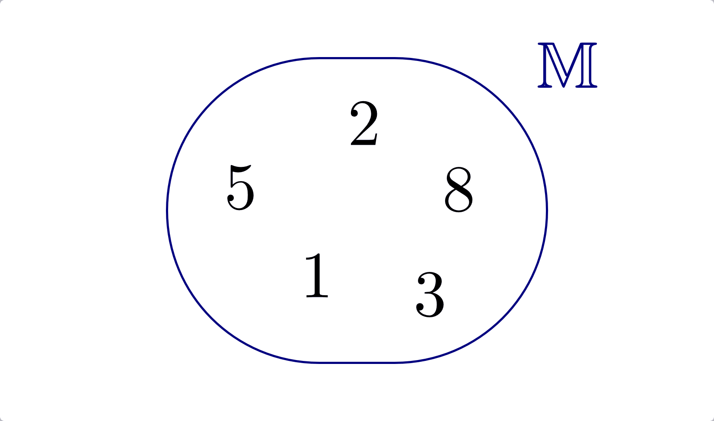
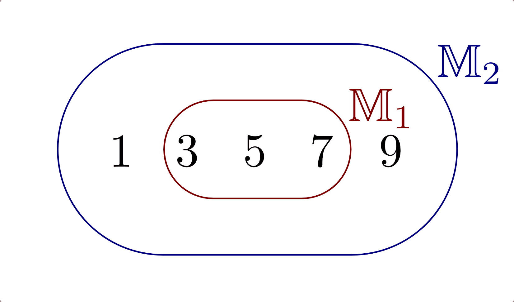
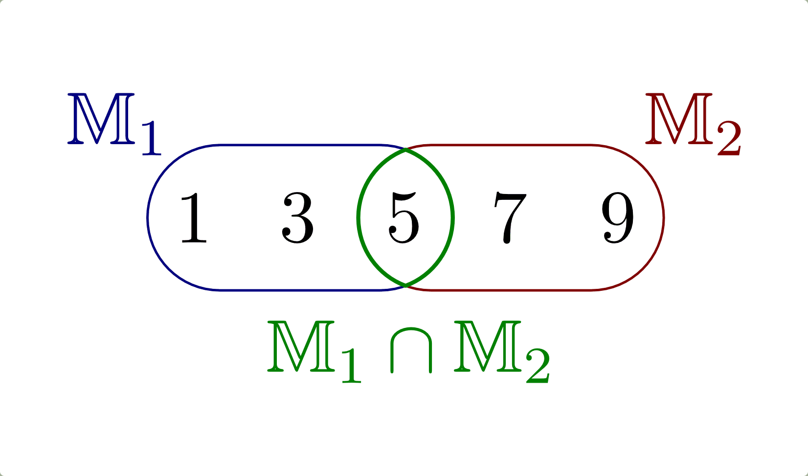
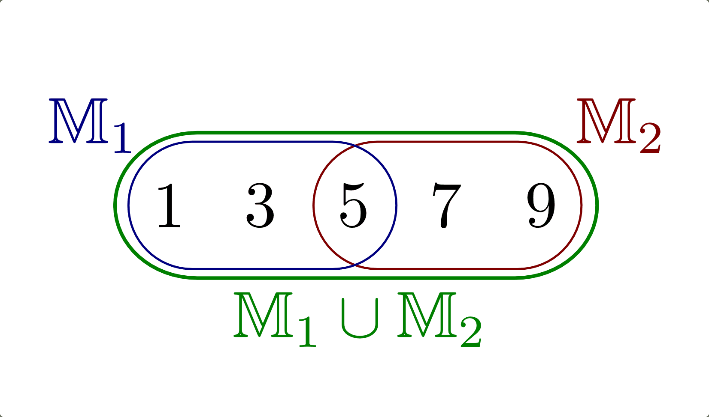
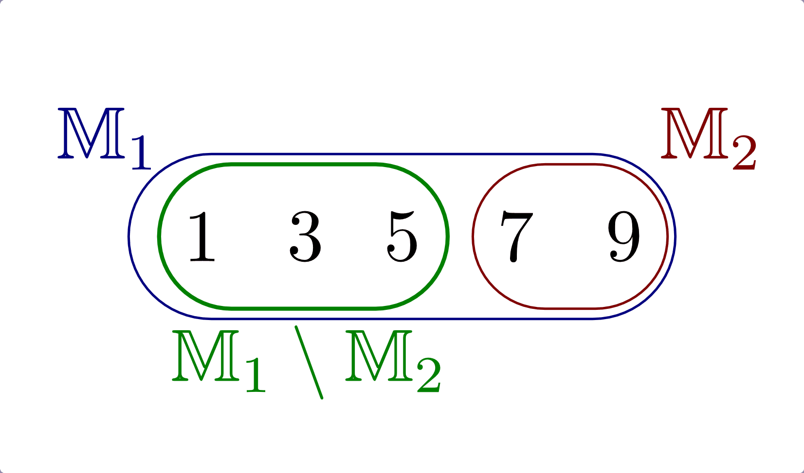
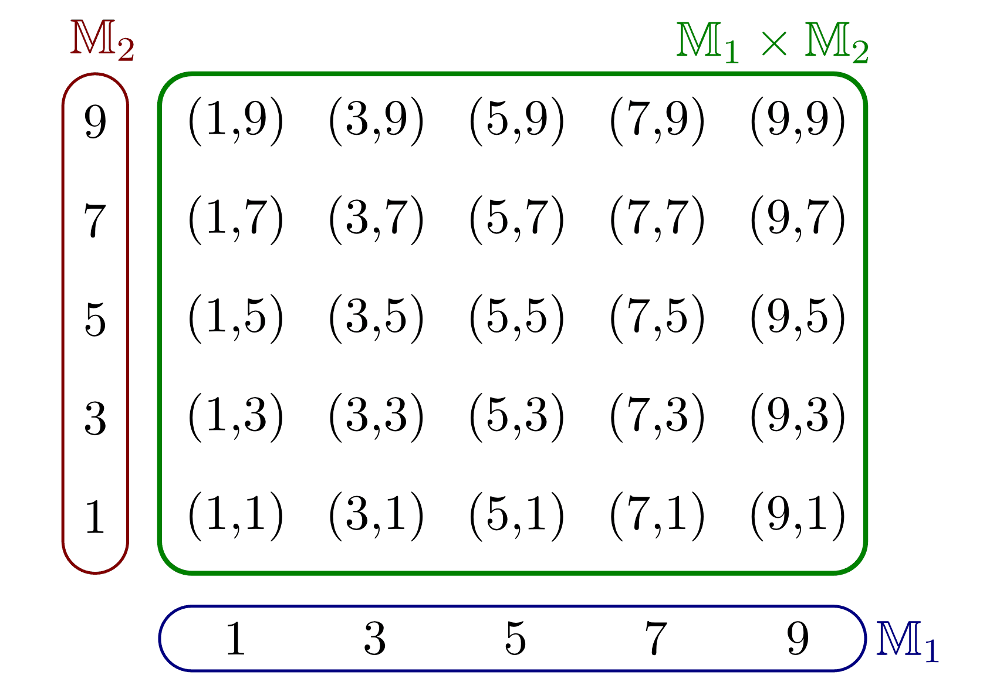

.. index:: Menge
.. _Mengen und ihre Eigenschaften:

Mengen und ihre Eigenschaften
=============================

Der Begriff "Menge" wurde erstmals von `Georg Cantor
<https://de.wikipedia.org/wiki/Georg_Cantor>`_ benutzt. Er bezeichnete damit
eine "Zusammenfassung von bestimmten, klar unterscheidbaren Objekten unserer
Anschauung und unseres Denkens zu einem Ganzen."

Eine Menge (Kurzschreibweise: :math:`\mathbb{M}`) hat damit folgende
Eigenschaften: [#C1]_ 

* Eine Menge ist genau dann festgelegt, wenn sich von allen Objekten festlegen
  lässt, ob sie zur Menge gehören oder nicht.
* Ein Objekt darf nicht mehrfach in der Menge enthalten sein.

.. index:: 
    single: Element

Die in einer Menge enthaltenen Objekte werden als Elemente bezeichnet. 

*Beispiele:*

* Die Teilnehmer eines bestimmten Lehrgangs sind wohlunterschiedene Objekte
  unserer Anschauung, sie bilden also eine Menge.
* Die natürlichen Zahlen sind wohlunterschiedene Objekte unseres Denkens und
  bilden somit eine Menge.
* Die abstrakten Objekte :math:`2`, :math:`\sqrt{4}`, :math:`\frac{4}{2}`,
  :math:`\frac{12}{6}` bilden eine einelementige Menge, da sie untereinander
  gleich sind.
* Die Menge der Primzahlen enthält unendlich viele Elemente.
* Die umgangssprachlichen Bezeichnungen: "eine Menge Geld", "eine Menge Wasser"
  usw. werden in der Mathematik nicht als Mengen angesehen, da sich nicht genau
  angeben lässt, welche Objekte dazugehören.

.. index:: 
    single: Menge; Leere Menge

Als Variablen für Mengen werden Großbuchstaben, als Variablen für Elemente einer
Menge Kleinbuchstaben verwendet. :math:`\mathbb{M}` ist eine Menge, wenn für
jedes konkrete oder abstrakte Objekt :math:`x` der Satz ":math:`x \in
\mathbb{M}`" eine wahre oder falsche Aussage ist. Gehört zu einer Menge kein
konkretes oder abstraktes Objekt, so wird sie als leere Menge bezeichnet und mit
dem Symbol :math:`\emptyset` dargestellt.

Die mathematische Kurzschreibweise :math:`x \in \mathbb{M}` bedeutet, dass das Element
:math:`x` ist in der Menge :math:`\mathbb{M}` enthalten ist. Ist dieser Satz 

* für alle :math:`x` falsch, so ist :math:`\mathbb{M}` eine leere Menge,  
* für endlich viele :math:`x` wahr, so ist :math:`\mathbb{M}` eine endliche Menge,  
* für unendlich viele :math:`x` wahr, so ist :math:`\mathbb{M}` eine unendliche  Menge.  

Ist ein Element :math:`x` nicht in der Menge :math:`\mathbb{M}` enthalten, so schreibt
man :math:`x \notin \mathbb{M}`. 

.. _Darstellung von Mengen:

Darstellung von Mengen
----------------------

Mengen lassen sich auf verschiedene Arten angeben:

* Aufzählende Form: 
    Die Symbole der Objekte werden in geschweiften Klammern, durch Komma
    getrennt, aufgelistet.  

    *Beispiele:*

    * :math:`\mathbb{M}  _{\rm{1}} = \lbrace 1, 2, 3, \ldots \rbrace`
    * :math:`\mathbb{M}  _{\rm{2}} = \lbrace a, b, c, d \rbrace`

* Kennzeichnende Form: 
    In der geschweiften Klammer wird eine Regel aufgeschrieben, anhand derer
    festgelegt ist, ob ein bestimmtes Element zur Menge gehört oder nicht. 

    *Beispiel:*

    * :math:`\mathbb{M} _{\rm{3}} = \lbrace  x \; | \; \text{$x$ ist eine Primzahl}  \rbrace`

    Die Schreibweise :math:`\mathbb{M} = \lbrace x | A(x) \rbrace` bedeutet
    somit, dass genau dann :math:`x \in \mathbb{M}` gilt, wenn die
    :ref:`Aussageform <Aussageform>` :math:`A(x)` wahr ist.

* Mengendiagramme: 
    Die Elemente der Menge werden innerhalb einer geschlossenen Kurve
    dargestellt ("Venn-Diagramm") 
    

    Beispiel eines Venn-Diagramms.

    .. only:: html
    
        :download:`SVG: Venn-Diagramm 
        <../pics/mengenlehre/venn-diagramm.svg>`

.. _Mengengleichheit:
 
.. rubric:: Mengengleichheit

Zwei Mengen :math:`\mathbb{M} _{\rm{1}}`  und :math:`M _{\rm{2}}` sind gleich,
wenn jedes Element von :math:`\mathbb{M} _{\rm{1}}` auch Element von
:math:`\mathbb{M} _{\rm{2}}` ist, in Kurzschreibweise :math:`\mathbb{M}
_{\rm{1}} = \mathbb{M} _{\rm{2}}`. 

.. math::
    
    \mathbb{M}_{\rm{1}}  = \mathbb{M}_{\rm{2}} \quad \Longleftrightarrow \quad
    (\mathbb{M}_{\rm{1}} \subset \mathbb{M}_{\rm{2}} \wedge \mathbb{M}_{\rm{2}}
    \subset \mathbb{M}_{\rm{1}} )

.. index:: 
    single: Menge; Teilmenge
    single: Menge; Obermenge
.. _Teilmenge und Obermenge:
 
Teilmenge und Obermenge
-----------------------

Sind alle Elemente der Menge :math:`\mathbb{M} _{\rm{1}}` auch Elemente der Menge
:math:`\mathbb{M}_{\rm{2}}`, so ist :math:`\mathbb{M} _{\rm{1}}` eine Teilmenge
von :math:`\mathbb{M}_{\rm{2}}`, in Kurzschreibweise :math:`\mathbb{M}_{\rm{1}}
\subset \mathbb{M} _{\rm{2}}`. Hierbei gibt es zwei Möglichkeiten: 

* :math:`\mathbb{M} _{\rm{1}}` heißt *echte* Teilmenge von :math:`\mathbb{M}
  _{\rm{2}}`, wenn :math:`\mathbb{M} _{\rm{1}} \subset \mathbb{M} _{\rm{2}}` gilt
  und :math:`\mathbb{M} _{\rm{2}}` mindestens ein Element besitzt, das nicht zu
  :math:`\mathbb{M} _{\rm{1}}` gehört.
* :math:`\mathbb{M} _{\rm{1}}` heißt *unechte* Teilmenge von :math:`\mathbb{M}
  _{\rm{2}}`, wenn :math:`\mathbb{M} _{\rm{1}} \subset \mathbb{M} _{\rm{2}}`
  gilt und :math:`\mathbb{M} _{\rm{2}}` kein Element besitzt, das nicht zu
  :math:`\mathbb{M} _{\rm{1}}` gehört -- es gilt :math:`\mathbb{M} _{\rm{1}} =
  \mathbb{M} _{\rm{2}}`.

.. math::
    
    \mathbb{M} _{\rm{1}} \subset \mathbb{M} _{\rm{2}} \quad \Leftrightarrow
    \quad \left( x \in \mathbb{M} _{\rm{1}} \Rightarrow x \in \mathbb{M}
    _{\rm{2}} \right) 

In beiden Fällen wird die Menge :math:`\mathbb{M} _{\rm{2}}`, die auch alle
Elemente von :math:`\mathbb{M} _{\rm{1}}` enthält, als Obermenge von
:math:`\mathbb{M} _{\rm{1}}` bezeichnet.

*Beispiel:*

* :math:`\mathbb{M} _{\rm{1}} = \lbrace  3,\, 5,\, 7 \rbrace,  \; \mathbb{M}
  _{\rm{2}} = \lbrace 1,\,3,\, 5,\,7,\,9 \rbrace \; \Rightarrow \; \mathbb{M}
  _{\rm{1}} \subset \mathbb{M} _{\rm{2}}`

    Venn-Diagramm einer Teilmenge.

    .. only:: html
    
        :download:`SVG: Venn-Diagramm Teilmenge
        <../pics/mengenlehre/venn-diagramm-teilmenge.svg>`

.. index:: Mengenoperation
.. _Mengenoperationen:

Mengenoperationen
-----------------

.. index:: 
    single: Mengenoperation; Schnittmenge
.. _Die Schnittmenge:

Die Schnittmenge
^^^^^^^^^^^^^^^^

Unter der Schnittmenge zweier Mengen :math:`\mathbb{M} _{\rm{1}}` und
:math:`\mathbb{M} _{\rm{2}}` versteht man die Menge aller Objekte, die sowohl zu
:math:`\mathbb{M}  _{\rm{1}}` als auch zu :math:`\mathbb{M} _{\rm{2}}` gehören,
in Kurzschreibweise :math:`\mathbb{M}_{\rm{1}} \cap \mathbb{M}_{\rm{2}}`. 

.. math::
    
    x \in \mathbb{M}_{\rm{1}} \cap \mathbb{M}_{\rm{2}} \quad \Longleftrightarrow
    \quad x \in \mathbb{M}_{\rm{1}} \wedge x \in \mathbb{M}_{\rm{2}}

*Beispiel:*

* :math:`\mathbb{M} _{\rm{1}} = \lbrace  1,\, 3,\, 5 \rbrace,  \; \mathbb{M}
  _{\rm{2}} = \lbrace 5,\,7,\,9 \rbrace \; \Rightarrow \; \mathbb{M}
  _{\rm{1}} \cap \mathbb{M} _{\rm{2}} = \lbrace 5 \rbrace`

    Venn-Diagramm einer Schnittmenge.

    .. only:: html
    
        :download:`SVG: Venn-Diagramm Schnittmenge
        <../pics/mengenlehre/venn-diagramm-schnittmenge.svg>`

Nach dem gleichen Prinzip lässt sich auch die Schnittmenge mehrerer Mengen
bilden. Mengen, die keine gemeinsamen Elemente haben, werden als disjunkte oder
elementefremde Mengen bezeichnet.

.. index:: 
    single: Mengenoperation; Vereinigungsmenge
.. _Die Vereinigungsmenge:

Die Vereinigungsmenge 
^^^^^^^^^^^^^^^^^^^^^

Die Menge aller Objekte, die zu mindestens einer der Mengen :math:`\mathbb{M}
_{\rm{1}}` oder :math:`\mathbb{M} _{\rm{2}}`  gehören, heißt Vereinigungsmenge
von :math:`\mathbb{M}_{\rm{1}}` und :math:`\mathbb{M}_{\rm{2}}`, in
Kurzschreibweise: :math:`\mathbb{M}_{\rm{1}} \cup \mathbb{M} _{\rm{2}}`.  

.. math::
    
    x \in \mathbb{M} _{\rm{1}} \cup \mathbb{M}_{\rm{2}} \quad
    \Longleftrightarrow \quad x \in \mathbb{M} _{\rm{1}} \vee x \in \mathbb{M}
    _{\rm{2}}

*Beispiel:*

* :math:`\mathbb{M} _{\rm{1}} = \lbrace  1,\, 3,\, 5 \rbrace,  \; \mathbb{M}
  _{\rm{2}} = \lbrace 5,\,7,\,9 \rbrace \; \Rightarrow \; \mathbb{M}
  _{\rm{1}} \cup \mathbb{M} _{\rm{2}} = \lbrace 1 ,\, 3 ,\, 5 ,\, 7 ,\, 9
  \rbrace`

    Venn-Diagramm einer Vereinigungsmenge.

    .. only:: html
    
        :download:`SVG: Venn-Diagramm Vereinigungsmenge
        <../pics/mengenlehre/venn-diagramm-vereinigungsmenge.svg>`

Nach dem gleichen Prinzip lässt sich auch die Vereinigungsmenge mehrerer Mengen
bilden.

.. index:: 
    single: Mengenoperation; Differenzmenge
    single: Mengenoperation; Komplementärmenge
.. _Die Differenz- und Komplementärmenge:

Die Differenz- und Komplementärmenge
^^^^^^^^^^^^^^^^^^^^^^^^^^^^^^^^^^^^

Die Menge aller Objekte, die zu :math:`\mathbb{M} _{\rm{1}}` gehören, ohne
zugleich auch zu :math:`\mathbb{M} _{\rm{2}}` zu gehören, heißt Differenzmenge
(oder auch Restmenge) der Mengen :math:`\mathbb{M} _{\rm{1}}` und
:math:`\mathbb{M} _{\rm{2}}`, in Kurzschreibweise :math:`\mathbb{M} _{\rm{1}}
\setminus \mathbb{M} _{\rm{2}}`.  

.. math::
    
    x \in \mathbb{M}_{\rm{1}} \setminus \mathbb{M}_{\rm{2}} \quad
    \Longleftrightarrow \quad x \in \mathbb{M}_{\rm{1}} \wedge x \notin
    \mathbb{M} _{\rm{2}}

*Beispiel:*

* :math:`\mathbb{M} _{\rm{1}} = \lbrace  1,\, 3,\, 5 ,\, 7 ,\, 9 \rbrace,  \;
  \mathbb{M} _{\rm{2}} = \lbrace 7,\,9 \rbrace \; \Rightarrow \; \mathbb{M}
  _{\rm{1}} \setminus \mathbb{M} _{\rm{2}} = \lbrace 1 ,\, 3 ,\, 5 \rbrace`

    Venn-Diagramm einer Differenzmenge.

    .. only:: html
    
        :download:`SVG: Venn-Diagramm Differenzmenge
        <../pics/mengenlehre/venn-diagramm-differenzmenge.svg>`

Die Komplementärmenge :math:`\mathbb{M}^{*} _{\rm{1}}` einer Menge
:math:`\mathbb{M}  _{\rm{1}}` ist diejenige Menge bezüglich einer Obermenge
:math:`\mathbb{M}`, deren Elemente zwar zu :math:`\mathbb{M}`, aber nicht zu
:math:`\mathbb{M} _{\rm{1}}` gehören. Somit gilt :math:`\mathbb{M}^{*} _{\rm{1}}
= \mathbb{M} \setminus \mathbb{M} _{\rm{1}}`.

.. index:: 
    single: Mengenoperation; Produktmenge
.. _Die Produktmenge:

Die Produktmenge
^^^^^^^^^^^^^^^^

Die Produktmenge (auch Kreuzmenge oder kartesisches Produkt) der Mengen
:math:`\mathbb{M} _{\rm{1}}` und :math:`\mathbb{M} _{\rm{2}}` ist die Menge
sämtlicher geordneter Paare, die mit den Elementen der Menge :math:`\mathbb{M}
_{\rm{1}}` (an erster Stelle) und denen der Menge :math:`\mathbb{M} _{\rm{2}}`
(an zweiter Stelle) gebildet werden können, in Kurzschreibweise
:math:`\mathbb{M} _{\rm{1}} \times \mathbb{M} _{\rm{2}}`: [#PM1]_

.. math::
    
    (x \, , \, y) \in \mathbb{M} _{\rm{1}} \times \mathbb{M} _{\rm{2}} \quad
    \Longleftrightarrow \quad x \in \mathbb{M} _{\rm{1}} \wedge y \in \mathbb{M}
    _{\rm{2}} 

    Venn-Diagramm einer Produktmenge.

    .. only:: html
    
        :download:`SVG: Venn-Diagramm Produktmenge
        <../pics/mengenlehre/venn-diagramm-produktmenge.svg>`

Ordnet man die Elemente von :math:`\mathbb{M} _{\rm{1}}` als Punkte eines
Zahlenstrahls und die Elemente von :math:`\mathbb{M} _{\rm{2}}` auf einem dazu
senkrecht stehenden Zahlenstrahl an, dann stellen sich die Elemente :math:`(x
_{\rm{i}} \, , \, y _{\rm{i}})` von :math:`\mathbb{M} _{\rm{1}} \times
\mathbb{M} _{\rm{2}}` als Punkte der Ebene dar, die von den beiden
Zahlenstrahlen aufgebaut wird. Führt man diesen Gedanken fort, so findet man,
dass alle Punkte einer :math:`xy`-Koordinatenebene mit :math:`x \in \mathbb{R}`
und :math:`y \in \mathbb{R}` durch die Elemente von :math:`\mathbb{R} ^2 =
\mathbb{R} \times \mathbb{R}` dargestellt werden können.

.. _Rechenregeln für Mengenoperationen:

Rechenregeln für Mengenoperationen
^^^^^^^^^^^^^^^^^^^^^^^^^^^^^^^^^^

Für Mengenverknüpfungen gelten ähnliche Rechenregeln wie beim Rechnen mit
Zahlen. Es gilt:

* Kommutativgesetz:

    .. math::
      
        \mathbb{M} _{\rm{1}} \cap \mathbb{M} _{\rm{2}} &= \mathbb{M} _{\rm{2}} \cap
        \mathbb{M} _{\rm{1}} \\
        \mathbb{M} _{\rm{1}} \cup \mathbb{M} _{\rm{2}} &= \mathbb{M} _{\rm{2}} \cup
        \mathbb{M} _{\rm{1}} \\

* Assoziativgesetz: [#A1]_

    .. math::
      
          \mathbb{M} _{\rm{1}} \cap (\mathbb{M} _{\rm{2}} \cap \mathbb{M} _{\rm{3}})
          &= (\mathbb{M} _{\rm{1}} \cap \mathbb{M} _{\rm{2}}) \cap \mathbb{M}
          _{\rm{3}} \\
          \mathbb{M} _{\rm{1}} \cup (\mathbb{M} _{\rm{2}} \cup \mathbb{M} _{\rm{3}})
          &= (\mathbb{M} _{\rm{1}} \cup \mathbb{M} _{\rm{2}}) \cup \mathbb{M}
          _{\rm{3}} \\

* Distributivgesetz: [#D1]_

    .. math::
    
        \mathbb{M} _{\rm{1}} \cap (\mathbb{M} _{\rm{2}} \cup \mathbb{M}
        _{\rm{3}}) &= (\mathbb{M} _{\rm{1}} \cap \mathbb{M} _{\rm{2}}) \cup
        (\mathbb{M} _{\rm{1}} \cap \mathbb{M} _{\rm{3}}) \\
        \mathbb{M} _{\rm{1}} \cup (\mathbb{M} _{\rm{2}} \cap \mathbb{M}
        _{\rm{3}}) &= (\mathbb{M} _{\rm{1}} \cup \mathbb{M} _{\rm{2}}) \cap
        (\mathbb{M} _{\rm{1}} \cup \mathbb{M} _{\rm{3}})

Zusätzlich gilt für beliebige Mengen:

.. math::
    
    \mathbb{M} _{\rm{1}} \setminus (\mathbb{M} _{\rm{2}} \cup \mathbb{M}
    _{\rm{3}}) &= (\mathbb{M} _{\rm{1}} \setminus \mathbb{M} _{\rm{2}}) \cap
    (\mathbb{M} _{\rm{1}} \setminus \mathbb{M} _{\rm{3}}) \\
    \mathbb{M} _{\rm{1}} \setminus (\mathbb{M} _{\rm{2}} \cap \mathbb{M}
    _{\rm{3}}) &= (\mathbb{M} _{\rm{1}} \setminus \mathbb{M} _{\rm{2}}) \cup
    (\mathbb{M} _{\rm{1}} \setminus \mathbb{M} _{\rm{3}})

.. math::
    
    \mathbb{M} _{\rm{1}} \times (\mathbb{M} _{\rm{2}} \cup \mathbb{M} _{\rm{3}})
    &= (\mathbb{M} _{\rm{1}} \times \mathbb{M} _{\rm{2}}) \cup (\mathbb{M}
    _{\rm{1}} \times \mathbb{M} _{\rm{3}}) \\
    \mathbb{M} _{\rm{1}} \times (\mathbb{M} _{\rm{2}} \cap \mathbb{M} _{\rm{3}})
    &= (\mathbb{M} _{\rm{1}} \times \mathbb{M} _{\rm{2}}) \cap (\mathbb{M}
    _{\rm{1}} \times \mathbb{M} _{\rm{3}})

Für Verknüpfungen mit der leeren Menge :math:`\emptyset`  gilt:

.. math::
    
    \mathbb{M} \cup \emptyset &= \mathbb{M} \\
    \mathbb{M} \cap \emptyset &= \emptyset \\
    \mathbb{M} \setminus \emptyset  &= \mathbb{M} \\
    \emptyset \setminus \mathbb{M} &= \emptyset \\

.. index:: Mächtigkeit
.. _Die Mächtigkeit von Mengen:

Die Mächtigkeit von Mengen
--------------------------

Haben zwei endliche Mengen :math:`\mathbb{M} _{\rm{1}}` und :math:`\mathbb{M}
_{\rm{2}}` die gleiche Anzahl an Elementen, so bezeichnet man :math:`\mathbb{M}
_{\rm{1}}` und :math:`\mathbb{M} _{\rm{2}}` als gleichmächtig. Die Anzahl
:math:`A` aller Elemente einer endlichen Menge :math:`\mathbb{M}` wird auch
Kardinalzahl genannt.

.. index:: Abzählbarkeit
.. _Die Abzählbarkeit:

.. rubric:: Die Abzählbarkeit

Die Mächtigkeit von unendlichen Mengen wird an der Menge der natürlichen
Zahlen :math:`\mathbb{N} = \lbrace 0 ,\, 1 ,\, 2 ,\, \ldots \rbrace` gemessen.
Lässt sich jedes Element einer Menge :math:`\mathbb{M}` in eindeutiger Weise
einem Element aus :math:`\mathbb{N}` zuordnen, so wird die Menge
:math:`\mathbb{M}` als abzählbar bezeichnet; die Elemente von
:math:`\mathbb{M}` lassen sich also mit Hilfe der natürlichen Zahlen
"numerieren". 

*Beispiel:*

* Jeder Zahl :math:`n` aus der Menge der natürlichen Zahlen :math:`\mathbb{N}`
  kann durch die Zuordnung :math:`2 \cdot n` eine geradzahlige natürliche Zahl
  zugeordnet werden. Die (unendliche) Menge der geradzahligen natürlichen
  Zahlen ist somit ebenfalls abzählbar.
  
Ist eine Menge nicht abzählbar, wie beispielsweise die Menge :math:`\mathbb{R}`
der reellen Zahlen, so wird sie überabzählbar genannt.

.. raw:: html

    

    
.. only:: html

    .. rubric:: Anmerkungen:

.. [#C1] Genaugenommen lassen sich, wenn man den Begriff "Menge" nicht genauer
    fasst, paradoxe Aussagen formulieren. Am bekanntesten ist die `Russelsche
    Antinomie <http://de.wikipedia.org/wiki/Russellsche_Antinomie>`_: 

        "Gibt es eine Menge die nur Elemente enthält mit der Eigenschaft,
        dass sie in keiner Menge enthalten sind?"

    Durch eine Formulierung von bestimmten Bedingungen, die jede Menge
    erfüllen muss, konnten die Mathematiker `Ernst Zermelo
    <http://de.wikipedia.org/wiki/Ernst_Zermelo>`_ und `Abraham Adolf
    Fränkel <http://de.wikipedia.org/wiki/Adolf_Abraham_Halevi_Fraenkel>`_
    im Jahr 1930 eine widerspruchsfreie Mengenlehre einführen. Für die
    meisten alltäglichen Mathematik-Aufgaben genügt allerdings der
    `ursprüngliche Mengenbegriff
    <http://de.wikipedia.org/wiki/Mengenlehre#19._Jahrhundert>`_.

.. [#PM1] Ein Element :math:`(x,y)` einer Produktmenge ist nicht mit einer Menge
    :math:`\lbrace x,y \rbrace` zu verwechseln. Während in letzterer die
    Reihenfolge von :math:`x` und :math:`y` keine Rolle spielt, d.h.
    :math:`\lbrace x,y \rbrace = \lbrace y,x \rbrace` gilt, sind zwei Elemente
    einer Produktmenge nur gleich, wenn ihre Komponenten paarweise gleich sind,
    d.h. wenn gilt:

    .. math::

        (x _{\rm{1}} ,\, y _{\rm{1}} ) = (x _{\rm{2}} ,\, y _{\rm{2}} )
        \Leftrightarrow (x _{\rm{1}} = x _{\rm{2}}) \wedge (y _{\rm{1}} = y
        _{\rm{2}})

.. [#A1] Da hierbei die Reihenfolge der Zusammenfassung beliebig ist, kann auf
        die Klammern verzichtet werden.

.. [#D1] Genau genommen entspricht die obige Darstellung nur der "linksseitigen"
    Distributivität. Für zwei Mengen gilt jedoch ebenso die "rechtsseitige"
    Distributivität:

    .. math::
    
        (\mathbb{M} _{\rm{2}} \cup \mathbb{M} _{\rm{3}}) \cap \mathbb{M}
        _{\rm{1}} &= (\mathbb{M} _{\rm{1}} \cap \mathbb{M} _{\rm{2}}) \cup
        (\mathbb{M} _{\rm{1}} \cap \mathbb{M} _{\rm{3}}) \\
        (\mathbb{M} _{\rm{2}} \cap \mathbb{M} _{\rm{3}}) \cup \mathbb{M}
        _{\rm{1}} &= (\mathbb{M} _{\rm{1}} \cup \mathbb{M} _{\rm{2}}) \cap
        (\mathbb{M} _{\rm{1}} \cup \mathbb{M} _{\rm{3}})

    Gelten sowohl die linksseitige wie auch die rechtsseitige Distributivität,
    wird allgemein von "Distributivität" gesprochen. 

