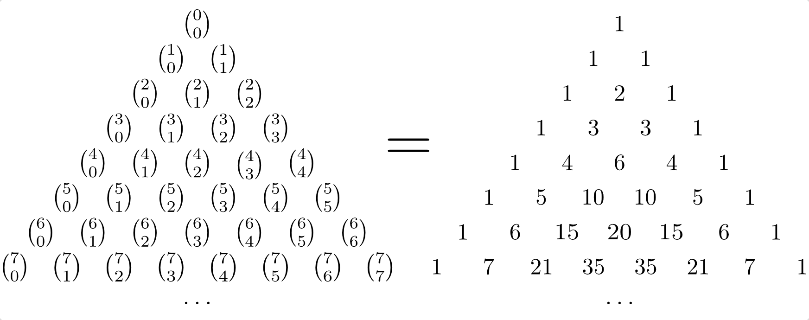

.. index:: Kombinatorik
.. _Kombinatorik:

Kombinatorik
============

In der Kombinatorik wird untersucht, wie viele unterschiedliche Möglichkeiten
sich bei der Anordnung einer bestimmten Anzahl an Objekten ergeben, je nachdem,
ob dabei die Reihenfolge der Objekte berücksichtigt wird und/oder die Objekte
wiederholt auftreten können.

.. index:: Permutation
.. _Permutationen:

Permutationen
-------------

Eine Menge mit :math:`n` Elementen soll unter Berücksichtigung der Reihenfolge
angeordnet werden, wobei jedes Element nur einmal vorkommen darf. Wie viele
verschiedene Anordnungen sind dabei möglich?

Diese Grundfrage lässt sich beantworten, indem Schritt für Schritt geprüft wird,
wie viele Möglichkeiten sich bei der Besetzung jeder einzelnen Stelle ergeben.
Für die Besetzung der ersten Stelle gibt es :math:`n` Möglichkeiten, da noch
kein Element vergeben wurde. Für die Besetzung der zweiten Stelle bleiben nur
noch :math:`n-1` Möglichkeiten, da ein Element bereits an der ersten Stelle
vergeben wurde. Für die Besetzung der dritten Stelle bleiben entsprechend noch
:math:`n-2` Möglichkeiten, und so weiter. Für die letzte Stelle bleibt nur noch
ein Element übrig, somit gibt es auch nur eine Möglichkeit die Stelle zu
besetzen.

Jede Besetzung einer einzelnen Stelle kann mit jeder Besetzung einer anderen
Stelle kombiniert werden. Damit entspricht die Anzahl an
:math:`n`-Permutationen, d.h. an Anordnungen mit Berücksichtigung der
Reihenfolge und ohne Wiederholung der Elemente, dem Produkt aller Möglichkeiten
für die einzelnen Stellen:

.. math::
    :label: eqn-permutationen
    
    n! = n \cdot (n-1) \cdot (n-2) \cdot \ldots \cdot 1 

Dabei wird mit :math:`n!` (gelesen: :math:`n` Fakultät) die :ref:`Produktfolge
<Produktfolgen>` von :math:`1` bis :math:`n` bezeichnet.

*Beispiel:*
    
* Auf wieviele verschiedene Arten sich ein roter, ein grüner, ein blauer, ein
  gelber und ein weißer Ball in einer Reihe hintereinander legen? 
  
  Da es sich insgesamt um fünf Bälle handelt und jeder Ball die erste Position
  in der Reihe einnehmen kann, gibt es für die Besetzung der erste Stelle
  :math:`5` Möglichkeiten. Für jede mögliche Besetzungen der ersten Stelle gibt
  es :math:`4` Möglichkeiten, die zweite Stelle zu besetzen, und für jede dieser
  Anordnungen existieren wiederum :math:`3` Möglichkeiten zur Besetzung der
  dritten Stelle. Schließlich gibt es für jede dieser Anordnungen dreier Bälle
  :math:`2` Möglichkeiten zur Besetzung der vierten Stelle. Die fünfte Stelle
  ist automatisch festgelegt, da jeweils nur :math:`1` Besetzungsmöglichkeit
  vorliegt. Insgesamt ergibt sich damit folgende Anzahl an Möglichkeiten:

  .. math::
      
      5! = 5 \cdot 4 \cdot 3 \cdot 2 \cdot 1 = 120

  Es gibt somit :math:`120` verschiedene Möglichkeiten die fünf Bälle der Reihe
  nach anzuordnen.

.. :math:`n` unterschiedliche Objekte lassen sich auf :math:`(n-1)!` Arten kreisförmig anordnen.

.. _Permutationen mit nicht unterscheidbaren Objekten:

.. rubric:: Permutationen mit nicht unterscheidbaren Objekten

Sind :math:`m` von den insgesamt :math:`n` Objekten nicht unterscheidbar, so
können diese auf :math:`m!` verschiedene Arten auf ihre Positionen verteilt
werden. Da alle diese die Möglichkeiten nur eine einzige Anordnung liefern,
würden sie in der Permutations-Gleichung :eq:`eqn-permutationen`
fälschlicherweise zu einem :math:`m!`-fachen an Kombinationsmöglichkeiten 
führen. 

Um die Einschränkung an unterschiedlichen Anordnungen zu berücksichtigen, muss
Gleichung :eq:`eqn-permutationen` durch :math:`m!` dividiert werden. Die
Anzahl an :math:`n`-Permutationen mit :math:`m` identischen Objekten ist somit
gleich :math:`\frac{n!}{m!}`.

Sind allgemein jeweils :math:`m _{\rm{1}}, m _{\rm{2}}, \ldots` der insgesamt
:math:`n` Objekte identisch, so lässt sich die Anzahl an Permutationen
(unterschiedlichen Anordnungen) folgendermaßen berechnen:

.. math::
    :label: eqn-permutationen-mit-identischen-objekten
    
    \frac{n}{m _{\rm{1}}! \cdot m _{\rm{2}}! \cdot \ldots}

*Beispiele:*

* Auf wieviele verschiedene Arten lassen sich die Ziffern :math:`001` anordnen?

  In diesem Fall treten zwei gleichartige Objekte (die zwei Nullen) auf. Für
  die Anzahl der möglichen Permutationen gilt somit:

  .. math::
      
      \frac{3!}{2!} = \frac{3 \cdot 2 \cdot 1}{2 \cdot 1} = 3
  
  Es sind somit drei verschiedene Permutationen :math:`(001 ,\, 010 ,\, 100)`
  möglich.

* Auf wieviele verschiedene Arten lassen sich die Buchstaben des Wortes
  "Mississippi" anordnen?

 Wären alle elf Buchstaben voneinander verschieden, so gäbe es :math:`11! =
 39\,916\,800` unterschiedliche Anordnungsmöglichkeiten. Von diesen Anordnungen
 sind allerdings :math:`4! \cdot 4! \cdot 2!` identisch, da es sich bei den vier
 Buchstaben "i", den vier Buchstaben "s" und den zwei Buchstaben "p" um nicht
 unterscheidbare Objekte handelt, und die verschiedenen Anordnungsmöglichkeiten
 der gleichen Buchstaben jeweils zu nur einer einzigen zusammenfallen.
 Insgesamt ergibt sich somit folgende Anzahl an möglichen Anordnungen:

 .. math::
     
     \frac{11!}{4! \cdot 4! \cdot 2!} = \frac{39\,916\,800}{1\ 152} = 34\,650

 Es gibt also :math:`34\,650` verschiedene Möglichkeiten, die elf Buchstaben
 unter Berücksichtigung der Reihenfolge anzuordnen.

.. index:: Variation
.. _Variationen:

Variationen
-----------

Bei einer Variation wird aus einer Menge von :math:`n`-Elementen eine Auswahl an
:math:`k` Elementen entnommen; dabei wird die Reihenfolge der entnommenen
Elemente berücksichtigt.

.. index:: Variation; ohne Wiederholung
.. _Variationen ohne Wiederholung:

.. rubric:: Variationen ohne Wiederholung

Wird aus einer Menge mit :math:`n` Elementen eine Anzahl an :math:`k \le n`
Elementen entnommen, wobei kein Element mehrfach vorkommen darf, so ergibt sich
(unter Berücksichtigung der Reihenfolge) eine bestimmte Anordnung der :math:`k`
Elemente. Mathematisch wird eine solche Anordnung :math:`( a _{\rm{1}} ,\,  a
_{\rm{2}} ,\,  a _{\rm{3}} ,\, \ldots ,\, a _{\rm{k}})` als "Tupel" bezeichnet.
[#]_

An der ersten Stelle des Tupels kann jedes der :math:`n` Elemente auftreten.
Für die Besetzung der zweiten Stelle sind nur noch :math:`(n-1)` Möglichkeiten
vorhanden, für die Besetzung der dritten Stelle :math:`(n-2)` Möglichkeiten.
Für die Besetzung :math:`k`-te Stelle gibt es schließlich :math:`(n-k+1)`
verschiedene Möglichkeiten. Die Anzahl an möglichen Tupeln ist
somit insgesamt gleich:

.. math::
    :label: eqn-variationen-ohne-wiederholung
    
    \frac{n!}{(n-k)!} = n \cdot (n-1) \cdot (n-2) \cdot \ldots \cdot (n-k+1)!

Da :math:`0! = 1` gilt, kann im Fall :math:`k = n` die obige Formel
:eq:`eqn-variationen-ohne-wiederholung` als :math:`\frac{n!}{(n-n)!} =
\frac{n!}{0!} = n!` geschrieben werden. Dieser Fall entspricht somit einer
Permutation der :math:`n` Elemente beziehungsweise der Gleichung
:eq:`eqn-permutationen`. Im Fall :math:`k < n` wird die Produktreihe vorzeitig
"abgeschnitten".

.. index:: Variation; mit Wiederholung
.. _Variationen mit Wiederholung:

.. rubric:: Variationen mit Wiederholung

Wird aus einer Menge mit :math:`n` Elementen eine Anzahl an :math:`k \le n`
Elementen entnommen, wobei jedes Element mehrfach vorkommen darf, so spricht man
von einer Variation mit Wiederholung. Jedes Ergebnis ist wiederum ein Tupel
:math:`( a _{\rm{1}} ,\,  a _{\rm{2}} ,\,  a _{\rm{3}} ,\, \ldots ,\, a
_{\rm{k}})`. 

An jeder Stelle des Tupels kann, wenn eine Wiederholung der Elemente möglich
ist, jedes der :math:`n` Elemente auftreten. Die Anzahl an möglichen Tupeln ist
somit gleich:

.. math::
    :label: eqn-variationen-mit-wiederholung
    
    \underbrace{n \cdot n \cdot n \cdot \ldots \cdot n}_{\text{$k$ mal} } = n^k
    
*Beispiel:*
    
* Aus einer Liste mit :math:`100` verschiedenen Zitaten wird jeden Tag nach
  einem Zufallsprinzip ein Zitat ausgewählt, um als "Zitat des Tages" auf einer
  Homepage eingeblendet zu werden. Wie viele verschiedene Variationen der Zitate
  können in :math:`7` Tagen auftreten?

  An jedem der Tage sind :math:`10` verschiedene Zitate möglich, denn es kann
  auch an zwei oder mehreren aufeinander folgenden Tagen das gleiche Zitat
  erscheinen. Innerhalb einer Woche gilt damit für die Anzahl an möglichen
  Zitatefolgen:

  .. math::
      
      10 ^7 = 10\,000\,000

  Innerhalb einer Woche können somit zehn Millionen verschiedene Anordnungen
  der Zitate auftreten.
  
.. index:: Kombination
.. _Kombinationen:

Kombinationen
-------------

Bei einer Kombination wird aus einer Menge von :math:`n`-Elementen eine Auswahl
an :math:`k` Elementen entnommen; dabei wird die Reihenfolge der entnommenen
Elemente *nicht* berücksichtigt.

..  Es gibt immer weniger Kombinationen als Variationen, da bei den Kombinationen
..  die Reihenfolge nicht beachtet wird.

.. index:: 
    single: Kombination; ohne Wiederholung
    single: Binomialkoeffizient
.. _Kombinationen ohne Wiederholung:

.. rubric:: Kombinationen ohne Wiederholung

Um :math:`k` Elemente in einer bestimmten Reihenfolge aus einer Menge mit
:math:`n` Elementen auszuwählen, gibt es, wie im Abschnitt :ref:`Variationen
ohne Wiederholung <Variationen ohne Wiederholung>` besprochen,
:math:`\frac{n!}{(n-k)!}` Möglichkeiten. Hierbei wurde allerdings jede
Reihenfolge der :math:`k` Elemente als eigene Möglichkeit angesehen. Soll die
Reihenfolge der entnommenen Elemente nicht berücksichtigt werden, so muss die
Gesamtzahl :math:`\frac{n!}{(n-k)!}` durch die Anzahl der möglichen Anordnungen der
:math:`k` Elemente dividiert werden (also durch :math:`k!`). 

Die sich ergebende Größe heißt Binomialkoeffizient und wird folgendermaßen
dargestellt:

.. math::
    :label: eqn-kombimationen-ohne-wiederholung
    
    \binom{n}{k} = \frac{n!}{(n - k)! \cdot k!}
    
Die Werte der Binomialkoeffizienten lassen sich als so genanntes "Pascalsches
Dreieck" anordnen. Da bei der Nummerierung der Zeilen und Spalten mit
:math:`n=0` beziehungsweise :math:`k=0` begonnen wird, befindet sich der
Koeffizient :math:`\binom{n}{k}` in der :math:`(n+1)`-ten Zeile an der
:math:`(k+1)`-ten Stelle.

    Das Pascalsche Dreieck

    .. only:: html
    
        :download:`SVG: Pascalsches Dreieck
        <../pics/stochastik/pascalsches-dreieck.svg>`

..  
    Symmetrie:
    
    .. math::
         
        \binom{n}{k} = \binom{n}{n-k}
     
    Zudem: :math:`\binom{n}{k} = 0` für :math:`k > n`.

Jede Zahl ist die Summe der beiden darüber liegenden Zahlen. Die Werte
Binomialkoeefizienten können somit rekursiv nach folgender Formel berechnet
werden:

.. math::
    
    \binom{n+1}{k+1} = \binom{n}{k} + \binom{n}{k+1}
    
..  :label: eqn-binomialkoeffizient-summe
..  
    bzw.
    
    .. math::
        
        \binom{n}{k} = \binom{n-1}{k-1} + \binom{n-1}{k}     

..   
    Zudem: Zeilensumme :math:`\binom{n}{0} + \binom{n}{1} + \ldots +
    \binom{n}{n} = \sum_{k=0}^{n}\binom{n}{k}= 2^n`, alternierende Summe :math:`\binom{n}{0} - \binom{n}{1}
    + \ldots + (-1)^n \cdot \binom{n}{n} = 0`

..  
    Allgemeine binomische Formel:
    .. math::
        
        (1+x)^n = \sum_{k=0}^{n}  \binom{n}{k} \cdot x^k

..  
    Insbesondere
        \sum_{k=0}^{n}  \binom{n}{k} = \sum_{k=0}^{n}  \binom{n}{k} \cdot 1^k =
        (1+1)^n = 2^n
    
..  
    \binom{n+m}{n} = \binom{n+m}{m}

..  
    :math:`n` gleiche Objekte in :math:`k` unterschiedliche Fächer legen, kein
    Fach darf leer bleiben: :math:`\binom{n-1}{k-1}`.
        
*Beispiel:*
    
* Wie viele Möglichkeiten gibt es, :math:`k=3` Kugeln aus einer Schale mit
  :math:`n=10` durchnummerierten Kugeln zu entnehmen, wenn die Reihenfolge keine
  Rolle spielt?
        
  Durch Einsetzen von :math:`k=3` und :math:`n=10` in Gleichung
  :eq:`eqn-kombimationen-ohne-wiederholung` erhält man:
  
  .. math::
      
      \binom{10}{3} = \frac{10!}{7! \cdot 3!} = \frac{10 \cdot 9 \cdot 8}{3
      \cdot 2 \cdot 1} = \frac{720}{6} = 120
  
  Es gibt somit :math:`120` verschiedene Möglichkeiten, aus zehn nummerierten
  Kugeln drei Stück auszuwählen.
  
.. Lotto!

.. index:: Kombination; mit Wiederholung
.. _Kombinationen mit Wiederholung:

.. rubric:: Kombinationen mit Wiederholung

Wird aus einer Menge mit :math:`n` Elementen eine Anzahl an :math:`k \le n`
Elementen entnommen, wobei jedes Element mehrfach vorkommen darf und die
Reihenfolge der entnommenen Elemente nicht berücksichtigt wird, so spricht man
von einer Kombination mit Wiederholung. [#KMW]_ Hierfür gibt es folgende Anzahl an
Möglichkeiten:

.. math::
    :label: eqn-kombimationen-mit-wiederholung
    
    \binom{n+k-1}{k} = \frac{(n + k -1)!}{(n-1)! \cdot k!}

Formal ist diese Formel mit der Binomialkoeffizienten-Gleichung
:eq:`eqn-kombimationen-ohne-wiederholung` identisch, wenn man :math:`n` durch
den Wert :math:`(n+k-1)` ersetzt.

*Beispiel:*
    
* Wie viele Möglichkeiten gibt es bei einem :math:`k=3`-fachen Werfen eines
  Würfels mit :math:`n=6` verschiedenen Seiten, wenn die Reihenfolge keine Rolle
  spielt? 

  Durch Einsetzen von :math:`k=3` und :math:`n=6` in Gleichung
  :eq:`eqn-kombimationen-mit-wiederholung` erhält man:
  
  .. math::
      
      \binom{6+3-1}{3} = \binom{8}{3} = \frac{8!}{5! \cdot 3!} = \frac{8 \cdot 7 \cdot 6}{3
      \cdot 2 \cdot 1} = 56
  
  Es gibt bei dreimaligem Werfen des Würfels somit :math:`56` verschiedene
  Kombinationen an erhaltenen Werten.
  

  
..  
    Das entspricht der Ziehung von k=3 Kugeln bei n=6 unterscheidbaren Kugeln,
    wenn die Kugeln jedes Mal zurückgelegt werden und die Reihenfolge auch hier
    keine Rolle

.. raw:: html

    

.. only:: html

    .. rubric:: Anmerkungen:

.. [#] Auch geordnete Paare zweier Zahlen, beispielsweise die Koordinaten
    :math:`(x ,\, y)` eines Punktes in einem zweidimensionalen
    Koordinatensystem, können somit als Tupel bezeichnet werden.

.. [#KMW] Da jedes Element mehrfach vorkommen darf, ist bei Kombinationen mit
    Wiederholung auch :math:`k > n` möglich.

