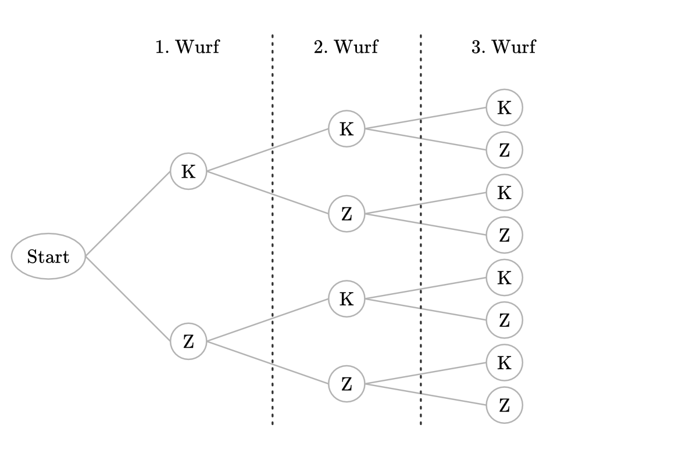

.. index:: Zufallsexperiment
.. _Zufallsexperimente und Ereignisse:

Zufallsexperimente und Ereignisse
=================================

Experimente, die unter gleichen Bedingungen zu gleichen Ergebnissen führen,
bezeichnet man als determiniert. Im Rahmen der Wahrscheinlichkeitsrechnung
werden hingegen meist zufällige Vorgänge betrachtet.

.. index:: Zufallsexperiment; einstufig
.. _Zufallsexperimente:

.. rubric:: Zufallsexperimente

Als Experiment bezeichnet man allgemein einen Vorgang, der (zumindest
prinzipiell) beliebig oft wiederholt werden kann. Dabei ist klar festgelegt,
welche Messgröße beobachtet werden soll, d.h. jedes mögliche Ergebnis kann
eindeutig festgestellt werden. Eine einzelne Durchführung eines Experiments
nennt man Versuch.

Ein Experiment, bei dem die Menge aller möglichen Ergebnisse bekannt ist, jedoch
nicht das bei der Durchführung eines Versuchs tatsächlich eintretende Ergebnis,
bezeichnet man als Zufallsexperiment.

*Beispiel:*

* In einer Urne befinden sich 50 gleichartige Kugeln mit den Nummern :math:`1,
  2, \ldots, 50`. Eine Kugel wird blind gezogen und anschließend ihre Nummer
  notiert. Es können dabei 50 mögliche Ergebnisse auftreten, wobei die Nummer
  der gezogenen Kugel :math:`k` genannt wird.

Für die einzelnen Versuchsergebnisse werden üblicherweise Kurzbezeichnungen
eingeführt, beispielsweise :math:`k` für das Ergebnis "Die gezogene Kugel hat
die Nummer :math:`k`". Alle möglichen Versuchsergebnisse fasst man zu einer so
genannten Ergebnismenge :math:`\Omega` zusammen. Im obigen Fall gilt
beispielsweise:

.. math::

    \Omega = \{ \; 1 ,\, 2 ,\, \ldots ,\,  50 \; \}

Die einzelnen, voneinander verschiedenen Ergebnisse eines Zufallsexperiments
werden allgemein mit :math:`\omega _1 , \omega _2, \ldots` bezeichnet. Allgemein
besteht eine Ergebnismenge also aus folgenden Elementen:

.. math::

    \Omega = \{ \; \omega_1 ,\, \omega_2 ,\, \ldots ,\, \omega_{\mathrm{n}} \; \}

.. index:: Zufallsexperiment; mehrstufig
.. _Mehrstufige Zufallsexperimente:

.. rubric:: Mehrstufige Zufallsexperimente

Einstufige Zufallsexperimente, wie beispielsweise das Ziehen *einer* Kugel aus
einer Urne, können zu mehrstufigen Zufallsexperimenten zusammengesetzt werden.
Hierbei wird das zu Grunde liegende einstufige Zufallsexperiment mehrfach
ausgeführt.

*Beispiel:*

* Eine Münze wird zweimal geworfen. Bei jedem Wurf kann entweder das Ergebnis
  "Kopf" :math:`(K)` oder "Zahl" :math:`(Z)` eintreten. Insgesamt lassen sich
  die möglichen Versuchsergebnisse durch ein Tupel zweier Werte beschreiben. Für
  die Ergebnismenge gilt in diesem Fall also:

  .. math::

      \Omega = \{ \; (K,K) ,\,  (K,Z) ,\,  (Z,K) ,\,  (Z,Z) \; \}

Die Ergebnismenge im obigen Beispiel lässt sich auch als :ref:`Produktmenge <Die
Produktmenge>` :math:`\{K,Z\} \times \{K,Z\}` der Ergebnismengen eines
einmaligen Werfens einer Münze darstellen. Allgemein lässt sich ein
:math:`k`-stufiges Zufallsexperiment mit Hilfe von geordneten Zahlenpaaren der
Länge :math:`k` (so genannten ":math:`k`-Tupeln") beschreiben.

    Baumdiagramm eines dreimailigen Münzwurfes.

    .. only:: html

        :download:`SVG: Baumdiagramm (Münzwurf)
        <../pics/stochastik/baumdiagramm-muenzwurf.svg>`

Eine Ergebnismenge kann durch einen so genannten Ergebnisbaum veranschaulicht
werden. Jedem Ergebnis entspricht dabei einem Weg durch den Ergebnisbaum.

.. Baumdiagramme sind allgemein hilfreich, wenn Ergebnisse Tupel sind, also die
.. Reihenfolge zu berücksichtigen ist.

.. todo pic

.. index:: Ereignis
.. _Ereignisse:

.. rubric:: Ereignisse

Ereignisse werden formal durch Teilmengen von :math:`\Omega` beschrieben.

*Beispiel:*

* Eine Urne enthält :math:`15` Kugeln, wobei je zwei Kugeln mit den Nummern
  :math:`0,1,2,3,4` und je eine Kugel mit den Nummern :math:`5,6,7,8,9`
  vorkommen. Es wird eine Kugel blind gezogen und ihre Nummer notiert, die
  Ergebnismenge ist also :math:`\Omega = \{ 0,1,2, \ldots, 9\}`.

  Fasst man das Zufallsexperiment als Glücksspiel auf, bei dem man gewinnt,
  wenn eine Nummer :math:`\ge 5` gezogen wird, so tritt dieses Ereignis genau
  dann ein, wenn die gezogene Nummer gleich :math:`5,\,6,\,7,\,8` oder :math:`9`
  ist, d.h. das Versuchsergebnis zur Menge :math:`M = \{ 5,6,7,8,9 \}` gehört.
  Das Ereignis ist also durch die Menge :math:`M` eindeutig beschrieben.

Allgemein beschreibt jede Teilmenge :math:`M` von :math:`\Omega` ein Ereignis.
Ist die Teilmenge mit :math:`\Omega` identisch :math:`(M = \Omega)`, so spricht
man von einem sicheren Ereignis, ist die Teilmenge gleich der leeren Menge
:math:`(M = \emptyset)`, so handelt es sich um ein unmögliches Ereignis.
Beinhaltet die Teilmenge genau ein Element :math:`\omega`, so nennt man das
Ereignis elementar. [#]_

.. index:: Ereignismenge
.. _Ereignismenge:

Die Menge aller möglichen Ereignisse, d.h. die Menge aller Teilmengen von
:math:`\Omega`, heißt Ereignismenge :math:`\mathcal{ P }(\Omega)`. [#]_

.. todo Beispiel

Da es sich bei Ereignissen um Mengen handelt, können diese ebenfalls durch
Mengenoperationen miteinander verknüpft werden:

* Betrachtet man die Schnittmenge :math:`M_1 \cap M_1` zweier Ereignisse, so
  spricht man von einem UND-Ereignis (:math:`M_1` und :math:`M_1`).
* Betrachtet man die Vereinigungsmenge :math:`M_1 \cup M_1` zweier Ereignisse, so
  spricht man von einem ODER-Ereignis (:math:`M_1` und :math:`M_1`).
* Betrachtet man die Komplementmenge :math:`\overline{M_1}` eines Ereignisses, so
  spricht man von einem Gegenereignis (nicht :math:`M_1`).

Durch Bildung von :ref:`Vereinigungs-, Schnitt- und Komplementmengen
<Mengenoperationen>` lassen sich nach den :ref:`Rechenregeln der Mengenlehre
<Rechenregeln für Mengenoperationen>` weitere Ereignisse formulieren bzw.
Beschreibungen von Ereignissen vereinfacht werden.

Können zwei Ereignisse :math:`M_1` und :math:`M_2` nicht gleichzeitig eintreten,
d.h. ist :math:`M_1 \cap M_2 = \emptyset`,  so nennt man die Ereignisse
unvereinbar. Dies ist stets bei einem Ereignis :math:`M` und dem entsprechenden
Gegenereignis :math:`\overline{M}` der Fall, es sind jedoch auch weitere Fälle
möglich.

*Beispiel:*

* Ein Würfel wird zweimal geworfen und jeweils die Augenzahl notiert. Dabei
  werden folgende Ereignisse betrachtet:

  * :math:`M_1`: "Die Summe der Augenzahlen ist gleich :math:`7`", also
    :math:`M_1 = \{ (1,6),\, (2,5),\, (3,4),\, (4,3),\, (5,2),\, (6,1) \}`.

  * :math:`M_2`: "Pasch: Die beiden Augenzahlen sind gleich", also :math:`M_1 =
    \{ (1,1),\, (2,2),\, (3,3),\, (4,4),\, (5,5),\, (6,6) \}`.

  In diesem Beispiel gilt :math:`M_1 \cap M_2 = \emptyset`, die Ergeignisse sind
  also unvereinbar.

.. raw:: html

    

.. only:: html

    .. rubric:: Anmerkungen:

.. [#] Zwischen dem Ergebnis :math:`\omega` und dem Elementarereignis
    :math:`\{\omega\}` besteht ein formaler Unterschied: Während :math:`\omega`
    ein Element der Ergebnismenge :math:`\Omega` ist, ist :math:`\{\omega\}` ein
    Element der Ereignismenge :math:`\mathcal{P}(\Omega)`.

.. [#] In der Mengenlehre bezeichnet man :math:`\mathcal{P}(\Omega)` als
    Potenzmenge von :math:`\Omega`. Eine :math:`n`-elementige Menge besitzt
    :math:`2^n` Teilmengen, d.h. für :math:`|\Omega| = n` ist :math:`|
    \mathcal{P}(\Omega) | = 2^n`. Zu einem Zufallsexperiment mit einer
    :math:`n`-elementigen Ergebnismenge gibt es also :math:`2^n` mögliche
    Ereignisse.

.. raw:: html

    

.. hint::

    Zu diesem Abschnitt gibt es :ref:`Übungsaufgaben <Aufgaben Zufallsexperimente und Ereignisse>`.

